# Add New Blog

-   [Add New Post](#add-new-post)
    -   [Manage your new added post](#manage-your-new--added-post)
        -   [ฺBlog Layout](#blog-layout)
-   [Add Blog to Catagory](#add-blog-to-catagory)
-   [Manage your Blog post](#manage-your-blog-post)
    -   [Blog Post Widget Section](#blog-post-widget-section)
-   [Manage your Blog index](#manage-your-blog-index)
    -   [Blog index widget section](#blog-index-widget-section)

## Add New Post

Make your website gain more visitors and readers!

Once you finished a cool website, you may want to add blog for more frequent communication and article updates. Or you may want to start your website blog the first thing. To do these, you can add blog on your website as simple as the way you add new page.

=> น้องวุ่นแสดงรูปภาพหน้าเว็บสวยๆที่มีเมนู Blog ขึ้นมาบน navigation โดยเปิดหน้า blog วไ้

Let's start

1. On the current Content editor, navigate to "+" symbol on floating menu to click **New Post**.

=> น้องวุ่น ในหน้า content editor คลิก + New Post

2. Add the name for your blog post in Post Name field, and select one blog category for this post.

=> น้องวุ่น ใน Add post panel,ชี้ให้เห็นช่อง Post Name, และส่วนของ categories ยังไม่ต้องชี้ไปที่ +Add Category

*Quick add new category function*

The **General** is the default category for your first time creating blog. You can add new category to thos post by clicking on "+ Add Category". Give it a name and make it a Parent or under other Category Parent.

=> น้องวุ่น ใน Add post panel, +Add Category , ช้่องใส่ชื่อ, และการเลือก parent หรือ set ตัวเองเป็น parent

### Manage your new added post

Your new added post will be welcome by its editor with all ways to manage you can think of.

=> น้องวุ่น หน้า post editor ใหม่ที่เพิ่ง add post มา แค่แสดงให้เห็นว่า add มาแล้ว และ tools มากมายที่จะใช้

#### Blog Layout

You can start at layout of your blog first to make it matched with your desire.

1. Click on Master Header to activate Post Info Setting panel.

=> น้องวุ่น หน้า post editor คลิกตรง Master header เพื่อเปิด post info setting ขึ้นมา

2. Click on "Design" tab, you will see 3 designs of blog Master Header to select. Select one from three, and click preview.
   
    *Design tab will be available in Master Header, End Master Header, Master Footer, Posts in Category widget, and End Mater Footer separetdly*

=> น้องวุ่น พอเปิด post info setting ขึ้นมาแล้ว คลิก tab Design แสดงให้เห็น design 3 แบบ คลิก 1 แล้วแสดงหใ้เห็นว่าต้องกด preview ด้วย

2.1 You can change design in Master Header, End Master Header, Master Footer, Posts in Category widget, and End Mater Footer separetdly.

   *Design tab will be available in Master Header, End Master Header, Master Footer, Posts in Category widget, and End Mater Footer separetdly*

=> น้องวุ่น แสดงให้เห็นว่า tab Design นี้ มีให้เลือกแยกกันในแต่ละส่วนของ blog นะคะ

3. Use **Drag and Drop** function to freely change position between every part of your blog in the same column.

    *Drag and drop is working only for moving the same vertical column only*

=> น้องวุ่น ใน blog แสดงให้เห็นว่าสามารถใช้ drag and drop สลับตำแหน่งใน blog ได้ และแสดงให้เห็นด้วยว่า สลับได้แค่ในฝั่ง column เดียวกันเท่านั้น

## Add Catagories

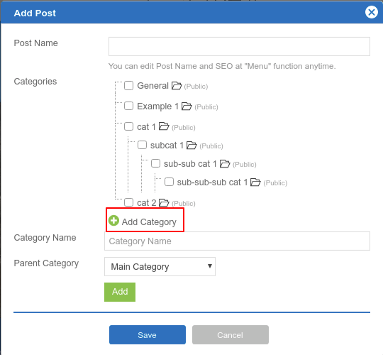

On step **Content**, click on **New Post**. You can click **Add Category** to create your own category. Also, you can select the parent category with the 3 maximum levels.

For example: If we add "Cats" category and select parent category to "Animals", a "Cats" category will be under the "Animals" folder.

## Manage your Categories Index

Also, you can modify a catagories page. Clicking **Site** -> **Blog** -> Select Catagory.

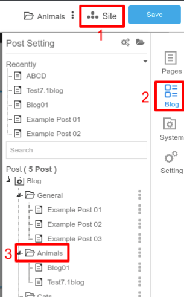

### Category index widget section

**By Category List**: Shows all your posts in the category

**By Category List Setting**

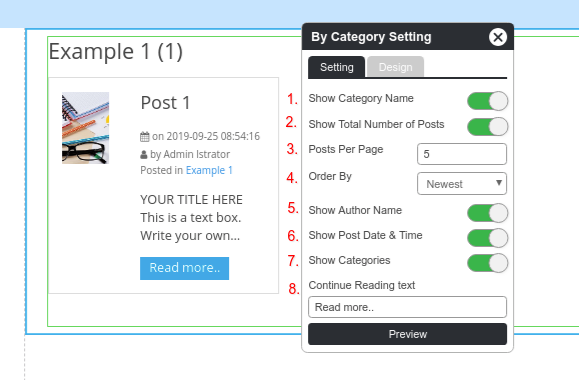

1. Enable/Disable Category Name
2. Enable/Disable Total Number of Posts
3. Limit post per page
4. Order by: Select Newest, Post Title or Last edit to arrage a list.
5. Enable/Disable author name on each post.
6. Enable/Disable post date and time on each post.
7. Enable/Disable post's category on each post.
8. Continue Reading text is a button to access a post page.

## Add Blog to Catagory

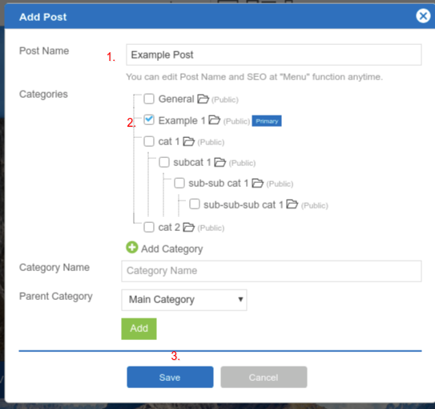

Fills your blog name and select catagory which you want to add in.

## Manage your Blog post

Once you creates a post, you will be able to write a content in the section under a post info widget section.

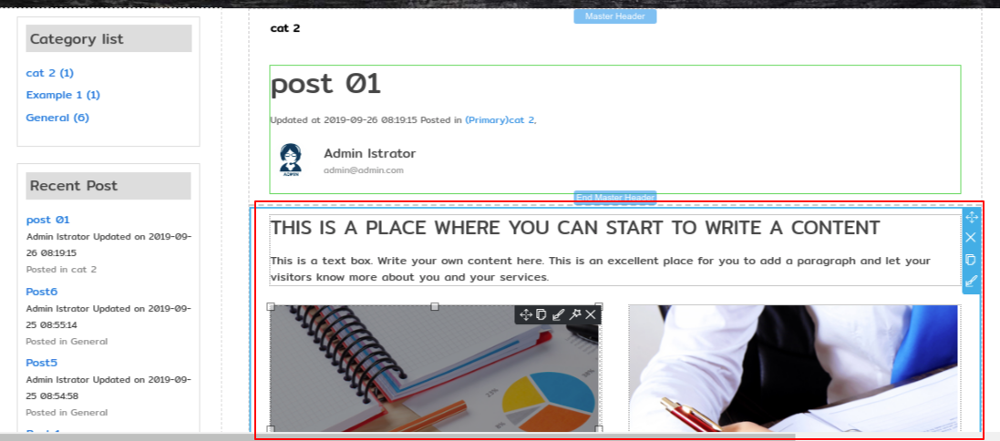

You can add more widget by clicking the **Section** icon then selecting **Blog**

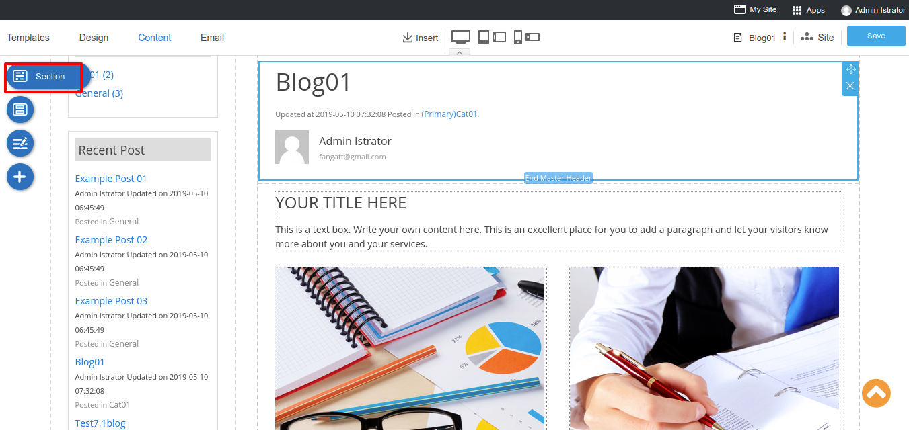

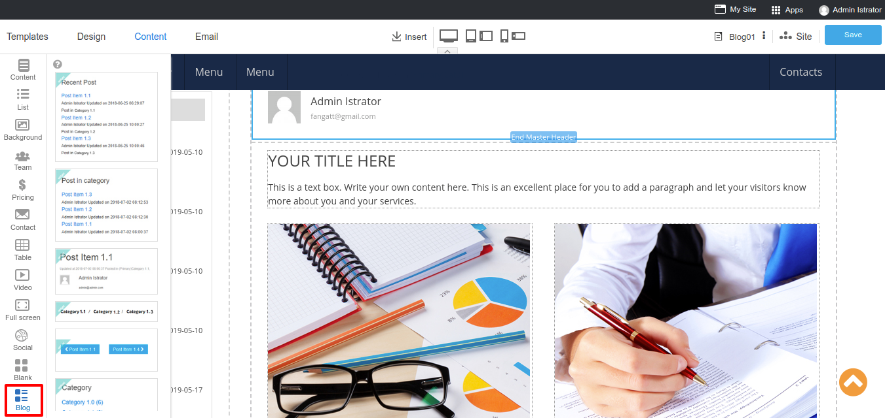

### Blog Post Widget Section

**Category list**: This widget shows all your categories.

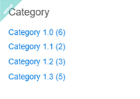

**Category List Setting**

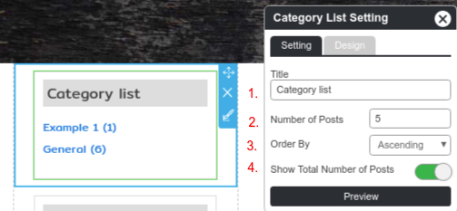

1. Title: Insert your Title.
2. Number of Category: Limit your category which display on the list.
3. Order by: Select Ascending or Descending to arrage a list.
4. Enable/Disable a total number of posts.

**Recent Post**: This widget shows your latest post.

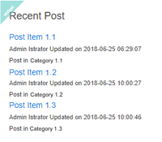

**Recent Post Setting**

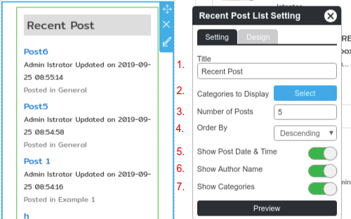

1. Title: Insert your Title.
2. Category to display: Select a category which you need to show on a list.
3. Number of Post: Limit your post which display on the list.
4. Order by: Select Ascending or Descending to arrage a list.
5. Enable/Disable post date and time on each post.
6. Enable/Disable author name on each post.
7. Enable/Disable show catagories on each post.

**Posts in Category**: Shows all blog post which create on the same post's category.

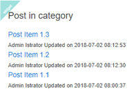

**Posts in This Category Setiing**

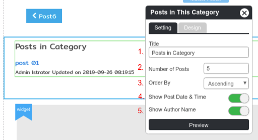

1. Title: Insert your Title.
2. Number of Post: Limit your post which display on the list.
3. Order by: Select Ascending or Descending to arrage a list.
4. Enable/Disable post date and time on each post.
5. Enable/Disable author name on each post.

**Post Info**: A post details and informations.

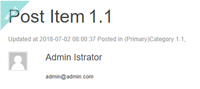

**Post Info Setting**

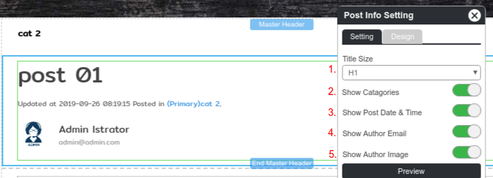

1. Title Size: Select a font size for Title
2. Enable/Disable Category name.
3. Enable/Disable post date and time.
4. Enable/Disable author email.
5. Enable/Disable author name.

**Navigation**: A post breadcrumb navigation.

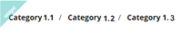

**Breadcrum Setting**

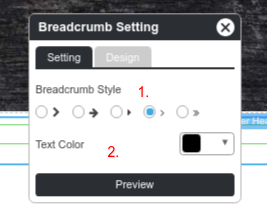

1. Select a design of arrow.
2. Select a text color.

**Next and Previous**: Visitor can click to see a next post and previous post.

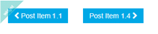

**Next and Previous Buttons Setting**

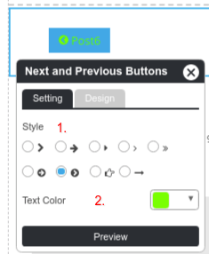

1. Select a design of arrow.
2. Select a text color.

## Manage your Blog index

A main blog page can access by domain.com/blog. This page is a blog dashboard where a visitor can see your all blog post as a thumbnail.

You can moditfy this page by clicking **Site** -> **Blog** tab -> **Blog** page.

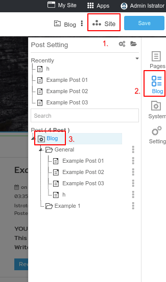

### Blog index widget section

There are 2 widgets section, Category list and Recent Post, allow to add in a blog index. Beside, you are able to adjust a blog list widget to display a thumnails of all posts.

**Blog List Setting**

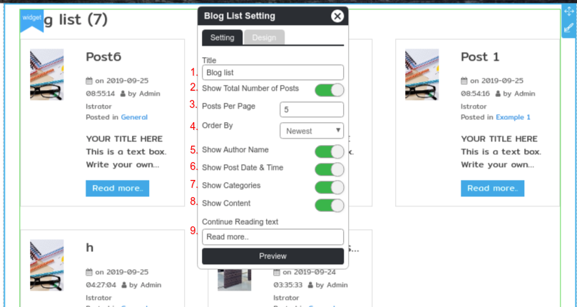

1. Title: Insert your Title.
2. Enable/Disable a total of posts
3. Limit a number of post which diaplay on the list
4. Order by: Select Newest, Post Title or Last edit to arrage a list.
5. Enable/Disable author name on each post.
6. Enable/Disable post date and time on each post.
7. Enable/Disable show catagories on each post.
8. Enable/Disable show a first paragraph on each post.
9. Continue Reading text is a button to access a post page.
