# ADMIN INTERFACE

-   [Admin Top Bar](#admin-top-bar)
    -   [My Site](#my-site)
    -   [Apps](#apps)
    -   [Website Admin (Your Name)](#website-admin-your-name)
-   [Left Menu](#left-menu)
    -   [Template](#template)
    -   [Design](#design)
    -   [Content](#content)
    -   [Email](#email)
-   [Center Menu](#center-menu)
    -   [Insert](#insert)
    -   [View modes](#view-modes)
    -   [Hide/Show Admin Top Bar](#hideshow-admin-top-bar)
-   [Right Menu](#right-menu)
    -   [Curren Page name with a symbol and 3-dots](#curren-page-name-with-a-symbol-and-3-dots)
    -   [Site](#site)
    -   [Save](#save)

## Admin Top Bar

Top Bar menus will be all time available on CMS for the easier and faster access.

From left to right

### My Site

To see your website in real time as you’re editing. A few seconds makes your website online.

### Apps

To access to more Apps you can use with your website aside from features in content editor. Almost 10 FREE Apps are available by default, and much more in [RVsitebuilder Apps Marketplace](https://apps.rvsitebuilder.com/) that you can install to use with your website. Free, cheap, and reasonable price Apps are all selectable.

### Website Admin (Your Name)

To show who is (you are) working now. Click on it and select.

## Left Menu

### Template

The first thing to welcome you to start a beautiful website. Every website template in every template category is automatically making your website a responsive one. The content, the layout, the images are well-designed for perfectly displaying on every device’s screen. You can see all RVsitebuilder 7 templates in our [website](https://rvsitebuilder.com/template/).

### Design

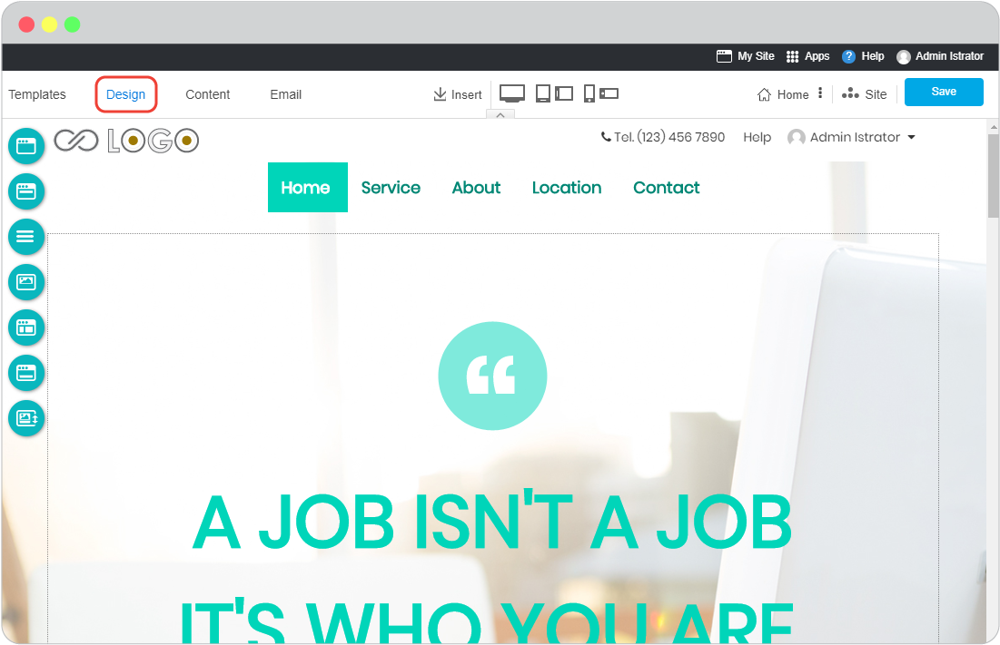

A place you can control how your website looks like from the most top down the footer. Not only for the beautiful look but also for more action and conversion you will get from your website visitors.

The 7 main parts to make your website be more attractive and functional.

-   **Website**

    Let’s say it’s color theme of your website. Aside from website template which tells how the header and content would be, the main color of your website is here to set to be matched your company.
    
    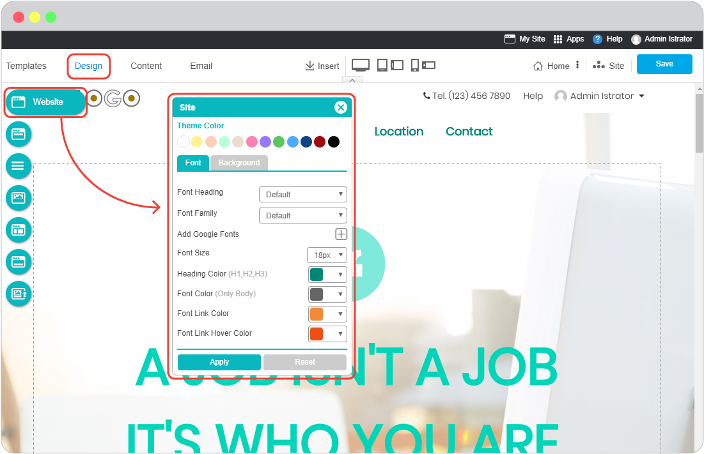

    _Theme Color_ : is to select how the color tone you want to be played in your website, the selectd will be appeared its detail below at Font part, and take real time effect on content area such as Header text and icons.

    _Font_ : is the related font colors from the selected Theme Color. It also displays real time on your content area at Header text and icons. You can also change these related font colors as you desire.

    _Background_ : will be “Fluid (full screen)” with color pickers disabled by default. You can apply and change Background color by disable “Fluid (full screen)”. Color, Custom, Gradient are all colors and shades you can select for your website background. Upload your own image or select pre-installed background images and designs are selectable in Image Manager.

-   **Topmenu**

    The top most to be seen is popular to display main parts of your company such as Logo, Telephone Number, Support or quick link, and also Account Name for when you allow your website to be logged in. Select one in 21 Topmenu designs to match your website template and theme, or to be completely different to get more attraction. The “Login/Logout” is enabled by default to let you and website visitors to register and login. Disable it if you like.
    
    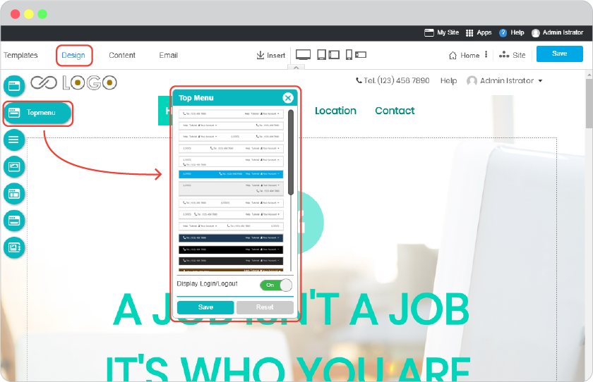

-   **Menu**

    The main navigation on your website can be set to be matched and more unique by select in one from 32 Horizontal Menu designs or one from 6 Transparent designs. Make it more Modern with “Overlap” function to make Menu float over website banner for more cooler. Disable Menu completely for when you make a website that has only one page.
    
    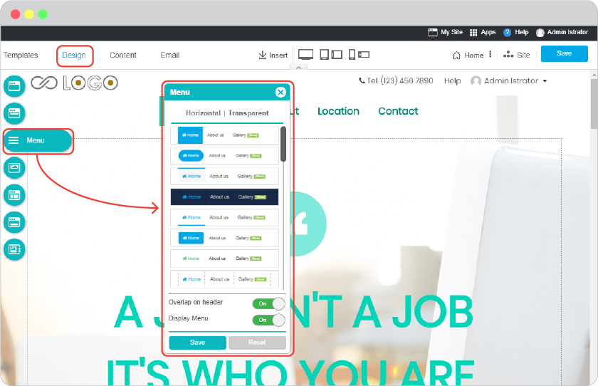

-   **Banner**

    Banner has 2 types, Hero and Slide. It can be switch between 2 types by select one from 29 Hero styles or 85 Slide styles, just be aware that all current content and setting will be reset by the change. The selected Banner can be changed its image(s) later by your desire.
    
    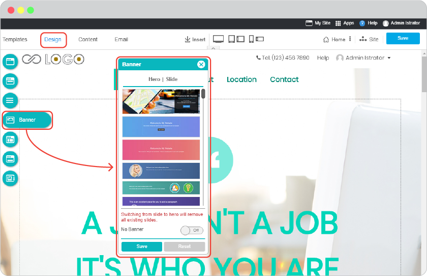

-   **Sidebar**

    The attention needed Page or Blog Post can be placed as to always gain on every page of your website. Make those highlight Page or Post on Left or Right or both sides at your desire.
    
    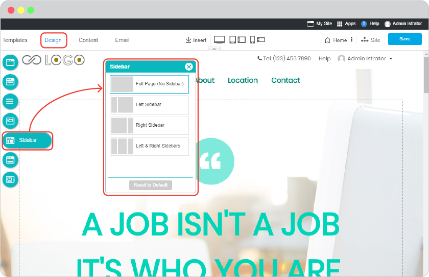

-   **Footer**

    Footer is the important part on website to let people know your company whereabout. The address is identity that makes people trust in your company. Keep them follow and in touch with you on renowned social channels.
    
    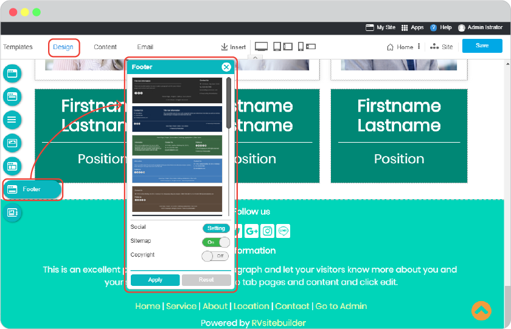

-   **Sort Header**

    Freely reposition of Header pieces (Banner, Topmenu, Menu) as you want in Header area.
    
    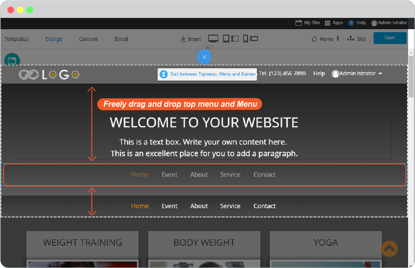

### Content

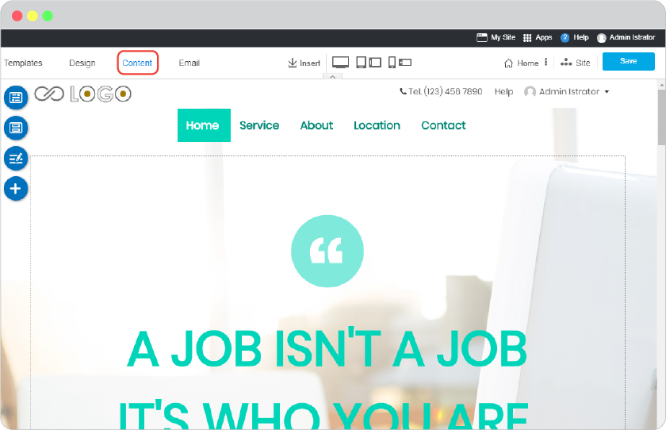

-   **Section**

    Start page content with Content Sections that guide you for how to insert content and image to your page. Just drag a Section you like to drop anywhere on page Body area. All selected Section can be moved, customized section background, background for Blogs in Section.
    
    

-   **Form**

    Use Online Form for website visitors to submit it directly to your Email Address. Add more fields to your Form for proper purpose, Calendar, Price, etc. Form section can also be play with design to make it more gorgeous.
    
    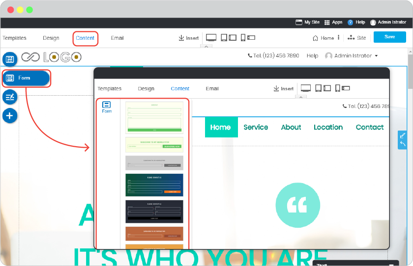

-   **Menu**

    Add more Page(s) to Menu or Top Menu before defying to a page that already made Content for it, redirect this new added Page to a Blog Post or other websites at your desire.
    
    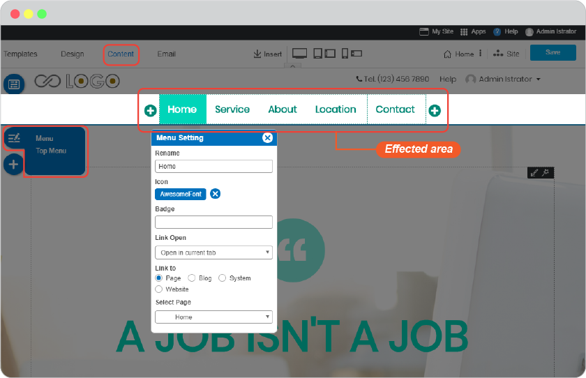

-   **Add Page/Post**

    Add a New Page or new Post and immediately without worrying about where to put it on Menu. You can defy it to where you want any time.

    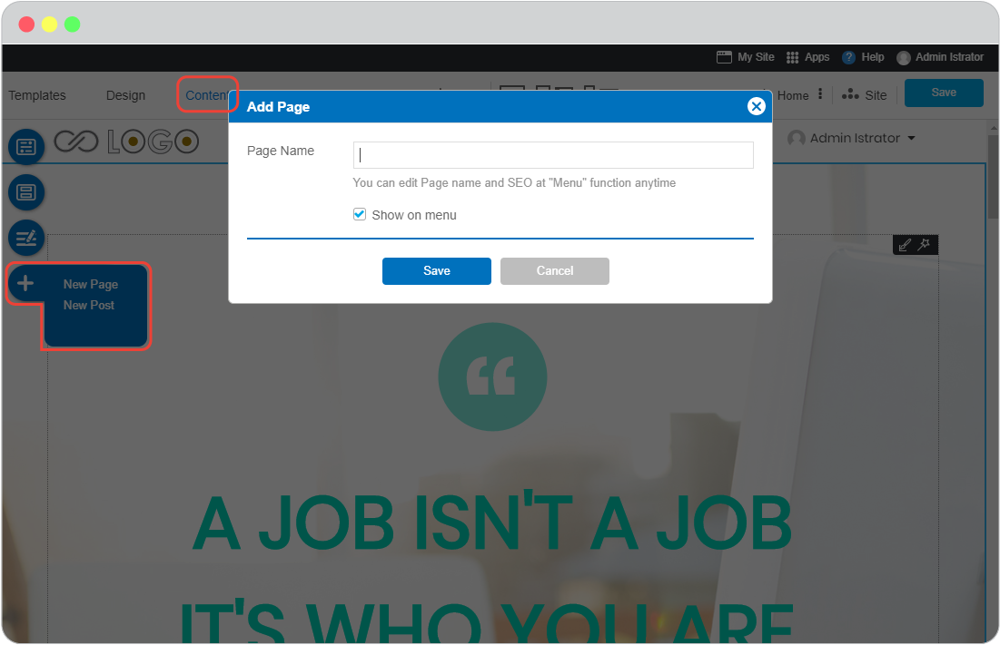

### Email

You may want to send an email for those visitors who register to your website as Welcome Email, Email Template can be useful and easier to support you. Custom its design to be matched your website design.

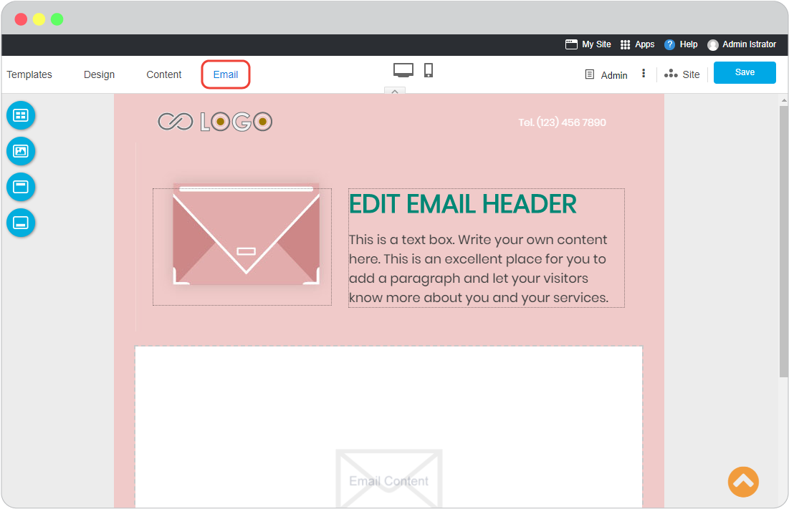

-   **Template**

    Select one from two default Email Template of how you want the email to be, and custom it later.

    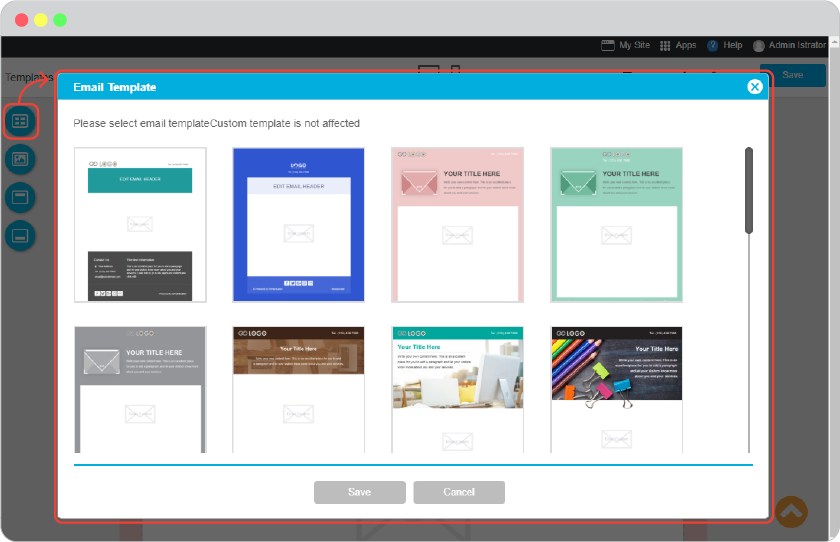

-   **Background**

    Make Email with background that match your website theme. Give dimensions of the email content and its background on Top, Bottom, Left, Right as you like.

    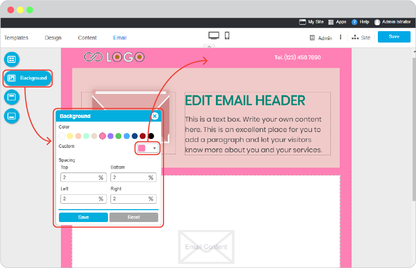

-   **Header**

    elect one from 7 Header designs and custom it the way you like such as Header color, Header Image, insert Logo, company name, telephone number, make it the way that the receiver will immediately know that it was sent from you,

    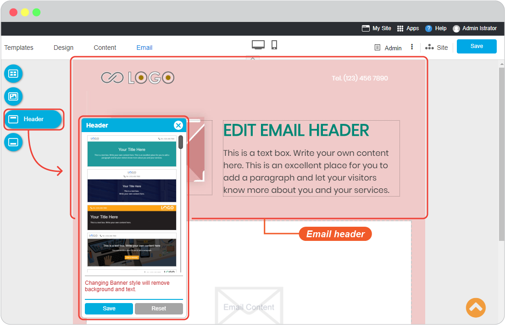

-   **Footer**

    Select one from 7 Footer designs, the information on Email Footer will be the same as in your website Footer by default. Add or edit the social channels to be followed.

    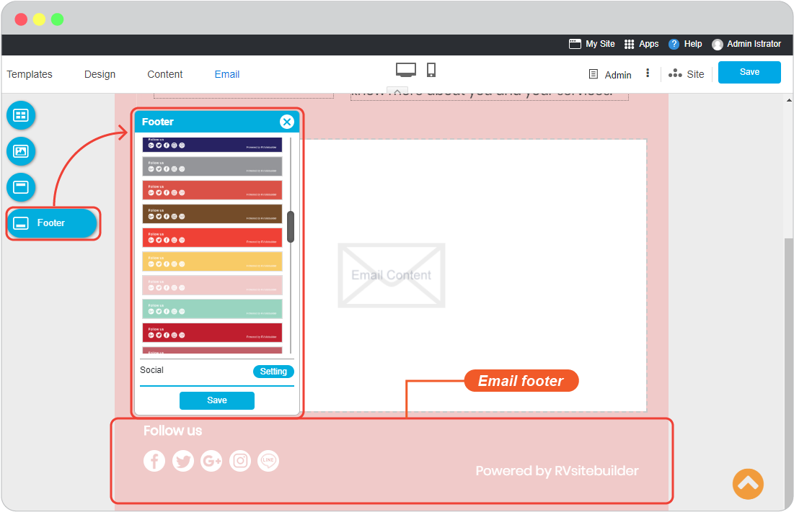

## Center Menu

### Insert

The center to insert anything to content on page you’re editing.

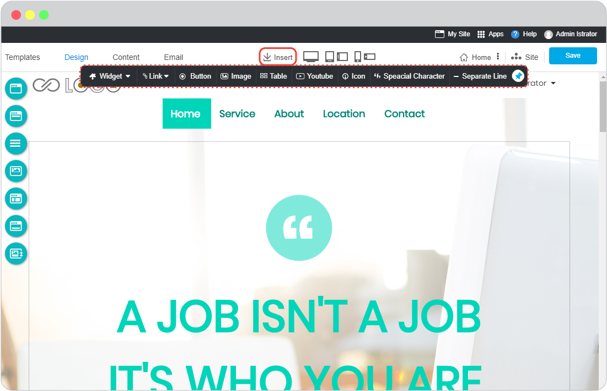

-   **Link**

    Connect page content to other page or Blog post to promote or give more related content. The link can also be set to other external website, email, files to open, content bookmark.

-   **Image**

    To upload image(s) from your computer, browse from your facebook personal account, or select in our Free images and Background styles.

-   **Table**

    Insert table to control content the way you want to your responsive website in easy way. Table settings are easy and displaying perfectly on mobile mode as well.

-   **Youtube**

    Upload video you want to present on your Youtube channel and add it to your page with this function, it not only helps save your website space but also makes this page works faster than upload video directly to the page itself.

-   **Icon**

    Hundreds of free icons to be freely used on any place of your website without worry of copyright or icon quality. All icons here are royalty-free and high resolution.

-   **Special Characters**

    Special Characters that you don’t have on your keyboard to make text more stylish, correct with some other language or text symbols are available to be used.

-   **Separate Line**

    Divide content parts by in the same text block with Separate Line is not only to be more clearly reading but the text block also looking cool.

### View modes

The real time website preview mode while you’re editing. See how your website would be on sizes of device screens, computer desktop, ipad and mobile in rotate eyes.

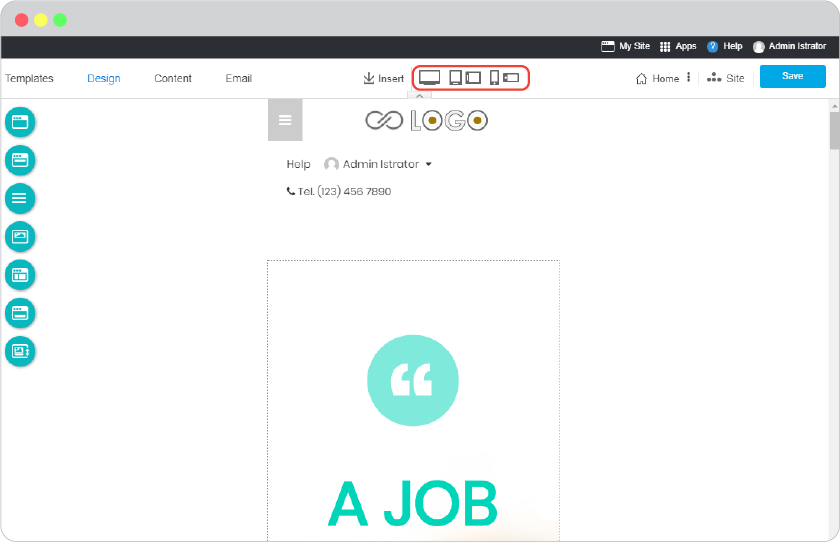

### Hide/Show Admin Top Bar

Admin Top Bar is an always-appear tool bar for more faster access wherever you are in CMS. Sometimes while you’re at content builder, you can hide this Top Bar in case if it becomes as eyesore.

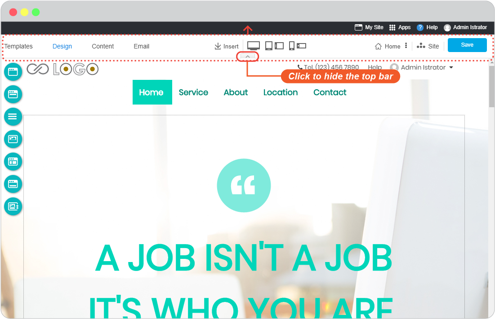

## Right Menu

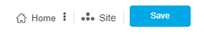

### Curren Page name with a symbol and 3-dots

The current page that you’re working with. It comes with a symbol in front of it such as Home or Document to tell the page’s priority. The 3-dots contains page setting for Set as home, Rename, Set as draft, Duplicate, SEO, Meta tag, Js/Css, Visibility.

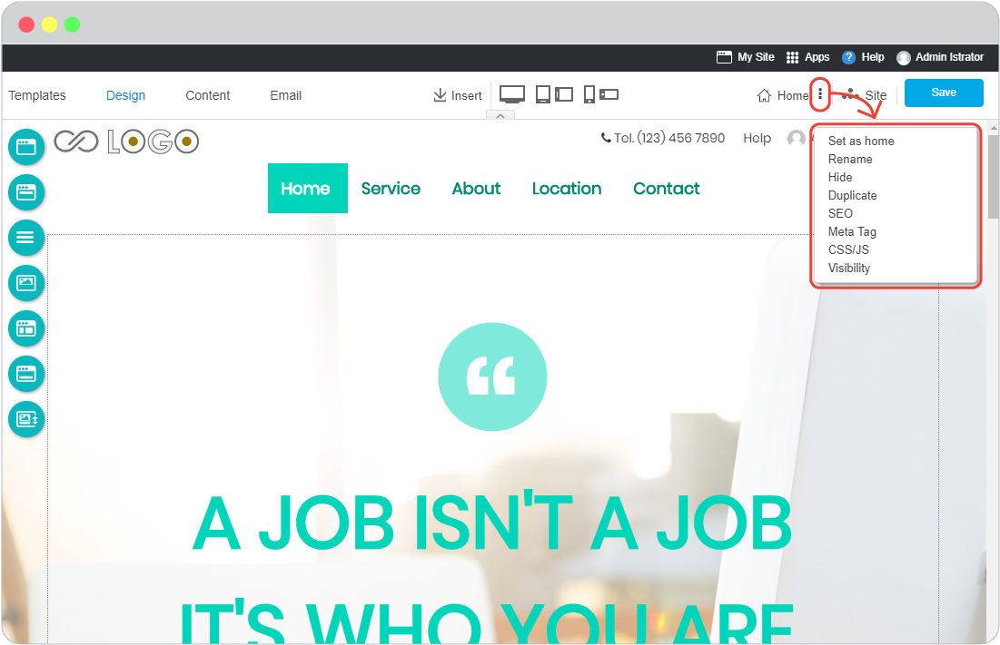

-   **Set as home**

    Make this page Home page of your website. Setting this page as Home will cahneg status of the previous Home page to be normal page.

-   **Rename**

    Rename this page and it will result on page name on Navigation, page’s URL, and Footer Sitemap.

-   **Hide**

    Hide this page for when it’s not finished to be shown on website yet. Set it a draft page that you can work with it until it’s done as set it undrafted to show it on your website.

-   **Duplicate**

    Duplicate this page for the purpose such as doing your website content in other languages. The design and content will be the same, the page name will be marked with a number. Just rename the duplicated page as the way it should.

-   **SEO**

    Make this page get ranked on search engine website such as google.com. Every page on your website has auto title and description for search engine tracking by the page name and content you add. It’d be better to edit it to the effective title and description.

-   **Meta tag**

    To insert embed meta tag that you would like search engines to track.

-   **Css/Js**

    If you can write your own Javascript or CSS and would like to use it on your page, RVsitebuilder CMS allows it here.

    Insert Javascript in this place by ignoring  tags.

    Insert CSS in this place by ignoring  tags.

-   **Visibility**

    Set this page to be visible to the visitors you want. There are 3 mains to concern.
    
    _Public_ : every page’s visibility is “Public” to be visible to EVERYONE by default.

    _All Members_ : set this page to be accessed and visible to only those who registered to your website as members, or those you added them as members by yourself.

    _Restricted Members_ : aside from setting page to be visible to those all members on your website, you can also restricted members by giving role to them as User or VIP.

    - **User**, is the role for those visitors who registered to be your website members. Every registered user is User.

    - **VIP**, the more privileged role you set to some User as VIP. Select this will restrict to only those VIP to see this page.

### Site

To navigate or change page/post editor.

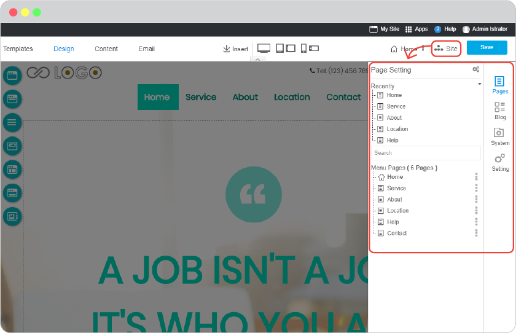

-   **Page Setting**

    _Recently_ : Quick way to access to your recently added pages.

    _Menu Pages_ : List of all pages and all Blog posts on your website. The 3-dots behind is for same functions as 3-dots on current edit page.

    _Internal Page_ : Page(s) you don’t yet to be ready to publish with the 3-dots page setting.

-   **Blog**

    _Recently_ : Quick way to access to your recently added pages.

    _Post_ : List of all Blog posts you on your website with the levels of categories it was added. The 3-dots behind is for same functions as 3-dots on current edit page.

-   **System**

    _System Page_
    
    - **Member**
        The master template for Register page and Login page for admin(s) and user(s). You can drag the same all tools as Content such as Banner, Section and custom its color and background in this master template page to be design for Register and Login pages.
        
        - **Login**, To set the system of Login pages for admin(s) and user(s). It of the System pages such as Register page and Login page for admin(s) and user(s). Login system allow 3rd parties such as Google account, Facebook, Twitter, LINE and also JWT Login.
  
        - **Register**, Set how you would allow people to register to your website, increase security with strength and captcha to enable and Admin Approve.

        - **Admin Login**, For you and other website admin(s) to login to website admin area.

    - **Blog**
        To set main system for Blog on your website.
        
        - **Category List**, Make Blog category list title you want. Control how many of posts and how it displays by date that should display on this part to make it perfectly match your website design.

        - **Recent Post**. Give it the title that you want. Select Blog Categories you want to show recent posts here. Control how many of posts and how it displays by date. Date, author name, and category of each recent post shown here can be on and off.

        - **Blog List**,

            _a) Setting_, Make the Blog list the title you want. Set how many of Blog post you want to show on this part, make it show the reasonable number by page for too many Blog post to be shown. Order the Blog post by its date, also to set to show and hide post’s date, post’s author name and category of the post. Give it more to be continued reading by putting a word the way you want instead of “Read more..”.

             _b) Design_, Select a layout design for how those Blog posts will be displayed in this part.

-   **Setting**

    One setting for global result that will take effect to every page and Blog post on your website unless you set some customization on specific page that it will take these result from page setting.

    _Back to top_ :
    To show and no to show the “Back to top” button on the long content page that will automatically appear for visitor.

    _Brand_ :
    To add your brand identity the same way you can on Top Menu. The latest setting in one of these 2 places will be the display on your website.

### Save

To save what you’re working with on your page. Many features in RVsitebuilder CMS are auto-apply to your page but it’s not saved yet, so just click this Save button as frequently as you want.

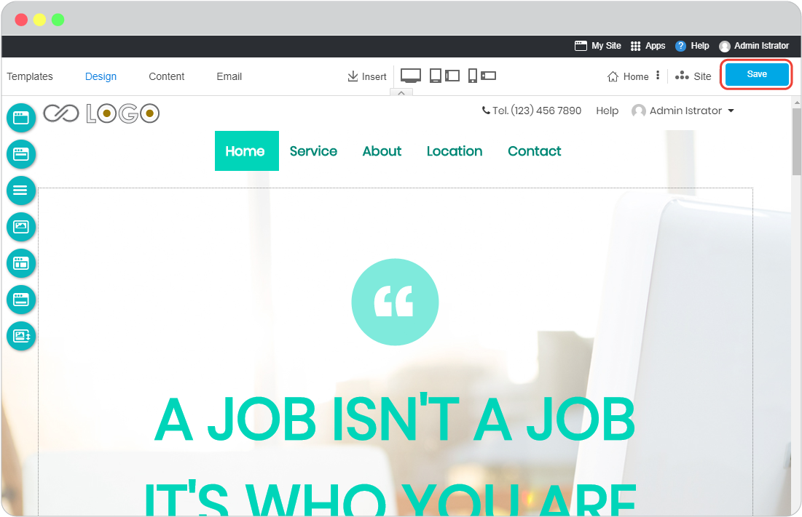