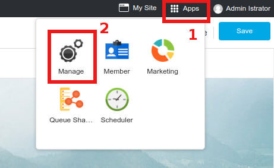
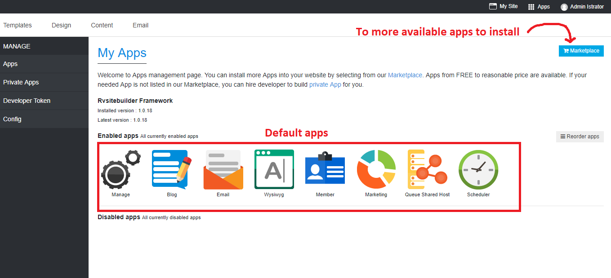

# Apps and Apps Marketplace

## Apps

RVsitebuilder 7 is a full function CMS, and it's also a tool that allows you to have more Apps to use with your website aside from features in content editor.

You can navigate it from **Apps** -> **Manage**.

Once **Apps** clicked, you will be at My Apps page.

It lists all current enabled apps for your website. The default 7 apps are always enabled for every website by default.

You can install more apps to use with your website such as Sitemap, Weather, and many others by visiting our [Apps Marketplace](https://apps.rvsitebuilder.com/).

-----------------------------------------------------------------------

## Apps Marketplace

### [RVsitebuilder Apps Marketplace](https://apps.rvsitebuilder.com/)

The place for more apps to install and use with your website.

Almost 10 FREE Apps are available by default, and much more in [RVsitebuilder Apps Marketplace](https://apps.rvsitebuilder.com/) that you can install to use with your website. Free, cheap, and reasonable price Apps are all selectable.

**Your needed app is not available in our [Apps Marketplace](https://apps.rvsitebuilder.com/)?**

You can hire our developers to build it especially for you!

The rest menus are for Laravel Developer to build private apps for you by structures in our [Developer Document](https://github.com/rvsitebuilder/developer-docs/tree/master/en).

-------------------------------------------------------------------------