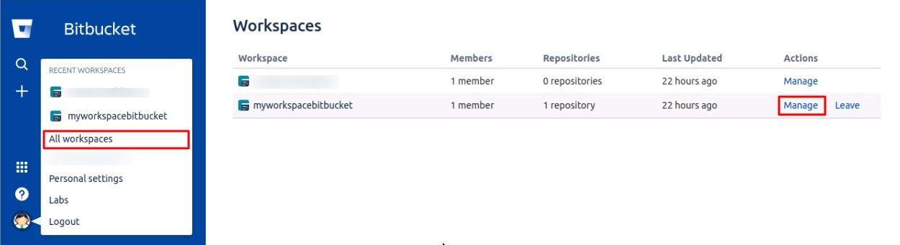
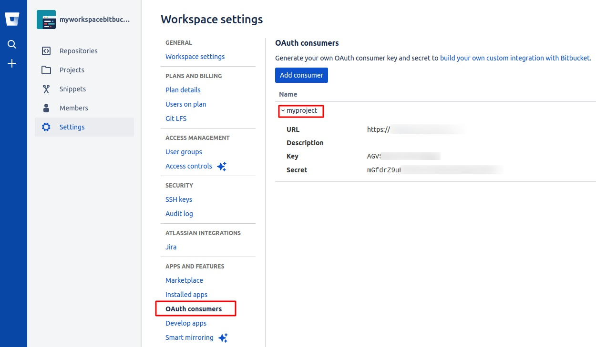
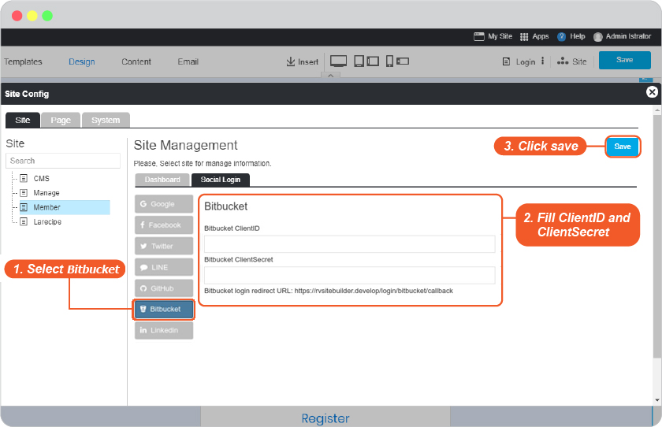

# Bitbucket Login Setup

Setup requires a Bitbucket membership and a Bitbucket app must be created.

## Creating a OAuth consumers

Generate your own OAuth consumer key and secret to [build your own custom integration with Bitbucket.](https://support.atlassian.com/bitbucket-cloud/docs/use-oauth-on-bitbucket-cloud/)

OAuth needs a key and secret, together these are know as an OAuth consumer. You can create a consumer on any existing workspace. To create a consumer, do the following:

1. Go to <https://Bitbucket.com/>, sign into your Bitbucket account.
2. From your profile avatar in the bottom left, click on the workspace in the "Recent workspaces" list or click All workspaces to open an entire list from which to choose.
3. Click "Settings" on the left sidebar to open the Workspace settings.
4. Click "OAuth consumers" under Apps and features on the left navigation.
5. Click the "Add consumer" button.
6. Click Save.
   The system generates a key and a secret for you.
7. Toggle the consumer name to see the generated Key and Secret value for your consumer.

## Once you have Bitbucket OAuth consumers, you can set up Login as Bitbucket as follows

1. Go to <https://Bitbucket.com/>, sign into your Bitbucket account.

2. In the bottom left sidebar, click your profile and setting, then click "All workspaces".

3. Click "Manage" your consumer.

    

4. Click "OAuth consumers" under Apps and features on the left navigation, then click the consumer name to see the generated Key and Secret value for your consumer.

    

5. Go to website editor -> Site -> System Pages -> Login, click on Login form to open Login setting, to enable Bitbucket Login Setup.

   1. Select Bitbucket tab.
   2. Insert App ID for Bitbucket Client ID and App Secret for Bitbucket Client Secret.
   3. Click OK to add these values to your form.

    

   4. On Login Setting, click "Apply" to apply your setting.
   5. Click "Preview"
   6. Click "Save" to save all of your setting above.

    

6. The Bitbucket Login single sign-on is available for your user to login to your website without make a new register.
