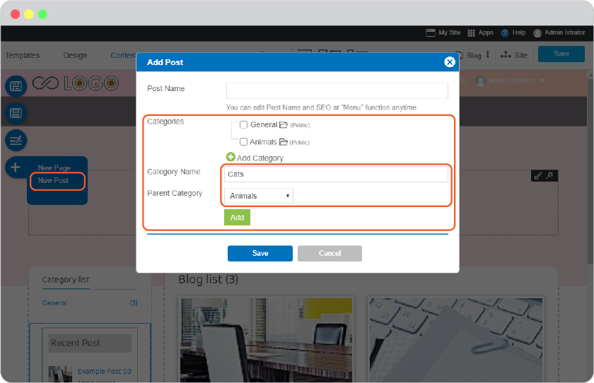
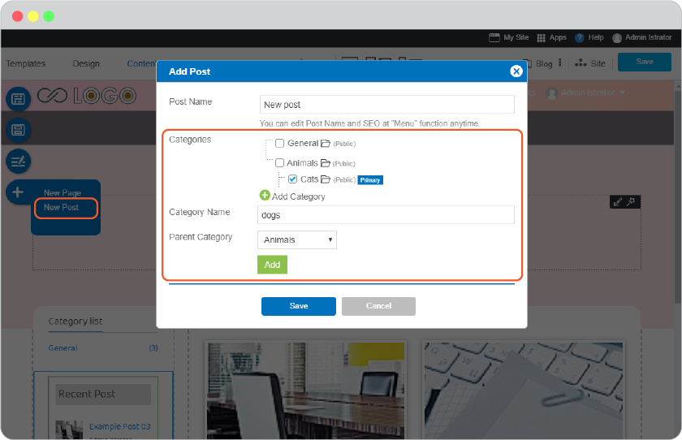
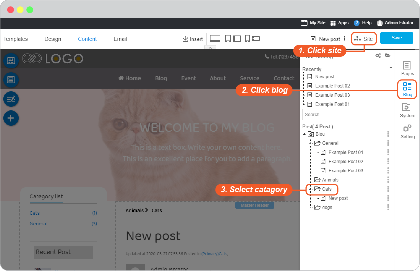
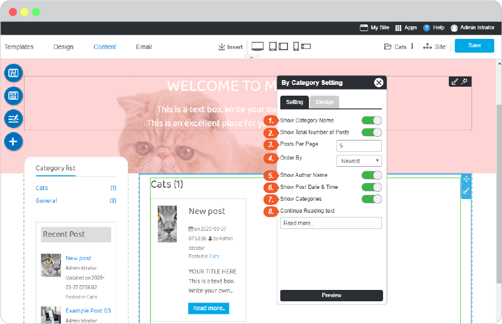
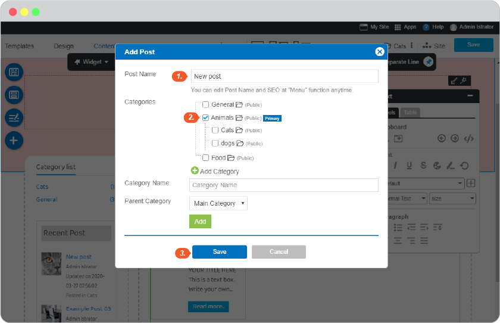

# Blog Category
- [Blog Category](#blog-category)
  - [Add Catagories](#add-catagories)
  - [Manage Category Index](#manage-category-index)
    - [Category index widget section](#category-index-widget-section)
  - [Add Blog to Catagory](#add-blog-to-catagory)

## Add Catagories

On step **Content**, click on **New Post**. You can click **Add Category** to create your own category. Also, you can select the parent category with the 3 maximum levels. 

For example: If we add "Cats" category and select parent category to "Animals", a "Cats" category will be under the "Animals" folder.

You can add new catagory when you add new post as well.

## Manage Category Index

Also, you can modify a catagories page. Clicking **Site** -> **Blog** -> Select Catagory. 

### Category index widget section 

**By Category List**: Shows all your posts in the category

**By Category List Setting**

1. Enable/Disable Category Name
2. Enable/Disable Total Number of Posts
3. Limit post per page
4. Order by: Select Newest, Post Title or Last edit to arrage a list.
5. Enable/Disable author name on each post.
6. Enable/Disable post date and time on each post.
7. Enable/Disable post's category on each post.
8. Continue Reading text is a button to access a post page.

## Add Blog to Catagory

Fills your blog name and select catagory which you want to add in.