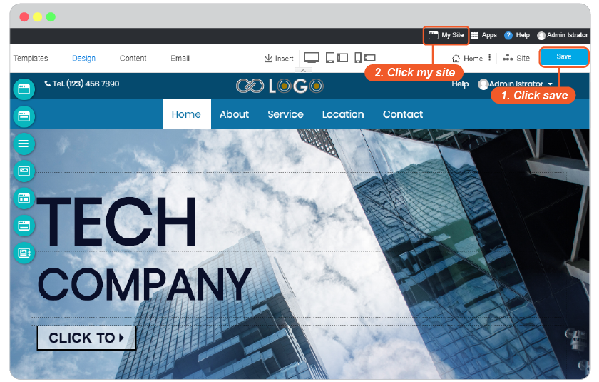

# Add New Blog

- [Add New Post](#add-new-post)
  - [Blog Layout](#blog-layout)
  - [Blog content](#blog-content)
    - [Editable section](#editable-section)
    - [Widget sections](#widget-sections)
- [Edit Blog](#edit-blog)
- [Publish Blog on your website](#publish-blog-on-your-website)

## Add New Post

Make your website gain more visitors and readers!

Once you finished a cool website, you may want to add blog for more frequent communication and article updates. Or you may want to start your website blog the first thing. To do these, you can add blog on your website as simple as the way you add new page.

=> น้องวุ่นแสดงรูปภาพหน้าเว็บสวยๆที่มีเมนู Blog ขึ้นมาบน navigation โดยเปิดหน้า blog วไ้

Let's start

1. On the current Content editor, navigate to "+" symbol on floating menu to click **New Post**.

=> น้องวุ่น ในหน้า content editor คลิก + New Post

2. Add the name for your blog post in Post Name field, and select one blog category for this post.

=> น้องวุ่น ใน Add post panel,ชี้ให้เห็นช่อง Post Name, และส่วนของ categories ยังไม่ต้องชี้ไปที่ +Add Category

*Quick add new category function*

The **General** is the default category for your first time creating blog. You can add new category to thos post by clicking on "+ Add Category". Give it a name and make it a Parent or under other Category Parent.

=> น้องวุ่น ใน Add post panel, +Add Category , ช้่องใส่ชื่อ, และการเลือก parent หรือ set ตัวเองเป็น parent

**Manage your new added post**

Your new added post will be welcome by its editor with all ways to manage you can think of.

=> น้องวุ่น หน้า post editor ใหม่ที่เพิ่ง add post มา แค่แสดงให้เห็นว่า add มาแล้ว และ tools มากมายที่จะใช้

### Blog Layout

You can start at layout of your blog first to make it matched with your desire.

1. Click on Master Header to activate Post Info Setting panel.

=> น้องวุ่น หน้า blog editor คลิกตรง Master header เพื่อเปิด post info setting ขึ้นมา

2. Click on "Design" tab, you will see 3 designs of blog Master Header to select. Select one from three, and click preview.
   
    *Design tab will be available in Master Header, End Master Header, Master Footer, Posts in Category widget, and End Mater Footer separetdly*

=> น้องวุ่น พอเปิด post info setting ขึ้นมาแล้ว คลิก tab Design แสดงให้เห็น design 3 แบบ คลิก 1 แล้วแสดงหใ้เห็นว่าต้องกด preview ด้วย

2.1 You can change design in Master Header, End Master Header, Master Footer, Posts in Category widget, and End Mater Footer separetdly.

   *Design tab will be available in Master Header, End Master Header, Master Footer, Posts in Category widget, and End Mater Footer separetdly*

=> น้องวุ่น แสดงให้เห็นว่า tab Design นี้ มีให้เลือกแยกกันในแต่ละส่วนของ blog นะคะ

3. Use **Drag and Drop** function to freely change position between every part of your blog in the same column.

    *Drag and drop is working only for moving the same vertical column only*

=> น้องวุ่น ใน blog แสดงให้เห็นว่าสามารถใช้ drag and drop สลับตำแหน่งใน blog ได้ และแสดงให้เห็นด้วยว่า สลับได้แค่ในฝั่ง column เดียวกันเท่านั้น

### Blog content

Once the post editor opened, you can immediately start your blog content.

#### Editable section

The only editable area on blog is blog content which you can notice it with "YOUR TITLE HERE".

=> น้องวุ่น หน้า blog editor ใหม่ที่เพิ่ง add post มา คลิกแสดงให้เห็นส่วน editable area (content)

1. **Content**

Start typing what you want to share on your blog post. All text tools and functions are same as wesbite content you can see full guide [here](https://user.rvsitebuilder.com/docs/master/en/website-content.md#add-content-and-font).

=> น้องวุ่น หน้า post editor ตรง content ลอง edit คำ หรือ ชี้ให้เห็น area edit content กับ image ก็ได้

2. **Design**

You can also design blog content are by using Section Properties and Block Properties.
   
    Section Properties full guide [here](https://user.rvsitebuilder.com/docs/master/en/website-content.md#content-section-design).

    Block Properties full guide [here](https://user.rvsitebuilder.com/docs/master/en/website-content.md#content-block-design).

=> น้องวุ่น หน้า blog editor ตรง content ชี้ให้เห็นปุ่ม edit Section properties กับ Block properties

3. **Add more blog section**
   
You can add more blog section to continue your long post or separate its content by using Section on the floating menu. Or see our full Content Section guide [here](https://user.rvsitebuilder.com/docs/master/en/website-content.md#add-new-content-section).

=> น้องวุ่น หน้า blog editor ชี้ให้เห็นเมนู Section ด้านซ้ายมือว่า add เพิ่มได้

#### Widget sections

Aside from blog content area, you will see many parts specified with "Widget" symbol. They're for setting, not directly type on it.

=> น้องวุ่น หน้า blog editor คลิกแสดงให้เห็นส่วนที่เป็น widget ต่างๆ ให้เห็นสัญลักษณืของมัน

1. **Breadcrumb widget**

The blog breadcrumb navigation you can set its style and design.

=> น้องวุ่น หน้า blog editor แสดงให้เห็นตรง breadcrumb widget

*Breadcrum Setting*

Setting tab is to set arrow style and its color.

Design tab is to select the design of Breadcrumb widget.

=> น้องวุ่น ตรง breadscrumb setting แสดงให้เห็นตรงการตั้งค่าทั้ง 2 tab

*Section Design*

You can edit design of this widget by using Section Properties.
   
    Section Properties full guide [here](https://user.rvsitebuilder.com/docs/master/en/website-content.md#content-section-design).

2. **Post Info widget**

The current post information such as; Category, Date and Time, Author Name, Author Image, and Author Email.

=> น้องวุ่น หน้า blog editor แสดงให้เห็นตรง Post info widget

*Post Info Setting*

Setting tab is to set Post title size and the information to show.

1. Title Size: Select a font size for Title
2. Enable/Disable Category name.
3. Enable/Disable post date and time.
4. Enable/Disable author email.
5. Enable/Disable author name.

=> น้องวุ่น ตรง Post info setting แสดงให้เห็นตรงการตั้งค่า settign tab ชี้ไปให้ตรงตำแหน่งต่างๆบน post info

Design tab is to select the design of Breadcrumb widget.

=> น้องวุ่น ตรง post info setting ชี้ให่เห็นตรง design tab.

*Section Design*

You can edit design of this widget by using Section Properties.
   
    Section Properties full guide [here](https://user.rvsitebuilder.com/docs/master/en/website-content.md#content-section-design).

3. **Category List widget**

This widget shows all categories and the number of blog posts in it,

=> น้องวุ่น หน้า blog editor แสดงให้เห็นตรง Catetory kist widget

*Category List Setting*

Setting tab is to set followings:

1. Title: Insert your Title.
2. Number of Category: Set the number of category you want them to show here.
3. Order by: Select Ascending or Descending to arrange in the list.
4. Enable/Disable a total number of posts.

=> น้องวุ่น ตรง category list setting แสดงให้เห็นตรงการตั้งค่า settign tab ชี้ไปให้ตรงตำแหน่งต่างๆบน list

Design tab is to select the design of Category List widget.

=> น้องวุ่น ตรง Category List setting ชี้ให่เห็นตรง design tab.

*Section Design*

You can edit design of this widget by using Section Properties.
   
    Section Properties full guide [here](https://user.rvsitebuilder.com/docs/master/en/website-content.md#content-section-design).

4. **Recent Post**

The section to show recent posts you added.

=> น้องวุ่น หน้า blog editor แสดงให้เห็นตรง recent post widget

*Recent Post Setting*

Setting tab is to set followings:

1. Title: Insert your Title.
2. Category to display: Select a category you want to show in the list.
3. Number of Post: Set the number of post you want them to show here.
4. Order by: Select Ascending or Descending to arrange in the list.
5. Enable/Disable post date and time on each post.
6. Enable/Disable author name on each post.
7. Enable/Disable show catagories on each post.

=> น้องวุ่น ตรง recent post setting แสดงให้เห็นตรงการตั้งค่า settign tab ชี้ไปให้ตรงตำแหน่งต่างๆบน list

Design tab is to select the design of Recent Post widget.

=> น้องวุ่น ตรง Category List setting ชี้ให่เห็นตรง design tab.

*Section Design*

You can edit design of this widget by using Section Properties.
   
    Section Properties full guide [here](https://user.rvsitebuilder.com/docs/master/en/website-content.md#content-section-design).

5. **Posts in Category**

This section shows blog posts in the same category of the post you're working with now.

=> น้องวุ่น หน้า blog editor แสดงให้เห็นตรง post in this cateogry widget

*Posts in Category Setting*

Setting tab is to set followings:

1. Title: Insert your Title.
2. Number of Post: Set the number of post you want them to show here.
3. Order by: Select Ascending or Descending to arrange in the list.
4. Enable/Disable post date and time on each post.
5. Enable/Disable author name on each post.

=> น้องวุ่น ตรง post in category setting แสดงให้เห็นตรงการตั้งค่า settign tab ชี้ไปให้ตรงตำแหน่งต่างๆบน list

Design tab is to select the design of Posts in Category widget.

=> น้องวุ่น ตรง Category List setting ชี้ให่เห็นตรง design tab.

*Section Design*

You can edit design of this widget by using Section Properties.
   
    Section Properties full guide [here](https://user.rvsitebuilder.com/docs/master/en/website-content.md#content-section-design).

6. **Next and Previous**

The buttons for readers to go next or back your other posts.

=> น้องวุ่น หน้า blog editor แสดงให้เห็นตรง Next and previous widget

*Next and Previous Setting*

Setting tab is to set arrow styles and its color.

Design tab is to select the design of Next and Previous widget.

=> น้องวุ่น ตรง breadscrumb setting แสดงให้เห็นตรงการตั้งค่าทั้ง 2 tab

*Section Design*

You can edit design of this widget by using Section Properties.
   
    Section Properties full guide [here](https://user.rvsitebuilder.com/docs/master/en/website-content.md#content-section-design).

## Edit Blog

## Publish Blog on your website

Just click **Save** button, your blog will be online immediately on the navigation of your website.

   