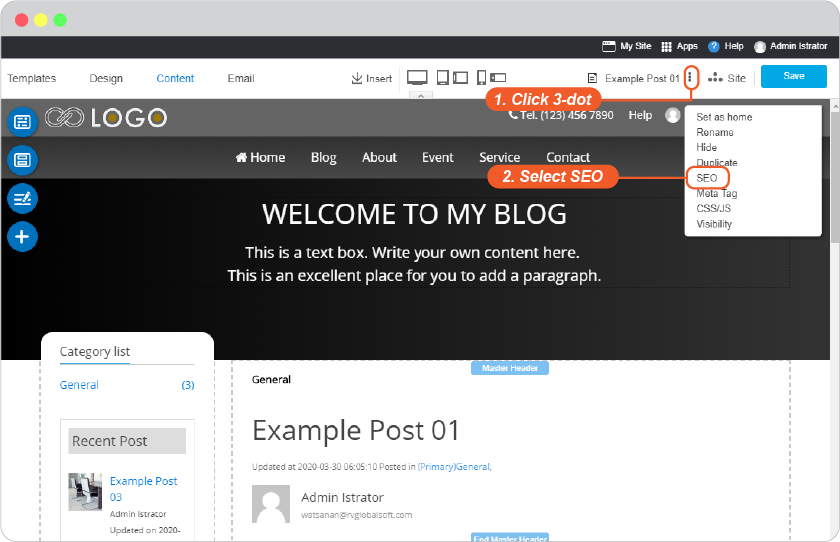
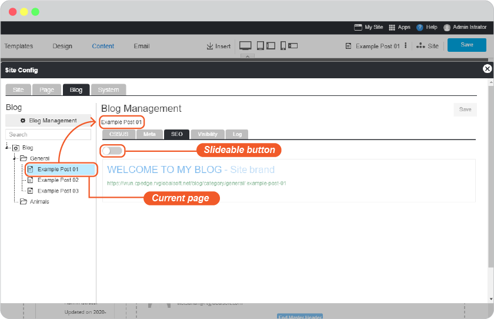
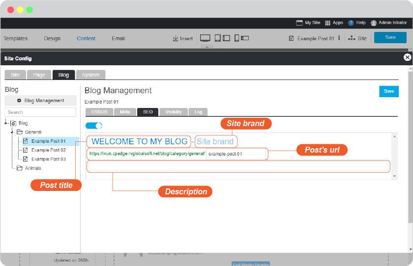
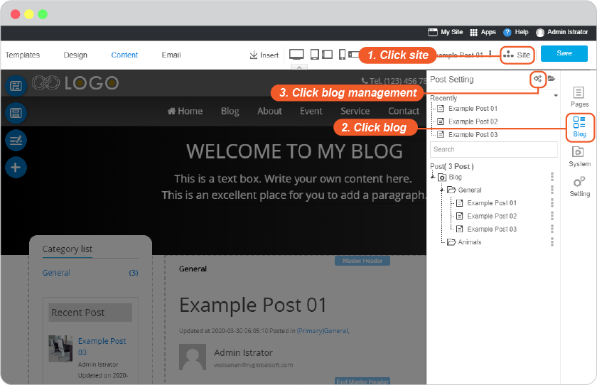
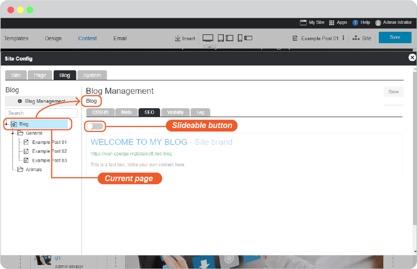
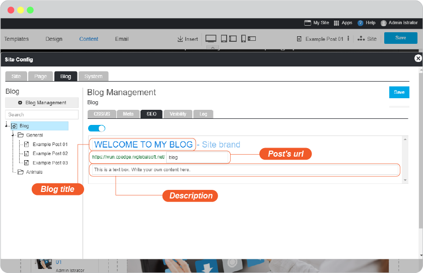
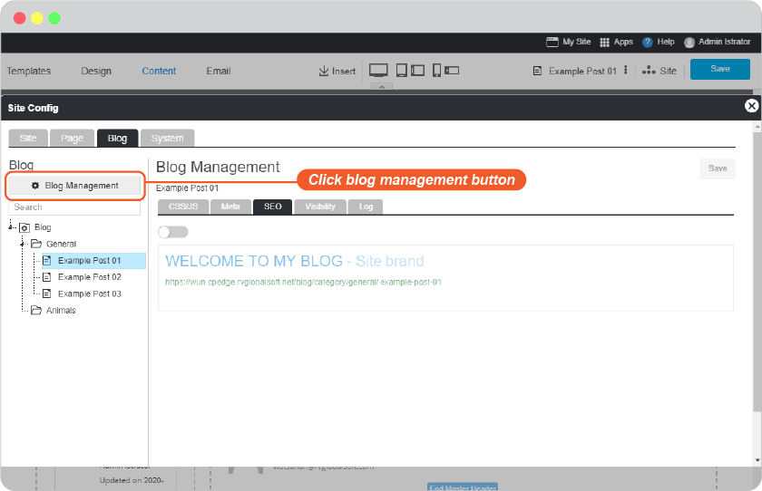
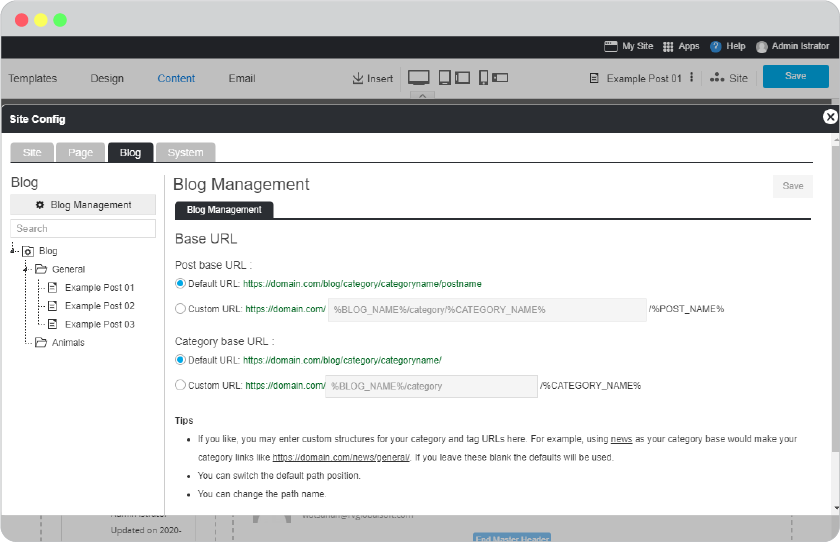
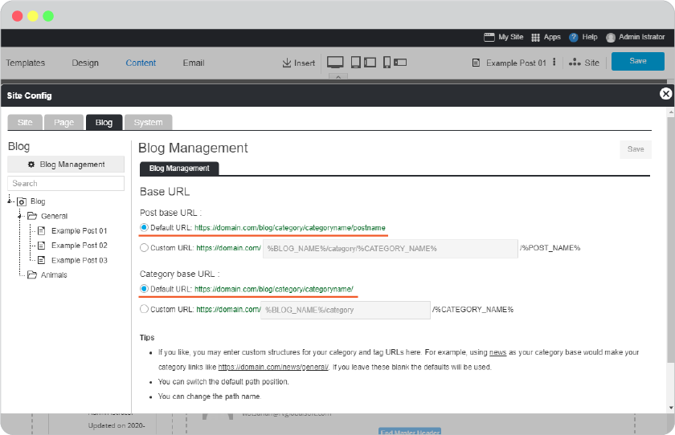
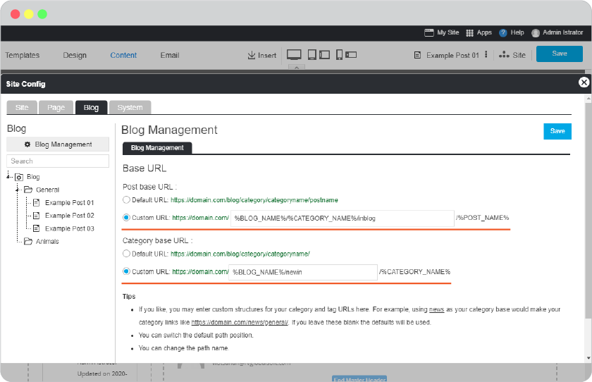

# Easy Blog SEO

- [Setting Areas](#setting-areas)
  - [SEO By post](#seo-by-post)
  - [SEO By entire blog](#seo-by-entire-blog)

**Make your blog found on google**

SEO strategy nowadays is not only to do the meta tag in order to get ranked in google. And as google nowadays has improved its algorithm in website ranking, so it becomes more focus on Page Title or content, related to what popular searched from global searchers.

RVsitebuilder 7 provides the easy way to set SEO for your blog and every of its post.

## Setting Areas

You can set SEO in 2 ways; by post or by site.

### SEO By post

It means to set SEO for an individual post.

A. 3-dot next to current post name you're editing

B. Site -> Blog icon -> post name

1. Click 3-dot after post names

2. Once **SEO** clicked, you will be at Blog Management panel which is for the current post you're on.

Slide the slide-button to right to custom post's title and description to be more effective SEO.

You will see the *Auto title and description* are the automated as default.

-   **Post title** : You can edit post's title to be more search key than page name such as changing Home to RVsitebuilder CMS.
-   **Site brand** : It is inherrited from Site brand you defined as your company.
-   **Post's url** : You can edit url of this post to be more search key than the normal such as changing https://rvsitebuilder.com/blog/category/general/post to https://rvsitebuilder.com/blog/category/general/mypost
-   **Description** : Make a few less-is-more sentences for the seek-and-found you. A short description about your business.

_Tips: Description for your blog should be short effective and quick understandable sentences with impact keywords people would use to find what they want relate to your business. Avoid using the very unique words which may relate to your company but people don't know about it. Localization is to focus on specific countries, be sure about your targetted customers and their locations._

### SEO By entire blog

This means to set SEO that will be effect for the entire blog. You can edit on any individual pages to use different SEO on guide **By post** above.

#### Setting SEO by blog

1. At Site -> Blog icon -> Blog -> 3-dot after Blog

2. Once **SEO** clicked, you will be at Blog Management panel which is for the current your blog.

Slide the slide-button to right to custom the title and description to be more effective SEO.

You will see the *Auto title and description* are the automated as default.

-   **Blog title** : You can edit blog title to be more search key than blog name such as changing Blog to Travel Blog.
-   **Post's url** : You can edit url of this post to be more search key than the normal such as changing https://rvsitebuilder.com/blog to https://rvsitebuilder.com/travelblog
-   **Description** : Make a few less-is-more sentences for the seek-and-found you. A short description about your business.

_Tips: Description for your blog should be short effective and quick understandable sentences with impact keywords people would use to find what they want relate to your business. Avoid using the very unique words which may relate to your company but people don't know about it. Localization is to focus on specific countries, be sure about your targetted customers and their locations.

#### Blog Management

Blog Management is set base url for blog post and category.

Base url setting is how URLs for your posts and cetegories will show that you can add more on it.

**Default URL** is what you can see on blog post and category when it's opened.

Sample of Post: https://domain.com/blog/category/categoryname/postname 

It's : https://domain.com/blog/category/general/post

Sample of Category : https://domain.com/blog/category/categoryname

It's : https://domain.com/blog/category/general (general is default blog genetal)

**Custom URL** is what you can add more from deafult.

Sample of Post: [ %BLOG_NAME%/%CATEGORY_NAME%/ ]%POST_NAME%

You may custom to : [ %BLOG_NAME%/%CATEGORY_NAME%/inblog ]%POST_NAME%

It will be: https://domain.com/blog/category/general/inblog/mypost/

Sameple of Category : [ %BLOG_NAME%/ ]%CATEGORY_NAME%

You may custom to : [ %BLOG_NAME%/newin ]%CATEGORY_NAME%

It will be: https://domain.com/blog/newin/general/