# Add facebook widget on your blog

- [Add facebook widget on your blog](#add-facebook-widget-on-your-blog)
  - [Add facebook comment](#add-facebook-comment)
  - [Add facebook Like and Share buttons](#add-facebook-like-and-share-buttons)
  - [Add facebook page](#add-facebook-page)

Your blog posts need more attention and are deserved to have your readers spread it. You can use facebook comment, Like, Share button, and facebook page widgets to make this mission completed.

## Add facebook comment

Allow your readers to comment on your blos post by their facebook account. This way saves their time on registering on your website, and also save your website data as well.

1. On blog editor (and website pages as well), click Section.

  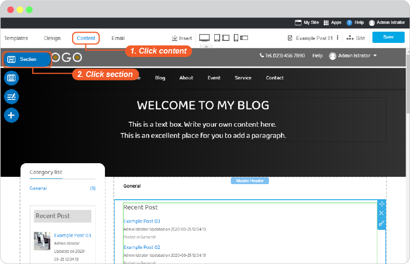

2. On **Social** category, select "Facebook comment" section, drag and drop to position you want.

  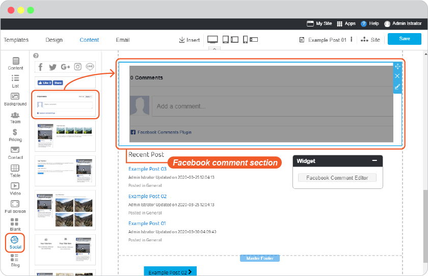
 
3. Place mouse of the "Facebook comment" widget to activate the editor. And click on "Facebook Comment Editor"

  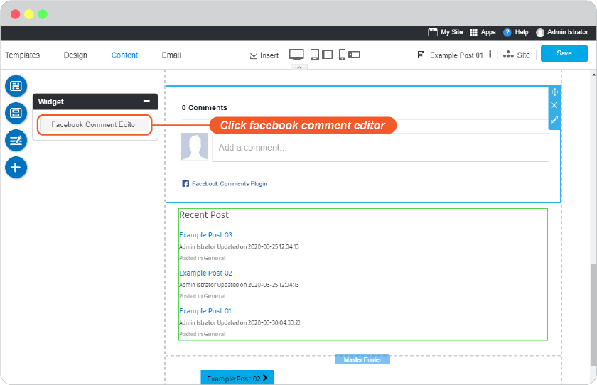

4. Set the width of section and number of comments you want them to show on comment section of this post.

  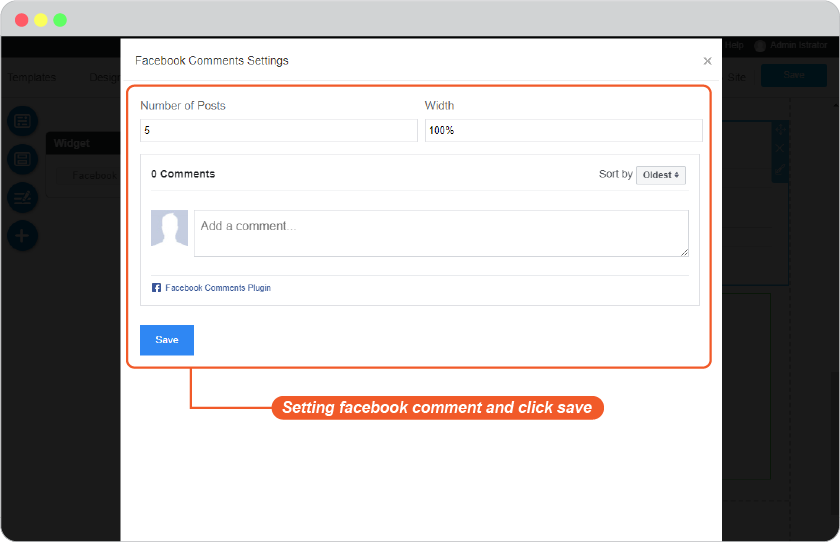

5. Click Save on blog editor.

  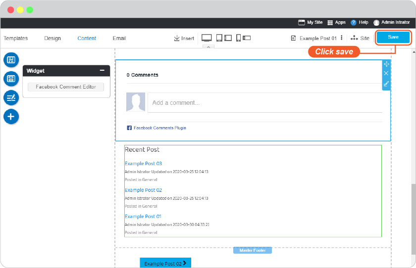

## Add facebook Like and Share buttons

Have your blog post spreaded by your readers. This good and interesting post of you worth sharing. Add these 2 buttons to let your readers like and share on their facebook accounts,

1. On Post editor (and website pages as well) , select the position to place the Share button and click Section.

  

2. Select "Social Like and Share" section from Social Section, drag and drop to position you want.

  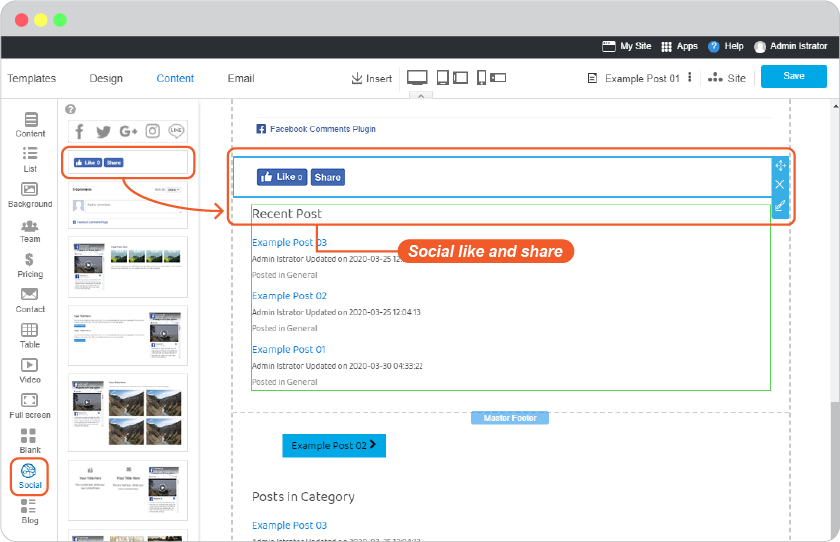

3. Place mouse of the "Social Like and Share" widget to activate the editor. And click on "Facebook Like Editor"

  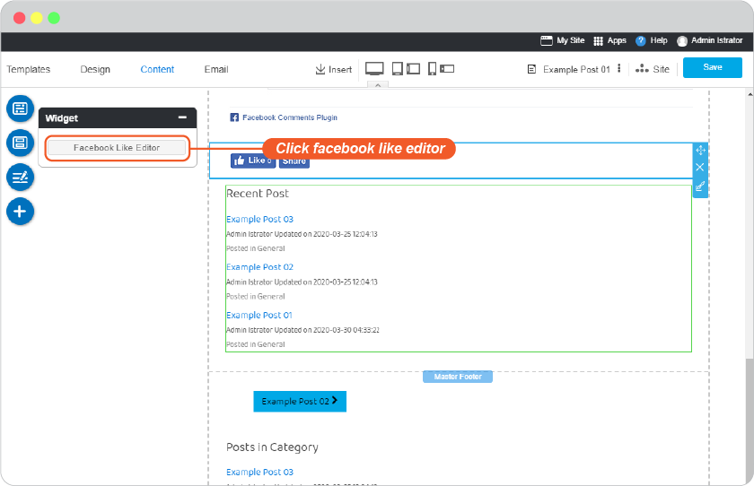

4. Set for enable both or only one button you want. And Save

  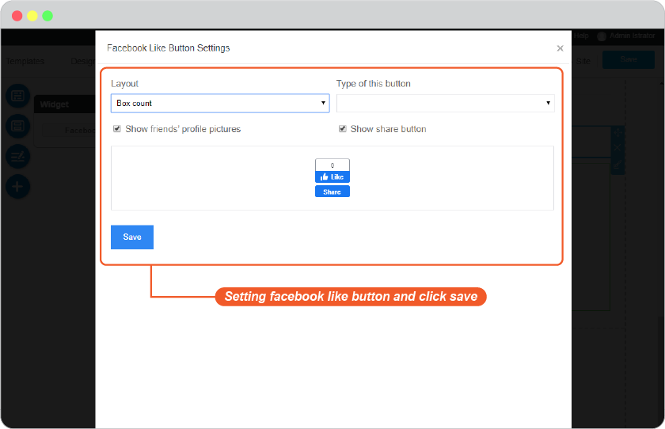

5. Click Save on blog editor.

  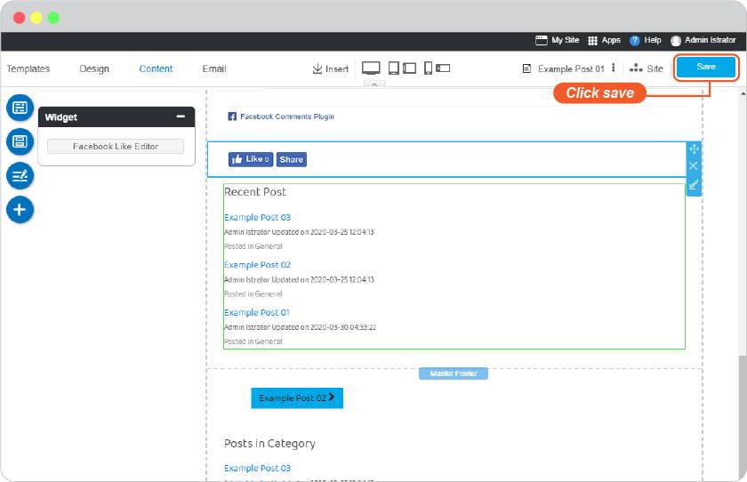

6. Have the ton of shares!

## Add facebook page

You can add your facebook on your blog post to reach more people, and to have more people reach you!

1. On Post editor (and website pages as well) , select the position to place the Share button and click Section.

  

2. Select one of "Facebook Page" sections from Social Section, drag and drop to position you want.

  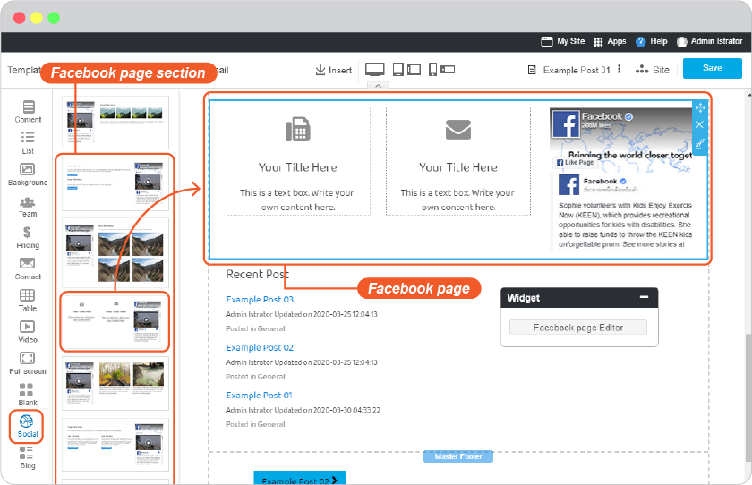

3. Place mouse of the "Facebook Page" widget to activate the editor. And click on "Facebook Page Editor"

  

4. Add your facebook page URL, and set its appearance as you want. And Save

  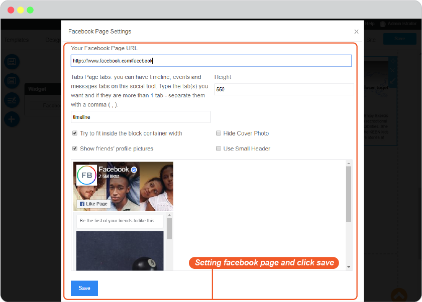

5. Click Save on blog editor.

  