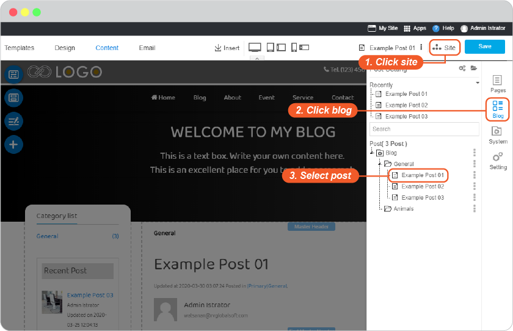
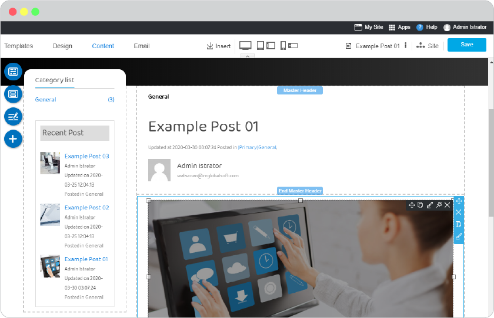
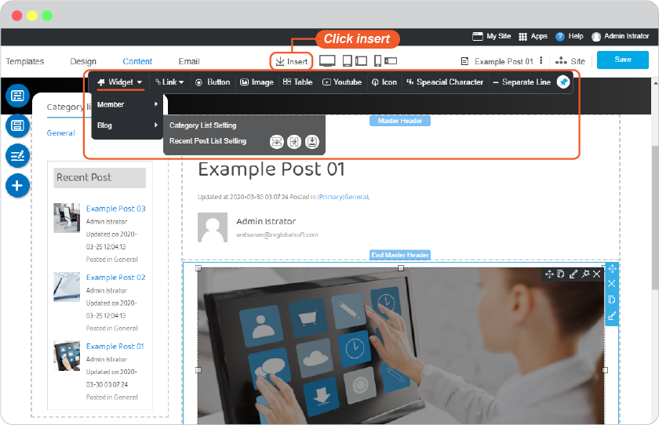
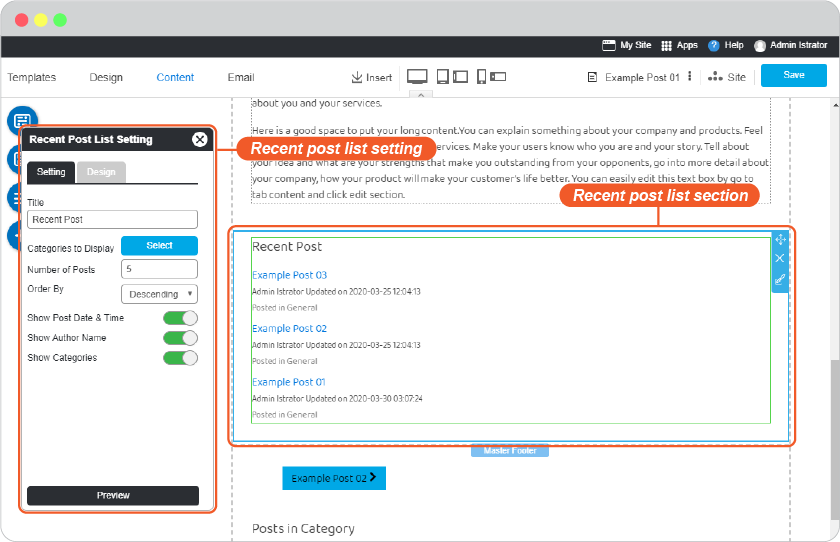
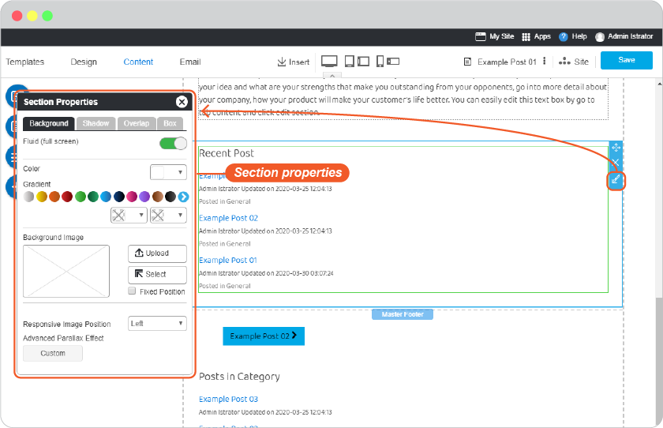
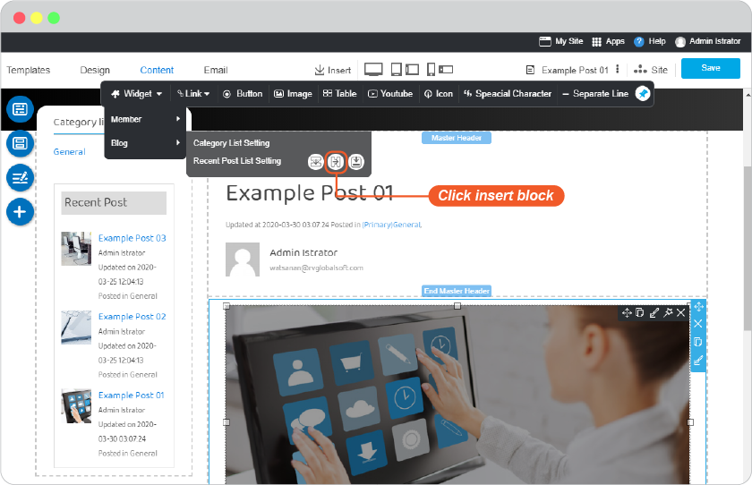
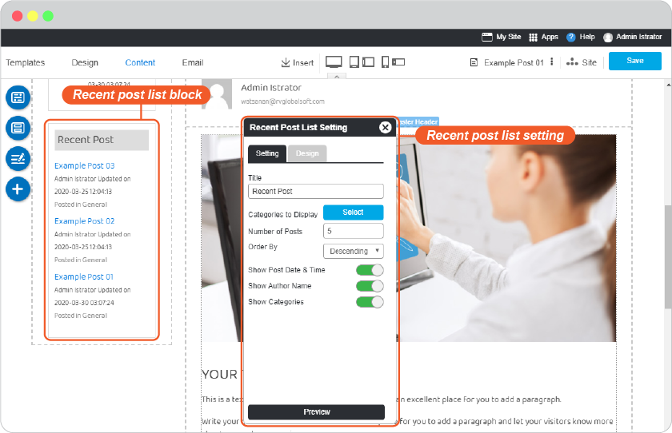
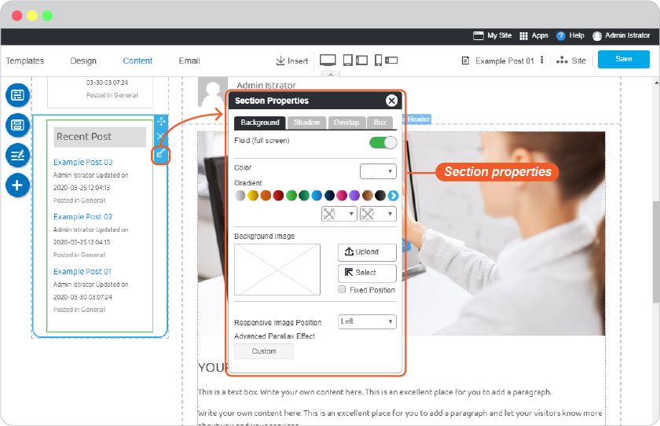
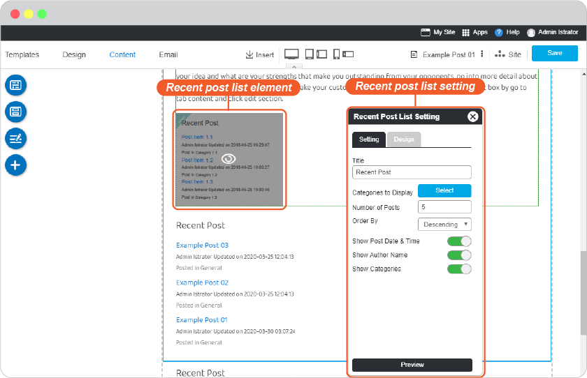

## Insert blog widget to post

You can use Blog widget to insert your **Blog Catagory List** and **Recent Post List** to a blog post you want for more connection and readers to your Blog.

3 ways to insert Blog widget for your Blog Catagory List or Recent Post List to content are; as Section, as Block and as element among the content.

### Insert blog widget as section

1. On any current page or blog editor, click on **Site** menu and navigate to **Blog** and click on post you want to edit.
    
    

2. Place mouse on blog content section you want to insert Blog widget.

    

3. Use **Insert** tool, and **Widget**.

    

4. By hovering mouse on **Blog** widget, place to insert Blog Catagory List or Recent Post List, and select **Insert Section**.

    

5. The inserted widget will be under the blog content section you clicked by number 1. You can edit how this list display and its design in the List Setting panel.

    

6. You can also edit section background the same way with section background of content.

    

### Insert blog widget as block
  
1. On any current page or blog editor, click on **Site** menu and navigate to **Blog** and click on post you want to edit.

    

2. Place mouse on content block you want to insert Blog widget.

    

3. Use **Insert** tool, and **Widget**. 

    

4. By hovering mouse on **Blog** widget, place to insert Blog Catagory List or Recent Post List, and select **Insert Block**.

    

5. The inserted widget will be next to content block you clicked by number 1. You can edit how this list display and its design in the List Setting panel.

    

6. You can also edit block background the same way with block background of content.

    

### Insert blog widget as element among your post content
  
1. On any current page or blog editor, click on **Site** menu and navigate to **Blog** and click on post you want to edit.

    

2. Place mouse inside blog content area you want to insert Blog widget.

    

3. Use **Insert** tool, and **Widget**. 

    

4. By hovering mouse on **Blog** widget, place to insert Blog Catagory List or Recent Post List, and select **Insert Element**.

    

5. The inserted widget will be at the mouse position among the content you clicked by number 1. You can edit how this list display and its design in the List Setting panel.

    