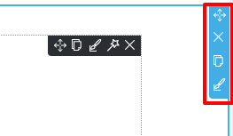
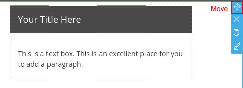
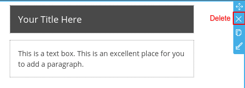
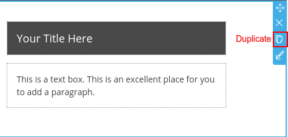
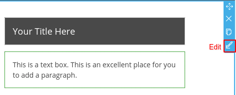
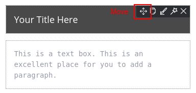
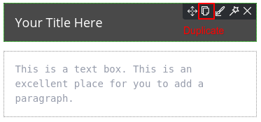
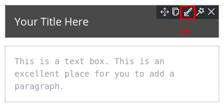
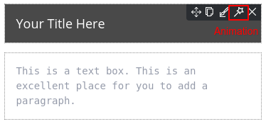
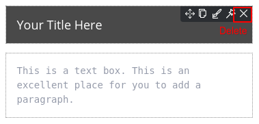

# Create New Website

## Accessing into RVsitebuilder

### By cPanel control panel

1. Login to control panel.
1. Look for Software feature group.
1. Click on "RVsitebuilder 7" icon.

### By your domain name

1. Open domain name on browser with /admin/login
1. Enter admin login.

## Domain Name Selection

After [logging in](https://github.com/rvsitebuilder/user-docs/blob/7.1/en/overview.md#login-system_), you can start your professtional site in 1 minute!
1. Start with click **Create new site** 

2. Selecting a domain name you want to create a beautiful professtional website with RVsitebuilder 7 and clicking "Next" to continue.

3. Check the information and add Admin Email, then check boxes to agree with our License Agreement.

4. Have a cup of coffee while waiting for RVsitebuilder 7 creates itself in your domain name.

## Content Editor

On step **Content**, you can select a **Section** by drag and drop on the editor area. We provide 12 catagories section.
In all 200+ layout designs, 130 designs are new from RVsitebuilder 7. 

1. **Content**: a normal section which contains a various layout.
2. **List**: it allows you to add a group of product with descriptions and icons. It’s great for things like product descriptions, or can be used as a unique way to list the services you offer.
3. **Backgroud**: It will present the almost ready content layout with cool text and picture positions with the beautiful background image from Background image album.
4. **Team**: Showing your staff members including profile images, job positions, member names and so on.
5. **Pricing**: If you run a business or sell a product on your website, you probably have a dedicated pricing page for the whole thing. You'll notice the best pricing pages have clean layouts, use simple language that speaks to the customer, and aim to inspire trust between the business and the user.
6. **Contact**: The goal of every contact us page is to convert by clearly and effectively presenting the method(s) of getting in touch with a company as quickly as possible.
7. **Table**: If you are presenting data and information using columns and rows, then these best table website templates are ideal for you. Tables are a super convenient way of displaying any sort of statistics, specifications and other whatnots. Instead of creating them from scratch, we built many different variations that are just a click away
8. **Video**: One of the best ways to catch the eye of your website visitors is by showcasing your videos in a featured video section. 
9. **Full screen**: Full-screen mode takes advantage of your available screen real estate and provides a useful platform for presenting visual content. One main benefit of a full screen page layout is visibility.
10. **Social**: Putting your social media channel on your website can directly affect the response and engagement from your visitor.
11. **Blank**: Custom design a section by yourself. We provide a blank section with a variety block layout.
12. **Blog**: Adding more widget on your page for letting a visitor can easily access to read your blog.

## Font Style

Step to add font style from Google Font.

1. Choosing a font at [Google Font](https://fonts.google.com).
2. On RVsitebuilder text tool, click plus button behind a font style.

3. Fill a font name and click Add.

4. You can select a new font from a font list.

    *Tips:* You can add a miximum 5 font styles.

## Page Function

### Section Properties

#### Move Section

Rearrange a section up or down by drag drag to drop where you want in the same page.

#### Delete Section

Use **Delete** icon to delete section. Be careful, it’s a prompt delete function.

#### Duplicate Section

You can use **Duplicate Section** icon to duplicate the section you want to repeat. It will copy all design and content immediately.

#### Edit Section

A Section properties which you can adjust Background, Shadow, Overlap and Box.

   - **Background**
   

*Fluid (full screen)*: Enable or disable a full screen section.

*Color* : Selecting background color by using color picker or choosing from a gradient color.

*Background Image*: Inserting an image to a background. You can select an image from Image Manager.

*Reponsive Image Position*: Image alignment on responsive mode.

   - **Shadow**

You can select 6 shadow preset styles which you can modify color and size on the below setting.

   - **Overlap**

Making one section to overlap other sections. 

   - **Box**

Adjusting section border design.

### Block Properties

#### Move Block

Drag to drop where you want in the same section.

#### Duplicate Block

#### Edit Block

#### Animation

#### Delete Block

