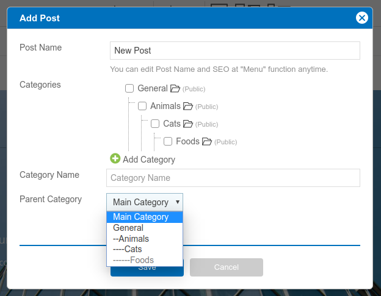
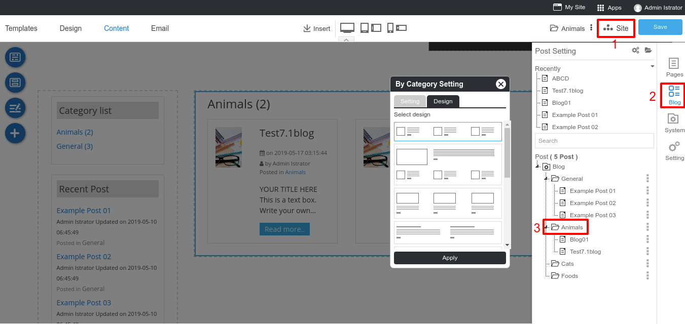

# Creating Blog

## Add New Post

1. Current on the step **Content**.
1. Select **New Post**.

## Blog Catagories

You can click Add Category to create your own category. Also, you can select the parent category with the 3 maximum levels. For example: If we add "Cats" category and select parent category to "Animals", a "Cats" category will be under the "Animals" folder.

Also, you can modify a catagories page. Clicking **Site** -> **Blog** -> Select Catagory. 
Click on Blog Category Setting to adjust and select a design to display.

## Add Widget

On the Post page, there will be a blog widget which contains Category list and Recent Post as a default. 

You can add more widget by clicking the **Section** icon then selecting **Blog**

**Category list**: This widget shows all your categories.

**Recent Post**: Shows your latest post also you can adjust the number of posts, set date & time, author name and categories.

**Posts in Category**: A blog list on current categories.

**Post Info**: Shows and Author profile and time and date of the blog post.

**Navigation**: A post breadcrumb navigation.

**Next and Previous**: Visitor can click to see a next post and previous post.

## Add Catagories

You can click **Add Category** to create your own category. Also, you can select the parent category with the 3 maximum levels. For example: If we add "Cats" category and select parent category to "Animals", a "Cats" category will be under the "Animals" folder.

## Add Blog to Catagory

Fills your blog name and select catagory which you want to add in.

## Manage your Blog page

A main blog page can access by domain.com/blog. This page is a blog dashboard where a visitor can see your all blog list. 

You can moditfy this page by clicking **Site** -> **Blog** tab -> **Blog** page.

It will have a blog widget Category list and Recent Post as a default.

Category list, this widget shows all your categories.

Category list Setting

1. Title: Insert your Title.
2. Number of Category: Limit your category which display on the list.
3. Order by: Select Ascending or Descending to arrage a list.
4. Enable/Disable a total number of posts.

Recent Post, this widget shows your latest post.

Recent Post Setting

1. Title: Insert your Title.
2. Category to display: Select a category which you need to show on a list.
3. Number of Post: Limit your post which display on the list.
4. Order by: Select Ascending or Descending to arrage a list.
5. Enable/Disable post date and time on each post.
6. Enable/Disable author name on each post.
7. Enable/Disable show catagories on each post.

Blog List, this widget shows all your posts.

Blog List Setting

1. Title: Insert your Title.
2. Enable/Disable a total of posts
3. Limit a number of post which diaplay on the list
4. Order by: Select Newest, Post Title or Last edit to arrage a list.
5. Enable/Disable author name on each post.
6. Enable/Disable post date and time on each post.
7. Enable/Disable show catagories on each post.
8. Enable/Disable show a first paragraph on each post.
9. Continue Reading text is a button to access a post page.

