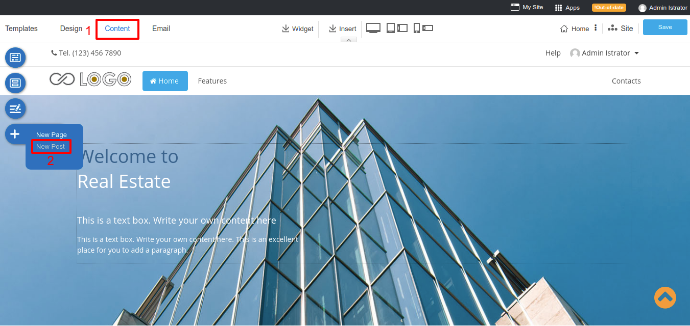

# Creating Blog

## Add New Post

A simple and easy to add your new blog post

1. Current on the step **Content**.
1. Select **New Post**.

## Add Catagories

On step **Content**, click on **New Post**. You can click **Add Category** to create your own category. Also, you can select the parent category with the 3 maximum levels. 

For example: If we add "Cats" category and select parent category to "Animals", a "Cats" category will be under the "Animals" folder.

## Manage your Categories Index

Also, you can modify a catagories page. Clicking **Site** -> **Blog** -> Select Catagory. 

**By Category List**: Shows all your posts in the category

**By Category List Setting**

1. Enable/Disable Category Name
2. Enable/Disable Total Number of Posts
3. Limit post per page
4. Order by: Select Newest, Post Title or Last edit to arrage a list.
5. Enable/Disable author name on each post.
6. Enable/Disable post date and time on each post.
7. Enable/Disable post's category on each post.
8. Continue Reading text is a button to access a post page.

## Add Blog to Catagory

Fills your blog name and select catagory which you want to add in.

## Manage your Blog post

Once you creates a post, you will be able to write a content in the section under a post info widget section.

You can add more widget by clicking the **Section** icon then selecting **Blog**

### Blog post widget section 

**Category list**: This widget shows all your categories.

**Category list Setting**

1. Title: Insert your Title.
2. Number of Category: Limit your category which display on the list.
3. Order by: Select Ascending or Descending to arrage a list.
4. Enable/Disable a total number of posts.

**Recent Post**: This widget shows your latest post.

**Recent Post Setting**

1. Title: Insert your Title.
2. Category to display: Select a category which you need to show on a list.
3. Number of Post: Limit your post which display on the list.
4. Order by: Select Ascending or Descending to arrage a list.
5. Enable/Disable post date and time on each post.
6. Enable/Disable author name on each post.
7. Enable/Disable show catagories on each post.

**Posts in Category**: Shows all blog post which create on the same post's category.

**Posts in this Category setiing**

1. Title: Insert your Title.
2. Number of Post: Limit your post which display on the list.
3. Order by: Select Ascending or Descending to arrage a list.
4. Enable/Disable post date and time on each post.
5. Enable/Disable author name on each post.

**Post Info**: A post details and informations.

**Post Info Setting**

1. Title Size: Select a font size for Title
2. Enable/Disable Category name.
3. Enable/Disable post date and time.
4. Enable/Disable author email.
5. Enable/Disable author name.

**Navigation**: A post breadcrumb navigation.

 

**Breadcrum Setting**

 

1. Select a design of arrow.
2. Select a text color.

**Next and Previous**: Visitor can click to see a next post and previous post.

**Next and Previous Buttons Setting**

1. Select a design of arrow.
2. Select a text color.

## Manage your Blog index

A main blog page can access by domain.com/blog. This page is a blog dashboard where a visitor can see your all blog post as a thumbnail.

You can moditfy this page by clicking **Site** -> **Blog** tab -> **Blog** page.

### Blog index widget section 

There are 2 widgets section, Category list and Recent Post, allow to add in a blog index. Beside, you are able to adjust a blog list widget to display a thumnails of all posts.

**Blog List Setting**

1. Title: Insert your Title.
2. Enable/Disable a total of posts
3. Limit a number of post which diaplay on the list
4. Order by: Select Newest, Post Title or Last edit to arrage a list.
5. Enable/Disable author name on each post.
6. Enable/Disable post date and time on each post.
7. Enable/Disable show catagories on each post.
8. Enable/Disable show a first paragraph on each post.
9. Continue Reading text is a button to access a post page.

