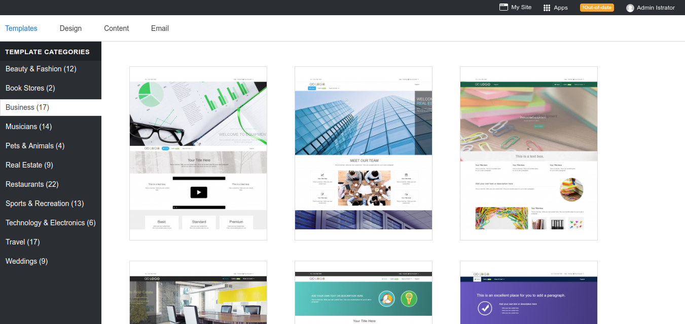
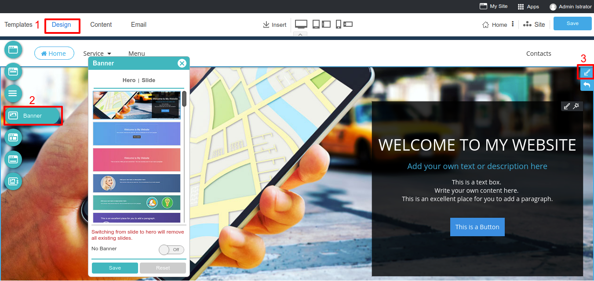
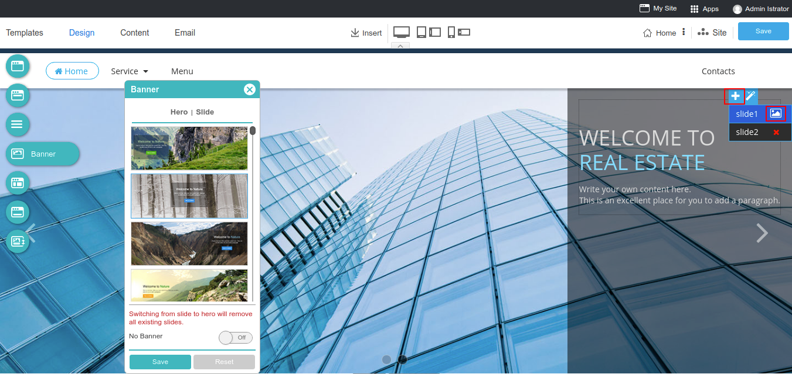
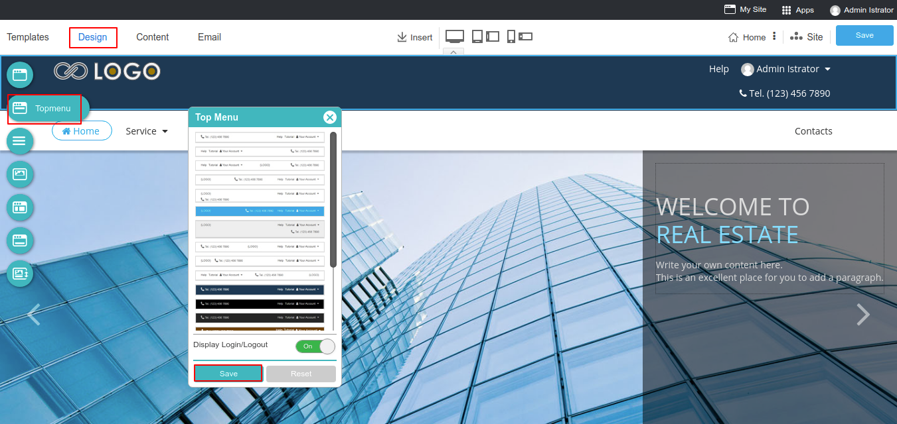
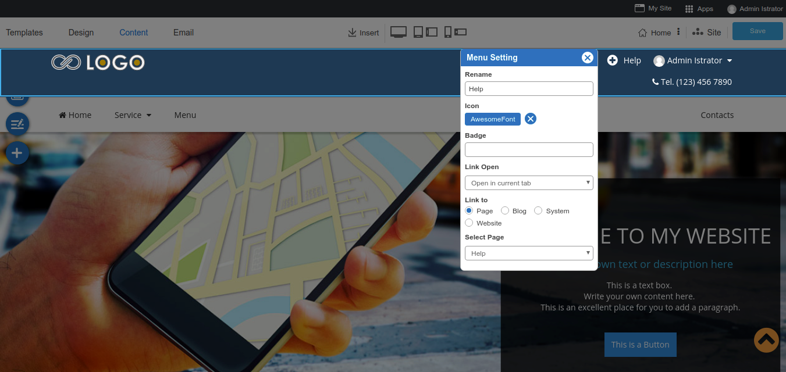
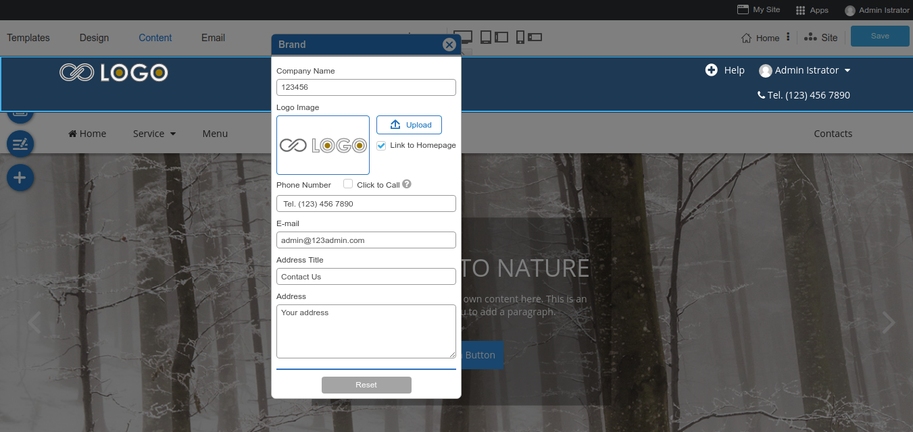
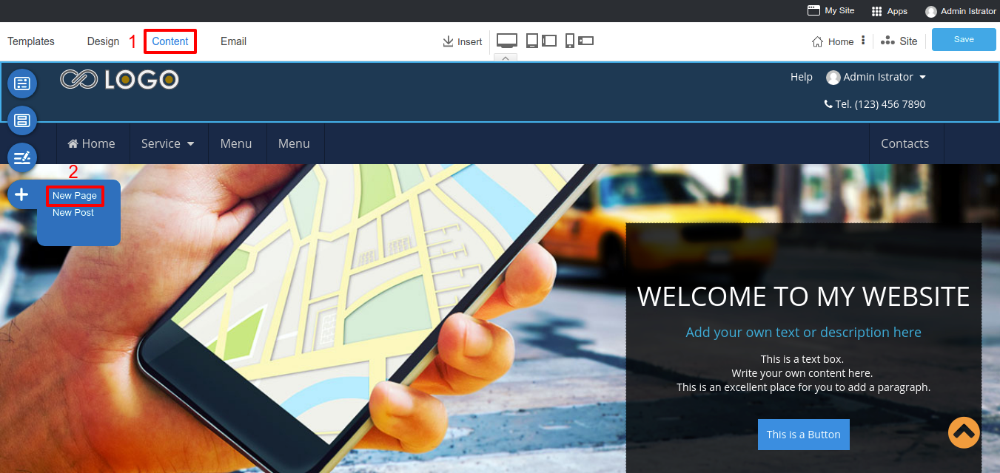
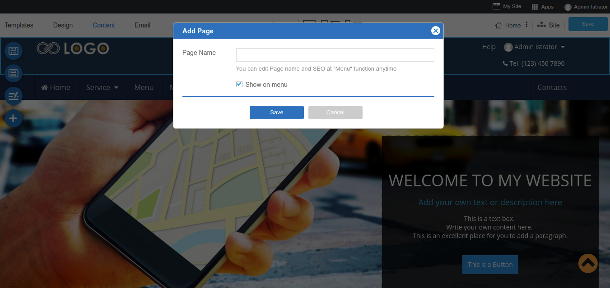
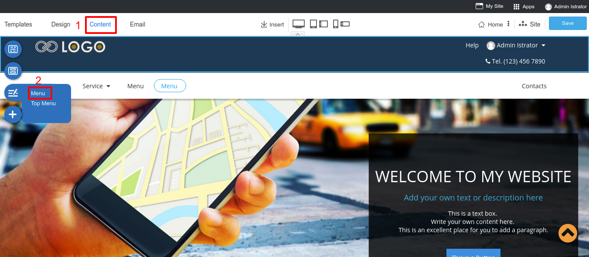
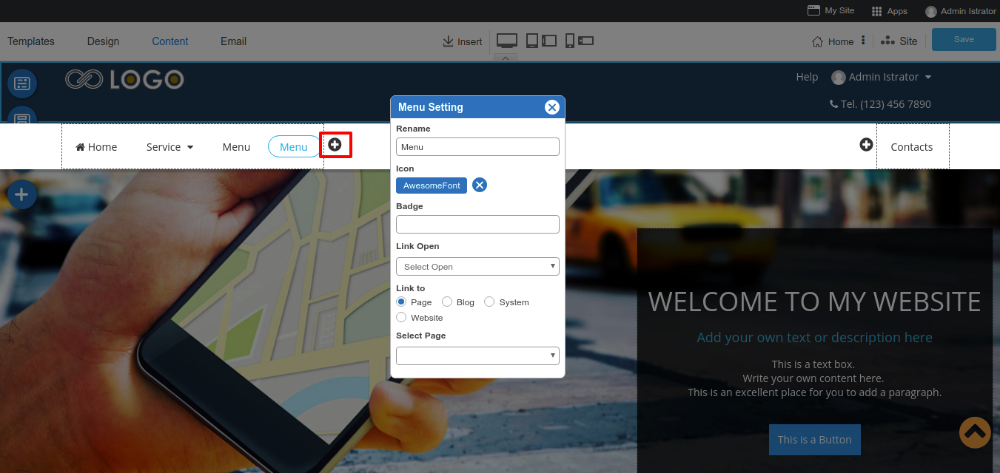

# Creating New Site

## Domain Name Selection

After [logging in](https://github.com/rvsitebuilder/user-docs/blob/7.1/en/overview.md#login-system_), you can start your professtional site in 1 minute!
1. Start with click **Create new site** 

2. Selecting a domain name you want to create a beautiful professtional website with RVsitebuilder 7 and clicking "Next" to continue.

3. Check the information and add Admin Email, then check boxes to agree with our License Agreement.

4. Have a sip of your coffee while waiting for RVsitebuilder 7 creates itself in your domain name.

## Beautiful Template
Select template relate to your business categorie with up to 200 ready-made beautiful templates. Keep or customize as you like.

## Professional Website

### Website Banner
The Most attractive part of your website. RVsitebuilder 7 allows you to use website banner in 2 styles.
- Hero Banner: A single banner image which you can insert the text and change its image. Choose the style at step **Design** and click on **Banner** icon. You can change its image and color by clicking on the Background icon on the right corner. 

- Slide Banner: Make it more than one image on your website banner, also you can change the slide effect.

> **Note:** If you're setting website banner at Home page, it will affect to ALL pages. 

### Website Navigation
Manage your Top Menu and Menu

**Top Menu:** Most of the visitors who access your website do not have much time to spare. The key is to intelligently display those links which your visitors are looking for. Once your products are easily accessible, your visitors are likely to turn into reliable customers.

You can select a Top menu style on step **Design**. Don't forget to click **Save**.

And modify your Top menu on step **Content**, click on the Menu icon and select **Top Menu**. You can adjust and point the menu to a page as you want, also insert the icon in front of the menu.

Clicking on a logo to change your own company logo and insert your company address.

**Main Menu:** This part is useful in organizing the information on your website so that your visitors have a clear idea of your products and services.

You can select a Top menu style on step **Design**. Don't forget to click **Save**.

There are 2 ways of adding a new menu

1. Adding a new page: On the step Content click on the New Page button. You can add a new page and checkbox Show on Menu. If you don't select Show on Menu, the page will be an internal page automatically. But if you select a Show on Menu box, it will create a new page, also add the menu to your navigation bar.

2. Adding manually menu: You can add a new menu and select page to point at the step Content, click on the Menu icon and select Menu. You can adjust and point the menu to a page as you want. 

On the Menu Setting you can:

- Fill your Menu name
- Add icon which will appear in front of the menu.
- Add badge to get more attractive from visitor.
- Select the method you need to open this menu.
- Choose a direction to link this menu.

### Website Content
Easy way to create a wonderful website just drag and drop element.

### Website Footer
The new feature of RVsitebuilder is an adjustable footer area! In version 7, it allows you to change the style and background color by selecting from a list we provides.

1. On step Design, select a Footer icon.
1. Now RVsitebuilder 7 provides 8 styles to choose and set to show a sitemap and copyright. Don't forget to click **Apply** after you selected.
1. You can insert your information by clicking on each block.

**Information Setting**
Simply put, your company profile is a professional introduction and aims to inform people (primarily prospective buyers and stakeholders) your products, services, and current status. A well written company profile is a great opportunity for your company to differentiate itself.

**Contact Us setting** Add your company address for more trustworthy and easy to contact. A logo, a phone number will be shown on your top menu also.

**Social Media setting** Always have your visitors stay connected with you on Facebook, Twitter, Google+, Instagram, Line that will appear on website footer.

> **Tip:** Showing a sitemap - This feature will be useful for visitors to get faster and easier access.

