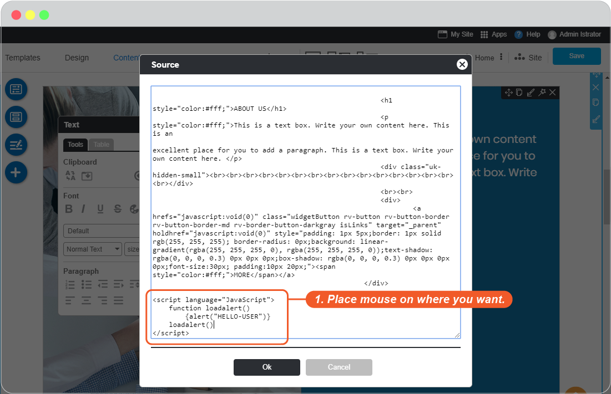
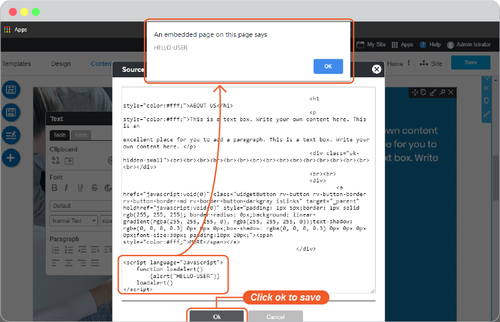
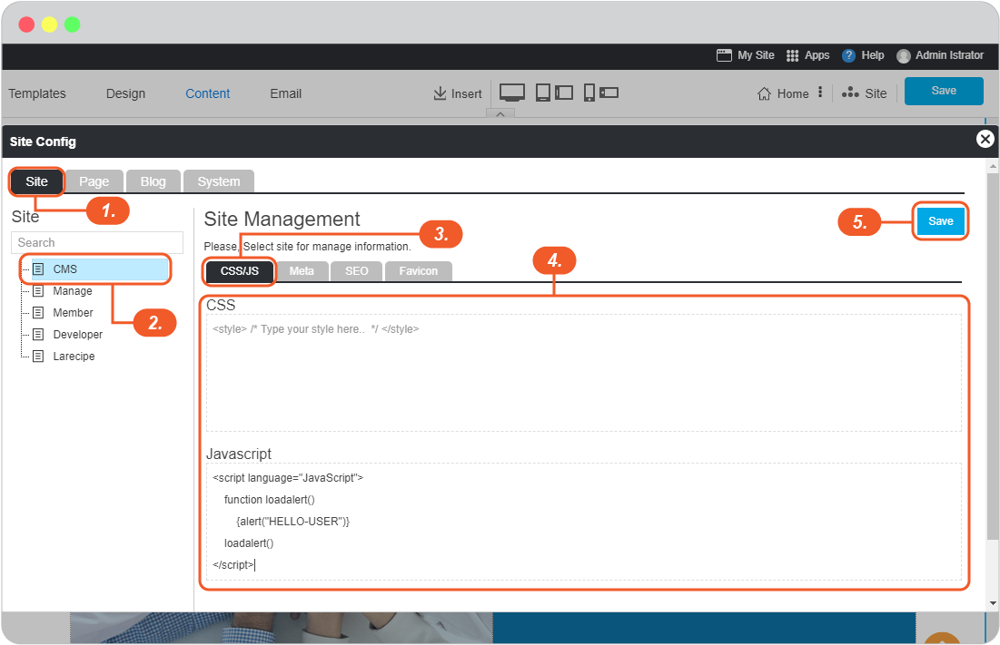

# Easy add CSS/Javascrip on your website

- [Add CSS/Javascript by page](#add-cssjavascript-by-page)
- [Add CSS/Javascript by site](#add-cssjavascript-by-site)

RVsitebuilder 7 is the plugable application that allows several Apps to install on it and use with your website.
Long story short, it allows you to install Apps from our [Apps Marketplace](https://apps.rvsitebuilder.com) to use on your website aside from cool features we already provide in RVsitebuilder.

But in case if sometimes you really want to add Javascript/Css on your page in order to make your website more wow, you can also do that in our **HTML Mode**.

## Add CSS/Javascript by page

1. Make sure the Javascript/Css you got is correct and working properly.

2. At Content tab, click on any content section of the page you want. On **Section Editor**, click on **html mode**.

    _javascript is supported here, you dont need to insert script in File Manager_

    

3. Insert the Javascript/Css

    

4. Click **Ok** to save.

    

5. Don't forget to click **Save** on content editor.

6. Click on **My Site** to see what you just have done.

7. If there's nothing in action or it shows and error, please check the script again for if it's really correct.

## Add CSS/Javascript by site

1. On Content editor, click **Site** -> **Page Management** icon

    

2. On **Site Config** panel.

   1. Click **Site**

   2. Select **CMS**

   3. Select **CSS/JS**

   4. Insert CSS or JavaScript

   5. Click **Save**

    

3. Don't forget to click **Save** on content editor.

4. Click on **My Site** to see what you just have done.

5. If there's nothing in action or it shows and error, please check the script again for if it's really correct.
