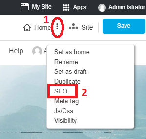
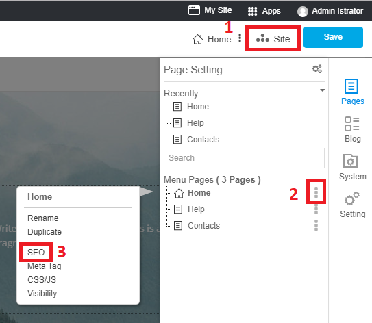
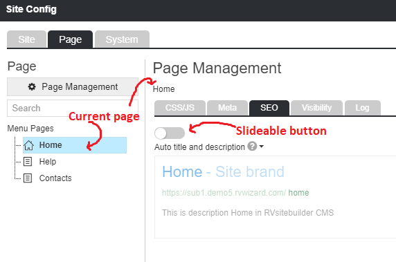
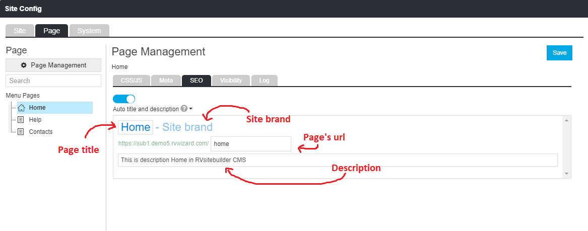

# Easy Website SEO

## Make your website found on google

SEO strategy nowadays is not only to do the meta tag in order to get ranked in google. And as google nowadays has improved its algorithm in website ranking, so it becomes more focus on Page Title or content, related to what popular searched from global searchers.

And in RVsitebuilder, we provide places to insert meta tag and meta description for users. This might be only a little help. But all the rest of being ranked in google, it's about SEO strategies as explained above.

RVsitebuilder 7 provides the easy way to set SEO to your website.

#### Setting Areas
- 3-dot next to current page name you're editing

- Site -> Page Management icon

- Site -> Menu Pages -> 3-dot after page names

At the Page Management, you're ready on SEO tab.

Auto title and description are the automated default for page's title, site brand and description.

Slide the slide-button to right to custom page's title and description to be more effective SEO.
- **Page's title** : You can edit page's title to be more search key than page name such as changing Home to RVsitebuilder CMS.
- **Site brand** : It is inherrited from Site brand you defined as your company.
- **Page's url** : You can edit url of this page to be more search key than the normal such as changing https://rvsitebuilder/com/home to https://rvsitebuilder.com/CMS
- **Description** : Make a few less-is-more sentences for the seek and found you. A short description about your business.

*Tips*: Description for your website should be short effective and quick understandable sentences with impact keywords people would use to find what they want relate to your business. Avoid using the very unique words which may relate your company but people don't know about it. Localization is to focus on specific countries, be sure about your targetted customers and their locations.
