# Email Template

  - [Email Template Setup](#emailtemplatesetup)
  - [Email Design](#emaildesign)
  - [Email Address Setup](#emailaddresssetup)

Make your website way more you with the custom email template for emails sent out to those visitors who register to your website and website admins. Email Template can be useful and easier to support you. Custom its design to be matched your website design.

### Email Template Setup

1. **Navigate it from Email menu.**

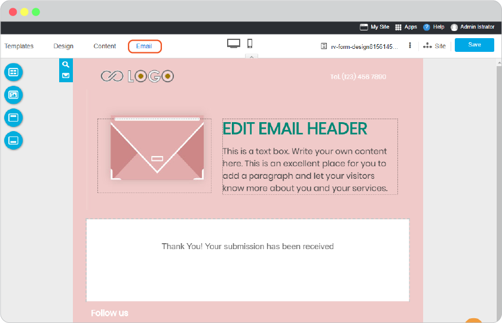

2. **Select template**, it can be customized later.

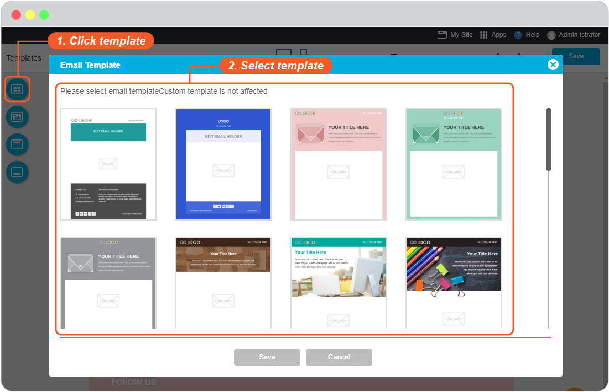

3. **Setup recipient templates**

In **Config** icon, you can select an email page which you want to adjust.

There are 2 templates for 2 receivers.

1) User template, email templates to send to your website users.

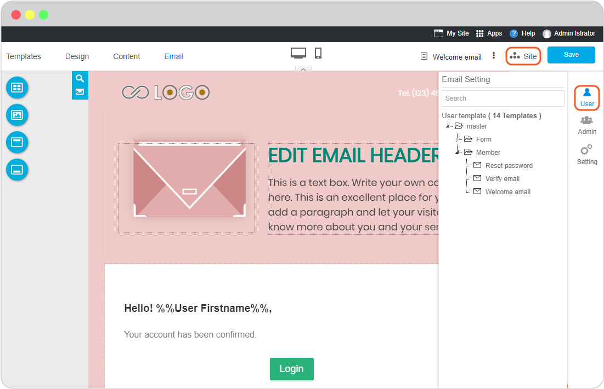

- **Master**, is to set an email template to globally use in every emails sent out.

- **Form**, the email template to use with online form on your website.

- **Member**, the email template to use with **Login** button on your website.

- *Reset password email*: the email to use when users use forget password function on website login area. 

- *Verify Email*: email approval for identifying the correct visitor email. Authentication your visitor by clicking confirm on their email.

- *Welcome Email*: a greeting email which sends out when visitors approve the verification email.

2) Admin template, email templates to send to website admins on your website.

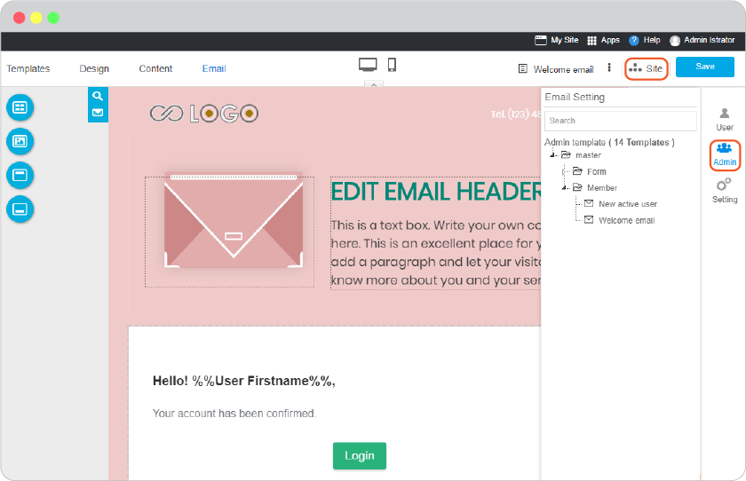

- **Master**, is to set an email template to globally use in every emails sent out.

- **Member**, the email template to use to get alert from new users.

*Online Form*: an alert email to inform all website admins when a new user has submitted online form on your website.

*New active user*: an alert email to inform all website admin about new resgistered users.

4. **Edit company brand**

You may edit company brand here in Email template by clicking on Brand area. The information about company brand you change here will be effect to website company brand as well.

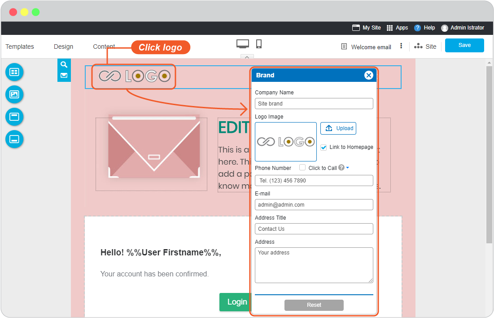

5. **Set Email header**

You can add an impact text on your email to get more attraction or a tiny promote before the whole email content. Just by clicking on **EDIT EMAIL HEADER** and start.

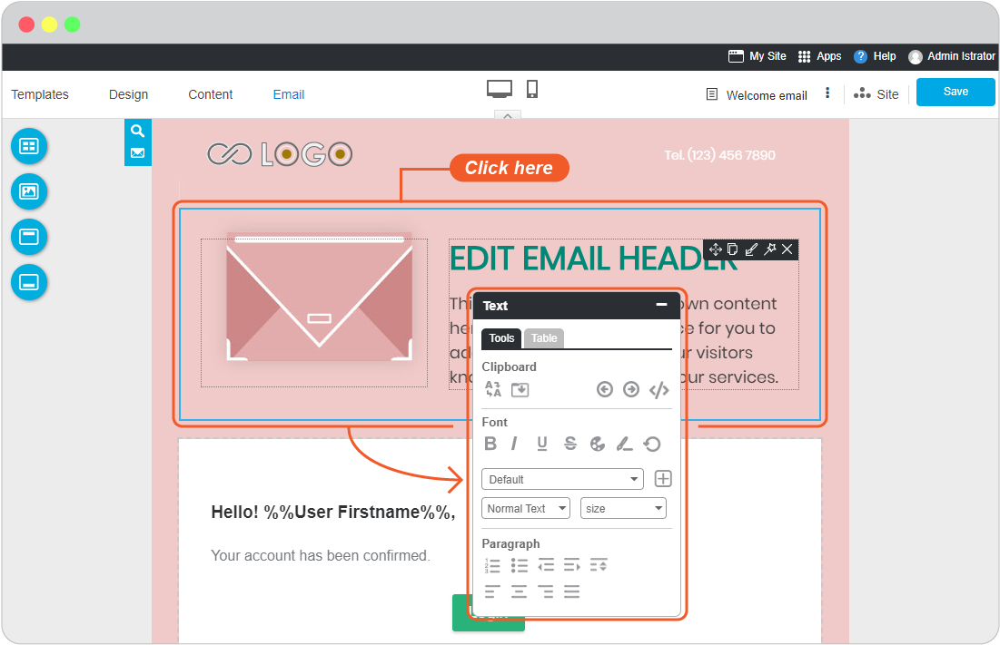

### Email Design

You can customise Email design to be more related feel to your company and website.

**Template**, is allow to back to the first step of template selection for Email Template.

**Background**, is to make Email with background that match your website theme. Give dimensions of the email content and its background on Top, Bottom, Left, Right as you like.

**Header**, select one from 7 Header designs and customise it the way you like such as Header color, Header Image, insert Logo, company name, telephone number, make it the way that the receiver will immediately know that it was sent from you.

**Footer**, select one from 7 Footer designs, the information on Email Footer will be the same as in your website Footer by default. Add or edit the social channels to be followed.

### Email Address Setup

**Email Subject**

Change Email subject to be the first to impress and get more attention to your users. Just navigate to email subject symbol. Edit and **Save** it.

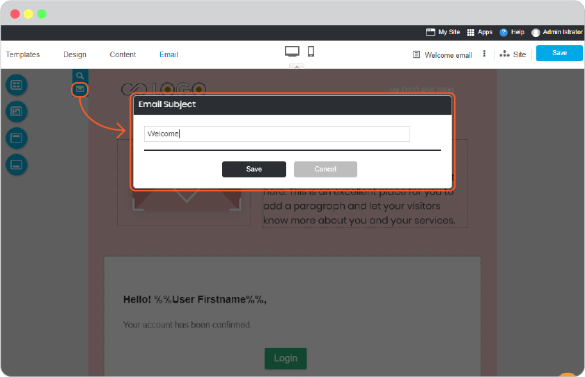

**Setting**

In **Config** icon, click on **Setting** to open email setting tools.

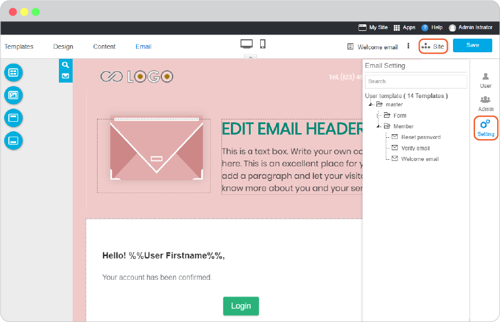

- **Email Setting**, is to set email driver for sending out emails from your website from SMTP, Sendmail, Mailgun, Ses, Sparkpost, Log, or Array.

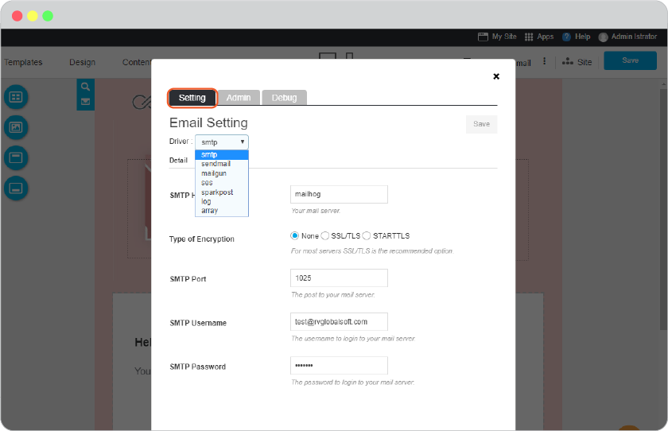

- **Admin Email Management**, to set admin email or email sender. You can select whether the same as your admin account email or insert another one.

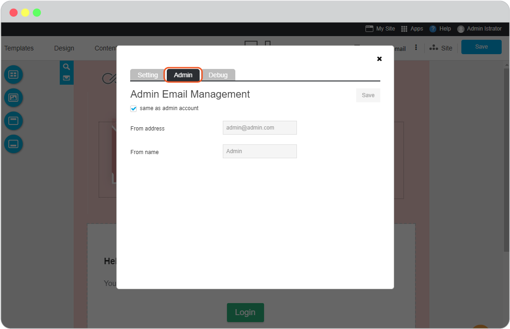

- **Email Debug**, place for advanced website admin to add email debug in order to monitor all emails.

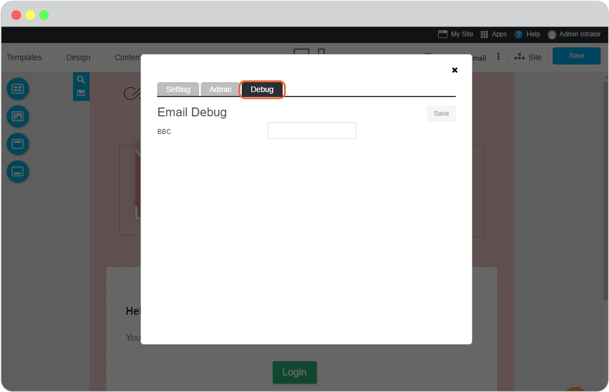

- **Preview and Test**

Preview your email template by sending it directly to your email. See how it works on the visitor's view.

Click on **Preview** feature, and insert your own email in **To** field. Click **Send** to send it.

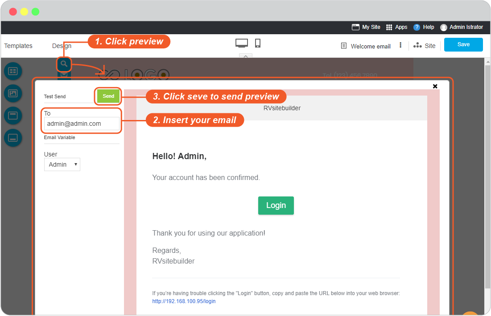