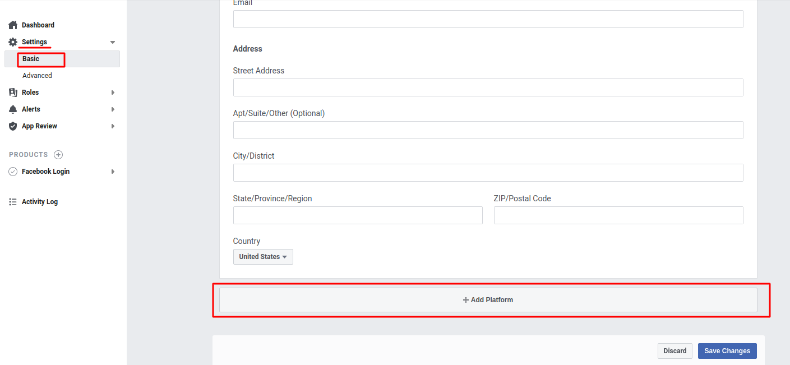
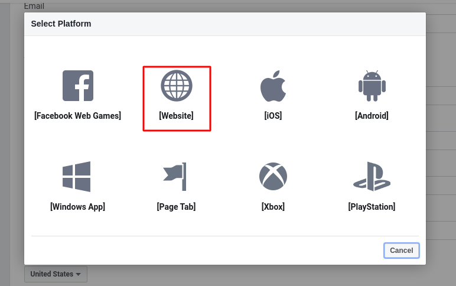
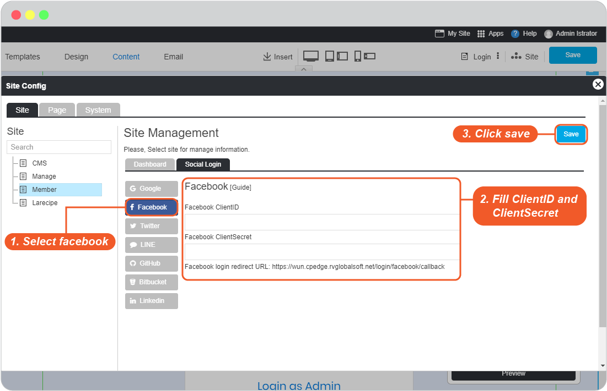
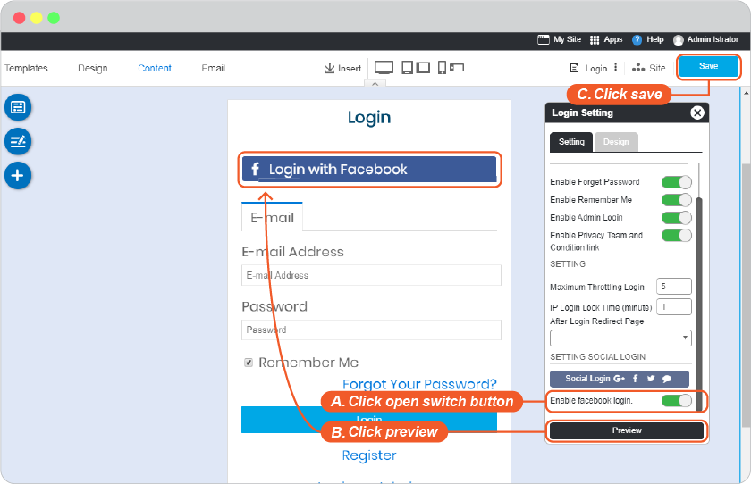

# ​Facebook Login Setup

1. Go to <https://developers.facebook.com/apps> , select **Add a New App**.
   
   

2. Insert **Display Name** and **Contact Email** you want facebook to connect with your website. Then click **Create App ID**.
   
   

3. Insert the correct **Security Check**.
   
   

4. Next page, look for product **Facebook Login** and select **Setup**.
   
   

5. At Product menu on the left, find **Facebook Login**, and click **Settings**. And insert **OAuth redirect URIs** and **Save Changes**.
   *(You can find Callback URL in your website editor -> Site -> System -> on "System Pages" list -> Login, click on Login form to open Login setting. On Login Setting panel, scroll and click "Social Login" button, you will be at "Site Config" Member, look for Facebook login redirect URL.)*

   

6. Go to **Settings** -> **Basic**, to insert **Privacy Policy URL**. If you have a page to provide Privacy Policy on your website, if not, you can insert your website URL.
   
   

7. Select **+ Add Platform** to continue.
   
   

8. Select Platform as **Website**.
   
   

9.  Insert your website at **Site URL** and click **Save Changes**.
    
   

10. Look for **App Secret** and select **Show**. Facebook API management page will display **App ID** and **App secret**.

   

11. Go to website editor -> Site -> System -> on "System Pages" list -> Login, click on Login form to open Login setting. On Login Setting panel, scroll and click "Social Login" button, you will be at "Site Config" Member.

    1. Select facebook tab.
    2. Insert App ID for Facebook Client ID and App Secret for Facebook Client Secret.
    3. Click Save to add these values to your form.
    4. Close the Site Config window.

    

    5. Click "Save" on editor page.
  
    

12. The Facebook Login single sign-on is available for your user to login to your website without make a new register.

**Bonus**

Disable and Enable your Facebook Login

Go to website editor -> Site -> System -> on "System Pages" list -> Login, click on Login form to open Login setting. On Login Setting panel, scroll and look at **Enable facebook login**.

A.  slide to to left to disable or right to enable.

B.  Click "Preview".

C.  Click "Save" to save all of your setting.

