# GitHub Login Setup

Setup requires a GitHub membership and a GitHub app.

## Creating a GitHub App

You can create and register a GitHub App under your personal account or under any organization you have administrative access to.
To learn how to use [Creating GitHub App](https://docs.github.com/en/free-pro-team@latest/developers/apps/creating-a-github-app/).

1. In the upper-right corner of any page, click your profile photo, then click Settings.

 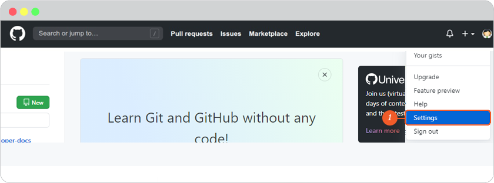

2. In the left sidebar, click Developer settings.

 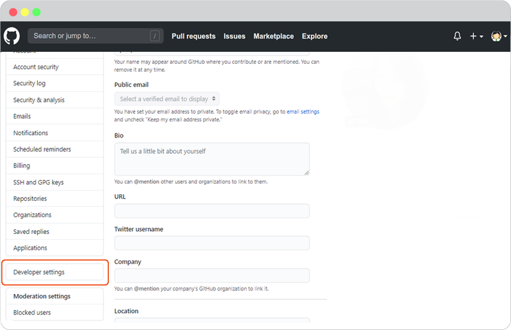

3. In the left sidebar, click GitHub Apps.

4. Click New GitHub App.

 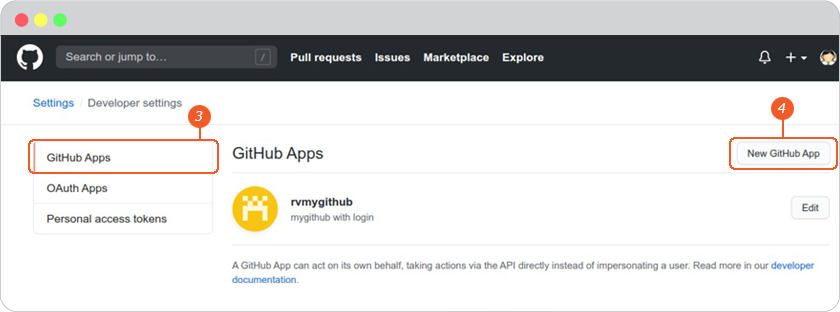

5. In "GitHub App name", type the name of your app.

6. Optionally, in "Description", type a description of your app that users will see.

7. In "Homepage URL", type the full URL to your app's website.

 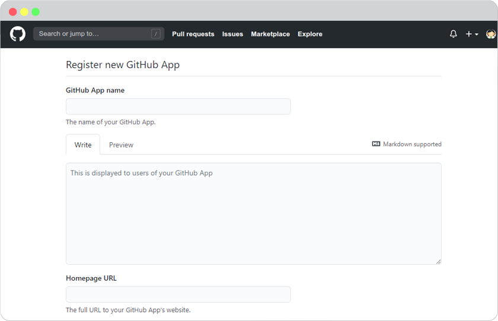

8. In "Callback URL", type the full URL to redirect to after a user authorizes the installation. This URL is used if your app needs to identify and authorize user-to-server requests.

9. By default, to improve your app's security, your app will use expiring user authorization tokens. To opt-out of using expiring user tokens, you must deselect "Expire user authorization tokens". To learn more about setting up a refresh token flow and the benefits of expiring user tokens, see "Refreshing user-to-server access tokens."

10. If your app authorizes users using the OAuth flow, you can select Request user authorization (OAuth) during installation to allow people to authorize the app when they install it, saving a step. If you select this option, the "Setup URL" becomes unavailable and users will be redirected to your "User authorization callback URL" after installing the app. See "Authorizing users during installation" for more information.

11. If additional setup is required after installation, add a "Setup URL" to redirect users to after they install your app.

 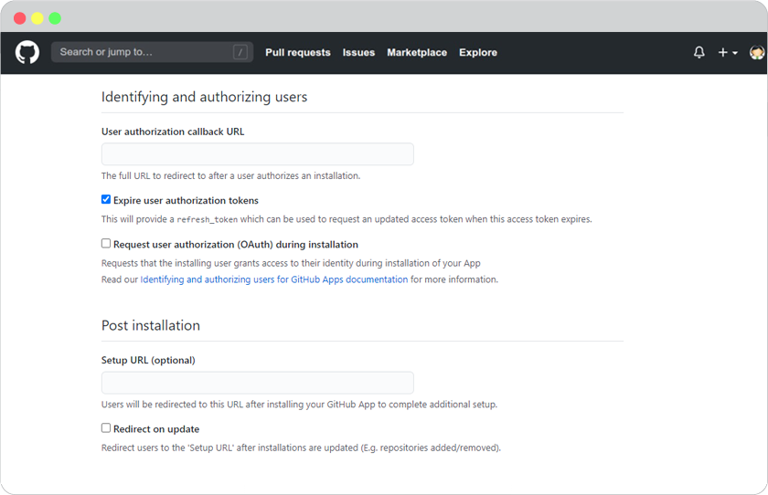

12. In "Webhook URL", type the URL that events will POST to. Each app receives its own webhook which will notify you every time the app is installed or modified, as well as any other events the app subscribes to.

13. Optionally, in "Webhook Secret", type an optional secret token used to secure your webhooks.

 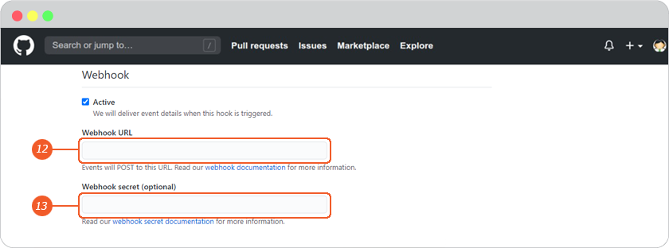

14. In "Permissions", choose the permissions your app will request. For each type of permission, use the drop-down menu and click Read-only, Read & write, or No access.

 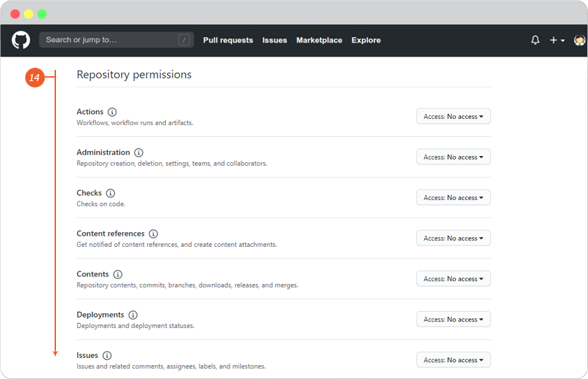

15. In "Subscribe to events", choose whether to subscribe your app to Label, Public, Repository, or Watch events.

16. To choose where the app can be installed, select either Only on this account or Any account. For more information on installation options, see "Making a GitHub App public or private."

17. Click Create GitHub App.

 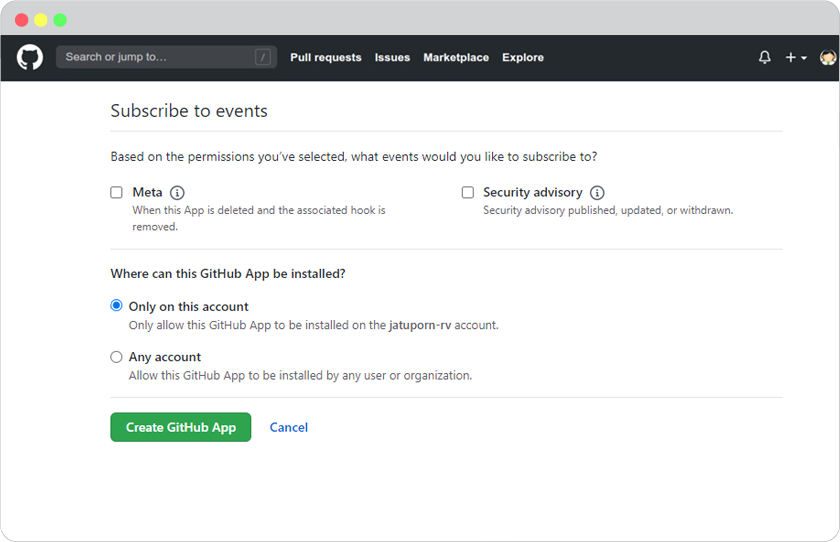

18. Click Generate a new client secret.

 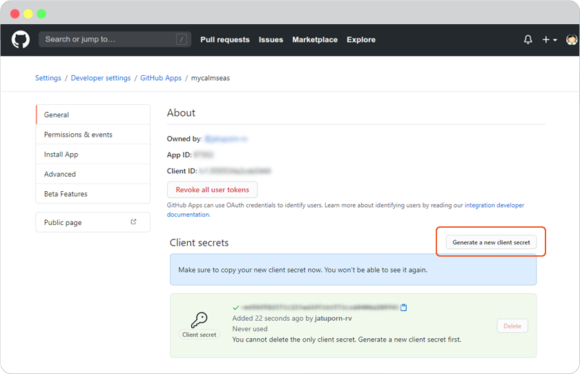

## Once you have GitHub App information, you can set up Login as GitHub as follows

1. Go to <https://github.com/>, sign into your GitHub account.

2. In the upper-right corner of any page, click your profile photo, then click **Settings**.

 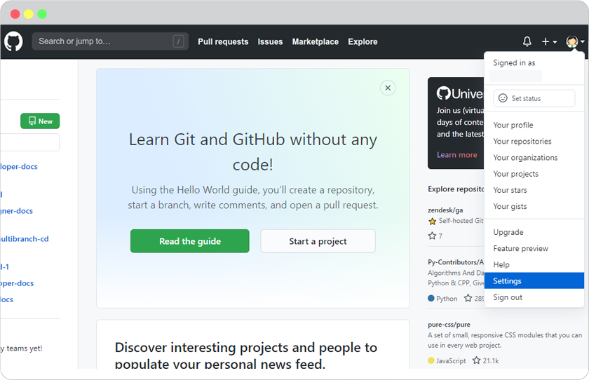

3. In the left sidebar, click **Developer settings**.

 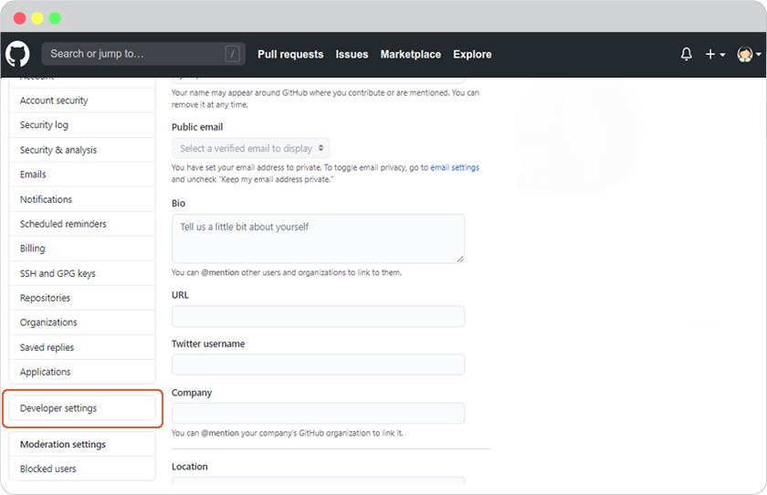

4. Click **Edit** your GitHub App.

 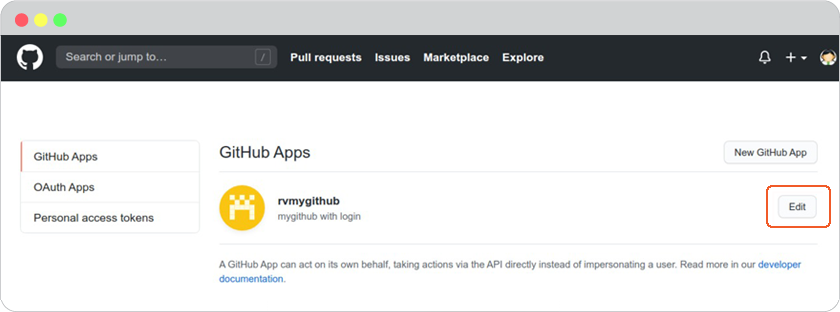

5. Information for your GitHub Apps displays.

 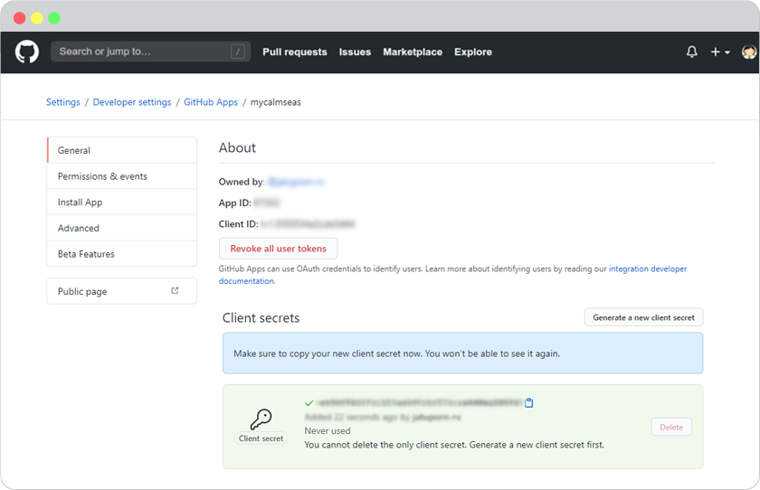

6. Go to website editor -> Site -> System -> on "System Pages" list -> Login, click on Login form to open Login setting. On Login Setting panel, scroll and click "Social Login" button, you will be at "Site Config" Member.

   1. Select GitHub tab.
   2. Insert App ID for Github Client ID and App Secret for Github Client Secret.
   3. Click Save to add these values to your form.
   4. Close the Site Config window.

    

   5. Click "Save" on editor page.

    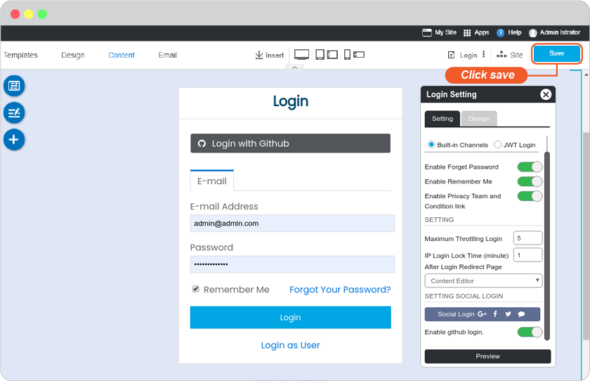

7. The Github Login single sign-on is available for your user to login to your website without make a new register.

**Bonus**

Disable and Enable your Github Login

Go to website editor -> Site -> System -> on "System Pages" list -> Login, click on Login form to open Login setting. On Login Setting panel, scroll and look at **Enable github login**.

A.  slide to to left to disable or right to enable.

B.  Click "Preview".

C.  Click "Save" to save all of your setting.

 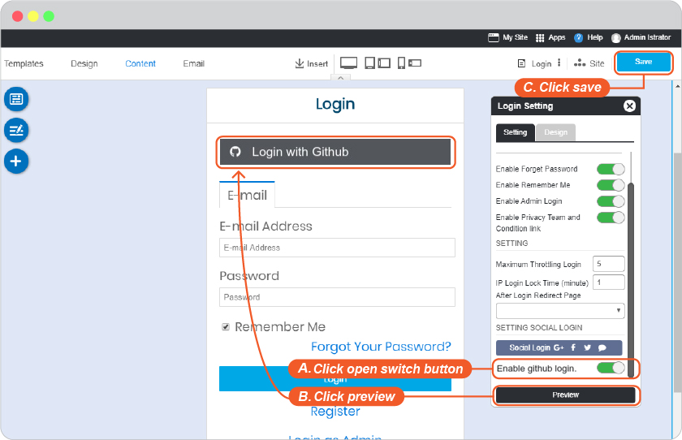
