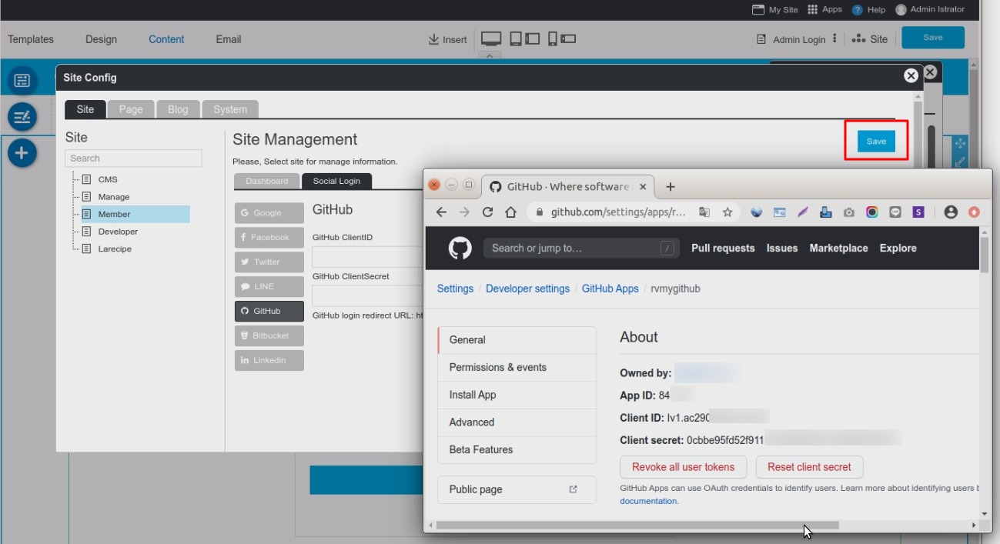
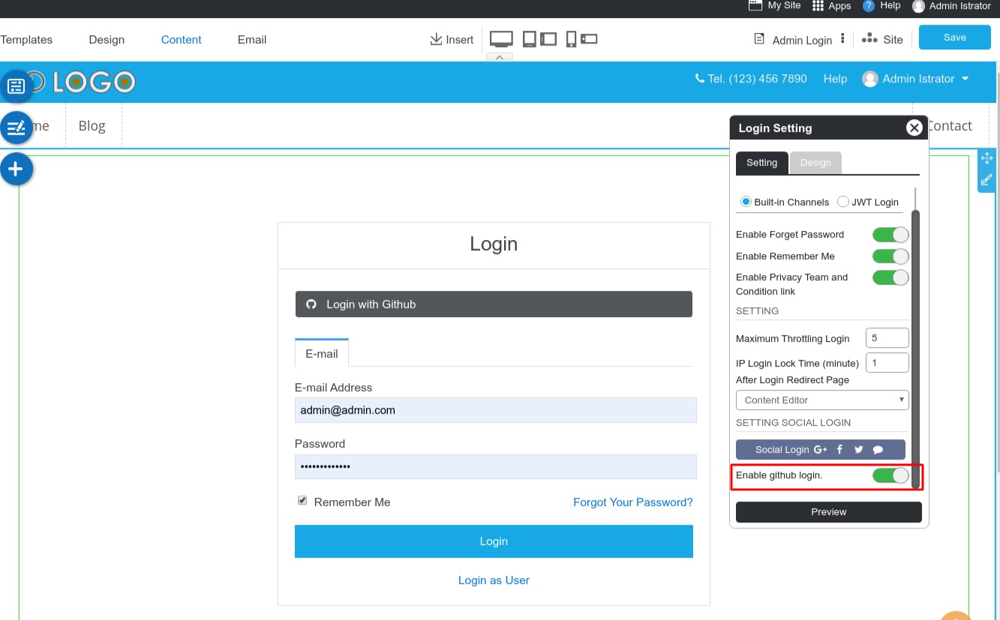

# Github Login Setup

หากมีอยู่แล้ว

1. Go to <https://github.com/>

2. In the upper-right corner of any page, click your profile photo, then click Settings.

    

3. In the left sidebar, click Developer settings.

    

4. In the left sidebar, Actived GitHub Apps, click the Edit Button your app name.

    

5. Display your GitHub Apps

    

6. Go to RVsitebuilder your website editor -> Site -> System Pages -> Login, click on Login form page to open Login Setting Panel and click the Social Login Button, to enable GitHub Login Setup.

    

        6.1 Select Github tab.
        6.2. Insert App ID for Github Client ID and App Secret for Github Client Secret.
        6.3 Click OK to add these values to your form.

    

        6.5 Click "Save" on Site Config windows.
        6.4 On Login Setting, Enable github login.
        6.5 Click "Preview"
        6.6 Click "Save" to save all of your setting above.

7. The Github Login single sign-on is available for your user to login to your website without make a new register.
  
## Note: Creating a GitHub App

You can create and register a GitHub App under your personal account or under any organization you have administrative access to.
 <https://docs.github.com/en/free-pro-team@latest/developers/apps/creating-a-github-app>
