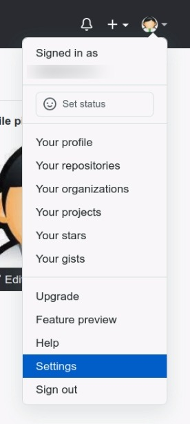
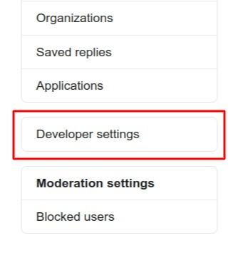
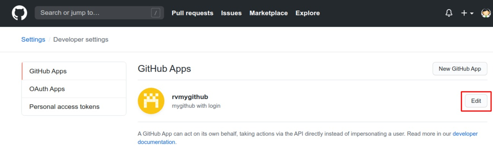
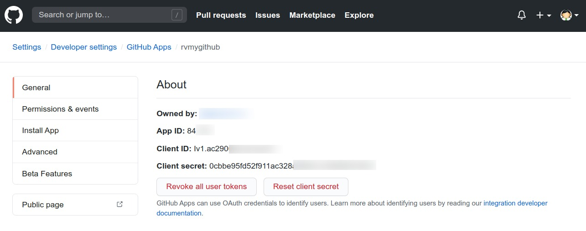
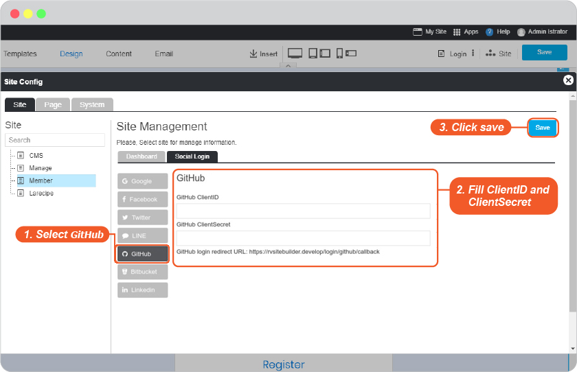

# Github Login Setup

Setup requires a GitHub membership and a GitHub app must be created.

## Creating a GitHub App

You can create and register a GitHub App under your personal account or under any organization you have administrative access to.
To learn how to use GitHub App <https://docs.github.com/en/free-pro-team@latest/developers/apps/creating-a-github-app>

## Once you have GitHub App information, you can set up Login as GitHub as follows

1. Go to <https://github.com/>, sign into your GitHub account.

2. In the upper-right corner of any page, click your profile photo, then click Settings.

    

3. In the left sidebar, click Developer settings.

    

4. Click "Edit" your GitHub App.

    

5. Display your GitHub Apps.

    

6. Go to website editor -> Site -> System Pages -> Login, click on Login form to open Login setting, to enable GitHub Login Setup.

   1. Select GitHub tab.
   2. Insert App ID for Github Client ID and App Secret for Github Client Secret.
   3. Click OK to add these values to your form.

    

   4. On Login Setting, click "Apply" to apply your setting.
   5. Click "Preview"
   6. Click "Save" to save all of your setting above.

    

7. The Github Login single sign-on is available for your user to login to your website without make a new register.
