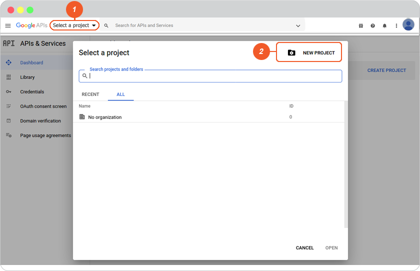
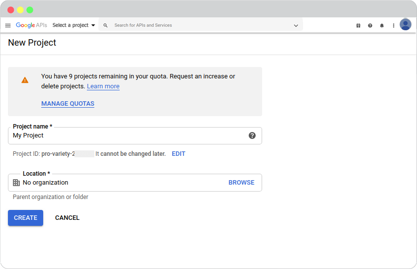
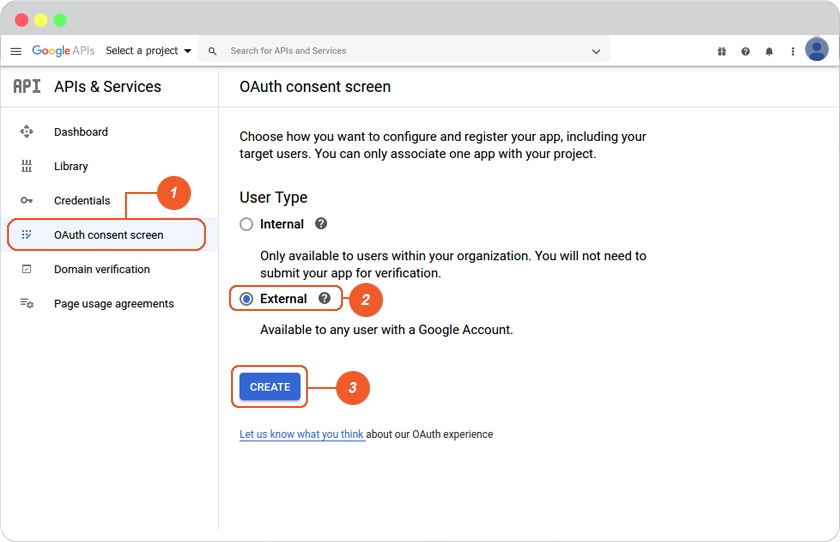
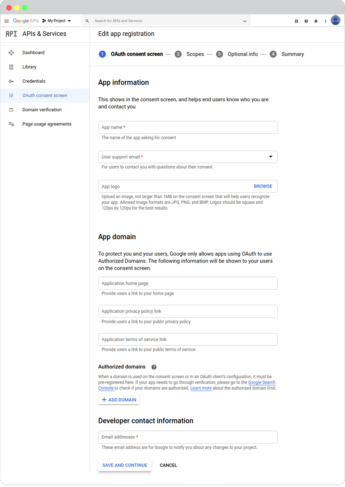
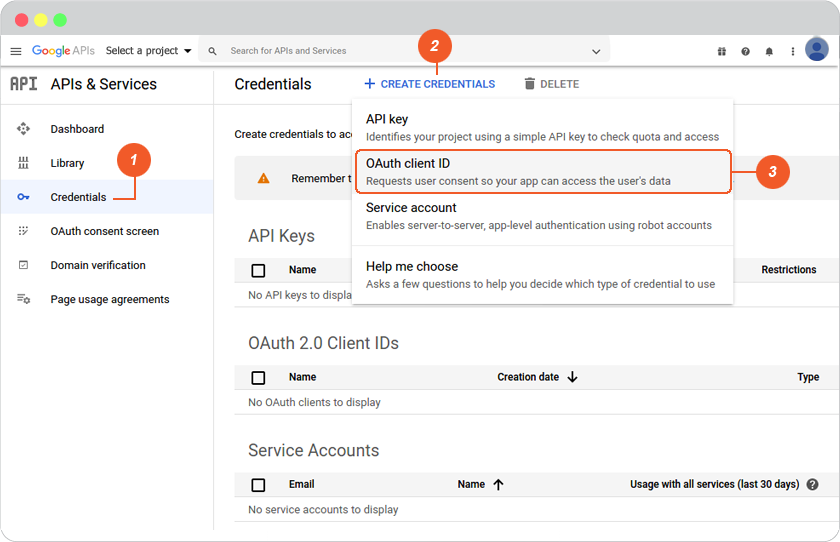
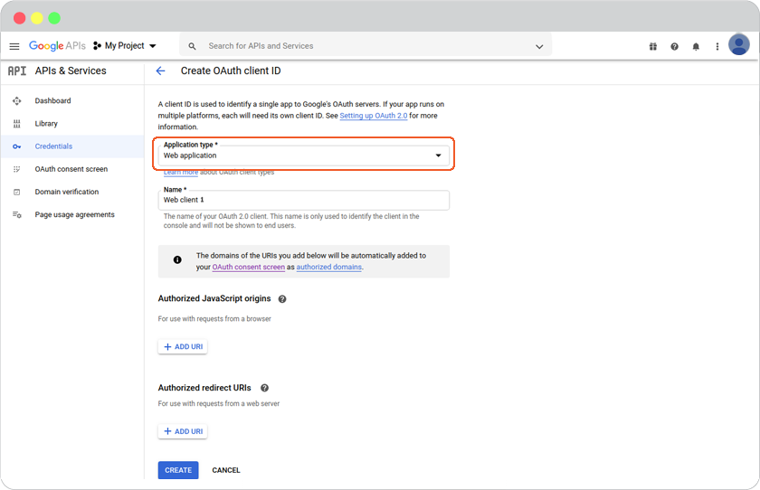
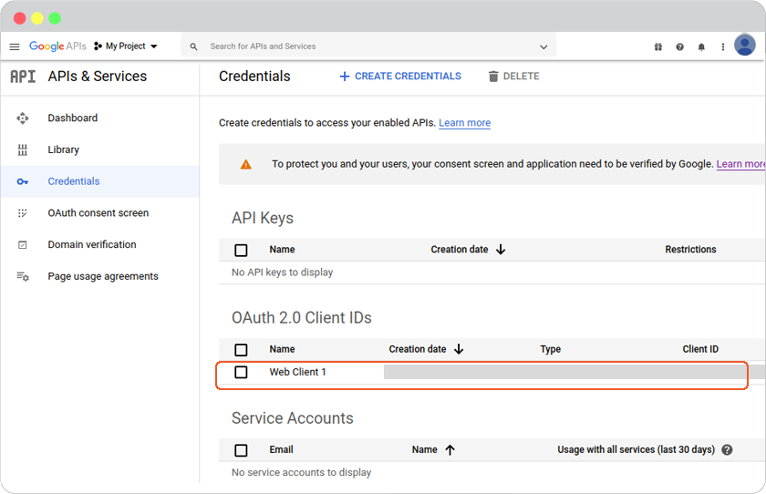
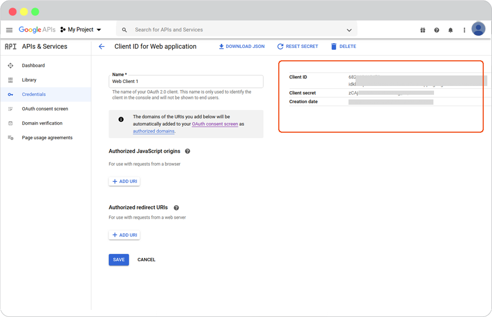

# Google Login Setup

Open Google Console website at <https://console.developers.google.com/> . Login with your google email (Gmail) or register if you don't have one.

## To create an OAuth 2.0 client ID in the console

To learn how to use [OAuth 2.0](https://support.google.com/cloud/answer/6158849?hl=en/)

1. Create New Project.

    1.1 On the top menu bar, click "Select a project", then click "NEW PROJECT".

    1.2 Create a new project for your domain, click "CREATE".

2. Create OAuth consent screen.

To set up your project's consent screen and request verification.

    2.1 On the left, click "OAuth consent screen".
    2.2 Click "External", then click "Create".

    2.3 Your registration in all 4 steps.

3. Create Client ID for Web application.

    3.1 On the left, click "Credentials".
    3.2 Click "+CREATE CREDENTIALS", then select "OAuth Client ID".

    3.2 Create OAuth client ID, select "Application type" (Web application), add Web Client Name, then click "CREATE".

    3.3 To Check: Click "Credentials", at the OAuth 2.0 Client IDs click "Web Client Name".

    3.4 On the page that appears, copy the client ID and client secret to your clipboard, as you will need them when you configure your client library.

*** กรณีเคยสร้างแล้ว

1. Login google <https://console.developers.google.com/>.

2. Open the [Google API Console Credentials page](https://console.developers.google.com/apis/credentials/).

3. At the OAuth 2.0 Client IDs, click "Client Name".
4. On the page that appears, copy the client ID and client secret to your clipboard, as you will need them when you configure your client library.

5. Go to website editor -> Site -> System Pages -> Login, click on Login form to open Login setting. Enable Google Login Setup.

     1. Select google tab.
     2. Insert Client ID and Client secret from number 9 to Google Login Setup, and click OK to complete setting.
     3. Click OK to add these values to your form.

    

     1. On Login Setting, click open switch button.
     2. Click "Preview"
     3. Click "Save" to save all of your setting above.

    
