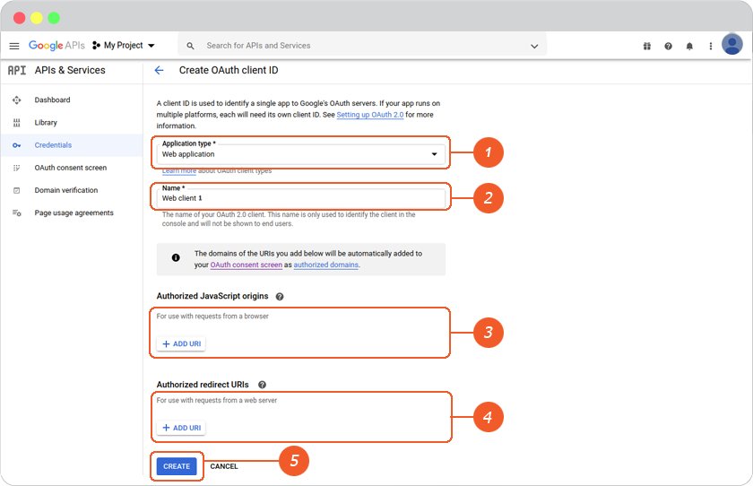
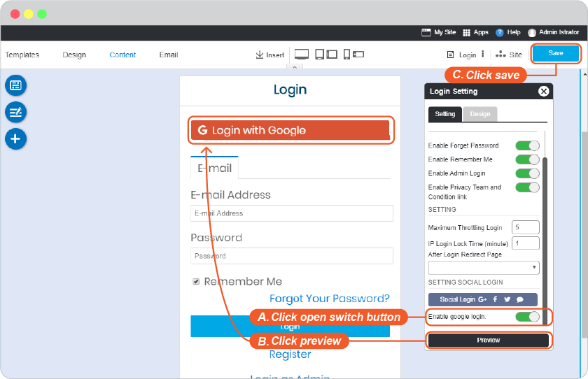

# Google Login Setup

You can set up social connections for applications using the Google API Setup. The configured social connections can be used to log in to your application.

To learn how to use [OAuth 2.0](https://support.google.com/cloud/answer/6158849/)

**Google Login Setup for Built-in Channels requires Google API Setup**. Don't worry if you don't feel familiar with Google API Setup, you can follow easy steps below.

1. Open Google Console website at <https://console.developers.google.com/> . Login with your google email (Gmail) or register if you don't have one.

2. Create Project Name: On the top menu bar, click **Select a project**, then click **NEW PROJECT**.

3. Insert a **Project name** for your domain, click **CREATE**.

4. On APIs & Services page. Click **OAuth consent screen** on the left menu, select User Type as **External**, then click **Create**.

5. Complete App information for 4 STEPS.

6. At the APIs & Services. On the left, click **Credentials**, click **+CREATE CREDENTIALS**, and select **OAuth client ID**.

7. On Create OAuth client ID page.

   1. Select "Application type" as **Web application**
   2. Create a name for recognizable
   3. Insert **Authorized JavaScript origins** (Your website URL)
   4. Insert **Redirect URIs** (You can find it in your website editor -> Site -> System -> on "System Pages" list -> Login, click on Login form to open Login setting. On Login Setting panel, scroll and click "Social Login" button, you will be at "Site Config" Member, look for Google login redirect URL.)
   5. Don't forget to click **Save**.

1. You can see the credential in **Credentials** on the left menu, click on your OAuth Client Name.

9. On the page that appears, copy the client ID and client secret to your clipboard, as you will need them when you configure your client library.

10. Go to website editor -> Site -> System Pages -> Login, click on Login form to open Login setting. Enable Google Login Setup.

     1. Select google tab.
     2. Insert Client ID and Client secret from number 9 to Google Login Setup, and click OK to complete setting.
     3. Click OK to add these values to your form.

     - Close the Site Config window.

    

    - Click "Save" in the editor page.

    

    **** กรณีตั้งค่าไว้แต่ยังไม่เปิดให้ user ใช้งาน สามารถ ปิด/เปิดปุ่ม Social Login ได้

    A.  On Login Setting, click open the switch button.

    B.  Click "Preview"

    C.  Click "Save" to save all of your setting above.

    

11. The Google Login single sign-on is available for your user to login to your website without make a new register.

If Google Login returns error when visitors try to login, please contact your host provider to allow google rule_id in ModSecurity by this [guide](https://support.rvglobalsoft.com/hc/en-us/articles/360019136994-Google-Login-on-My-website-is-giving-error-when-visitors-try-to-login-).
