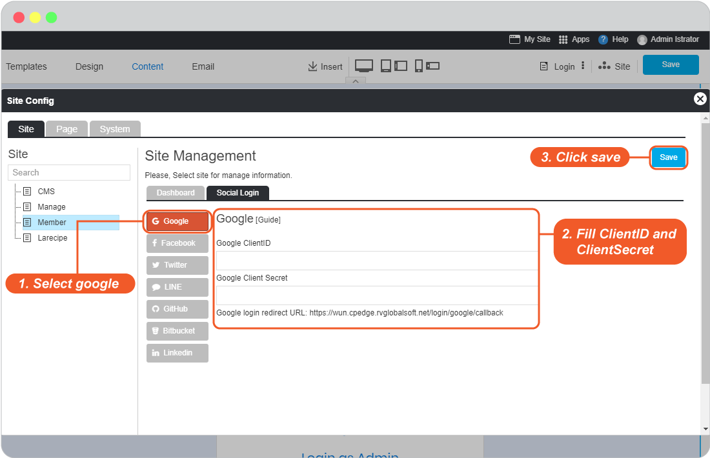
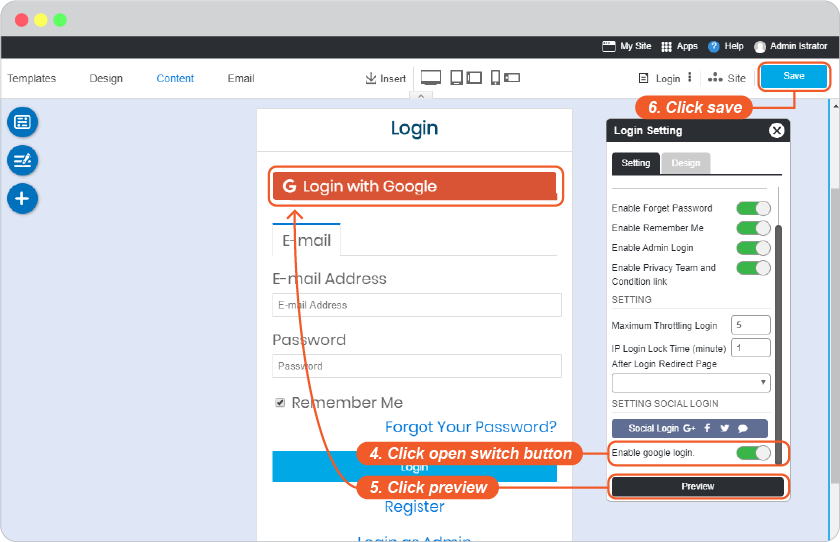

# Google Login Setup

**Google Login Setup for Built-in Channels requires Google API Setup**. Don't worry if you don't feel familiar with Google API Setup, you can follow easy steps below.

1. Open Google Console website at https://console.developers.google.com/ . Login with your google email (Gmail) or register if you don't have one.

2. In Google APIs page, click **Create** for setting your new Google API.
   
    

3. Insert your Project Name, and click **Create**.
   
    

4. Once the new project has been created, at Google APIs select your created project and click **Credential**.
   
    

5. In Create credentials drop-down list, select OAuth client ID
   
    

6. Then, select **Configure consent screen**..
   
    

7. Create your **Product name shown to users** and website URL at **Homepage URL**.

    _For example_

    _Product name shown to users : Calm Seas_

    _Homepage URL : http://calmseas.netwaysite.com/_

    

8. At **Create OAuth client ID** page.

      1. Select **Web application**
      2. Create a name for recognizable
      3. Insert **Authorized JavaScript origins** (Your website URL)
      4. Insert **Redirect URL\***
   
    _Please login to your website editor -> Site -> System, select "Login" under Member. Click on any area of Login widget to open Login Setting. Click on Social Login, and copy URL from Google Login Redirect URL_

    

      5. Don't forget to click **Save**.

    

9. The **Client ID** and **Client Secret** are showing that you can copy before leaving this page by clicking **OK**.

    

10. Once you clicked OK to leave OAuth client, at Google APIs page, select **Library**.
    
    

11. Search for the following API setups to **Enable** them.

    

12. Click ***Enable*** to activate the API.*

    

13. Go to website editor -> Site -> System Pages -> Login, click on Login form to open Login setting. Enable Google Login Setup.

     1. Select google tab.
     2. Insert Client ID and Client secret from number 9 to Google Login Setup, and click OK to complete setting.
     3. Click OK to add these values to your form.

    

     4. On Login Setting, click open switch button.
     5. Click "Preview"
     6. Click "Save" to save all of your setting above.

    

14.   The Google Login single sign-on is available for your user to login to your website without make a new register.

If Google Login returns error when visitors try to login, please contact your host provider to allow google rule_id in ModSecurity by this [guide](https://support.rvglobalsoft.com/hc/en-us/articles/360019136994-Google-Login-on-My-website-is-giving-error-when-visitors-try-to-login-).

