# Installation

- [Installation](#installation)
  - [cPanel Control Panel](#cpanel-control-panel)
  - [Other Control Panel Systems and Non-control panel](#other-control-panel-systems-and-non-control-panel)

## cPanel Control Panel

1. You can buy hosting service from our cPanel [hosting partners](https://rvsitebuilder.com/hosting-partner/) to get a control panel account with RVsitebuilder that's already installed.

2. Then you can access to RVsitebuilder immediately from [your cPanel control panel](https://user.rvsitebuilder.com/docs/7.2/en/create-new-website) and start your website!

## Other Control Panel Systems and Non-control panel

For other control panel systems or non-control panel domain name, you can simply follow these steps.

1. Get a control panel account or domain name on a server that already has RVsitebuilder license from your host provider or find one in our [hosting partners](https://rvsitebuilder.com/hosting-partner/) list.

2. Make your control panel account meet with the following requirements.

   -   Domain name must run on PHP7.1.3 or above.
   -   php extension: 'mysqlnd','pdo','gd','curl','iconv','mbstring','zip','posix_getpwuid','json'
   -   php ini config 'memory_limit' => 64M
   -   Firewall on your server doesn't block the following domains.  
    download.rvglobalsoft.com  
    Files.mirror1.rvsitebuilder.com

3. Create a database, perform the following steps to create the MySQL database.

    1. Click icon to create MySQL® databases.

        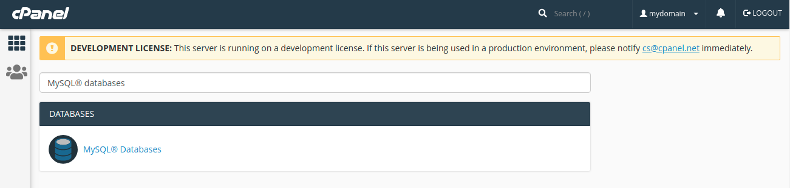

    2. In the New Database text box, enter a name for the database and click create database.

        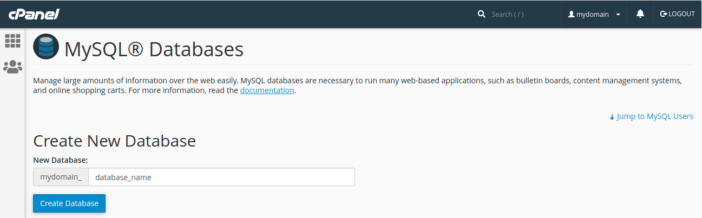

    3. A new interface will appear. Click Go Back.

        

    4. The new database appears in the Current Databases table.

         

**After you create a database, add users to the database and configure their privileges. To create a new user account, perform the following steps:**

1. Enter a username in the Username text box.
2. Enter and confirm the new password in the appropriate text boxes.
3. Click Create User. 

    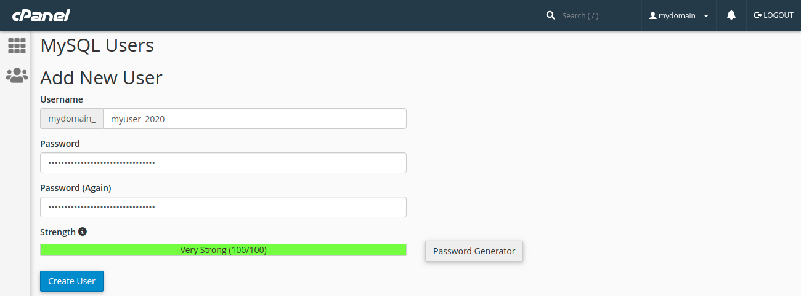 

4. Click Go Back to return to the main interface.

    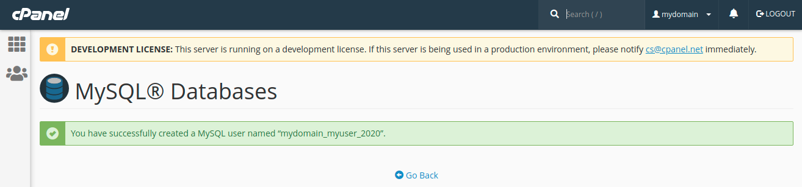
  
**Add a user to a database. To add a user to a database, perform the following steps:**

1. In the Add User To Database section of the interface, select the desired user and database from the menus. Click Add. 

    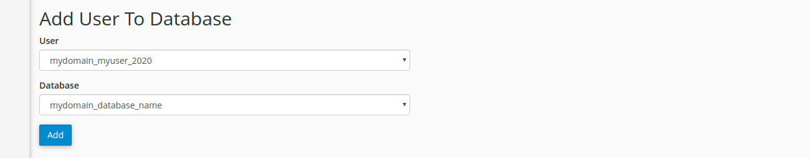

2. Select the checkboxes that correspond to the privileges that you wish to grant to the user.  Click Make Changes. And click Go back to return to the main interface.

      

3. Download RVsitebuilder Setup wizard
   
    1. Download RVsitebuilder Setup wizard https://files.mirror1.rvsitebuilder.com/download/rvsitebuilderinstaller/setup to your local computer.
    2. Unzip the setup file
    3. Upload Folder rvsitebuilder to /public_html/ or /publc/ or /www/ 
   
4. Install RVsitebuilder directly on your domain name.
  
   1. Call the setup.php script for your domain name on browser http://mydomainname.com/rvsitebuilder/setup.php

        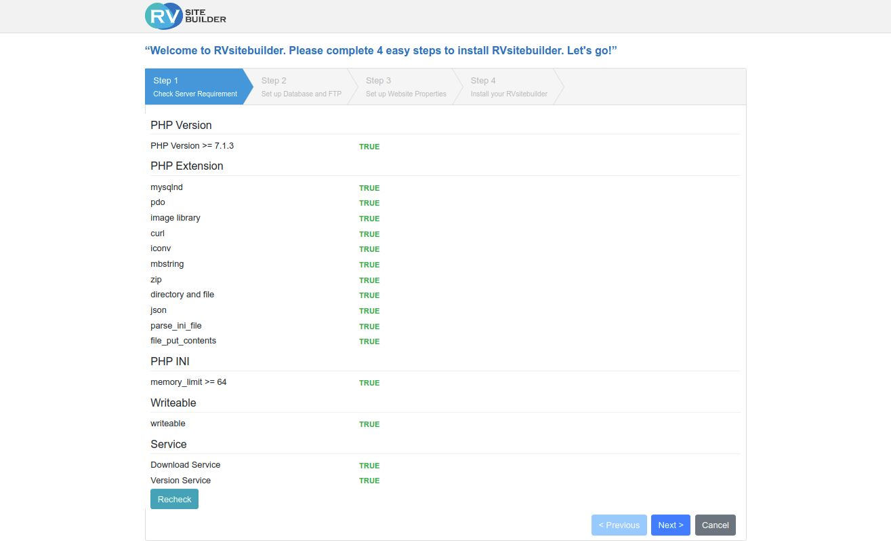

   2. Database and FTP setup 

        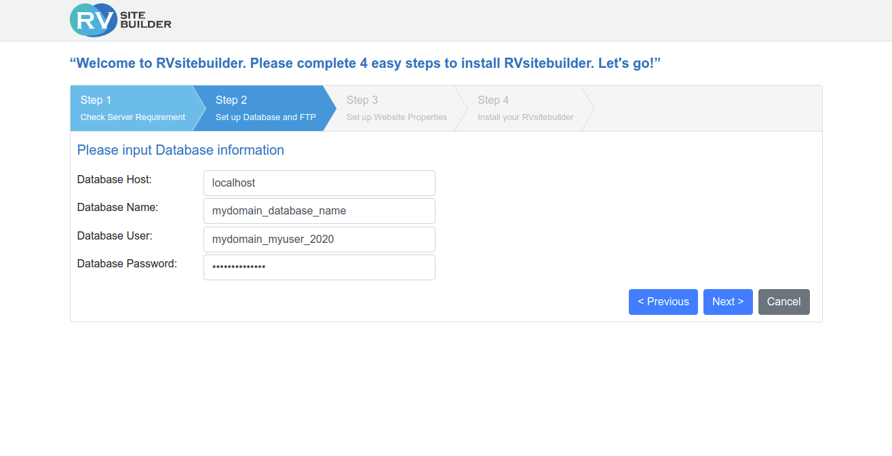

   3. website properties setup

        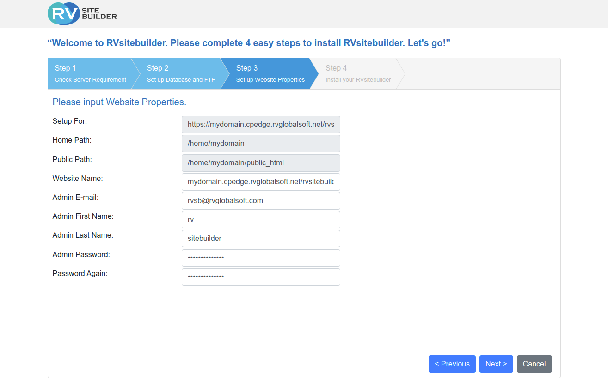

   4. Accept agreement and install.

        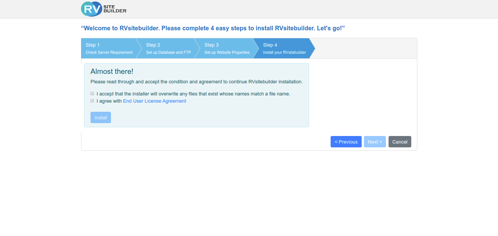 
        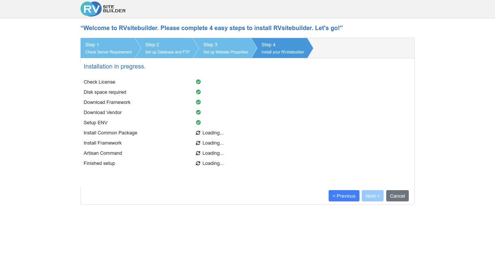
 
5. Once the installation is completed.

   RVsitebuilder CMS is ready to [create website](https://user.rvsitebuilder.com/docs/7.2/en/create-new-website) on your domain now!

    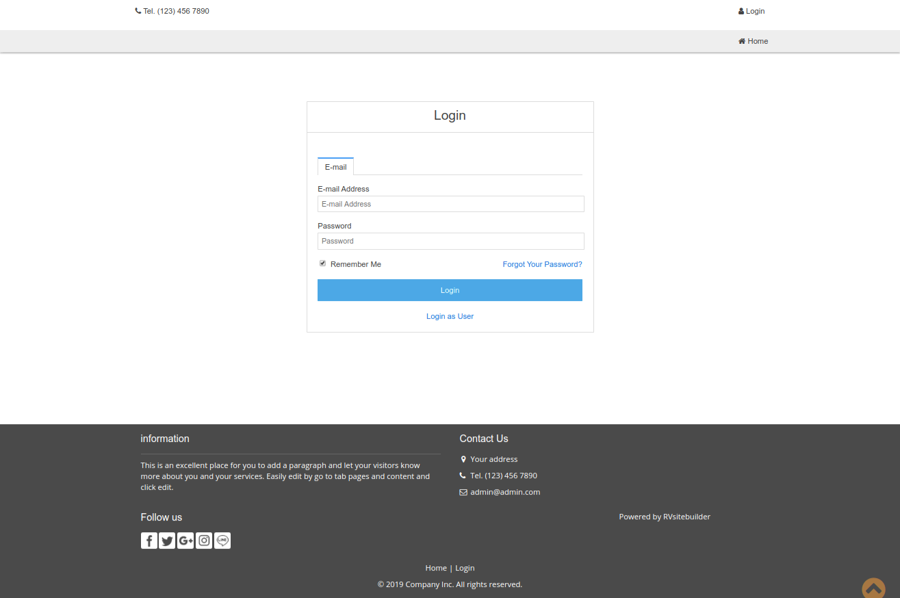