# LINE Login Setup

To setup Line app as a login channel for your website, you will have to register your email address with Line first.

Register here: <https://developers.line.biz/en/docs/line-login/getting-started/>

Then setup the login by following.

1. Login to line developer console at: <https://developers.line.biz/console/>

2. Click **Create a new provider**.

    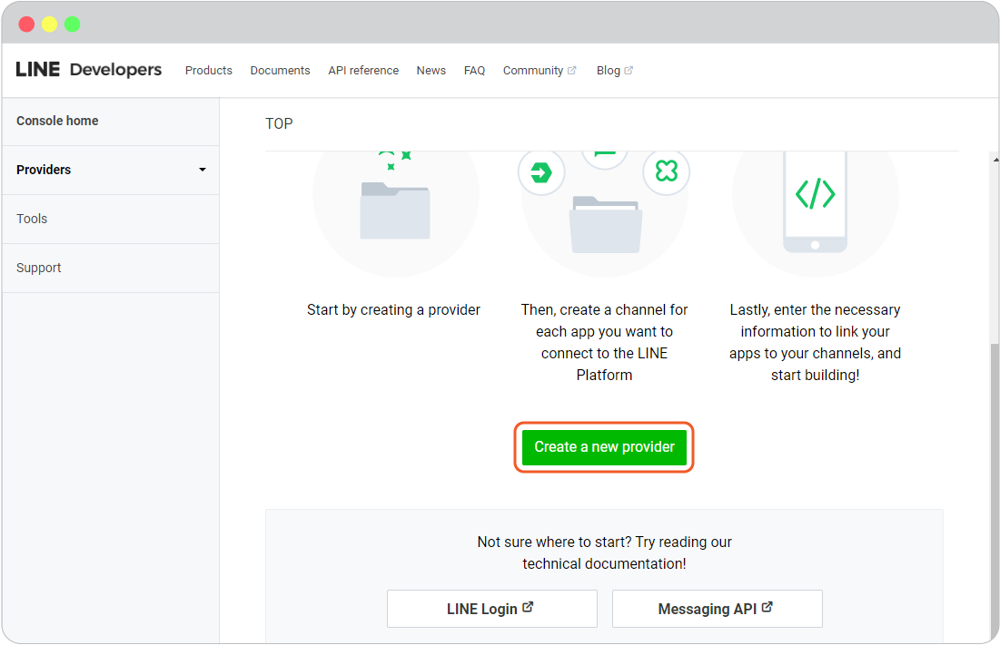

3. Add **Provider name**, and click**Create**.

    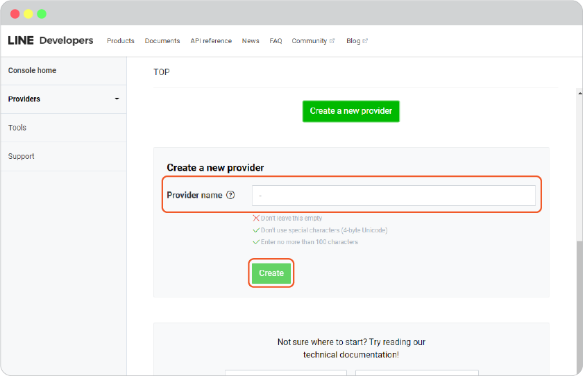

4. Select **Create a LINE Login Channel** to use with your website login with LINE.

    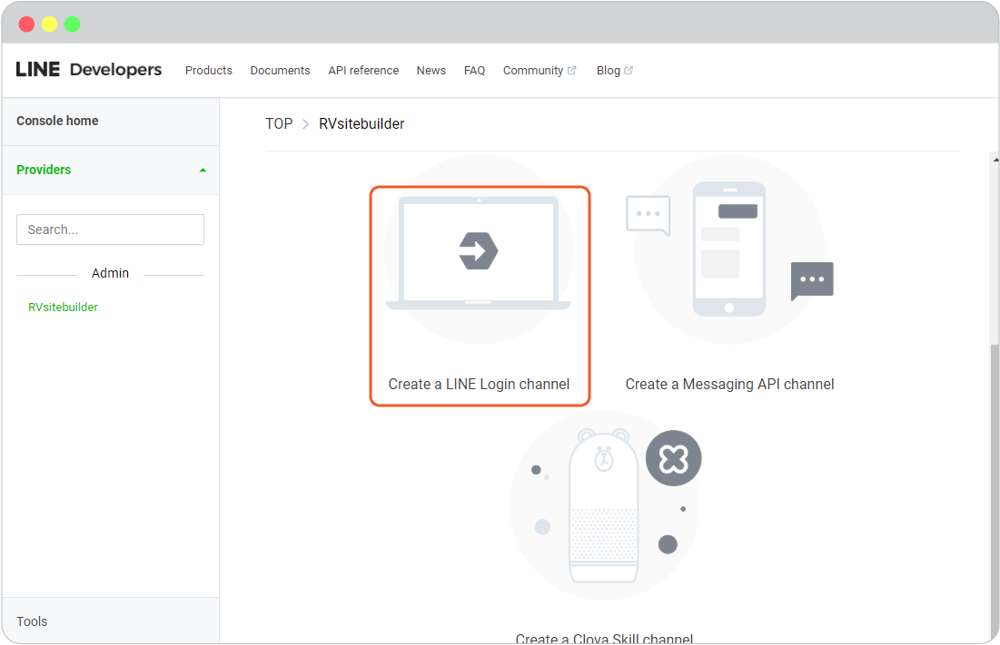

5. Complete required values:

   - _App name_
   - _App description_
   - _App type_, select Use Web
   - _Email address_, add the email address of admin.

    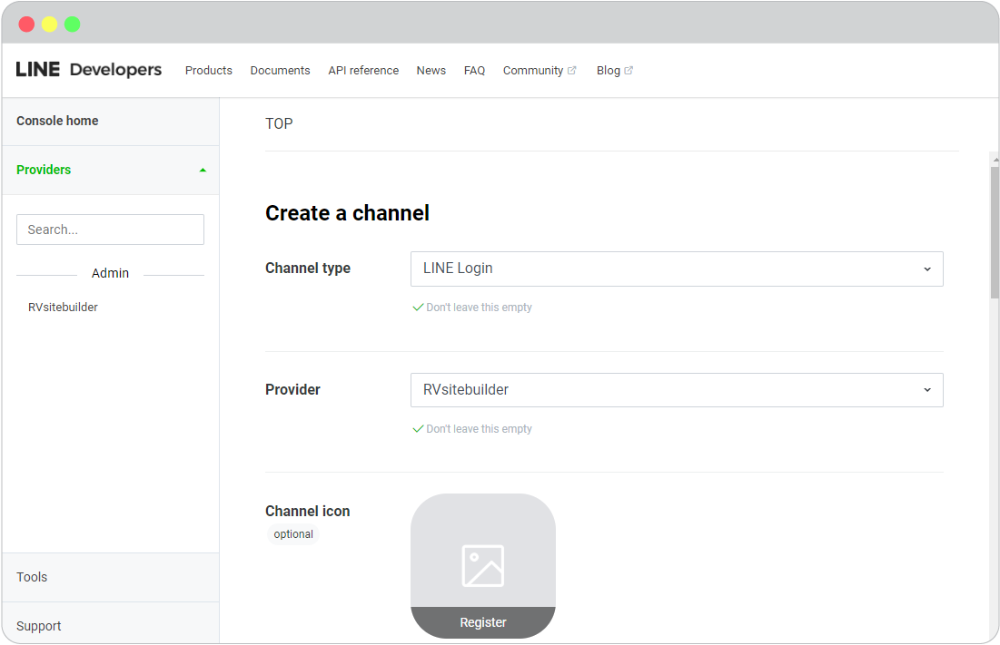

6. Once you're at Confirm page, *checkbox at LINE Developer Agreement*, and click **Create**.

    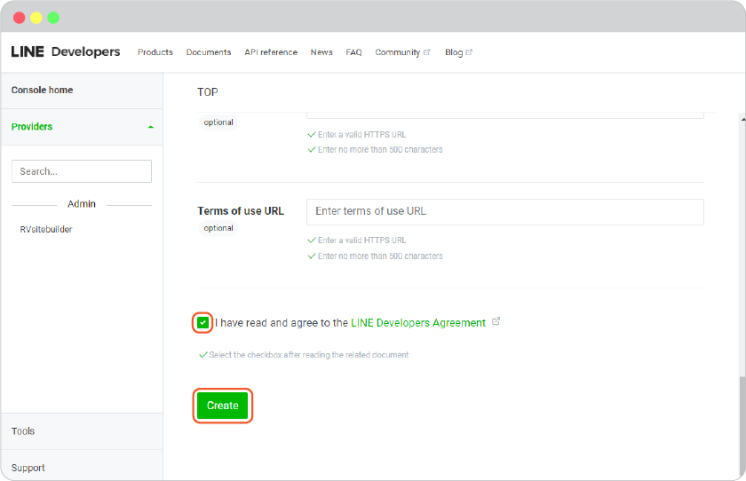

7. Select LINE Login tab, Insert **Callback URL**, and click **Update**.
    _(You can find Callback URLs in your website editor -> Site -> System -> on "System Pages" list -> Login, click on Login form to open Login setting. On Login Setting panel, scroll and click "Social Login" button, you will be at "Site Config" Member, look for LINE login redirect URL.)_

    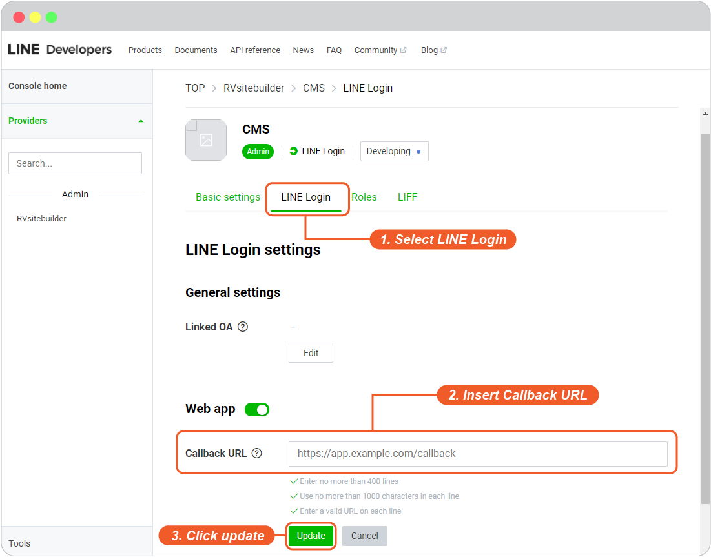

8. Select **Basic setting** tab for setting **OpenID Connect**, the details of **Channel ID** and **Channel secret**

9. Click **Apply** button for setting **OpenID Connect**

    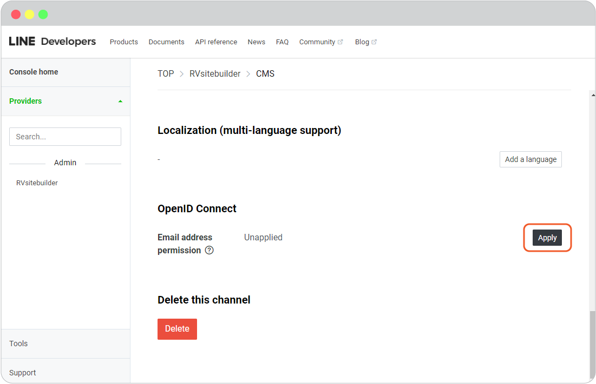

10. *Check boxes for functions*, and click **Submit**.

    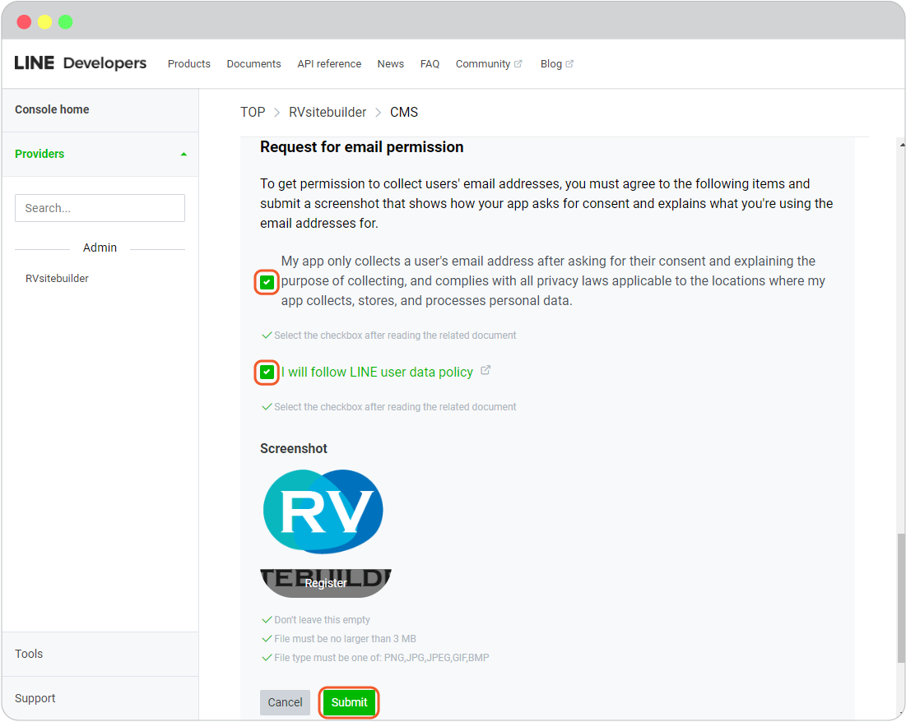

11. The details of **Channel secret** are showing.

    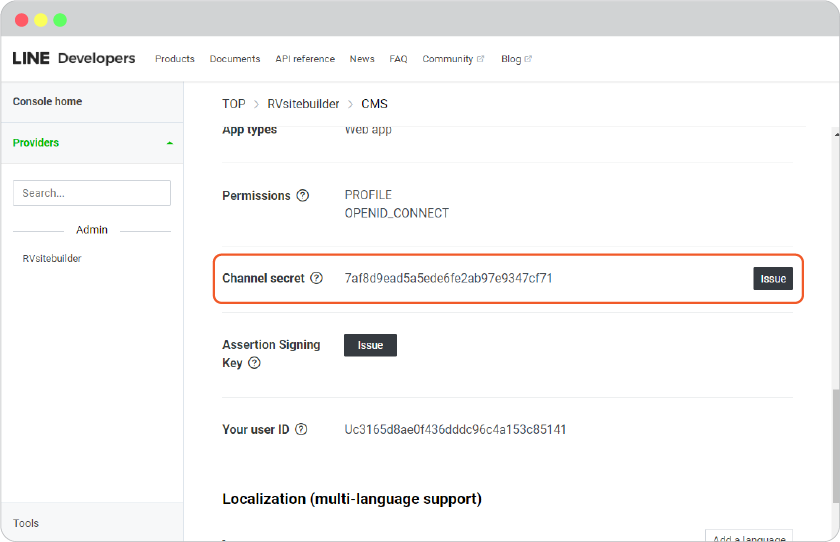

12. The details of **Channel ID** are showing.

    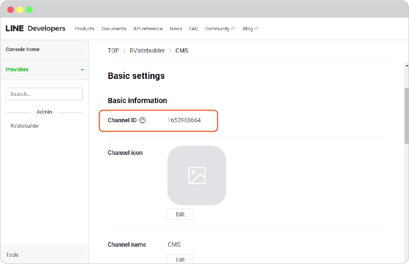

13. Go to website editor -> Site -> System -> on "System Pages" list -> Login, click on Login form to open Login setting. On Login Setting panel, scroll and click "Social Login" button, you will be at "Site Config" Member.
    
    1. Select LINE tab.
    2. Insert Channel ID for LINE Client ID and Channel Secret for LINE Client Secret.
    3. Click Save to add these values to your form.
    4. Close the Site Config window.

    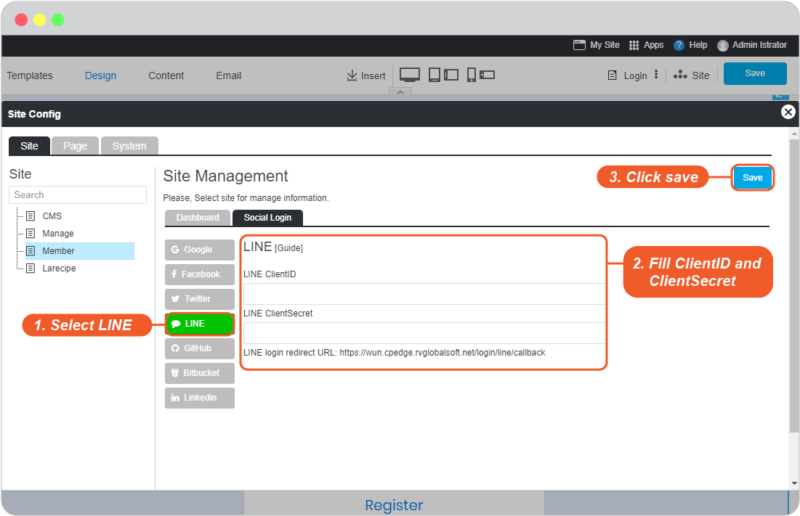

    5. Click "Save" in the editor page.

    

14. The LINE Login single sign-on is available for your user to login to your website without make a new register.

**Bonus**

Disable and Enable your Twitter Login

Go to website editor -> Site -> System -> on "System Pages" list -> Login, click on Login form to open Login setting. On Login Setting panel, scroll and look at **Enable line login**.

A.  Slide to to left to disable or right to enable.

B.  Click "Preview".

C.  Click "Save" to save all of your setting.

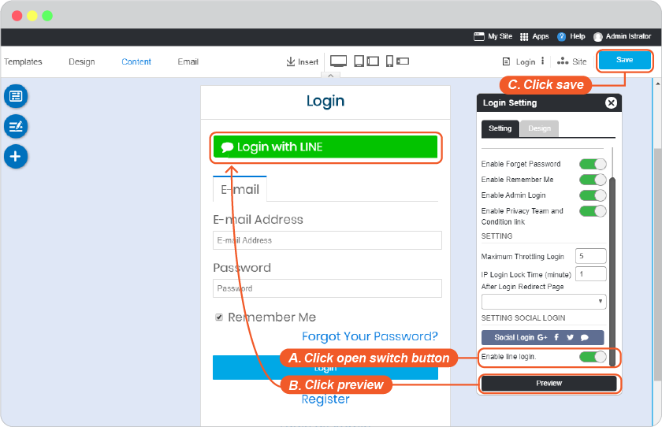

