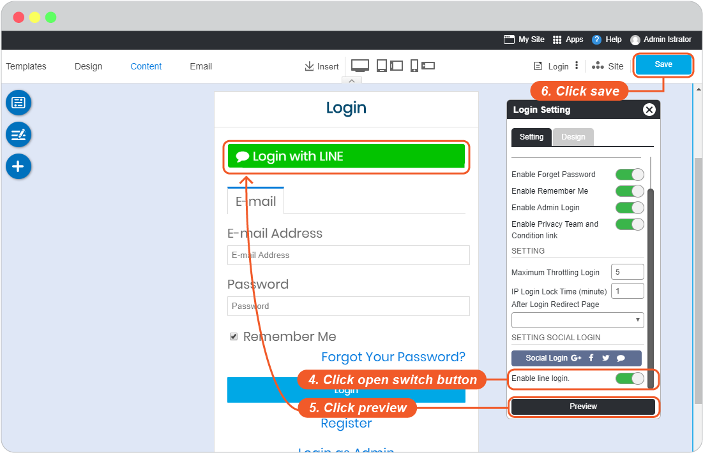

# LINE Login Setup

To setup Line app as a login channel for your website, you will have to register your email address with Line first.

Register here: <https://developers.line.biz/en/docs/line-login/getting-started/>

Then setup the login by following.

1. Login to line developer console at: <https://developers.line.biz/console/>

2. Click **Create New Provider**.

    

3. Add Provider name, and Create.

    

4. Create **a Line Login Channel** for LINE Login.

    

5. Add required values:

   - _App name_
   - _App description_
   - _App type_, select Use Web
   - _Email address_, add the email address of admin.

    

6. Once you're at Confirm page, *checkbox at LINE Developer Agreement*, and click **Create**.

    

7. Select LINE Login tab, Insert **Callback URL**, and click **Update**.

    _(You can find Callback URLs in your website editor -> Site -> System Pages -> Login, click on Login form to open Login setting, look for LINE login redirect URL.)_

    

8. Select **Basic sitting** tab for setting **OpenID Connect**, the details of **Channel ID** and **Channel secret**

9. Click **Submit** button for setting **OpenID Connect**

    

10. *Check boxes for functions*, and click **Submit**.

    

11. The details of **Channel secret** are showing.

    

12. The details of **Channel ID** are showing.

    

13. Go to website editor -> Site -> System Pages -> Login, click on Login form to open Login setting, to enable LINE Login Setup.

    1. Select LINE tab.
    2. Insert Channel ID for LINE Client ID and Channel Secret for LINE Client Secret.
    3. Click OK to add these values to your form.
      - จากนั้นปิดหน้าหน้าต่าง site config

    

      - กด save ในหน้า editor

    

    **** กรณีตั้งค่าไว้แต่ยังไม่เปิดให้ user ใช้งาน สามารถ ปิด/เปิดปุ่ม Social Login ได้

    4. On Login Setting, click open switch button.
    5. Click "Preview"
    6. Click "Save" to save all of your setting above.

    

14. The LINE Login single sign-on is available for your user to login to your website without make a new register.
