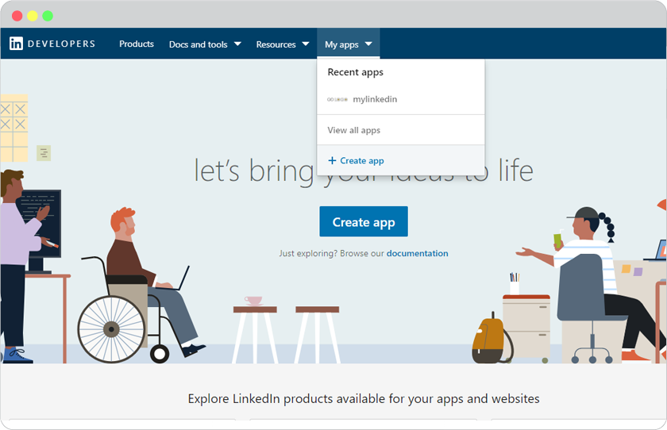
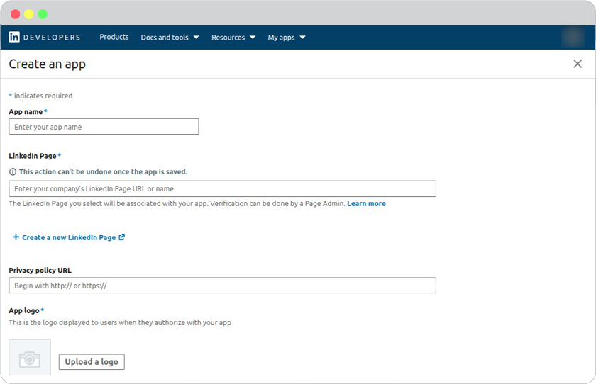
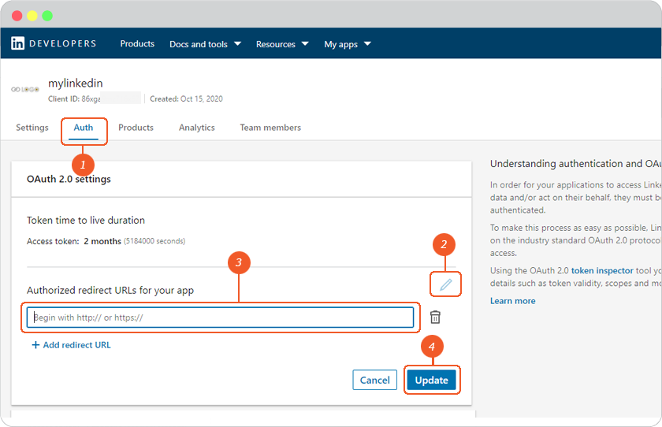
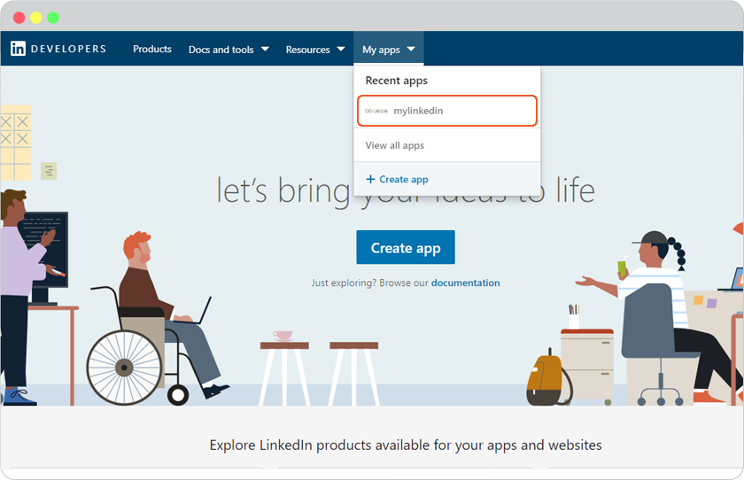
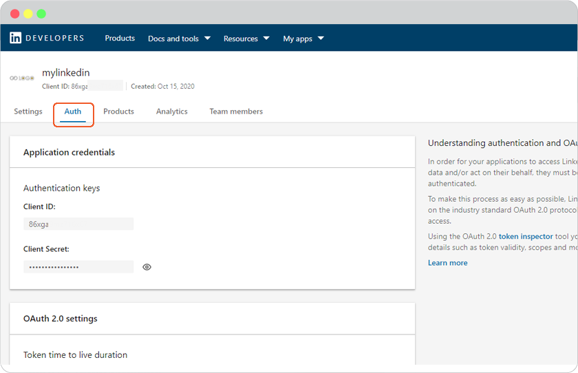
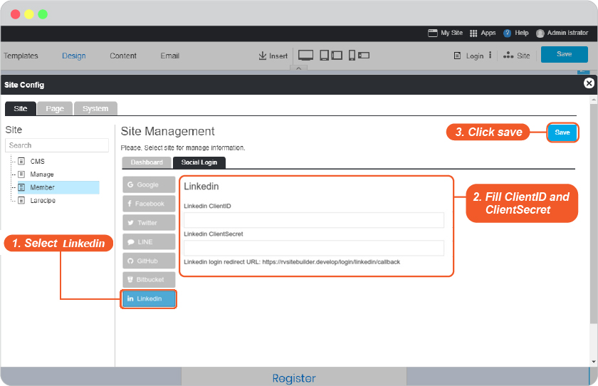
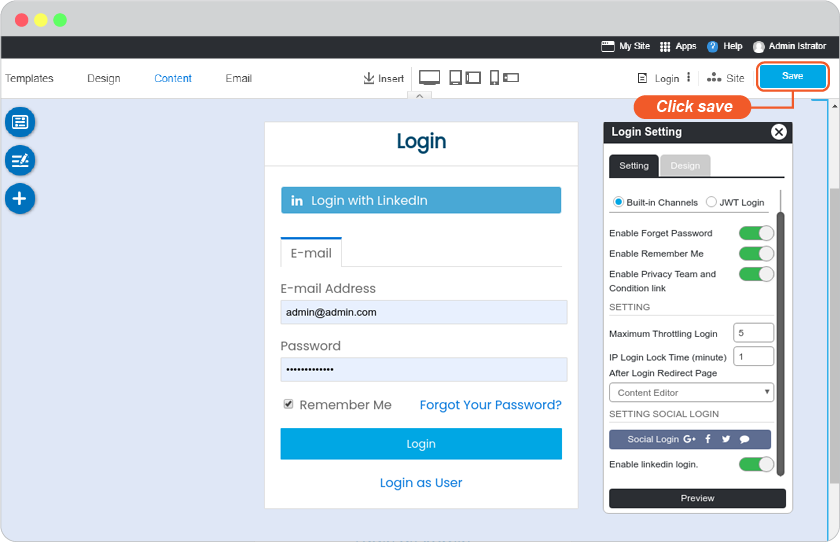
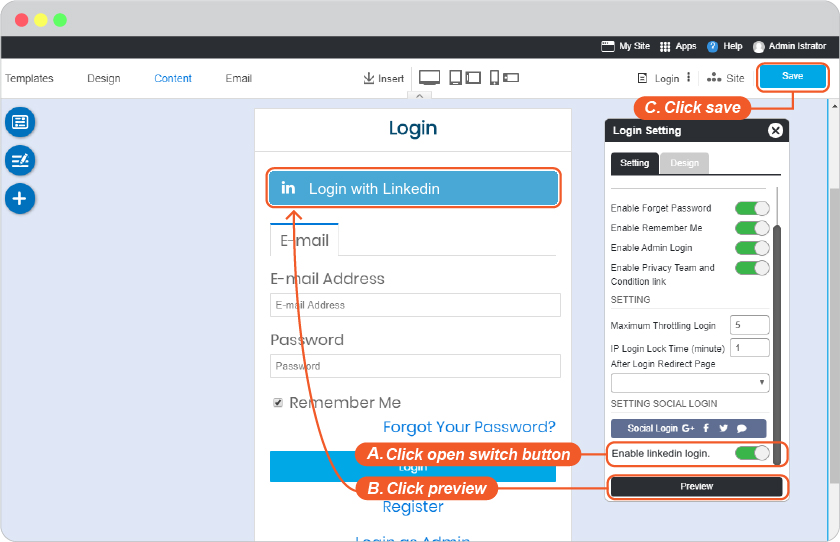

# LinkedIn Login Setup

Setup Linked Login requires a LinkedIn membership and a LinkedIn app. Please follow the easy guide below to create yours.

1. Go to <https://www.linkedin.com/developers>, sign into your LinkedIn account.

2. The top menu bar, click **My Apps**, then click **+Create app**.

1. Complete all required fields.

4. Next page, click on **Auth** tab, and **pencil symbol** to insert **Authorized redirect URLs for your app**. *(You can find Callback URL in your website editor -> Site -> System -> on "System Pages" list -> Login, click on Login form to open Login setting. On Login Setting panel, scroll and click "Social Login" button, you will be at "Site Config" Member, look for LinkedIn login redirect URL.)*

5. Look for **My App** menu, and select your app name.

7. Click **Auth** tab, hit the eye icon to show password.

8. Go to website editor -> Site -> System -> on "System Pages" list -> Login, click on Login form to open Login setting. On Login Setting panel, scroll and click "Social Login" button, you will be at "Site Config" Member.

   1. Select LinkedIn tab.
   2. Insert **App ID** for **LinkedIn Client ID** and **App Secret** for **LinkedIn Client Secret.**
   3. Click Save to add these values to your form.
   4. Close the Site Config window.

    

   5. Click "Save" on editor page.

    

9. The LinkedIn Login single sign-on is available for your user to login to your website without make a new register.

**Bonus**

Disable and Enable your Linked Login

Go to website editor -> Site -> System -> on "System Pages" list -> Login, click on Login form to open Login setting. On Login Setting panel, scroll and look at **Enable linkedin login**.

A.  slide to to left to disable or right to enable.

B.  Click "Preview".

C.  Click "Save" to save all of your setting.

