# Navigation and Menu on Mobile

- [Navigation and Menu on Mobile](#navigation-and-menu-on-mobile)
  - [Hide Register and Login menus on mobile mode](#hide-register-and-login-menus-on-mobile-mode)
  - [Change Font color on Top menu for dark tone background color](#change-font-color-on-top-menu-for-dark-tone-background-color)
  - [Change background color for Hamburger menu on mobile mode](#change-background-color-for-hamburger-menu-on-mobile-mode)

Once you built your website perfectly in both content and design, you may want to make it a little different between opening your website on computer screen and mobile. 


## Hide Register and Login menus on mobile mode

You can hide Register and Login menu on any device screens smaller than 1024px such as tablet and mobile.

1. On Content editor, click on 3-dot and select "CSS/JS"
   
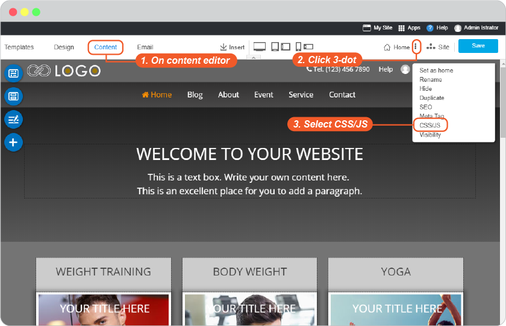

2. On Site Config panel, navigate to **Site** tab and select CMS from left menu. 

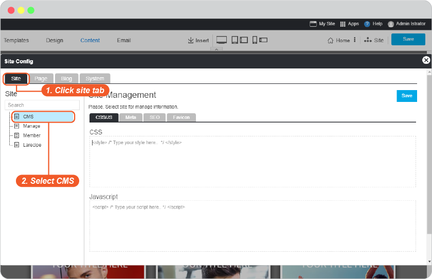

3. On Site Management, select **CSS/JS** tab. 

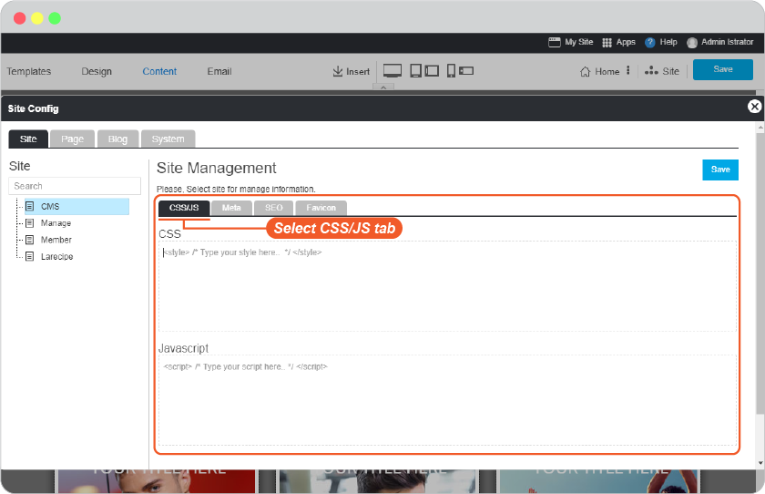

4. Insert the following code. 

    ```css 
    <style>

    @media only screen and (max-width:1024px) { 
    .top_login  { display:none; }     

    /*class_name*/ 
    } 

    </style>

    ```

    
> class_name
> 
> selected_topmenu {display:none;}  /*  to hide Topmenu Section  */ 
> 
> sitemapFooter {display:none;}   /*  to hide Sitemap Footer Section  */ 
> 
> poweredFooter {display:none;}  /*   to hide Powered Section */ 
    
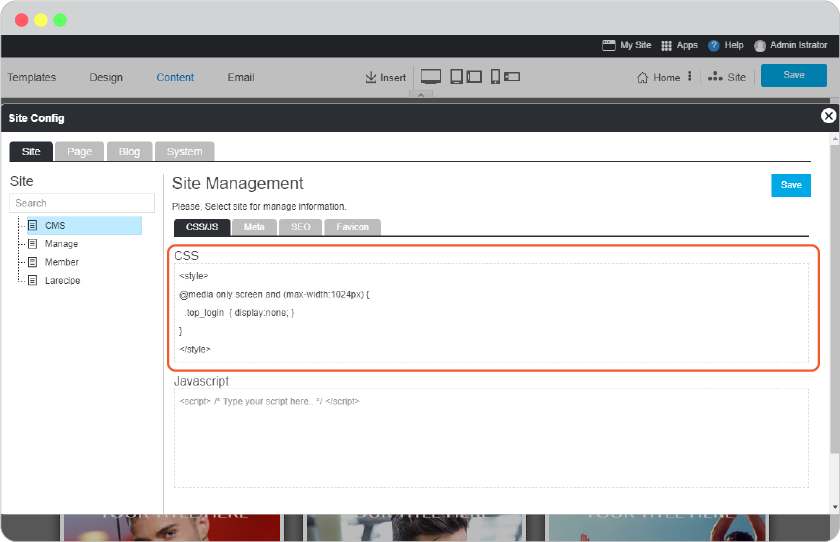


5. Save this on Site Config panel.

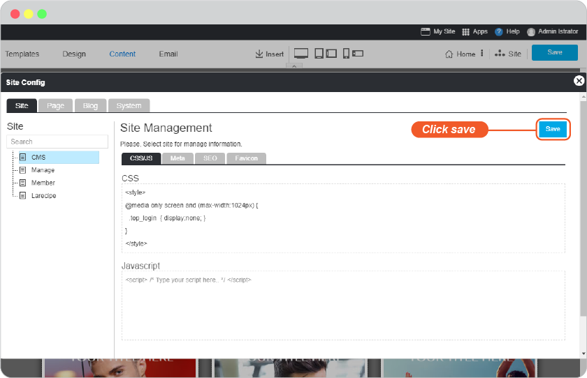

6. Don't forget to Save by the main save button.

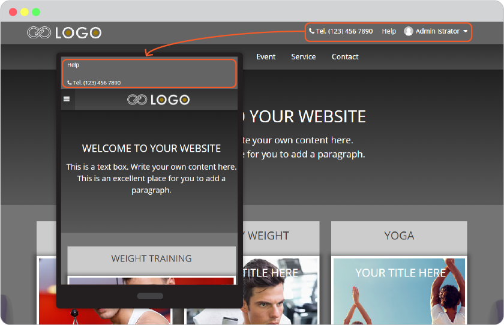

7. You will get like this.


------------------------------------------------------------------------------------------------


## Change Font color on Top menu for dark tone background color 

If you change background color for **Top Menu** and it'squite dark that the menu names are sunk in. You can make it more visible by editing CSS/JS.
 
1. On Content editor, click on 3-dot and select "CSS/JS"
   


2. On Site Config panel, navigate to **Site** tab and select CMS from left menu. 


3. On Site Management, select **CSS/JS** tab. 


4. Insert the following code. 

    ```css 
    <style>

    nav#topmenu a { color: #f15a29 !important; } 

    </style>

    ```


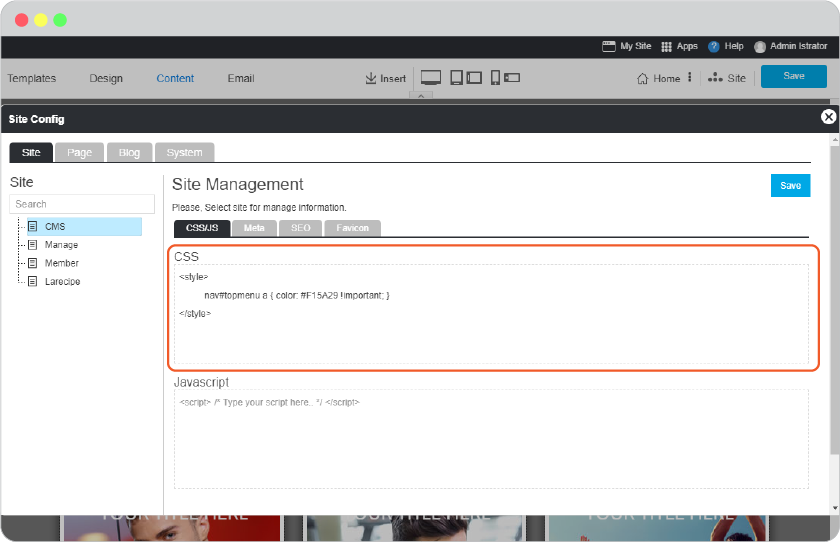

5. Save this on Site Config panel.


6. Don't forget to Save by the main save button.


7. You will get like this.

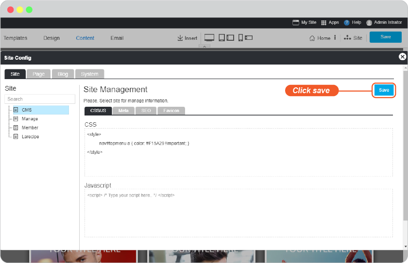

 
------------------------------------------------------------------------------------------------


## Change background color for Hamburger menu on mobile mode

The default background color for hamburger menu on device screens smalller than 1024px will be grey, such as on tablet and mobile.

YOu can change it ligher for more visible menus.

1. On Content editor, click on 3-dot and select "CSS/JS"
   


2. On Site Config panel, navigate to **Site** tab and select CMS from left menu. 


3. On Site Management, select **CSS/JS** tab. 


4. Insert the following code. 


    ```css 
    <style>

    @media only screen and (max-width:1024px) { 

        .uk-navbar {background-color: #501a00; color: #fff;}  /* background Logo Section */ 

        .uk-offcanvas-bar { background: #501a00;} 

        html:not(.uk-touch) .uk-nav-offcanvas > li > a:hover { 

            background: #00000030; color: #ffffff; 

        } 

    } 

    </style> 
    ```

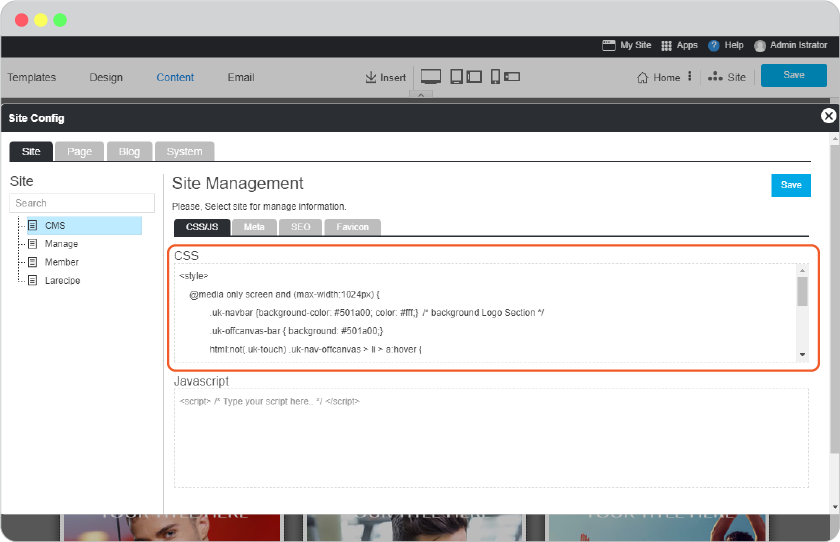

5. Save this on Site Config panel.


6. Don't forget to Save by the main save button.

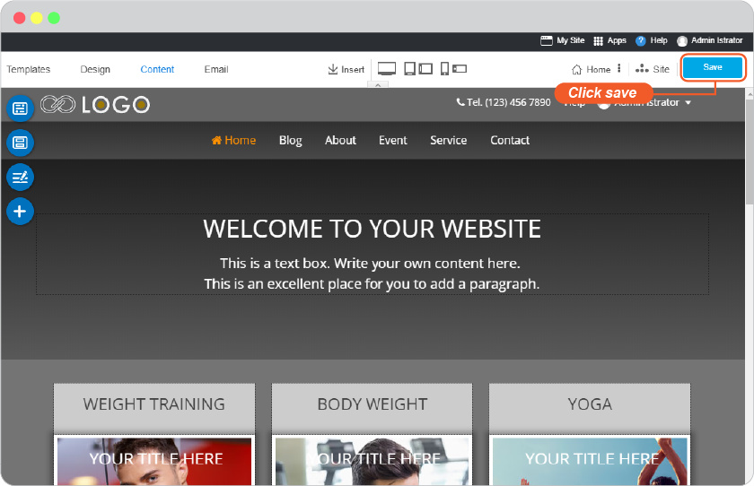

7. You will get like this.

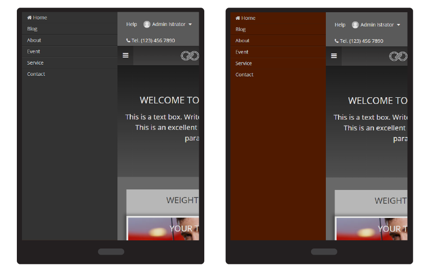
 

 