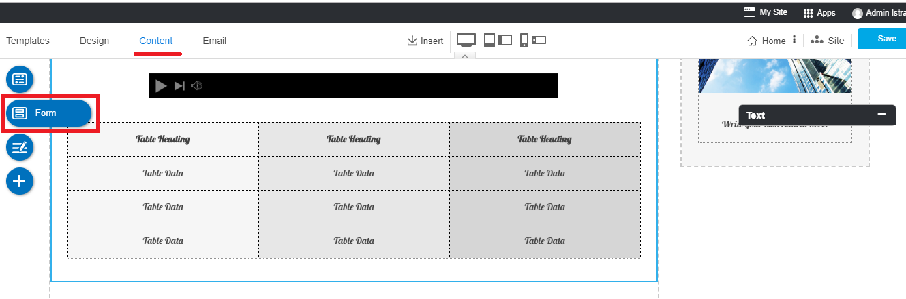
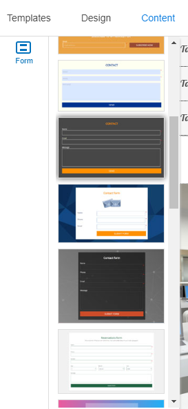
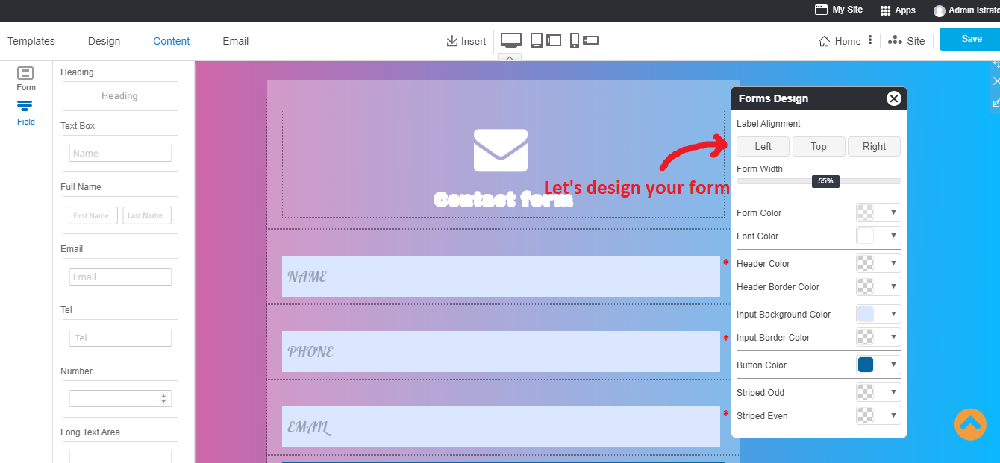
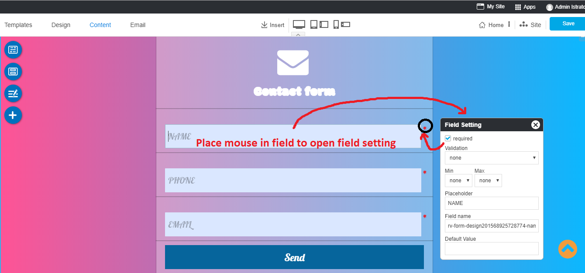
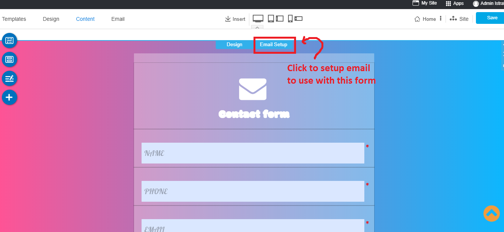
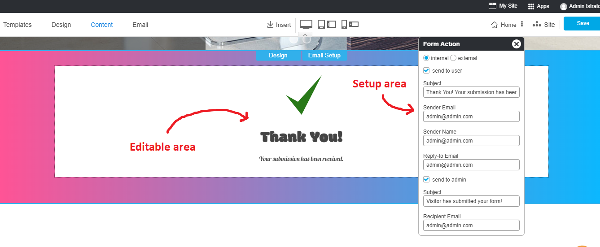

## Adding Online Form on Your Website

Online Form is frequently used on a website that needs more communication between you, the website owner, and website users. 

Its purpose is to let users to submit information for you to contact back or for more sale opportunity.

Here's the easy way to add it.

**1.** On Content Editot, navigate to **Form** floating menu.

**2.** Select one from cool Form designs, and drag it to drop on content area.

**3.** Once the Form dropped, the Form Design will welcome you for custom design as you want. All color can be changed, the Form fields can be added or removed for your need.

Once you done playing with the color, click on the form to add or remove fields on this form as your need.

**4.** Any field can be set as *Required* to ask the nescessary information from your users. Click **directly on field** to set it.

**5.** Once you redesign your form beautiful enough and the nescessary fields added,click on the form to setup EMAIL to use with this form. Click on **Email Setup**.

**6.** Form will switch to Email Setup area

- **the Form Action** panel is to set Subject and Email Address for this Form in order to recieve information when it is submitted by users.

- **the background "Thank you"** is the editable area that you can edit text and image/icon on it directly!

**7.** DON'T FORGET TO CLICK **Save** on the rihgt menu to save all of your form setting.

