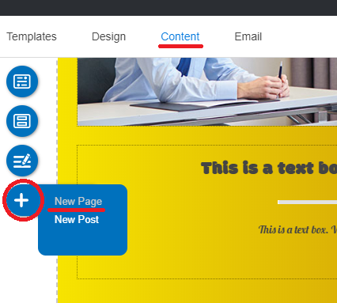
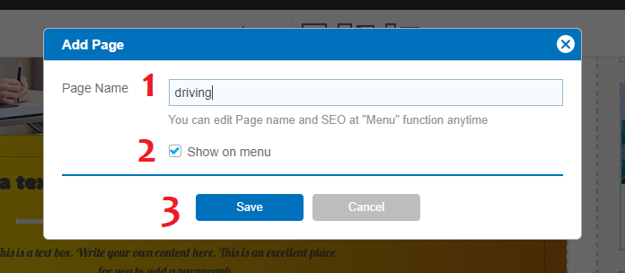
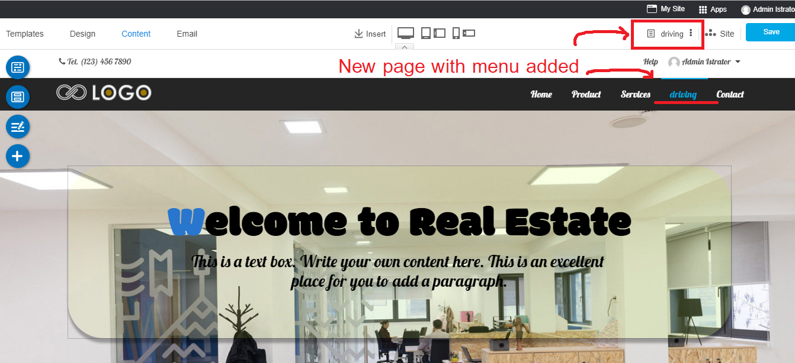
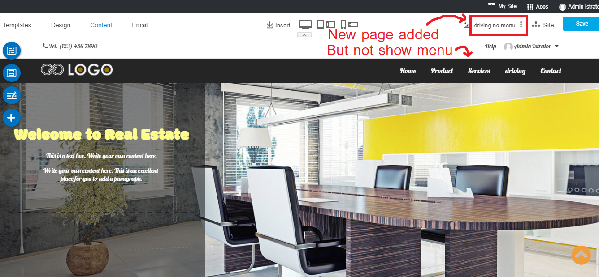

## Adding Page and Menu are easy as by following this guide

First, a little to know is adding Page and adding Menu are not the same part.

Adding page is to add new content area for your new content. It WILL NOT appear on website navigation unless you add it to a Menu.

Adding menu is to add new Top Menu or Menu on website navigation. You can define **Page** for the new added menu immediately or later.

### Adding New Page

1. In Content editor, click "+" floating menu, and select **New Page**.

2. The "Add Page" panel appears;

    1) Page Name : Insert any name for this new page
    2) "Show on menu" box : Check it to make this new page has its own Menu on website navigation
    3) Save : To add this page

    
Sample of the new added page with "Show on menu" box checked. The new content editor will be ready to work that you can see it on current page name on the Right Menu, and its Menu is right on the website navigation.
    

Sample of the new added page with "Show on menu" box UNCHECKED. The new content editor will be ready to work that you can see it on current page name on the Right Menu. This page will not have its Menu on the website navigation. You can add Menu for this page later (next section).

3. You can start content for this page now.

-------------------------------------------------------------------------------

### Adding New Menu

1. In Content editor, click "Menu" floating menu, and select **Menu**.

2. The "Menu Setting" panel appears. Click at "+" symbol on Website Navigation to add new menu.

3. The added menu information appears in "Menu Setting" panel.

4. Edit the Menu name, add Icon and Badge (optional), set Link open to same or new window, and define a Page or Blog or System or Website to be opened by this Menu.

5. Once setting it up already, you can drag this new added Menu to drop anywhere on website navigation.

6. Enjoy!