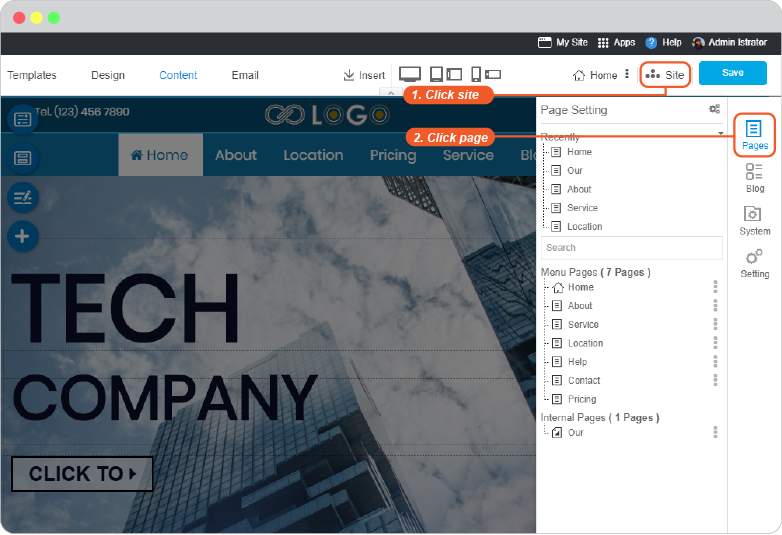
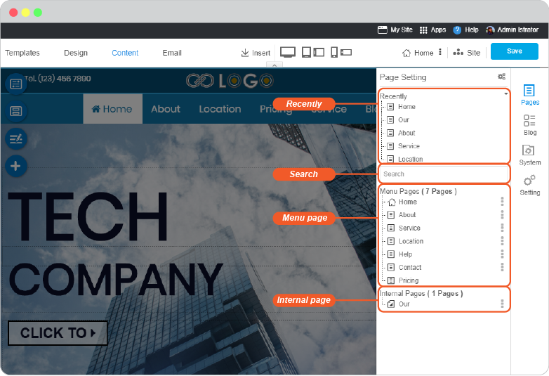
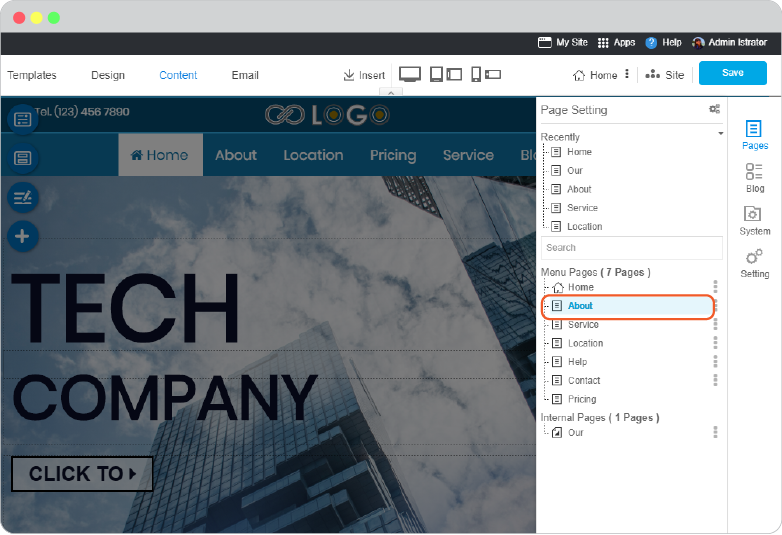
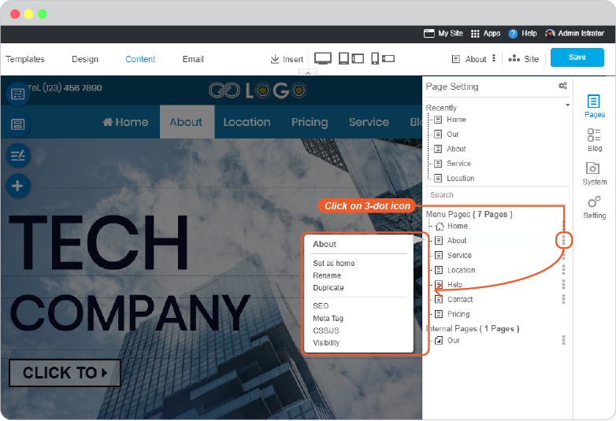

# Page Management

- [Edit page](#edit-page)
- [Page management tools](#page-management-tools)
  
## Edit page

You can access any of your page to edit at anytime.

1. On any current page editor, click on **Site** menu and navigate to **Page**. (It's always current here)
    
    

2. "Page Setting" tool is activated.

   - *Recently* part is showing your recently added pages

   - *Search* is to search pages on your website

   - *Menu Pages* pages that are already connected with menus on website navigation

   - *Internal Pages* new created pages that are not connected with any menu

    

3. You can click directly on page name to open its editor.

    

--------------------------------------------------------------------

## Page management tools

You can mange pages on your website by using Page Setting feature.

1. On any current page editor, click on **Site** menu and navigate to **Page**. (It's always current here)

    

2. "Page Setting" tool is activated, click on 3-dot next to page name you want to manage.

    

   - *Set as home* is to set this page as website home page

   - *Rename* is to rename this page

   - *Delete* is to delete this page from your website. If you linked it with a menu, the menu will be DELETED as well.

   - *Duplicate* is to duplicate this page both content and design, and may change its details later

   - *SEO* is to add SEO to your page for being more reached and found when readers search on search engine. Full guide is [here](website-seo.md).

   - *Meta Tag* is to insert meta tag and meta descritpion. Full guide is [here](website-meta-tag.md).

   - *CSS/JS* is to insert CSS and javascript code to this page. Full guide is [here](css-and-javascript.md).

   - *Visibility* is to set to whom your page will be visible to, public, all members, or restricted members. Full guide is [here](page-visibility.md).