# Page Visibility and Website Membership

## Page Visibility

### Meaning
Page visibility is the feature to set to whom your page(s) will be visible to, public, all members, or restricted members.

**Public**, is the default visibility for every page you added in your website. The Public is meant to allow everyone who open the page to be able to see the content.

**All members**, is the custom visibility you can define to any page in your website. It will allow ONLY MEMBERS who registered on your website can see the content of this page by logging in with their registered username and password.

**Restricted member(s)**, is the custom visibility you set for restricted members who have more privilege than normal members such as to be able to access to website admin area. The advanced privilege of these restrictd members will be set by you (will be explained in Website Membership part).

#### Setting Areas
- 3-dot next to current page name you're editing

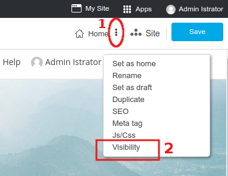

- Site -> Page Management icon

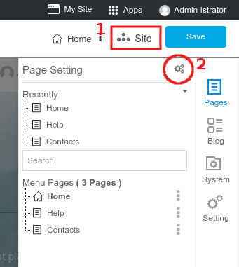

- Site -> Menu Pages -> 3-dot after page names

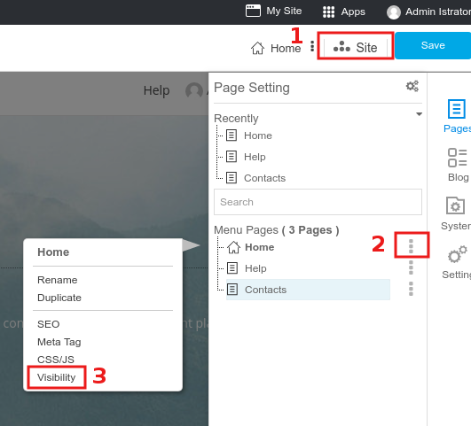

#### Page Visibility Management

Once **Visibility** clicked, you will be at Page Management box.

- **Menu Pages** on the left colum will bluely highlight the current page that you're going to set its visibility now. You can change to other pages from here to set their visibilities.

- **Page Management** with current page name on the right column. The slideable button will be shown as "Auto" with colorless which it's telling that the visibility of THIS PAGE is automatically set to PUBLIC. 

Slide this button to right, and select one audience type for this page.

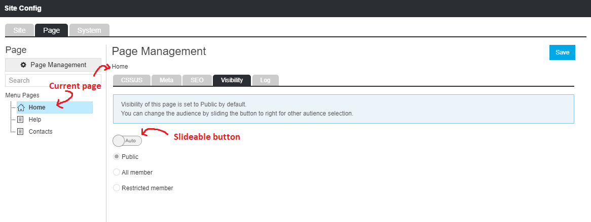

## Website Membership

### Meaning

Member is where to manage user and role for website members for both those you added and those who registered by themselves.

**User Management** is to manage users information.

**Role Management** is to manage roles for users.

#### Setting Area

At the current page editor, click on **Apps**, selct **Member** to open Member management area.

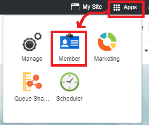

### User Management

All website members, you, other website admins, and those customers who registered on your website will be listed here.

#### Edit Current Member
You can edit password, enable the member to login by single sign-on from their socials accounts (Gogle Email, Facebook, Twitter, LINE), personal information, and roles , or delete member.

1. Click the name you want to edit.
1. In the member information page, edit fields you want. 
1. Click **Update** button for saving.

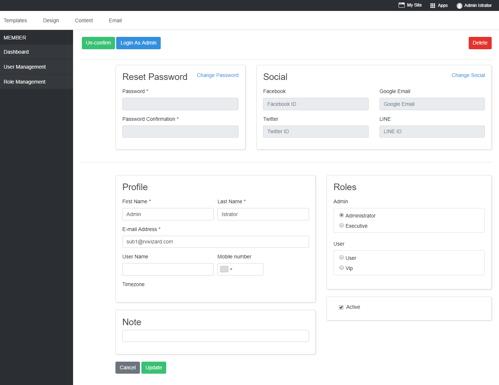

#### Add New Member

You can add anyone as a member to your website. Give them role, and send them the login information.

1. Click on **Add Member**.

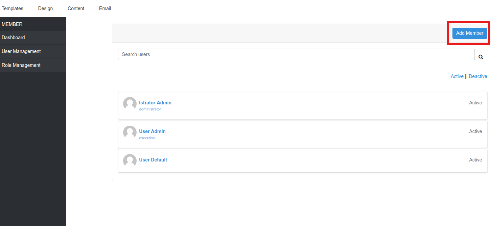

2. Add information in all fields.

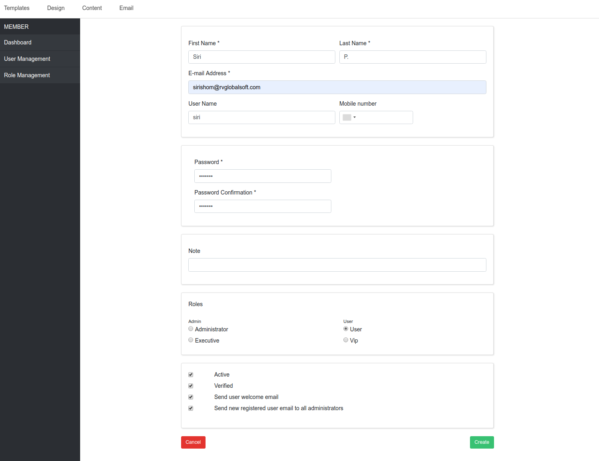

***Role*** You can define role for thie new user as Administrator, Executive, User, or VIP. We will see more details about each role in the next part.

***Notification*** 

- *Active*, Check this box for immediately activate this user once added.
- *Verified*, Check this box to make this user verified by you once added.
- *Send user welcome email*, Check this box to send Account Activation email to this user by email address given above.
- *Sene new registered user email to add administrator*, Check this box to send New Activated User to all administrator of this website.

3. Click **Create** to confirm adding this user.

#### Delete Member

Delete member will permanently delete that person from access to your member area website, all privilege and data will be deleted. Make sure before using this feature.

1. Click a name you want to delete from being your website member.

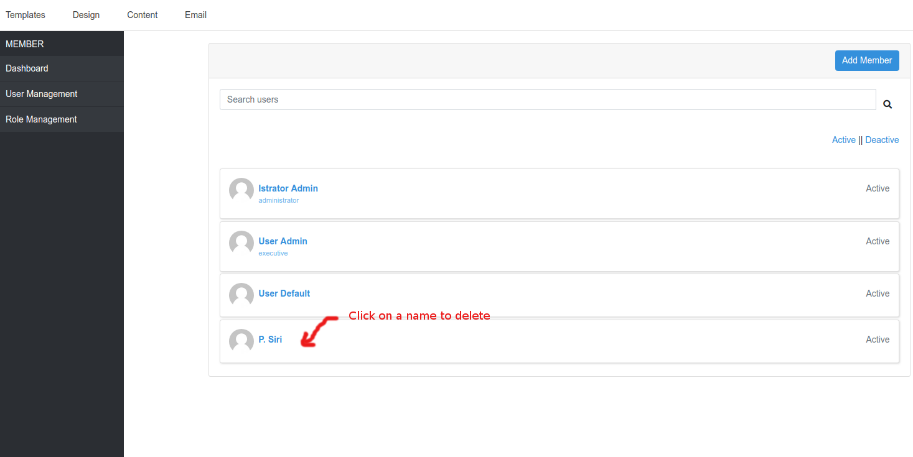

2. In user information page, click on **Delete** on the top right corner.

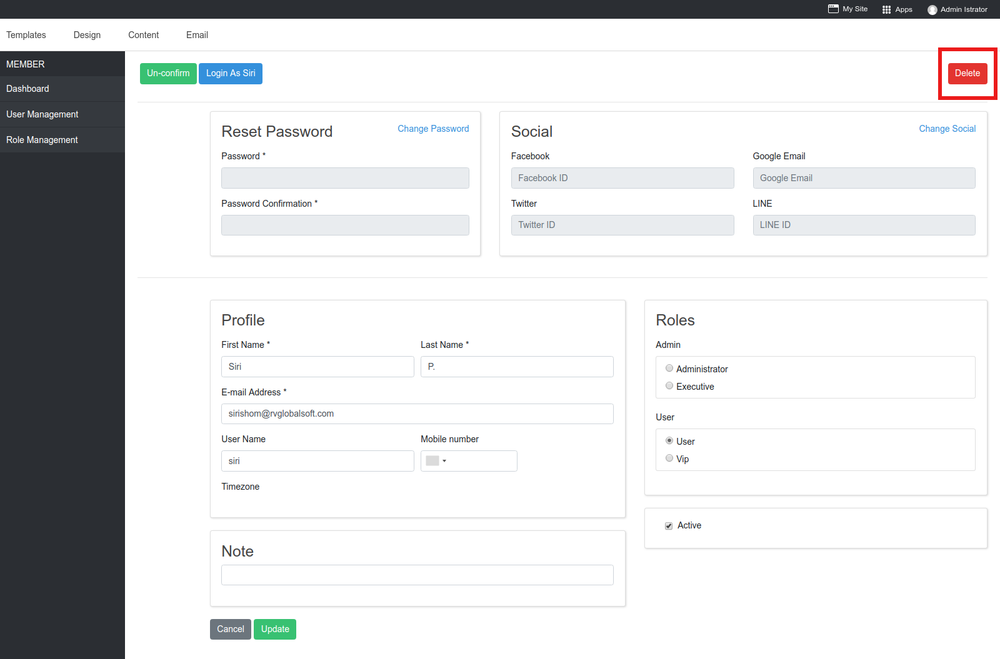

3. Confirm.

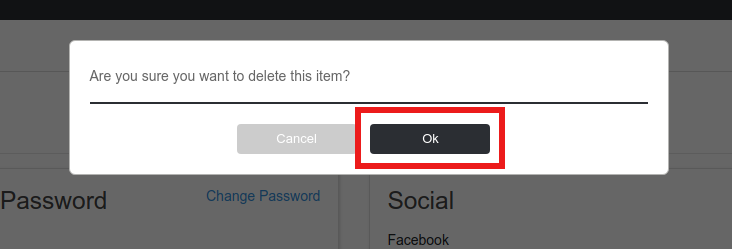

This user is deleted from member area of your website but still able to visit your website as normal visitor.

### Role Management

Role is the privilege to define to website member. You, as the website starter, will hold **Administrator** role. All self-registered will have role as **User** by default.

There are 4 roles you can manage, and more custom role(s) you can create.

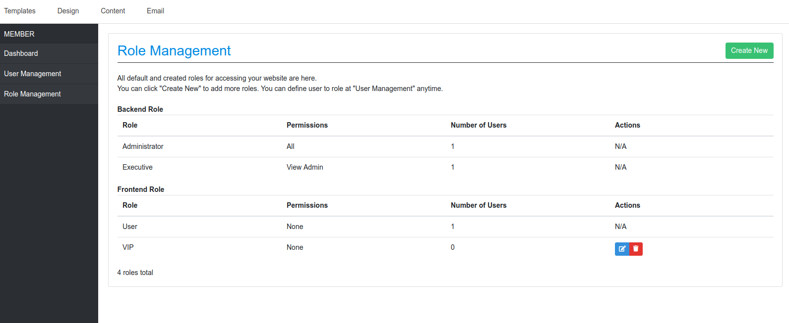

## Backend Role

**Administrator**, The most privilege role for website member. This role holds all permissions to manage website, can add , delete, and define every website member a role. Usually the first person, you, who started create this website will have this role.

**Executive**, The high privilege role second from Administrator. This role holds exclusive permission to access to website admin area to edit website content, manage installed applications, mostly for website information but cannot manage users and roles. This role is mainly used when you want more website content editors aside from you.

## Frontend Role

**User**, The member privilege for website visitors who registered to your website. User role is mostly for permission to access to member area or some pages on your website you set visibilily only for User (member).

**VIP**, The **User** more permission role that can be used when you want some **User** to access to website admin area. This role is not famous to use, so it allows you to remove it from your website member management.

## Create Custom Role

Role management allows you to create custom role(s) you may need.

1. Click **Create New**

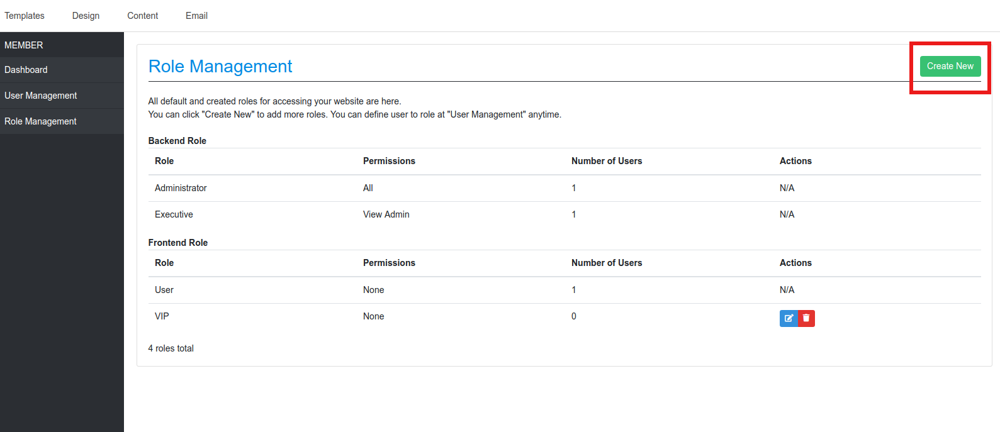

2. Give this Role a name.
1. At **Associated Permissions**, you can check this box if you want this Role to be ale to access to website admin area.
1. Click **Create**.

