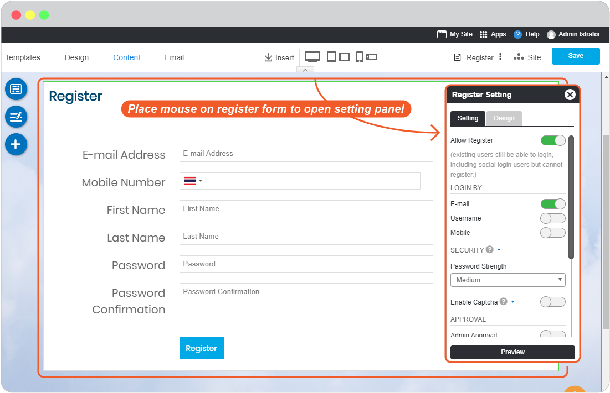
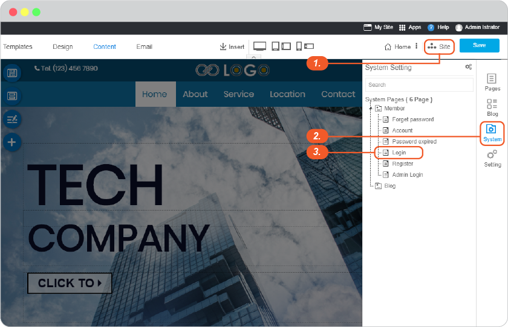
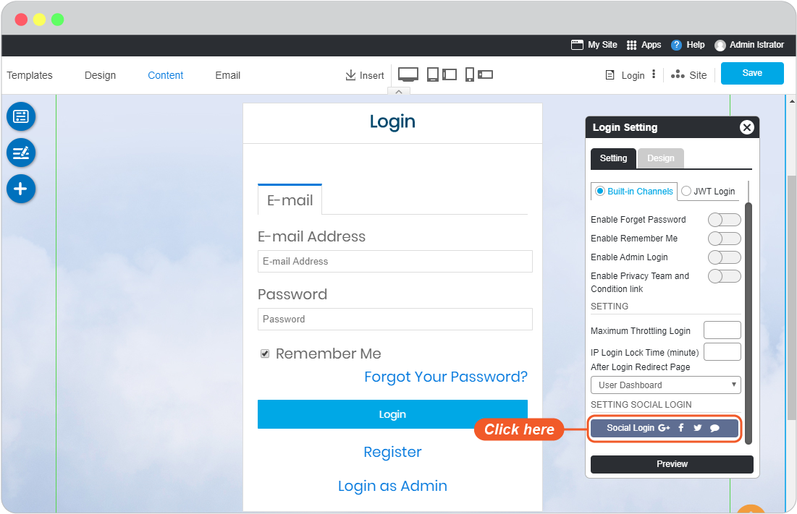
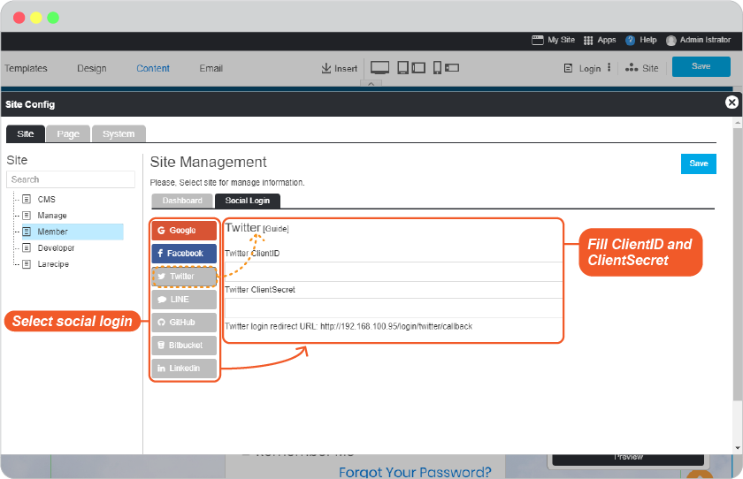
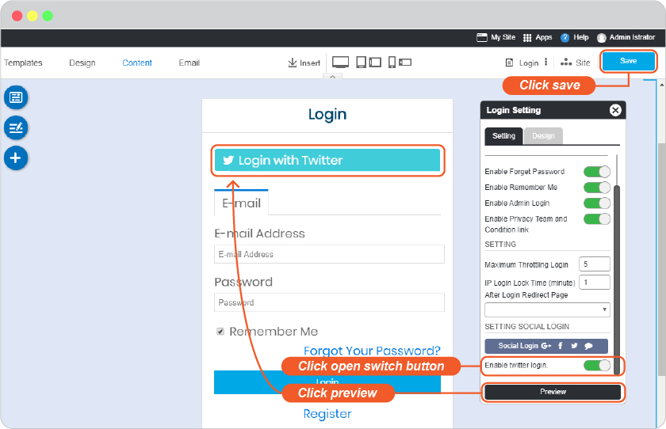

# Register and Login System

- [Built-in Register and Login Setup](#built-in-register-and-login-setup)
  - [Register Setup](#register-setup)
  - [Login Setup](#login-setup)

RVsitebuilder 7 has login function for website and user separately such as;

<https://user.rvsitebuilder.com/login>, for website user.

<https://user.rvsitebuilder.com/admin/login>. for you and other website admins [you set](website-membership.md)

You can start using the Built-in Login channel to let user register and login with their email addresses. RVsitebuilder 7 has social login channels to​ allow​ users to​ use​ one of their​ current accounts from​ **Google​ Email, Facebook, Twitter, LINE** to loginto your website in the quicker way.

## Built-in Register and Login Setup

Every website created in RVsitebuilder 7 will have **Login button on Top Menu by default**. This Login button will be used for user register and login.

It can be disabled and enabled in Design -> Topmenu -> Display Login button, slide the slidable button from here.

### Register Setup

1. Click on Site -> System -> Register page.

    

2. Once the Register form appears, click on form to open Register Setting panel.

    

### Login Setup

1. Click on Site -> System -> Login page.

    

2. Once the Register form appears, click on form to open Login Setting panel.

    

3. You can start with **Built-in Channels**.

4. You can also enable **Social Login** to use together with normal Built-in in number 3.

    1. Click on Social Login icon

        

    2. Slide the slideable button on any or all the Social channels you want user to login to your website with.

        

    3. On Login Setting, click open switch button, click "Preview", then click "Save" to save all of your setting above.

        
