# Register and Login System

-   [Built-in Register and Login Setup](#built-in-register-and-login-setup)
    -   [Register Setup](#register-setup)
    -   [Login Setup](#login-setup)
-   [Google Login Setup for Built-in Channels in your website](#google-login-setup-for-built-in-channels-in-your-website)
-   [​Facebook Login Setup for Built-in Channels in your website](#facebook-login-setup-for-built-in-channels-in-your-website)
-   [Twitter Login Setup for Built-in Channels in your website](#twitter-login-setup-for-built-in-channels-in-your-website)
-   [LINE Login Setup for Built-in Channels in your website](#line-login-setup-for-built-in-channels-in-your-website)

RVsitebuilder 7 has login function for website and user separately such as;

https://user.rvsitebuilder.com/login, for website user.

https://user.rvsitebuilder.com/admin/login. for you and other website admins [you set](website-membership.md)

You can start using the Built-in Login channel to let user register and login with their email addresses. RVsitebuilder 7 has social login channels to​ allow​ users to​ use​ one of their​ current accounts from​ **Google​ Email, Facebook, Twitter, LINE** to loginto your website in the quicker way.

## Built-in Register and Login Setup

Every website created in RVsitebuilder 7 will have **Login button on Top Menu by default**. This Login button will be used for user register and login.

It can be disabled and enabled in Design -> Topmenu -> Display Login button, slide the slidable button from here.

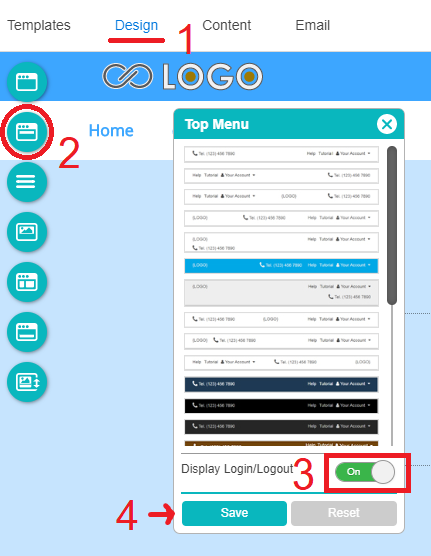
 <code>_Image: Disable/enable Login button_</code>

 

### Register Setup

1. Click on Site -> System -> Register page.

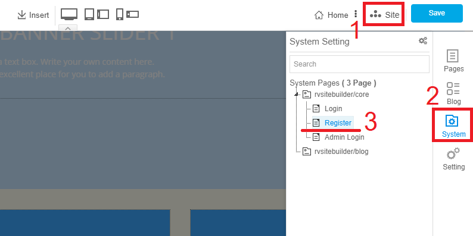
 <code>_Image: Opening Register setting_</code>

 
2. Once the Register form appears, click on form to open Register Setting panel.

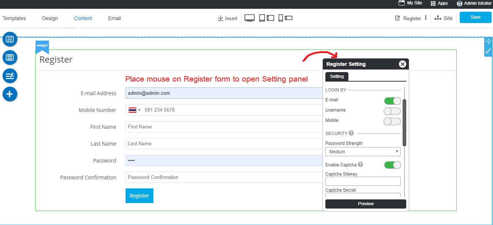
 <code>_Image: Register setting area_</code>

 

### Login Setup

1.  1. Click on Site -> System -> Login page.

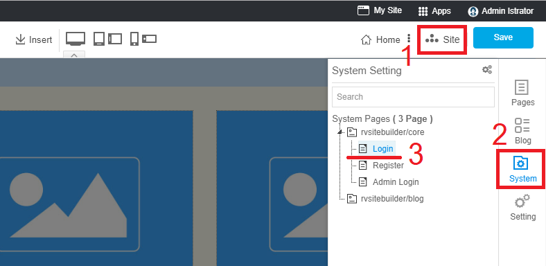
 <code>_Image: Opening Login setting_</code>

 
2. Once the Register form appears, click on form to open Login Setting panel.

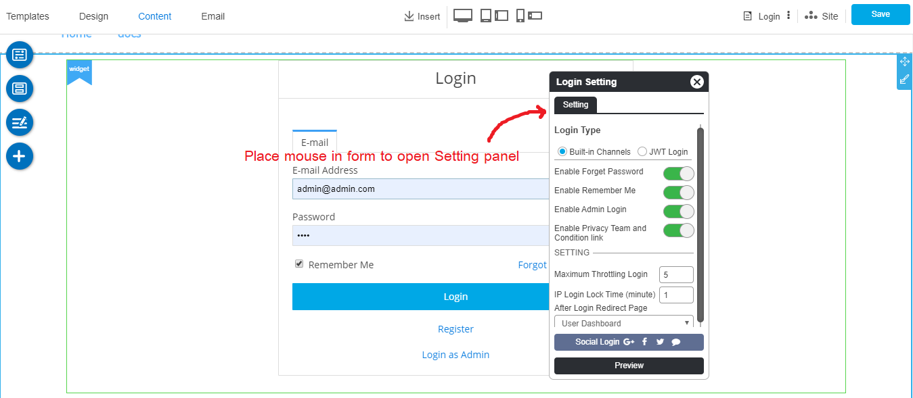
 <code>_Image: Login setting area_</code>

 
3. You can start with **Built-in Channels**.

4. You can also enable **Social Login** to use together with normal Built-in in number 3.

4.1) Click on Social Login icon

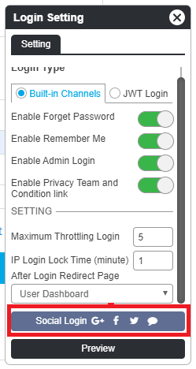

 
4.2) Slide the slideable button on any or all the Social channels you want user to login to your website with.

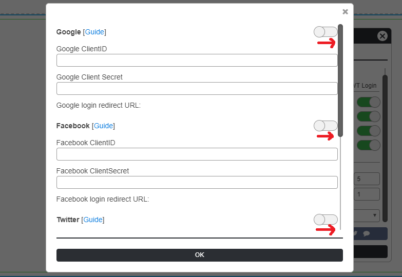

 

-   [Google Account](#googlelogin)

-   [Facebook](#facebooklogin)

-   [Twitter](#twitterlogin)

-   [LINE](#linelogin)

 

## Google Login Setup for Built-in Channels in your website

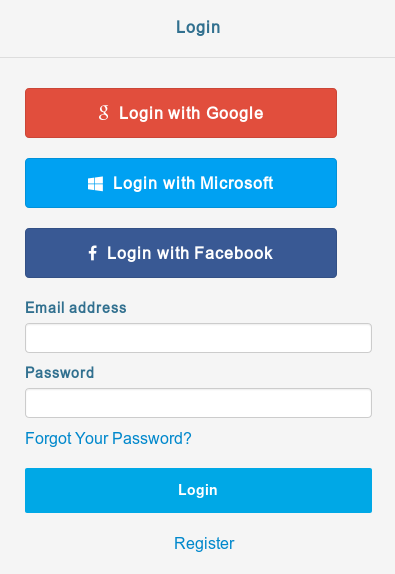

 
**Google Login Setup for Built-in Channels requires Google API Setup**. Don't worry if you don't feel familiar with Google API Setup, you can follow easy steps below.

1. Open Google Console website at https://console.developers.google.com/ . Login with your google email (Gmail) or register if you don't have one.

2. In Google APIs page, click **Create** for setting your new Google API.

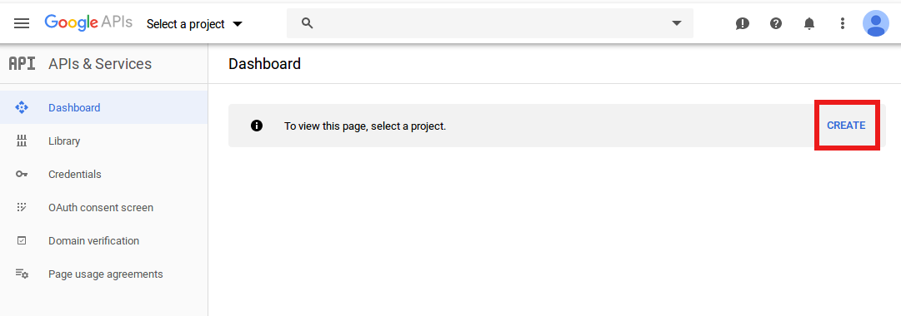

 
3. Insert your Project Name, and click **Create**.

 
4. Once the new project has been created, at Google APIs select your created project and click **Credential**.

 
5. In Create credentials drop-down list, select OAuth client ID

 
6. Then, select **Configure consent screen**.

 
7. Create your **Product name shown to users** and website URL at **Homepage URL**.

_For example_

_Product name shown to users : Calm Seas_

_Homepage URL : http://calmseas.netwaysite.com/_

 
8. At **Create OAuth client ID** page.

1. Select **Web application**

2. Create a name for recognizable

3. Insert **Authorized JavaScript origins** (Your website URL)

4. Insert **Redirect URL\***

_Please login to your website editor -> Site -> System, select "Login" under Member. Click on any area of Login widget to open Login Setting. Click on Social Login, and copy URL from Google Login Redirect URL_

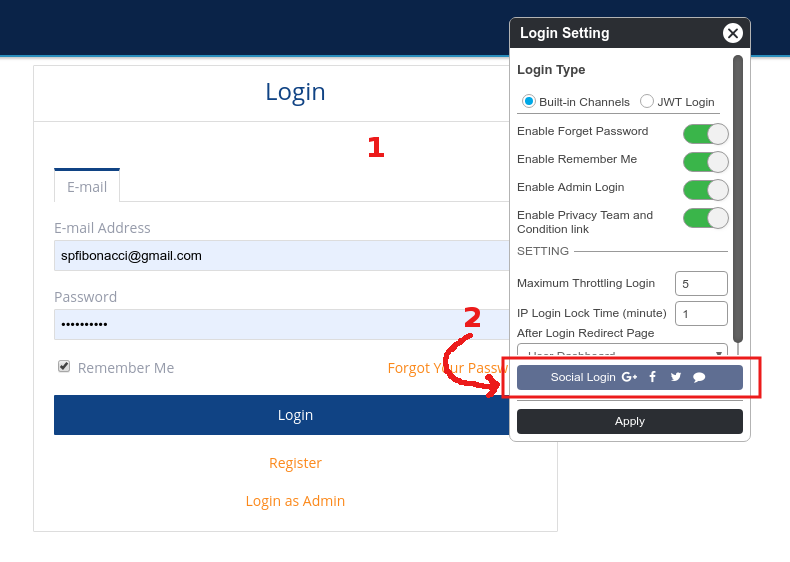

 
5) Don't forget to click **Save**.

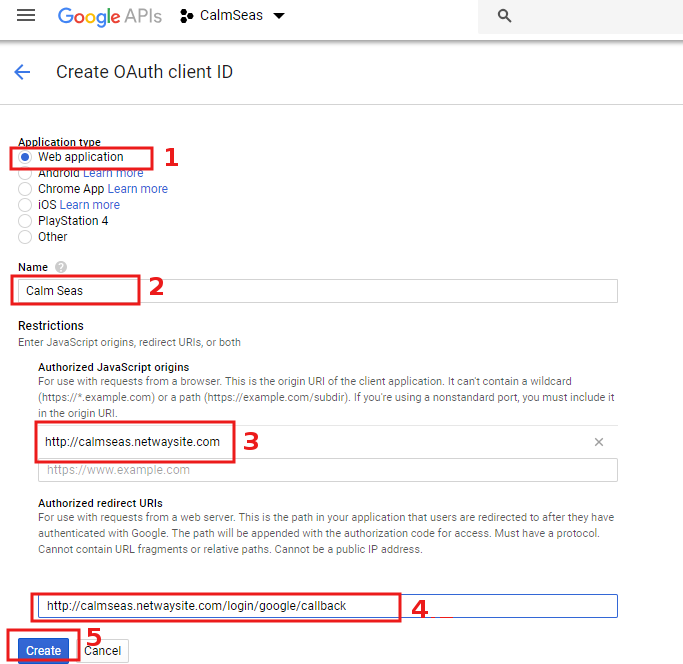

 
9. The **Client ID** and **Client Secret** are showing that you can copy before leaving this page by clicking **OK**.

 
10. Once you clicked OK to leave OAuth client, at Google APIs page , select **Library**.

 
11. Search for the following API setups to **Enable** them.

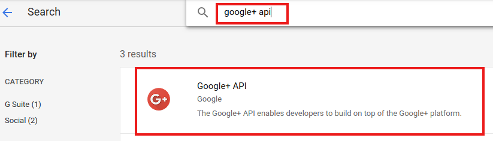

 
Click ***Enable*** to activate the API.*

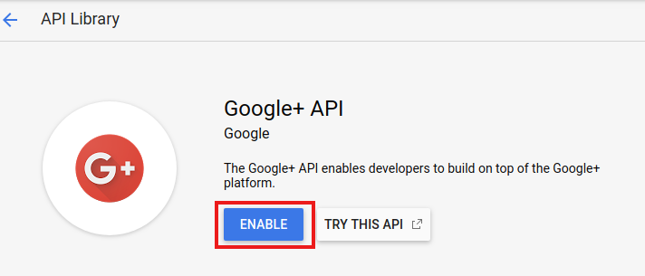

 
12. Go to website editor -> Site -> System Pages -> Login, click on Login form to open Login setting. Enable Google Login Setup.

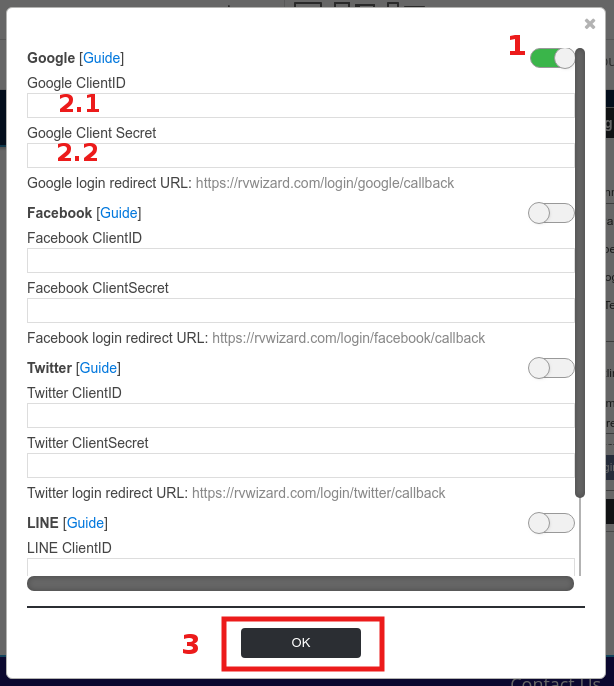

 
1) Slide the slidable button to activate Google Login.

2. Insert Client ID and Client secret from number 9 to Google Login Setup, and click OK to complete setting.

3. Click OK to add these values to your form.

4. On Login Setting, click "Apply" to apply your setting.

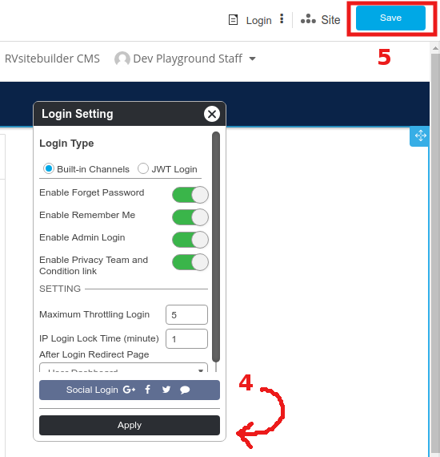

 
5) Click "Save" to save all of your setting above.

13. The Google Login single sign-on is available for your user to login to your website without make a new register.

If Google Login returns error when visitors try to login, please contact your host provider to allow google rule_id in ModSecurity by this [guide](https://support.rvglobalsoft.com/hc/en-us/articles/360019136994-Google-Login-on-My-website-is-giving-error-when-visitors-try-to-login-).

 

## ​Facebook Login Setup for Built-in Channels in your website

1. Go to https://developers.facebook.com/apps , select **Create a New App**.

1. Insert **Display Name** and **Contact Email** you want facebook to connect with your website. Then click **Create App ID**.

1. Insert the correct **Security Check**.

1. Next page, look for product **Integrate Facebook Login** and select **Confirm**.

1. At Facebook API management dashboard, find **Facebook Login**, and insert **OAuth redirect URIs** and **Save Changes**. _(You can find OAuth redirect URIs in your website editor -> Site -> System Pages -> Login, click on Login form to open Login setting, look for Login Callback URL for facebook.)_

1. Go to **Settings** -> **Basic**, to insert **Privacy Policy URL**. If you have a page to provide Privacy Policy on your website, if not, you can insert your website URL.

1. Select **+ Add Platform** to continue.

1. Select Platform as **Website**.

1. Insert your website at **Site URL** and click **Save Changes**.

1. Next page, set the **Status** as **On**.

1. **Confirm** the setting.

1. Look for **App Secret**, and select **Show**.

1. Facebook API management page will display **App ID** and **App secret**.

1. Go to website editor -> Site -> System Pages -> Login, click on Login form to open Login setting, to enable Facebook Login Setup.

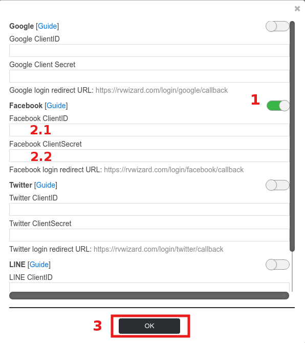

 
1) Slide the slidable button to activate Google Login.

2. Insert App ID for Facebook Client ID and App Secret for Facebook Client Secret.

3. Click OK to add these values to your form.

4. On Login Setting, click "Apply" to apply your setting.

 
5) Click "Save" to save all of your setting above.

15. The Facebook Login single sign-on is available for your user to login to your website without make a new register.

 

## Twitter Login Setup for Built-in Channels in your website

1. Go to https://apps.twitter.com/, select **Create New App**.

2. Insert all the information required. _(You can find Callback URLs in your website editor -> Site -> System Pages -> Login, click on Login form to open Login setting, look for Twitter login redirect URL.)_ And click **Create** to complete the setting.

3. Once the application created, select **Keys and Access Tokens**.

4. Twitter API management page will display Consumer Key (API key) and Consumer Secret (API Secret).

5. Go to website editor -> Site -> System Pages -> Login, click on Login form to open Login setting, to enable Twitter Login Setup.

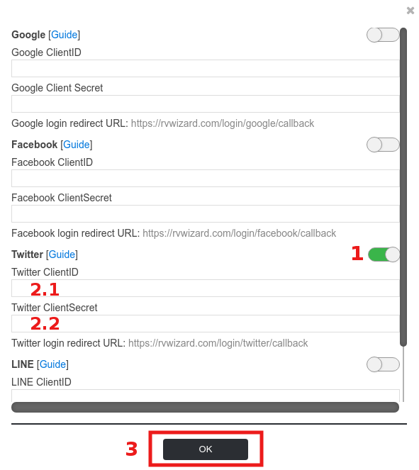

 
1) Slide the slidable button to activate Google Login.

2. Insert Consumer Key for Twitter Client ID and Consumer Secret for Twitter Client Secret.

3. Click OK to add these values to your form.

4. On Login Setting, click "Apply" to apply your setting.

 
5) Click "Save" to save all of your setting above.

6. The Twitter Login single sign-on is available for your user to login to your website without make a new register.

 

## LINE Login Setup for Built-in Channels in your website

To setup Line app as a login channel for your website, you will have to register your email address with Line first.

Register here: https://developers.line.biz/en/docs/line-login/getting-started/

Then setup the login by following.

1. Login to line developer console at: https://developers.line.biz/console/

2. Click **Create New Provider**.

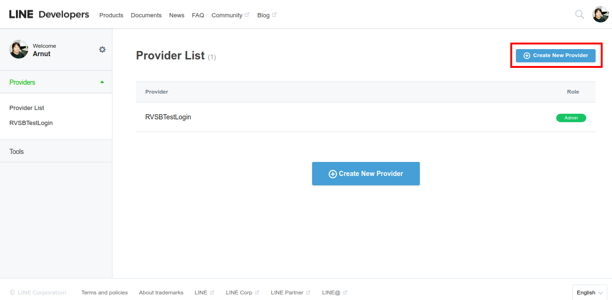

 
3. Add Provider name, and Confirm.

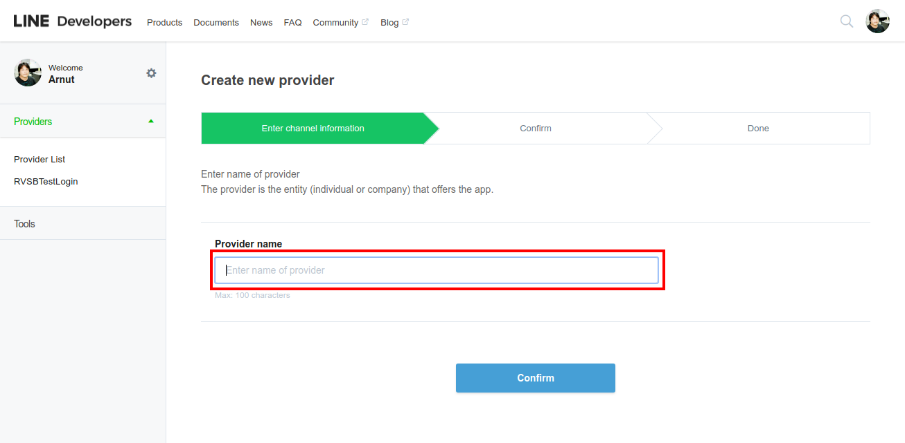

 
4. At "Confirm" stage, click **Create**.

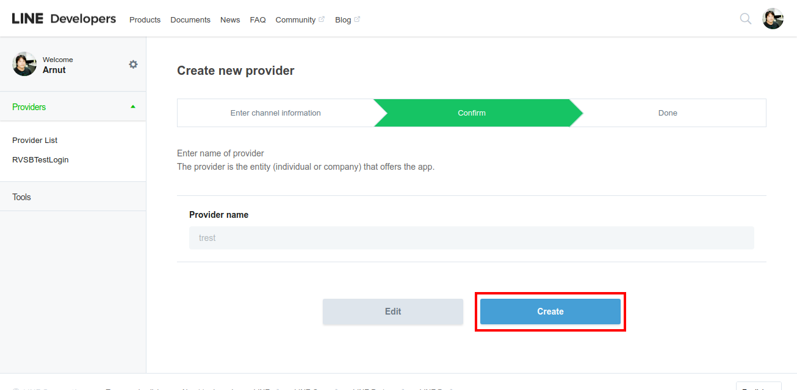

 
5. Create **Create Channel** for LINE Login.

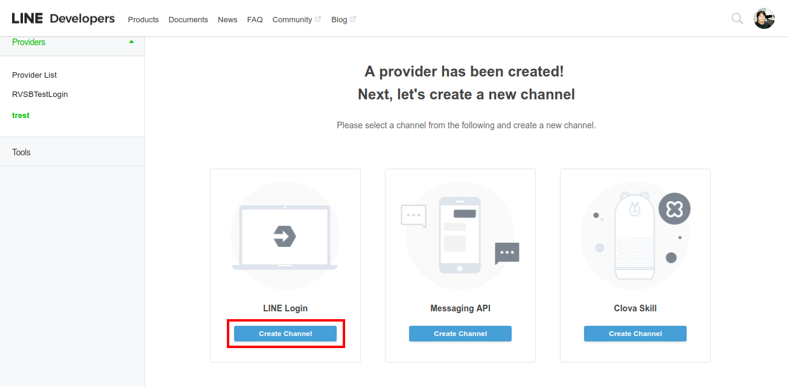

 
6. Add required values:

_App name_
_App description_
_App type_, select Use Web
_Email address_, add the email address of admin.

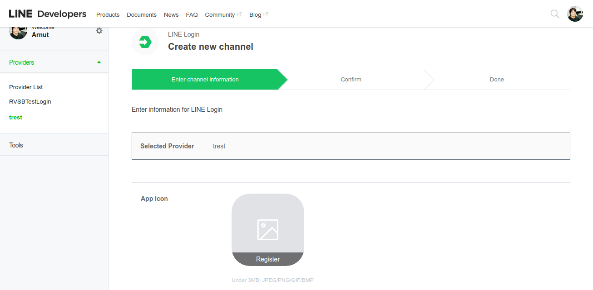

 
7. Once you're at Confirm page, *checkbox at LINE Developer Agreement*, and click **Create**.

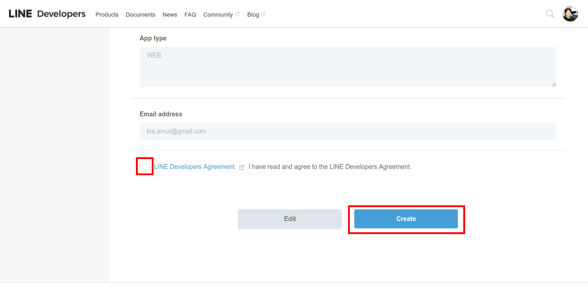

 
8. You'll be leaded to App page. Click on **LINE Login** app.

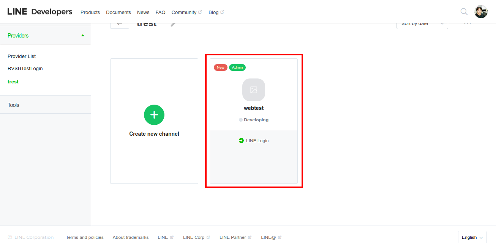

 
9. Insert **Callback URL**, and click **Update**.

_(You can find Callback URLs in your website editor -> Site -> System Pages -> Login, click on Login form to open Login setting, look for LINE login redirect URL.)_

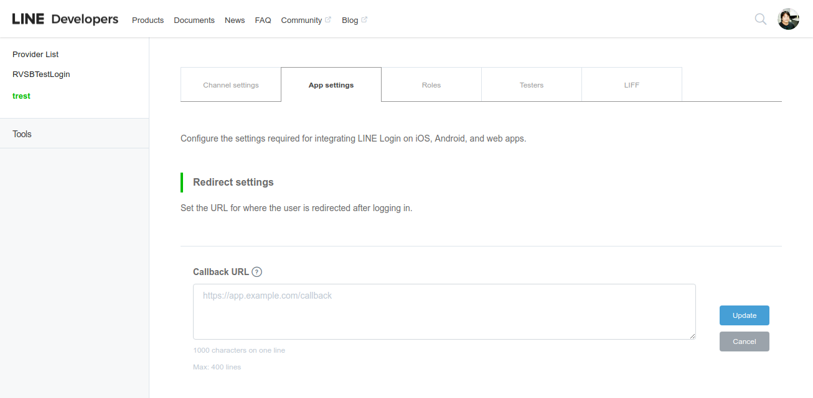

 
10. To record email addresses of LINE registered users on your website, you can setup at **OpenID Connect** by clicking on **Submit**.

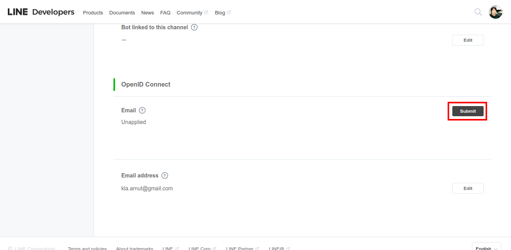

 
*Check boxes for functions*, and click **Submit**.

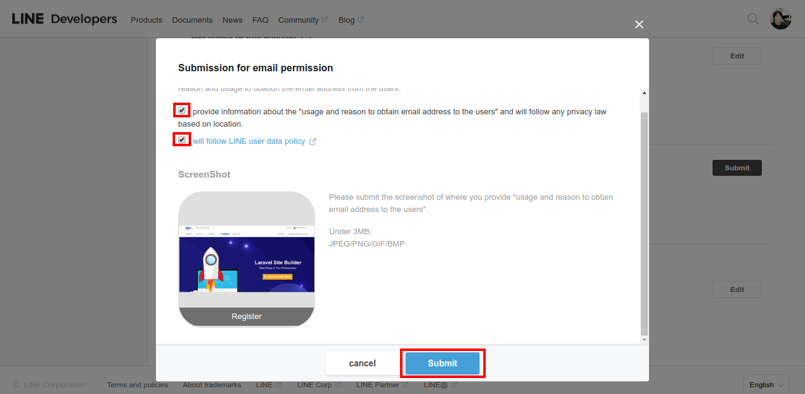

 
11. The details of **Channel ID** and **Channel secret** are showing.

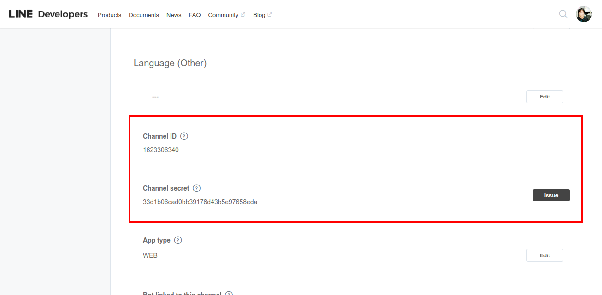

 
12. Go to website editor -> Site -> System Pages -> Login, click on Login form to open Login setting, to enable LINE Login Setup.

 
1) Slide the slidable button to activate Google Login.

2. Insert Channel ID for LINE Client ID and Channel Secret for LINE Client Secret.

3. Click OK to add these values to your form.

4. On Login Setting, click "Apply" to apply your setting.

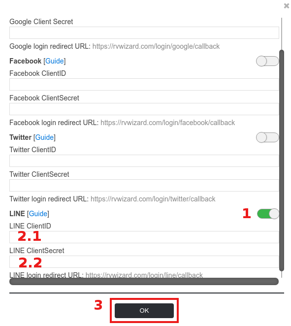

 
5) Click "Save" to save all of your setting above.

6. The LINE Login single sign-on is available for your user to login to your website without make a new register.
