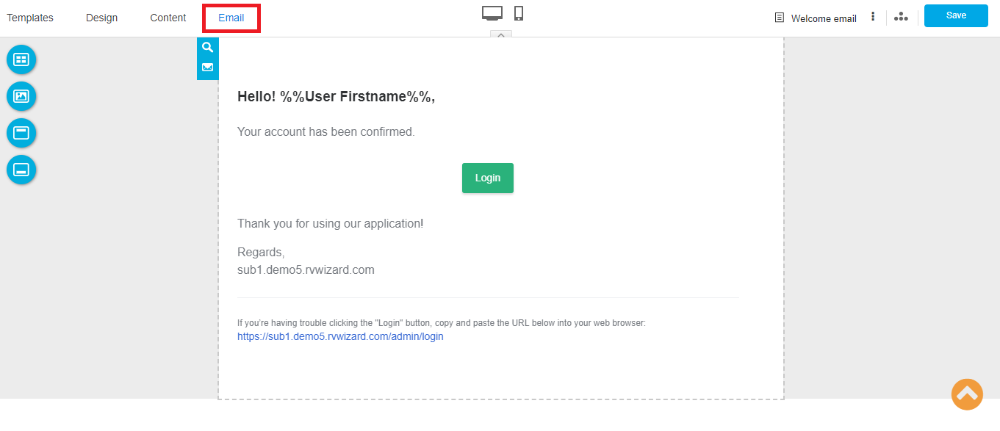
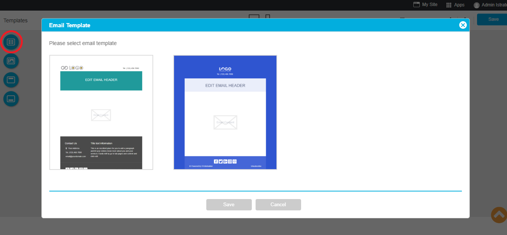

# Email Template

Make your website more you with the custom email template for emails sent out to those visitors who register to your website and website admins. Email Template can be useful and easier to support you. Custom its design to be matched your website design.

Emails sent from your website will be for:

**Website Users**

- Online Form: An email which will be sent to a user who submits the online form.

- Reset password email: When a visitor clicked forgets password on website login area and need to reset it. 

- Verify Email: Email approval for identifying the correct visitor email. Authentication your visitor by clicking confirm on their email.

- Welcome Email: A greeting email which sends out when visitors approve the verification email.

 
**Website Admins**

- Online Form: An email alert to inform that your visitor has submitted an online form on your website

- New active user: An email alert to inform that you have a new member.

###Email Template Setup

1. Navigate it from **Email** menu.

2. Select one from to two templates, it can be customized later.

