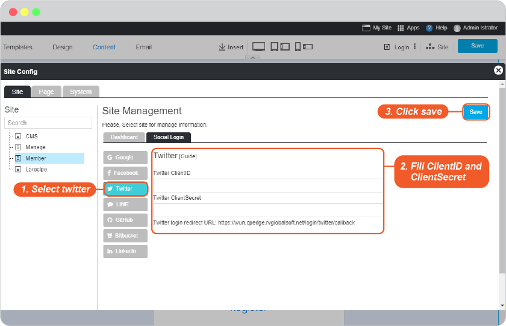
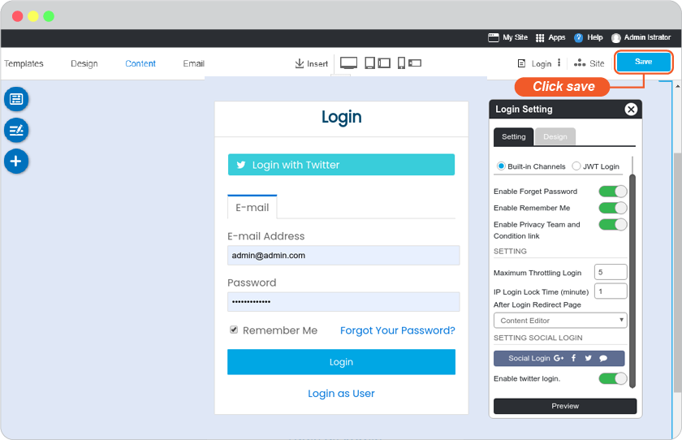
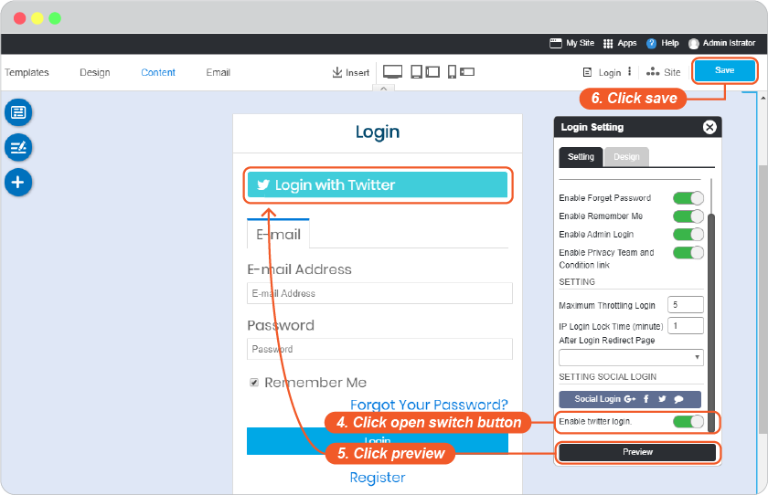

# Twitter Login Setup

1. Go to <https://apps.twitter.com/>, select **Create New App**.

2. Insert all the information required. _(You can find Callback URLs in your website editor -> Site -> System Pages -> Login, click on Login form to open Login setting, look for Twitter login redirect URL.)_ And click **Create** to complete the setting.

3. Once the application created, select **Keys and Access Tokens**.

4. Twitter API management page will display Consumer Key (API key) and Consumer Secret (API Secret).

5. Go to website editor -> Site -> System Pages -> Login, click on Login form to open Login setting, to enable Twitter Login Setup.

   1. Select twitter tab.
   2. Insert Consumer Key for Twitter Client ID and Consumer Secret for Twitter Client Secret.
   3. Click OK to add these values to your form.
    - Close the Site Config window.

    

     - Click "Save" in the editor page.
  
    

    **** กรณีตั้งค่าไว้แต่ยังไม่เปิดให้ user ใช้งาน สามารถ ปิด/เปิดปุ่ม Social Login ได้

   4. On Login Setting, click "Apply" to apply your setting.
   5. Click "Preview"
   6. Click "Save" to save all of your setting above.

    

6. The Twitter Login single sign-on is available for your user to login to your website without make a new register.
