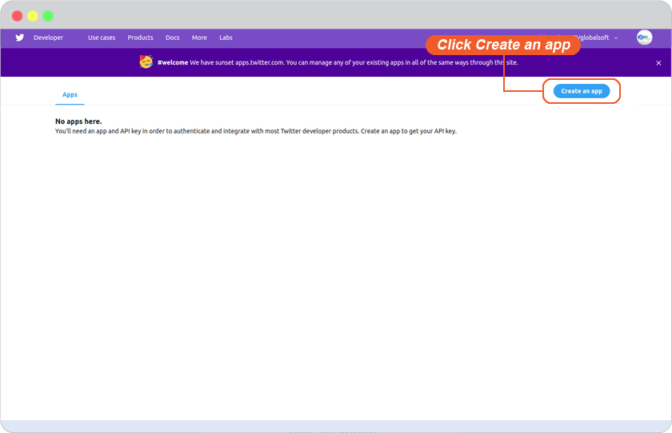
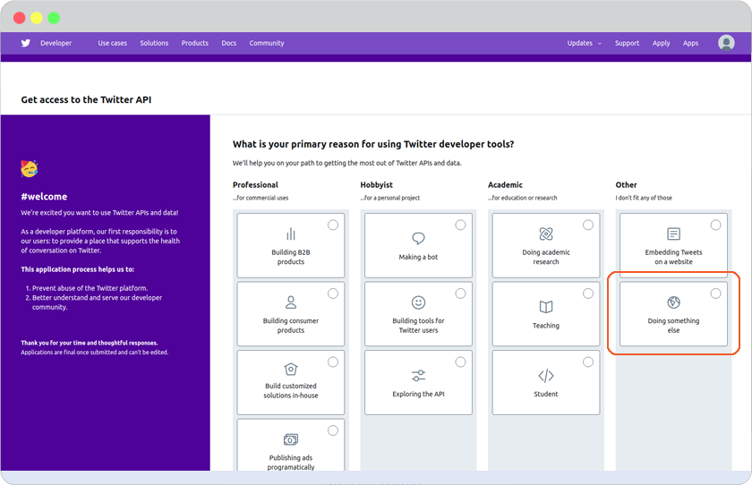
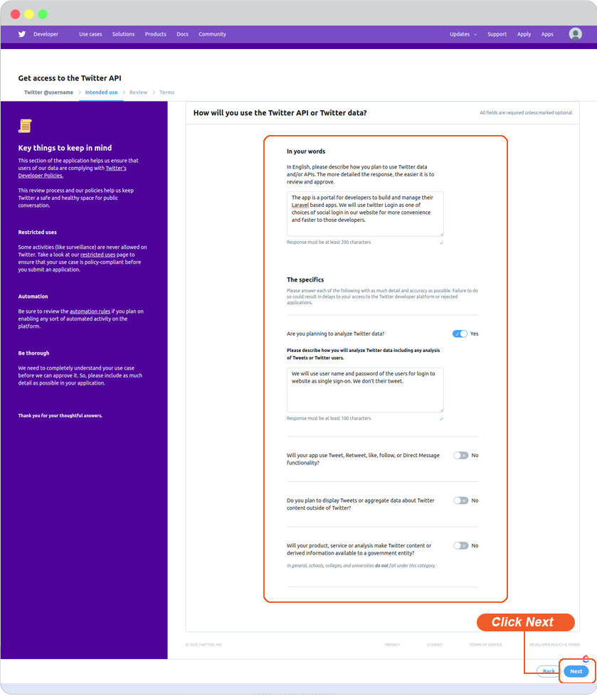
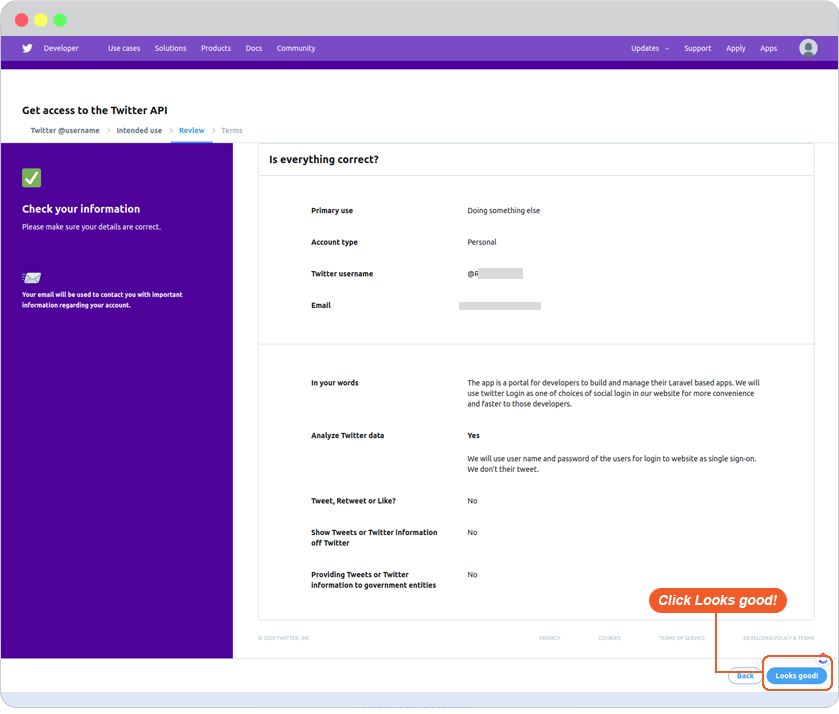
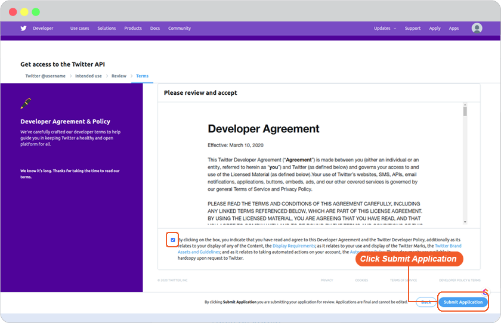
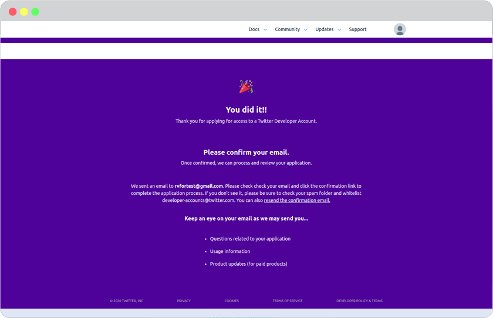
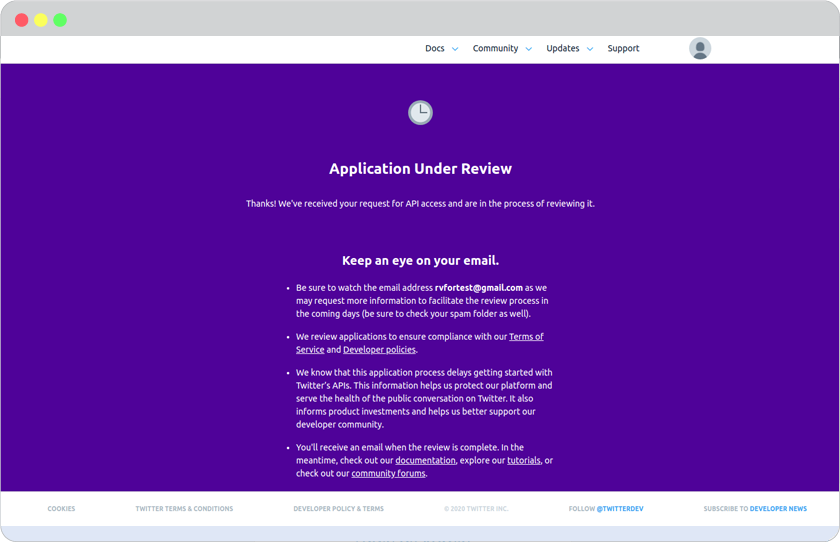

# Twitter Login Setup

1. Twitter login setup requires a twitter account. You can continue number 2 by using your existing twitter account. If you don't have one. Please register it first at <https://twitter.com/> .

2. Go to <https://apps.twitter.com/>, select **Create an app**.

 

3. Select the purpose of using Twitter developer tools, we are **Doing something else**.

 

4. Answer the required questions of what you will use with the Twitter data. Click **Next** to go to the next step.

 

5. Review your details, and click **Looks good!** to continue.

 

6. Read and accept Developer Agreement. And click **Submit Application**.

 

7. Confirmation of applying for access to Twitter Developer Account informs you to **Confirm your email**. Please check your inbox and click confirm from the email.

 

8. Your application is under review when you confirmed your email. Please wait for Twitter team to review which could take 7 days to few weeks. Stay close to your email inbox for their contact.

 

9. Insert all the information required. *(You can find Callback URL in your website editor -> Site -> System -> on "System Pages" list -> Login, click on Login form to open Login setting. On Login Setting panel, scroll and click "Social Login" button, you will be at "Site Config" Member, look for Twitter login redirect URL.)*

 And click Create your Twitter application.

10. Twitter API management page will display Consumer Key (API key) and Consumer Secret (API Secret).

 

11. Go to website editor -> Site -> System -> on "System Pages" list -> Login, click on Login form to open Login setting. On Login Setting panel, scroll and click "Social Login" button, you will be at "Site Config" Member.
    
    1. Select twitter tab.
    2. Insert Consumer Key for Twitter Client ID and Consumer Secret for Twitter Client Secret.
    3. Click Save to add these values to your form.
    4. Close the Site Config window.

    

    5. Click "Save" on editor page.
  
    

12. The Twitter Login single sign-on is available for your user to login to your website without make a new register.
    

**Bonus**

Disable and Enable your Twitter Login

Go to website editor -> Site -> System -> on "System Pages" list -> Login, click on Login form to open Login setting. On Login Setting panel, scroll and look at **Enable twitter login**.

    A.  slide to to left to disable or right to enable.

    B.  Click "Preview".

    C.  Click "Save" to save all of your setting.

    
