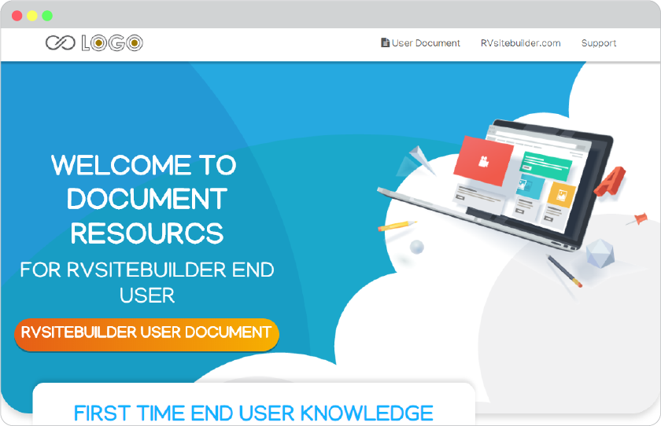
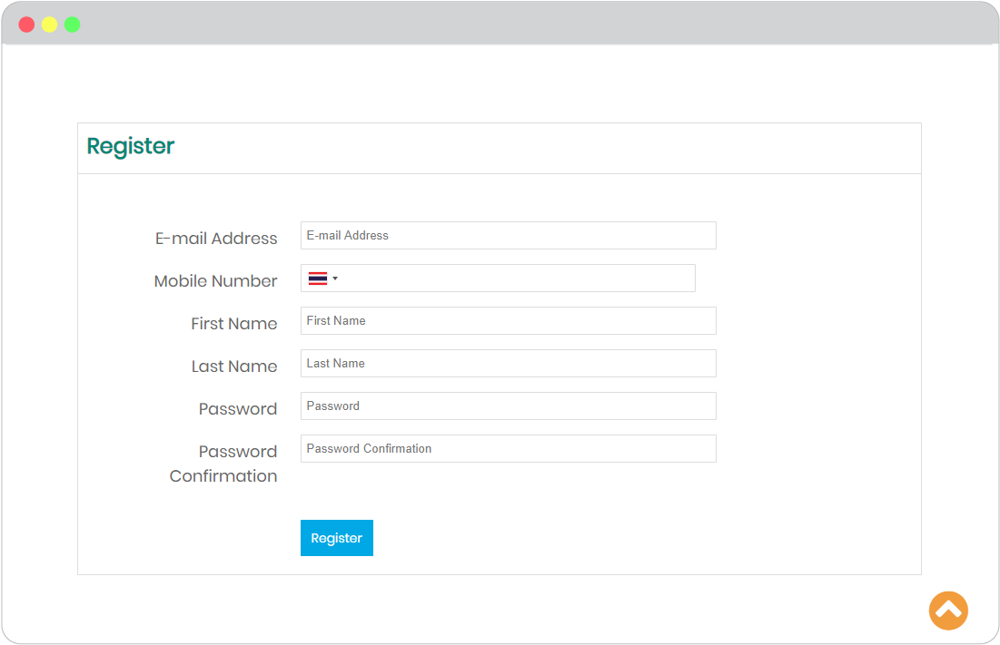
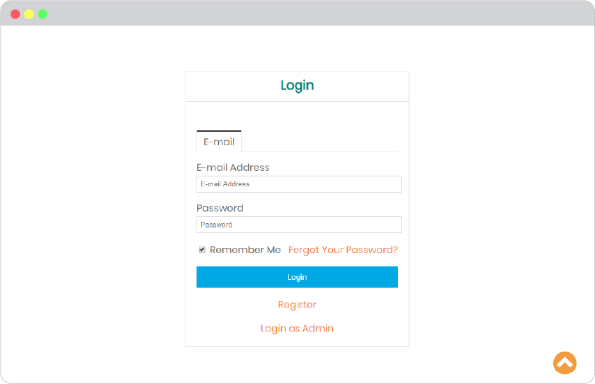
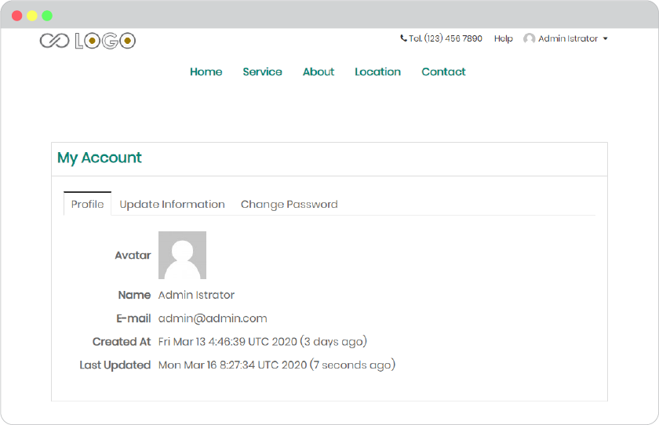
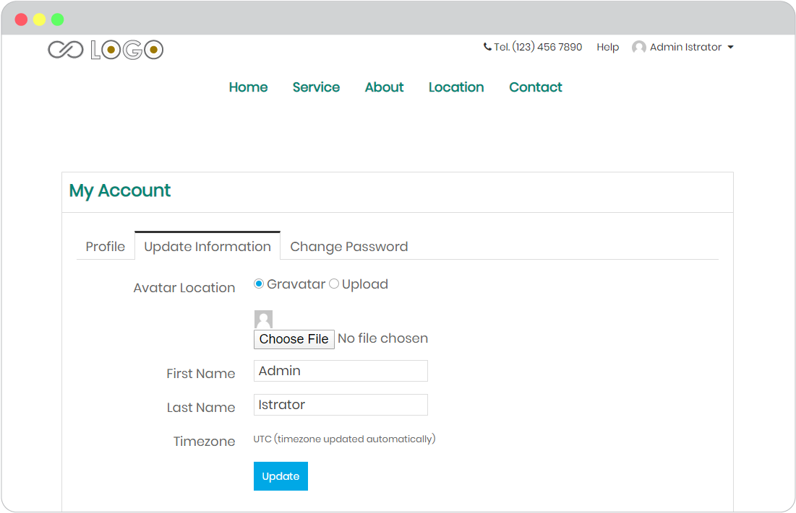
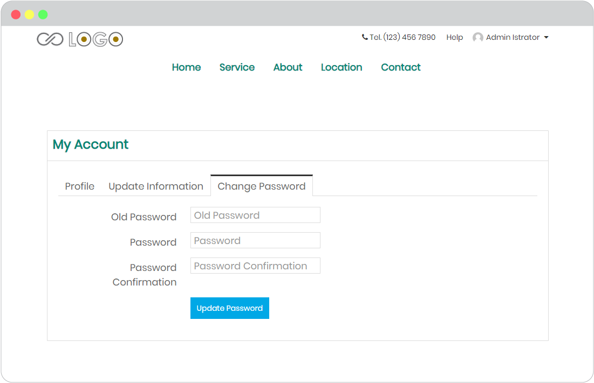

# User Interface

-   [Public Interface](#public-interface)
-   [Member Interface](#member-interface)

User Interface will have 2 main levels; **Public** and **Member**.

## Public Interface

For guest, or every website visitors who open your website.

1. **Your website** that you willingly allow everyone can access to. Such as https://user.rvsitebuilder.com/
   
   

2. **Register** page. For when you allow users to register for website membership. The register page will be available on your website when you enable it in Design -> Top Menu -> Display Login/Logout.
   
   

3. **Login** page. For those who registered already or when you enable [social login](register-and-login-system.md); google email, facebook, or twitter for your website register. The default login page will be available on your website when you enable it in Design -> Top Menu -> Display Login/Logout.
   
   

## Member Interface

For website visitors who are already your website members.

User Dashboard has 3 managements.

1. **Profile**

    To show user their deafult information.
    
    

2. **Update Information**

    To let user manage their profile info and image.
    
    

3. **Change Password**

    Some users were regitered to your website by website admin. This way they probably want to change the password for more private.
    
    

[Here](website-membership.md) is how you manage these members on your website.