# Content Editor

Edit content for your website is the most easiest and frequent activity you may enjoy. The Content Editor is the very first and an always place to welcome you after logging in.

At Content tab, you will always be at the new added page or the latest one you edit previously. 

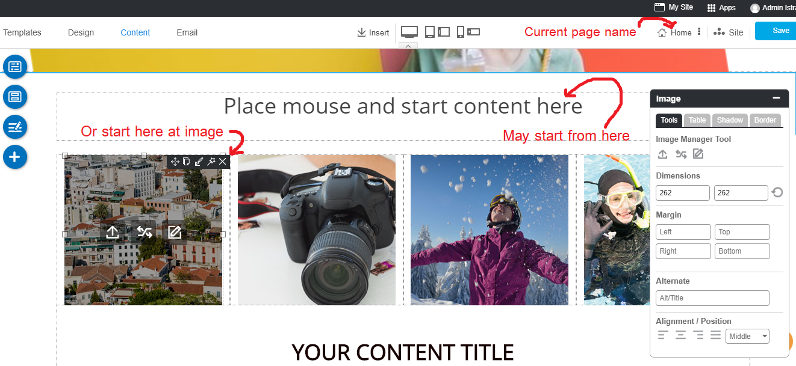

---------------------------------------

## 1. Edit your content

Once you place mouse on a text area, you can immediately start your content with our cool text tools.

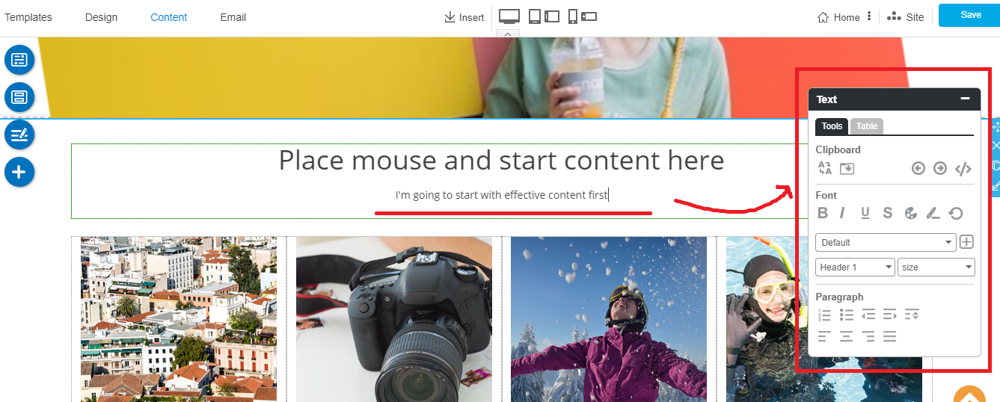

### Text Tools

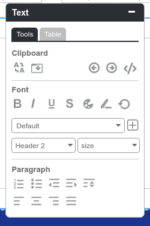 

#### Clipboard

**Paint format**

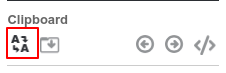

The Paint Tool copies formatting from one place in your document to another. It's quite handy. RVsitebuilder lets you copy the formatting you've applied to a specific section of text to another section using the paint format tool. To use this tool, select the text that's formatted in the way that you want to copy

1. Current cursor on format a line of text or cell in your desired appearance.
2. Click the Paint Format icon.
3. To apply this format to other text, simply highlight the text you want to apply the formatting to.
4. Clicking Paint Format icon again, it will lock the format into place and every piece of text clicked will change to the new format.

**Paste from external**

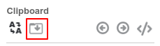

This will clean up HTML source code before pasting it into your document. Paste or drag content from Office documents, web pages and other programs into the box below (To paste use the keyboard shortcut, Ctrl + v on Windows or Command + v on a Mac). Please be patient, pasting from Office documents can take a considerable amount of time. When the paste is complete press Insert.

**Undo and Redo**

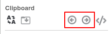 

To reverse your last action and To reverse your last Undo.

**HTML Mode**

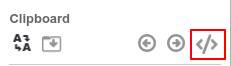

Insert HTML Code for each block. Please be careful to usie the correct HTML code. As it will break an RVsitebuilder function, if your code doesn't use the correct syntax.

#### Font

**Bold, Italic, Underline, Strikethrough**

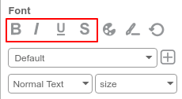

Add text to Bold, Italic, Underline, Strikethrough.

**Font Color**

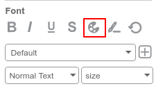

Apply color to font by using our color picket or you can type a color code for the specific color.

**Font Highlight**

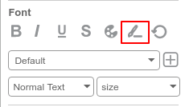

Hover the text and choosing the colot to highlight.

**Clean formatting**

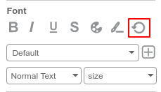

Clearing text format, in case you copy the text from another website. 

**Font Family**

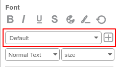

Selecting font family from the drop-down list and you can use **our new feature to add more font family from Google Font** as well!

**Add font family from Google Font**

1. Choosing a font at [Google Font](https://fonts.google.com).
2. On RVsitebuilder text tool, click plus button behind a font family.

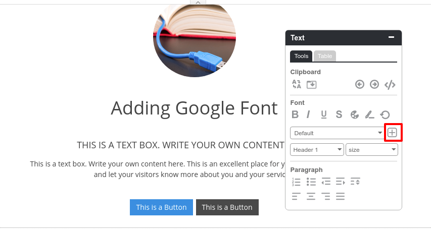

3. Fill a font name and click Add.

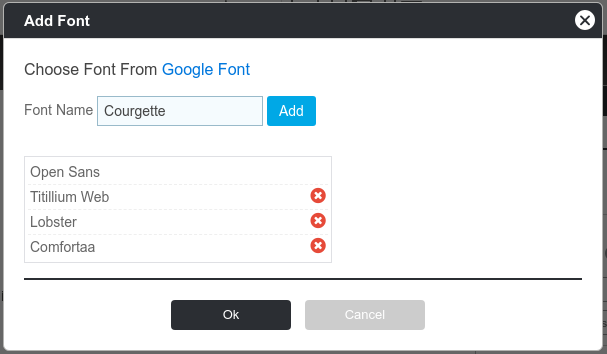

4. You can select a new font from a font list.

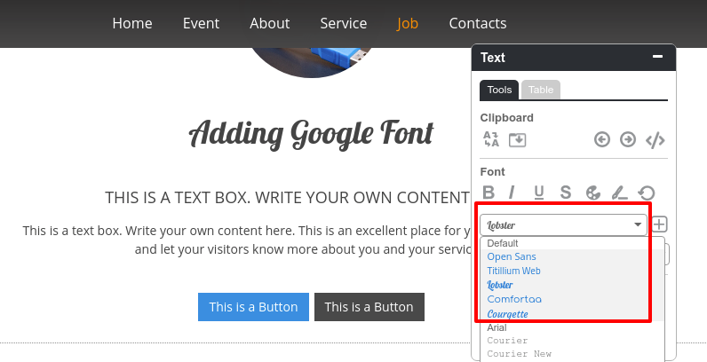

    Tips: You can add a miximum 5 font families.

**Font Style**

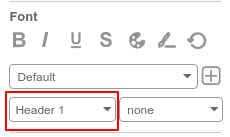

Font style creates the basic text structure, helping you organize thoughts on a page. You can apply style to text while you’re editing or adding it. Selecting 11 stlyes on the drop-down list to control the typography (font design), giving the words personality and flare.

**Font Size**

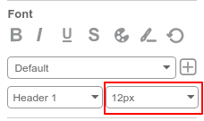

Increase or decrease a font size by choosing on the drop-down list.

#### Paragraph

**Insert Number**

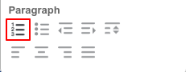

Add list by numbered.

**Insert bullet**

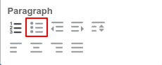

Add content to list by bulleted list icons.

**Indent**

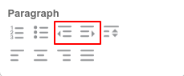

In the Text toolbar, click the increase or decrease indent icons to indent text to the left or right.

**Line Spacing**

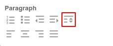

Change the space between lines. 

**Alignment**

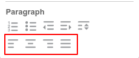

Align your text paragraph; left, center, right and justify.

### Table Tools

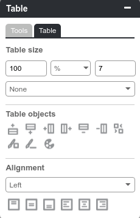

#### Table Size

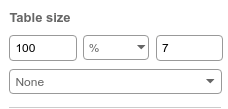

Adjust the table and boarder size, also select the boarder style on the drop-down list. You can choose a table unit size between percentage and pixel.

#### Table object

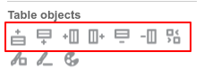

To Insert, merge, remove both row and column.

**Table Color**

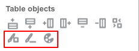

Adjust the color on each cell or the whole table and table border color.

#### Table Alignment

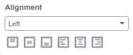

Align text on the table both horizontal and verticle.

-----------------------------------------------

## 2. Add new content section

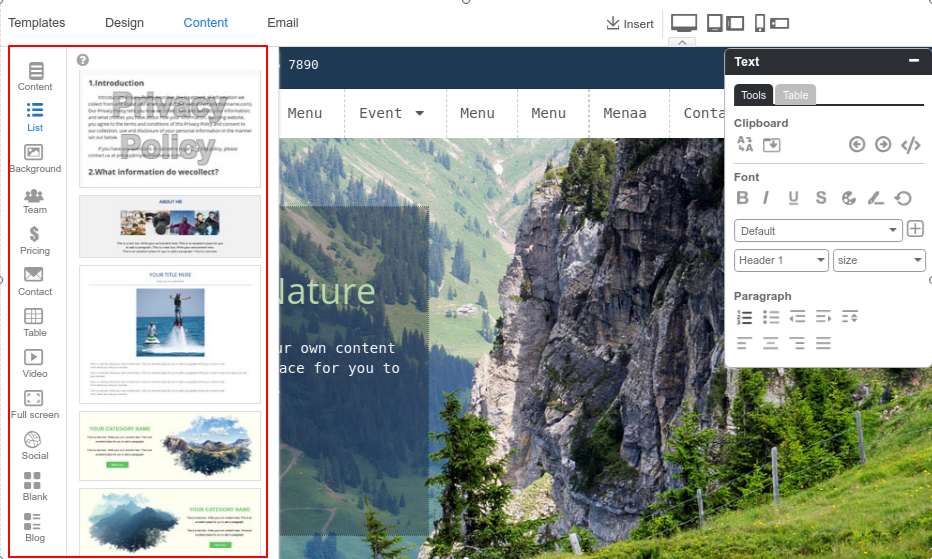

On step **Content**, you can select a **Section** by drag and drop on the editor area. We provide 12 catagories section.
In all 200+ layout designs, 130 designs are new from RVsitebuilder 7. 

1. **Content**: a normal section which contains a various layout.
2. **List**: it allows you to add a group of product with descriptions and icons. It’s great for things like product descriptions, or can be used as a unique way to list the services you offer.
3. **Backgroud**: It will present the almost ready content layout with cool text and picture positions with the beautiful background image from Background image album.
4. **Team**: Showing your staff members including profile images, job positions, member names and so on.
5. **Pricing**: If you run a business or sell a product on your website, you probably have a dedicated pricing page for the whole thing. You'll notice the best pricing pages have clean layouts, use simple language that speaks to the customer, and aim to inspire trust between the business and the user.
6. **Contact**: The goal of every contact us page is to convert by clearly and effectively presenting the method(s) of getting in touch with a company as quickly as possible.
7. **Table**: If you are presenting data and information using columns and rows, then these best table website templates are ideal for you. Tables are a super convenient way of displaying any sort of statistics, specifications and other whatnots. Instead of creating them from scratch, we built many different variations that are just a click away
8. **Video**: One of the best ways to catch the eye of your website visitors is by showcasing your videos in a featured video section. 
9. **Full screen**: Full-screen mode takes advantage of your available screen real estate and provides a useful platform for presenting visual content. One main benefit of a full screen page layout is visibility.
10. **Social**: Putting your social media channel on your website can directly affect the response and engagement from your visitor.
11. **Blank**: Custom design a section by yourself. We provide a blank section with a variety block layout.
12. **Blog**: Adding more widget on your page for letting a visitor can easily access to read your blog.

--------------------------------------------------

## 3. Add image to your content

Once some content done, let's make this page more interesting by adding images on it.

You can click directly on the images that come with section.

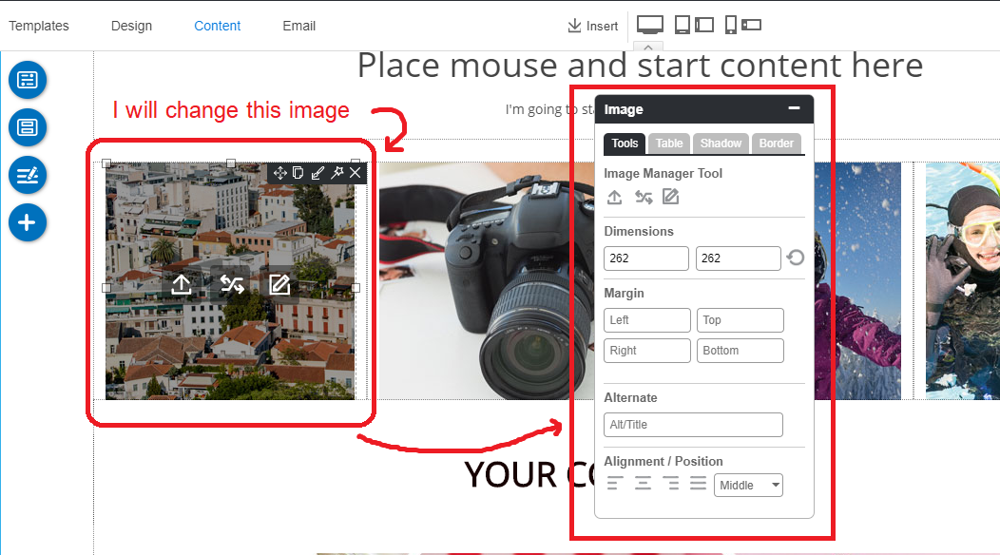

The 3 image tools are right on the image you clicked; **Upload**, **Replace**, and **Edit** respectively.

1. **Upload**
      
Click this icon, you will see the Upload Image window to upload an image from your computer. Simply upload it.

2. **Replace**

Click this icon and you will see the Image manager panel that has 3 main parts to manage image.

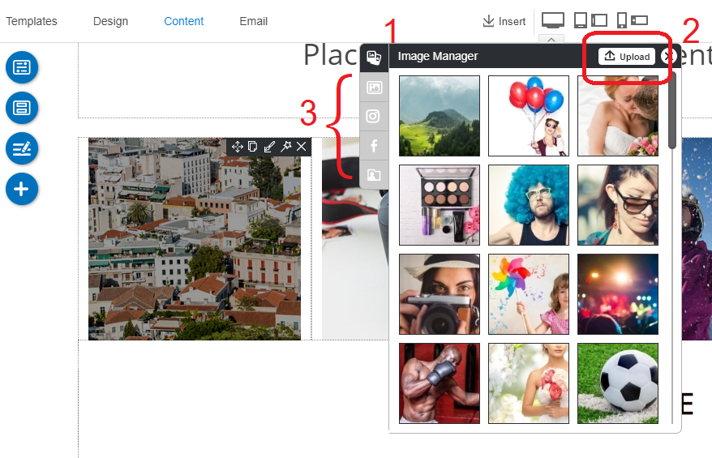

   1 ) Image Manager panel ; Feel free to select one in free images from here.

   2 ) Upload button ; Feel free to upload new image from your computer.

   3 ) Other image folders ; folders to select images from such as our own buit-images, images from your Instagram or facebook accounts.

3. **Edit**

Click this button in order to edit this image.

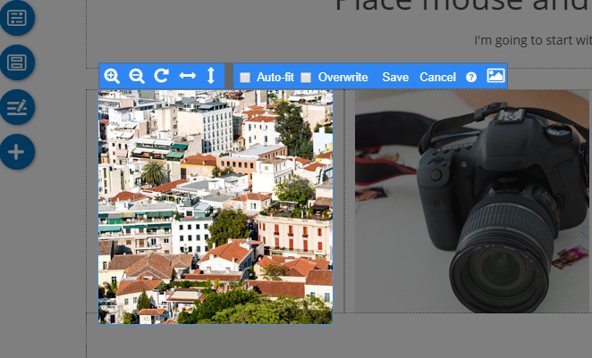

   From left to right.

   **Zoom In** : To Zoom this image for more closer.

   **Zoom Out** : To make this image more farther but not farther than the original.

   **Rotate** : To rotate this image.

   **Flip Horizontal** : To make this image flipped horizontally.

   **Flip Vertical** : To make this image flipped vertically.

   **Resize** : To make this image size matched this image box. It's not to resize image freely.

   **Overwrite** (Caution) : If you click Overwrite, it will entirely overwrite the original image by the new uploaded image. If you have the original image in any places of your website, it will be displayed the new uploaded image instead.

   **FULL image Editor** : You can insert text, crop, rotation and add a filter. Make your image more beautiful ever!

----------------------------------------------------------------------------------------------------

