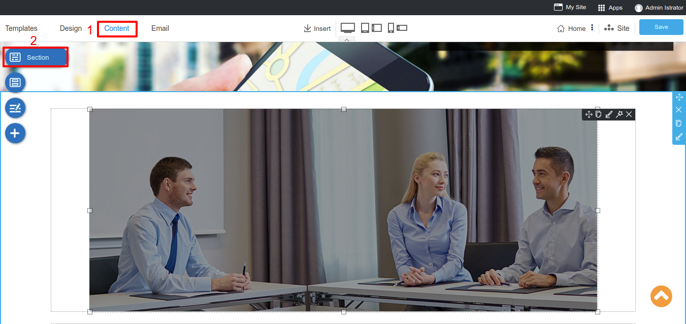
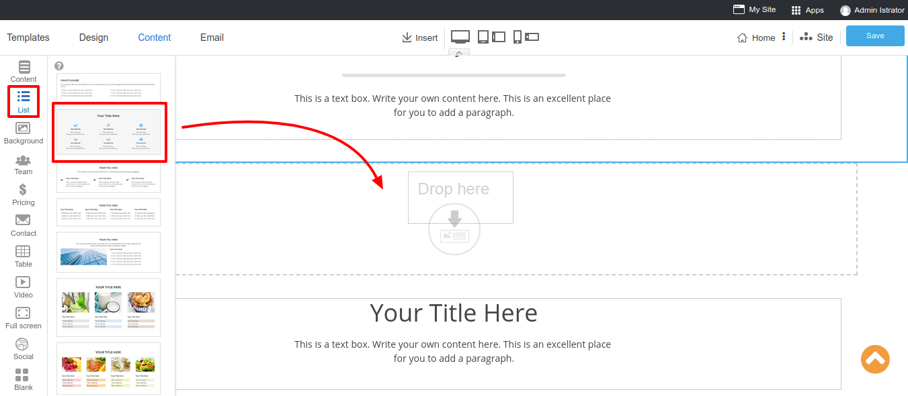

# Website Design

After the [one-click create my site](create-new-website.md), you sure want to design it as beautiful as your style.

First we will start with a beautiful template.

### Beautiful Template
Select template relate to your business categorie with up to 138 ready-made beautiful templates including with very new template designs and blank templates.

----------------------------------------------------------------------

### Website Banner
Banner is the most attractive part of your website. RVsitebuilder 7 allows you to use website banner in 2 styles; Hero Banner and Slide Banner.
- **Hero Banner**: A single banner image which you can insert the text and change its image. Choose the style at step **Design** and click on **Banner** icon. You can change its image and color by clicking on the Background icon on the right corner. 

- **Slide Banner**: Make it more than one image on your website banner, also you can change the slide effect.

> **Note:** If you're setting website banner at Home page, it will affect to ALL pages. 

----------------------------------------------------------------------

### Website Navigation
Manage your Top Menu and Menu

**Top Menu:** Most of the visitors who access your website do not have much time to spare. The key is to intelligently display those links which your visitors are looking for. Once your products are easily accessible, your visitors are likely to turn into reliable customers.

You can select a Top menu style on step **Design**. Don't forget to click **Save**.

And modify your Top menu on step **Content**, click on the Menu icon and select **Top Menu**. You can add icon, badge and point the menu to a page as you want.

Clicking on a logo to change your own company logo and insert your company address.

**Menu:** This part is useful in organizing the information on your website so that your visitors have a clear idea of your products and services.

You can select a Menu style on step **Design**. Don't forget to click **Save**.

There are 2 ways of adding a new menu

1. **Adding a new page**: On the step Content click on **New Page**. You can add a new page and checkbox **Show on Menu**. If you don't select Show on Menu, the page will be an internal page automatically. But if you select a **Show on Menu** box, it will create a new page, also add the menu to your navigation bar.

2. **Adding manually menu**: You can add a new menu and select page to point at the step **Content**, select on the Menu icon and select Menu. Clicking plus buttom to add a new Menu. You can add icon, badge and point the menu to a page as you want.

On the Menu Setting you can:

- Fill your Menu name
- Add icon which will appear in front of the menu.
- Add badge to get more attractive from visitor.
- Select the method you need to open this menu.
- Choose a direction to link this menu.

----------------------------------------------------------------------

### Website Content
Easy way to create a wonderful website just drag and drop element. On step **Content**, click on a **Section** button then drag and drop a section.

Drac and drop a section from the list to your project, you may see a section properties on a blue tab which you can customize as you needs.

----------------------------------------------------------------------

#### Section Properties

##### Move Section

Rearrange a section up or down by drag drag to drop where you want in the same page.

##### Delete Section

Use **Delete** icon to delete section. Be careful, it’s a prompt delete function.

##### Duplicate Section

You can use **Duplicate Section** icon to duplicate the section you want to repeat. It will copy all design and content immediately.

##### Edit Section

   - **Background**
   

*Fluid (full screen)*: Enable or disable a full screen section.

*Color* : Selecting background color by using color picker or choosing from a gradient color.

*Background Image*: Inserting an image to a background. You can select an image from Image Manager.

*Reponsive Image Position*: Image alignment on responsive mode.

   - **Shadow**

You can select 6 shadow preset styles which you can modify color and size on the below setting.

   - **Overlap**

Making one section to overlap other sections. 

   - **Box**

Adjusting section border design.

----------------------------------------------------------------------

#### Block Properties

Inside a section, it contain a block content which you can customize on block properties, a

##### Move Block

Drag to drop where you want in the same section.

##### Duplicate Block

Duplicate the block you want to repeat. It will copy all design and content immediately.

##### Edit Block

##### Animation

Set Animation and Parallax Effect for block by “Edit Block”. You can choose 18 animations and 19 scrolling effects.

##### Delete Block

Use “Delete” icon to delete block. Be careful, it’s a prompt delete function.

----------------------------------------------------------------

