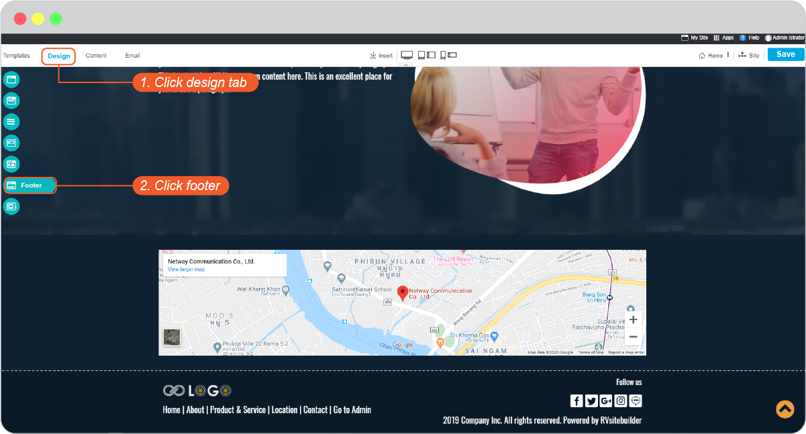
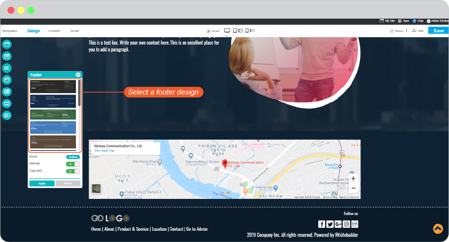
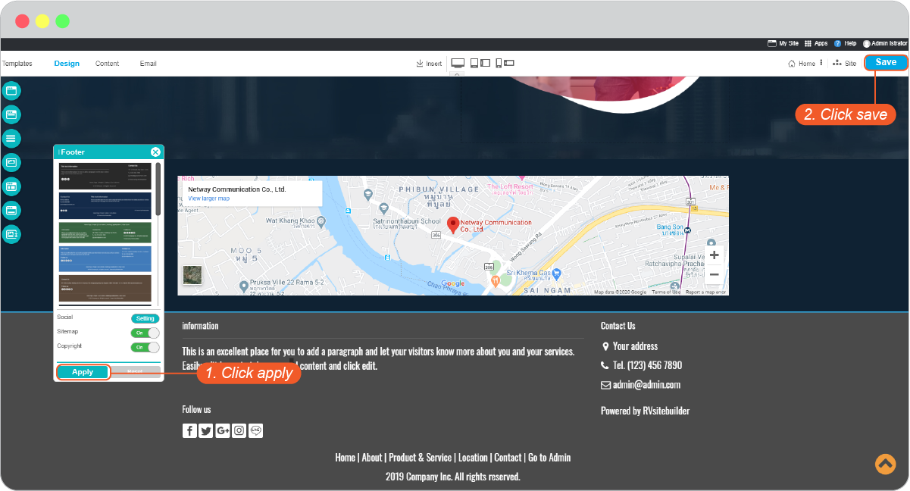
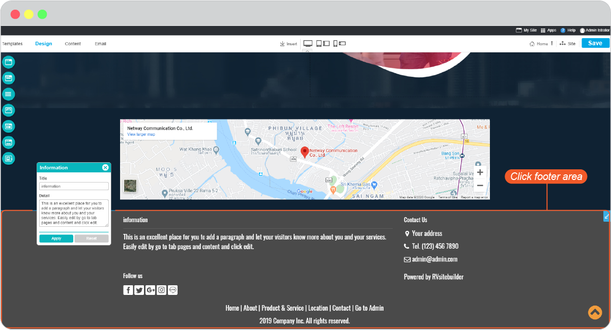
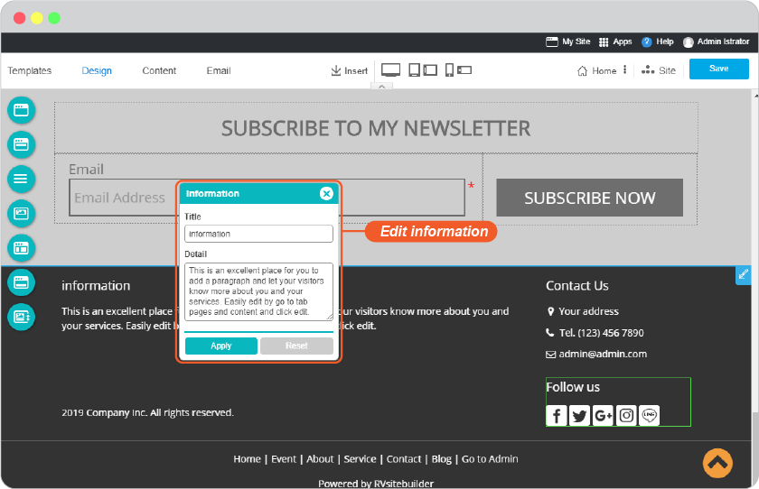
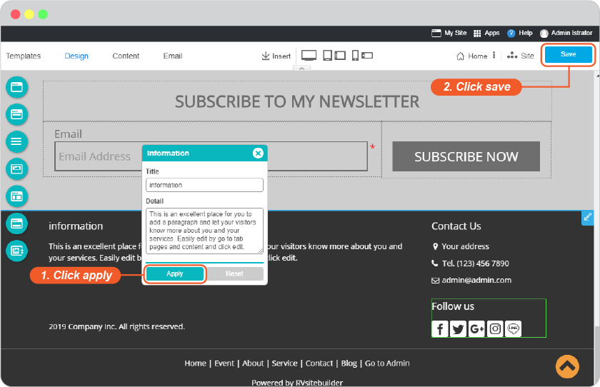
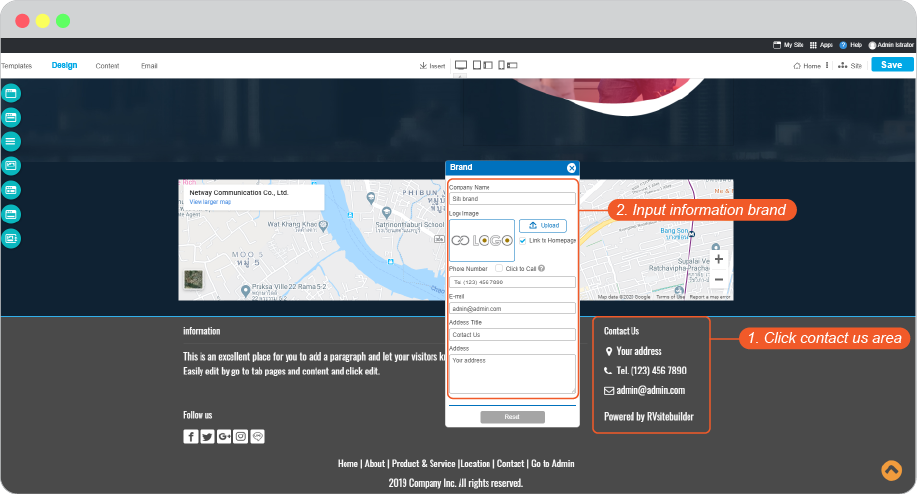
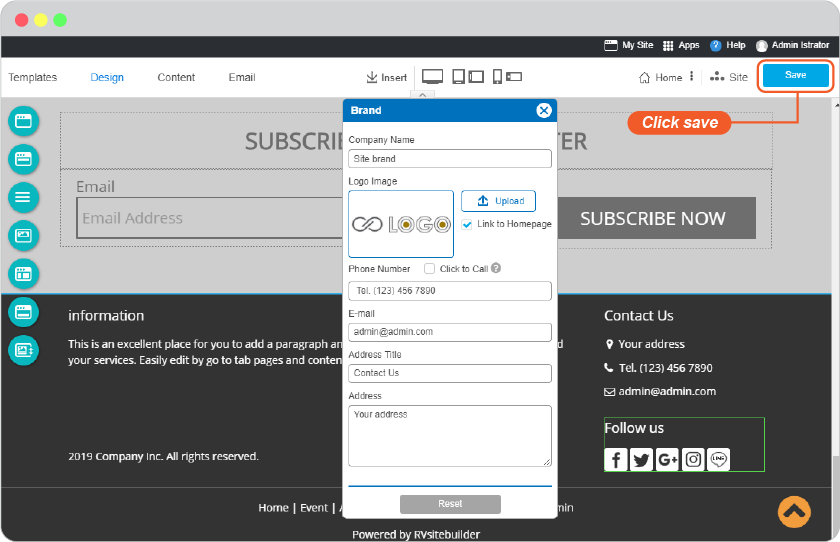
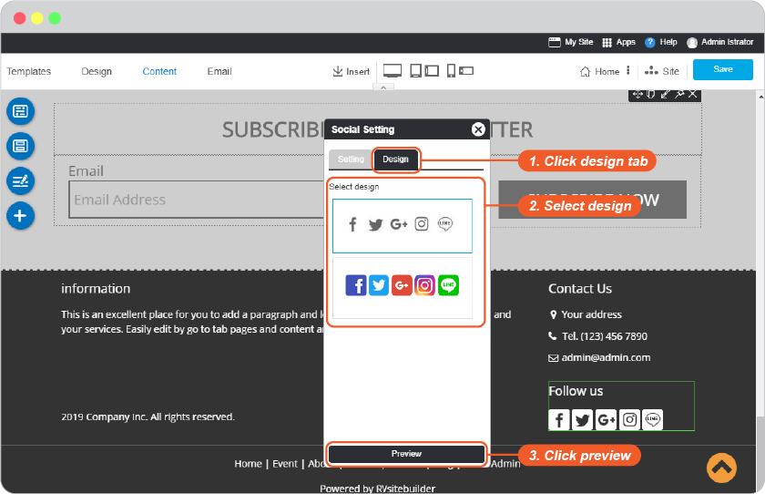
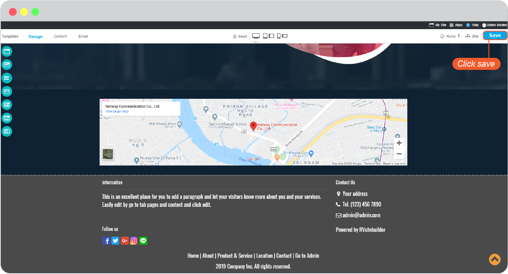

# Website Footer

  - [Footer Design](#footerdesign)
  - [Information Setting](#informationsetting)
  - [Contact Us Setting](#contactussetting)
  - [Social Media Setting](#socialsetting)

The new feature of RVsitebuilder is an adjustable footer area!

In version 7, it allows you to change the style and background color by selecting from a list we provides.

## Footer Design

1. On step **Design** tab, click **Footer**.

2. Select a Footer design and set to show a sitemap and copyright.

> **Tip:** Showing a sitemap - This feature will be useful for visitors to get faster and easier access.

3. Click **Apply**, and Save it on Content editor page.

 

---------------------------------------------------------------------------------------------------

## Information Setting

You can insert information about your company on the information block.

1. Just click directly on the Follow Us area on Footer and set it. 

 

2. Simply put, your company profile is a professional introduction and aims to inform people (primarily prospective buyers and stakeholders) your products, services, and current status. A well written company profile is a great opportunity for your company to differentiate itself.

3. Click **Apply**, and Save it on Content editor page.

 

---------------------------------------------------------------------------------------------------

## Contact Us setting

Add your company address for more trustworthy and easy to contact. This is a Brand global setting which logo, a phone number will be shown on your top menu also.

1. Just click directly on the Contact Us area on Footer and set it. 

> **Note:** This Contact Us information is the same when you add and edit on Top Menu.

2. Click **Apply**, and Save it on Content editor page.
=> [พี่โฉม อันนี้ไม่มีปุ่ม Apply แล้ว]

 

---------------------------------------------------------------------------------------------------

## Social Media setting

Always have your visitors stay connected with you on Facebook, Twitter, Google+, Instagram, Line that will appear on website footer.

1. Just click directly on the Follow Us area on Footer and set it. 
  

2. ใส่ข้อมูลในแท็บ setting
   

3. เลือกดีไซน์ในแท็บดีไซน์ และคลิก Preview

4. Click **Save** it on Content editor page.

