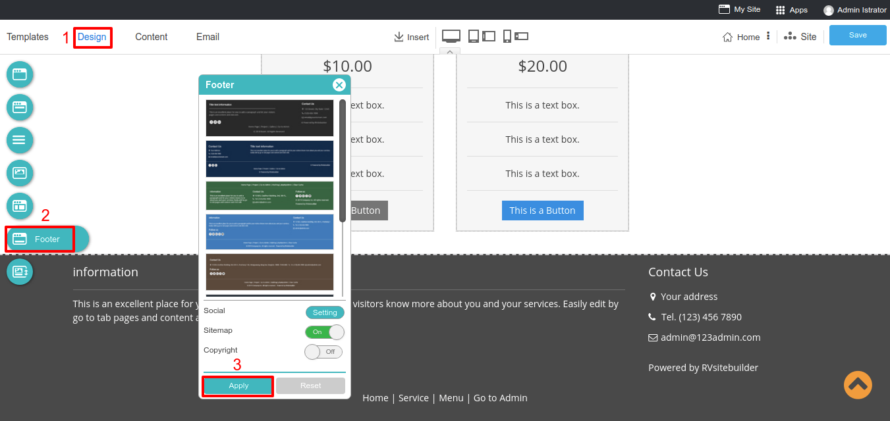
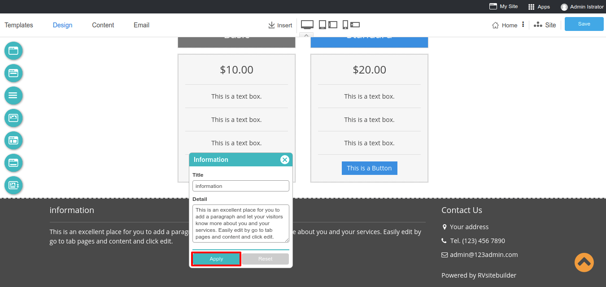
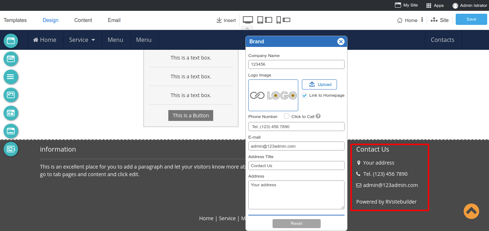
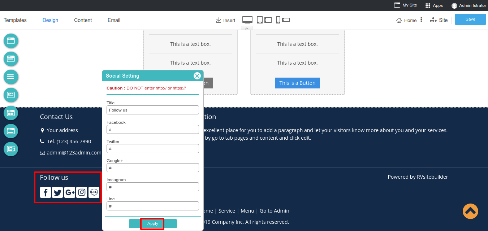

### Website Footer
The new feature of RVsitebuilder is an adjustable footer area!

In version 7, it allows you to change the style and background color by selecting from a list we provides.

1. On step **Design** -> **Footer**.
2. Now RVsitebuilder 7 provides 8 styles to choose and set to show a sitemap and copyright. Don't forget to click **Apply** after you selected.

> **Tip:** Showing a sitemap - This feature will be useful for visitors to get faster and easier access.

3. You can insert your information by clicking on an information block. Click **Apply** after each change to make it save.

**Information Setting**
Simply put, your company profile is a professional introduction and aims to inform people (primarily prospective buyers and stakeholders) your products, services, and current status. A well written company profile is a great opportunity for your company to differentiate itself.

**Contact Us setting** Add your company address for more trustworthy and easy to contact. This is a Brand global setting which logo, a phone number will be shown on your top menu also.

**Social Media setting** Always have your visitors stay connected with you on Facebook, Twitter, Google+, Instagram, Line that will appear on website footer.

