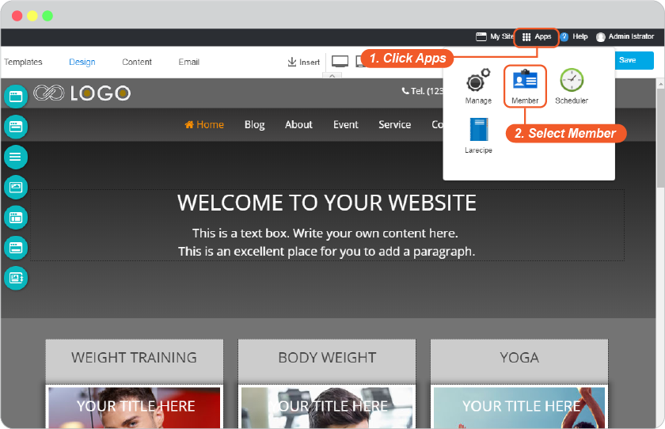
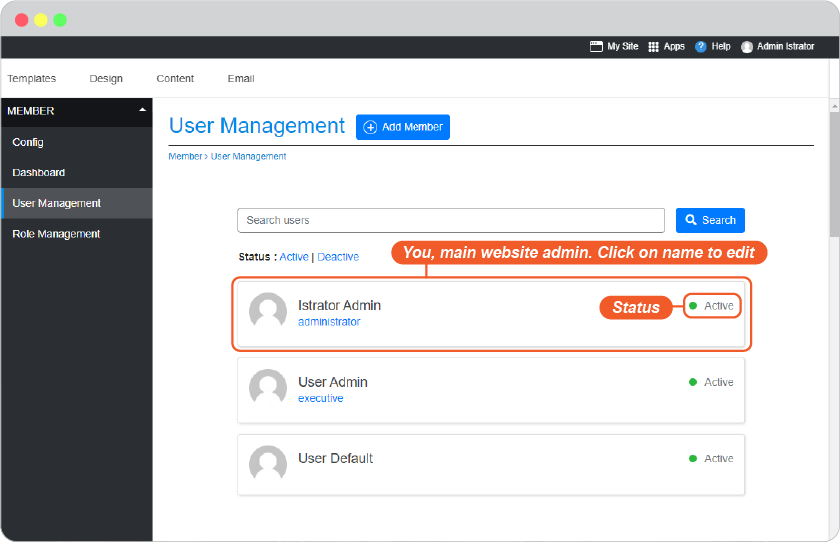
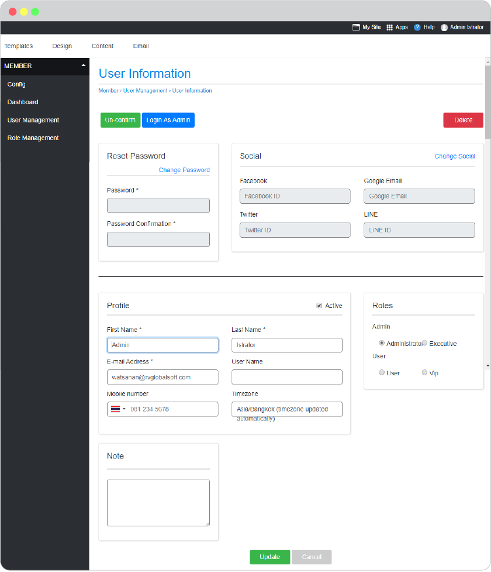
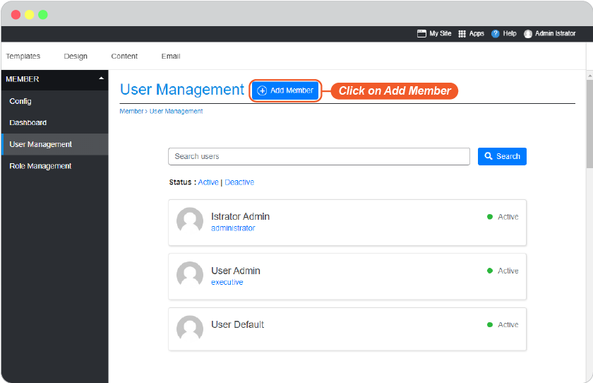
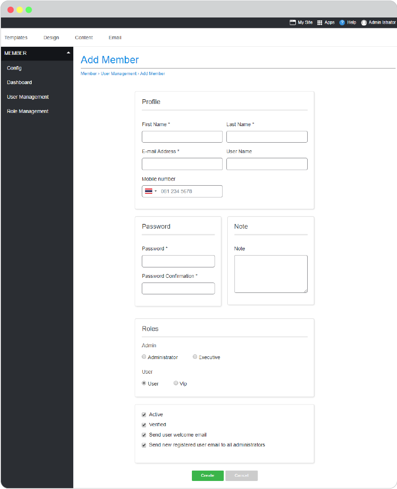
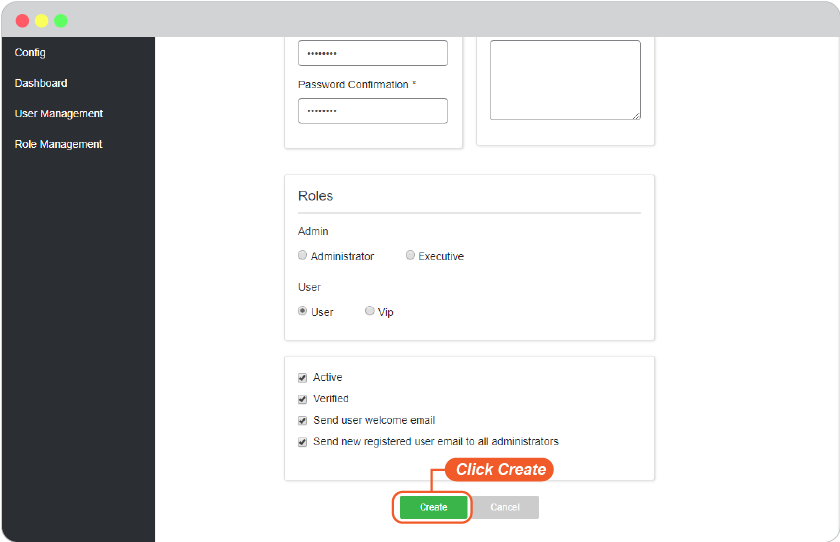
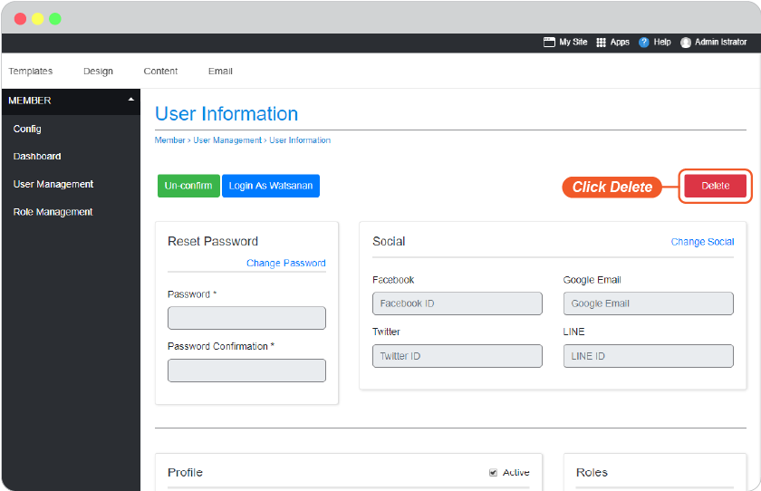
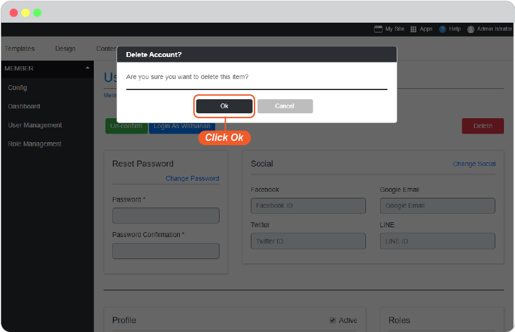
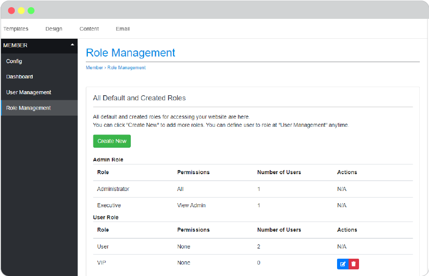

# Website Membership

-   [Meaning](#meaning)
-   [Setting Areas](#setting-areas)
-   [User Management](#user-management)
    -   [Edit Current Member](#edit-current-member)
    -   [Add New Member](#add-new-member)
    -   [Delete Member](#delete-member)
-   [Role Management](#role-management)
    -   [Backend Role](#backend-role)
    -   [Frontend Role](#frontend-role)
    -   [Create Custom Role](#create-custom-role)

## Meaning

Member is where to manage user and role for website members for both those you added and those who registered by themselves.

**User Management** is to manage users information.

**Role Management** is to manage roles for users.

## Setting Areas

At the current page editor, click on **Apps**, select **Member** to open Member management area.

## User Management

All website members, you, other website admins, and those customers who registered on your website will be listed here.

### Edit Current Member

You can edit password, enable the member to login by single sign-on from their socials accounts (Gogle Email, Facebook, Twitter, LINE), personal information, and roles , or delete member.

1. Click the name you want to edit.
1. In the member information page, edit fields you want.
1. Click **Update** button for saving.

### Add New Member

You can add anyone as a member to your website. Give them role, and send them the login information.

1. Click on **Add Member**.

2. Add information in all fields.

**_Role_** You can define role for thie new user as Administrator, Executive, User, or VIP. We will see more details about each role in the next part.

**_Notification_**

-   _Active_, Check this box for immediately activate this user once added.
-   _Verified_, Check this box to make this user verified by you once added.
-   _Send user welcome email_, Check this box to send Account Activation email to this user by email address given above.
-   _Sene new registered user email to add administrator_, Check this box to send New Activated User to all administrator of this website.

3. Click **Create** to confirm adding this user.

### Delete Member

Delete member will permanently delete that person from access to your member area website, all privilege and data will be deleted. Make sure before using this feature.

1. Click a name you want to delete from being your website member.

2. In user information page, click on **Delete** on the top right corner.

3. Confirm.

This user is deleted from member area of your website but still able to visit your website as normal visitor.

## Role Management

Role is the privilege to define to website member. You, as the website starter, will hold **Administrator** role. All self-registered will have role as **User** by default.

There are 4 roles you can manage, and more custom role(s) you can create.

### Backend Role

**Administrator**, The utimate permission role for website member. This role holds all permissions to manage website, can add, delete, and define every website member a role. Usually the first person, you, who started create this website will have this role.

**Executive**, The high permission role second to Administrator. This role holds exclusive permission to access to website admin area to edit website content, manage installed applications, mostly for website information but cannot manage users and roles. This role is mainly used when you want more website content editors aside from you.

### Frontend Role

**User**, The member privilege for website visitors who registered to your website. User role is mostly for permission to access to member area or some pages on your website you set visibilily only for User (member).

**VIP**, The **User** more permission role that can be used when you want some **User** to access to website admin area. This role is not famous to use, so it allows you to remove it from your website member management.

### Create Custom Role

Role management allows you to create custom role(s) you may need.

1. Click **Create New**

2. Give this Role a name.

3. At **Associated Permissions**, you can check this box if you want this Role to be ale to access to website admin area.

4. Click **Create**.

