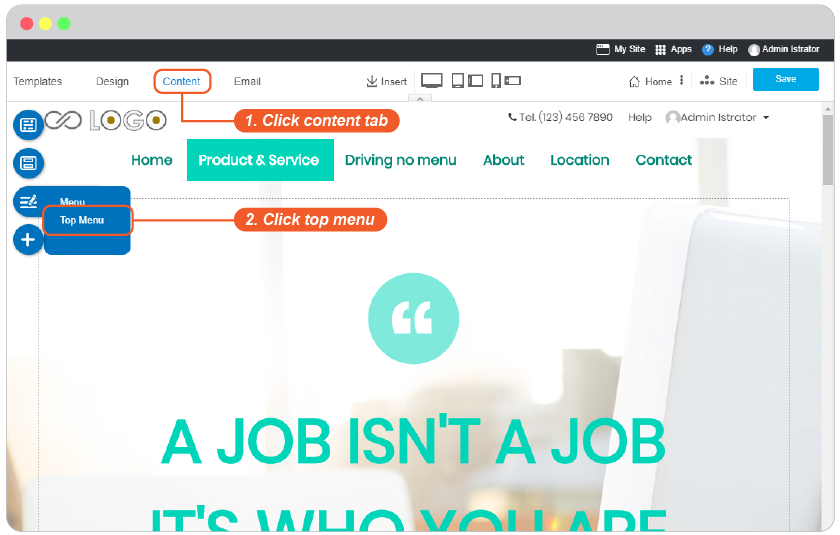
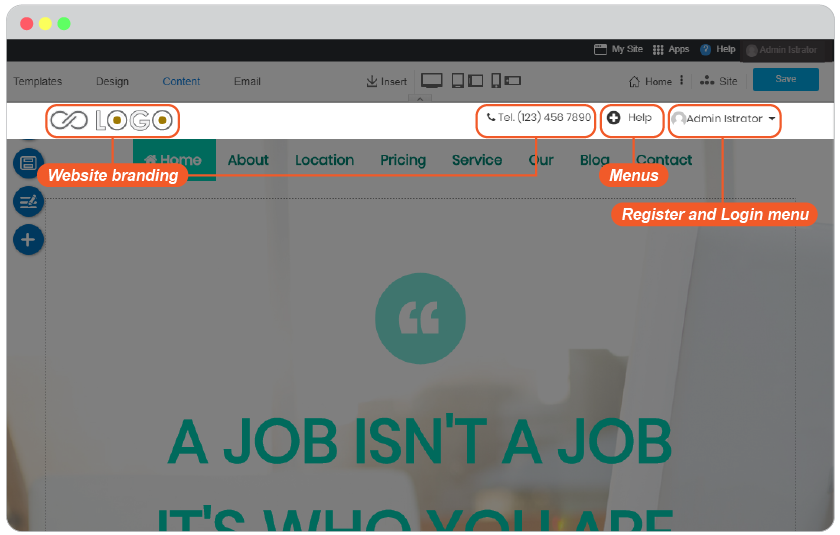
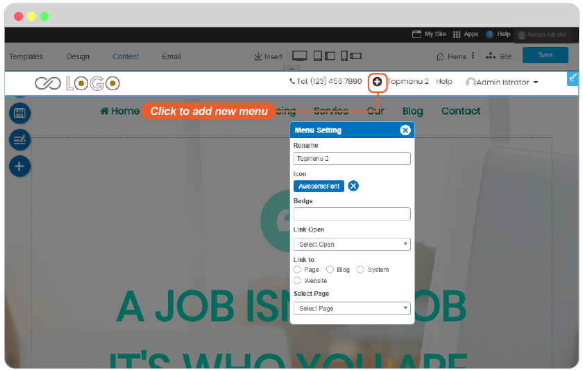
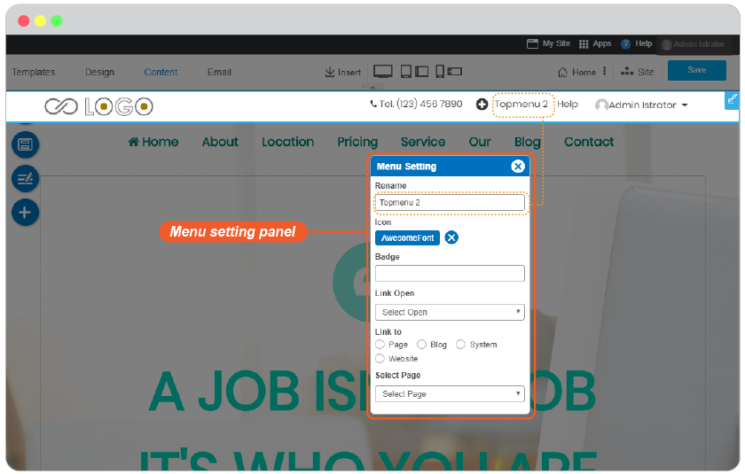
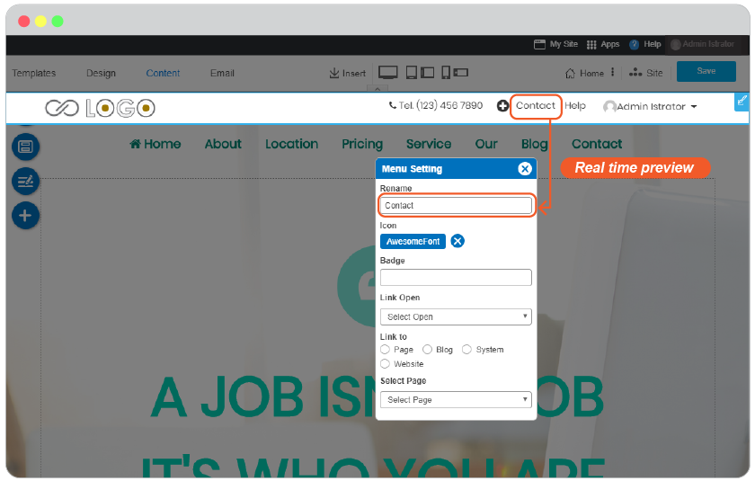
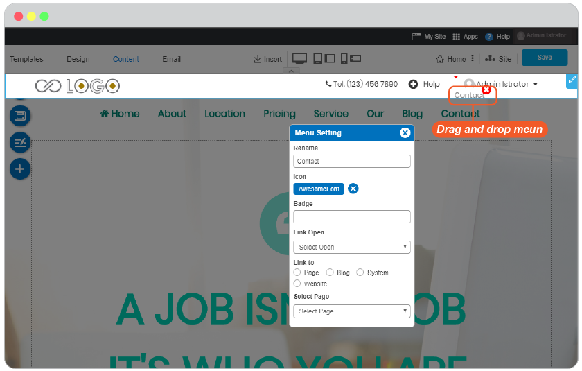
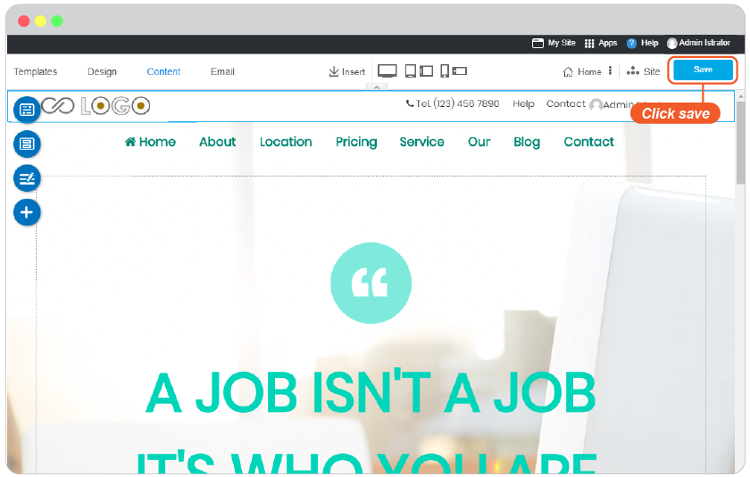
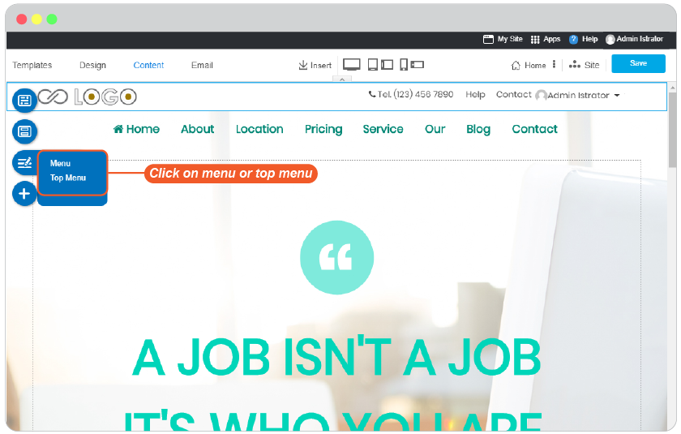
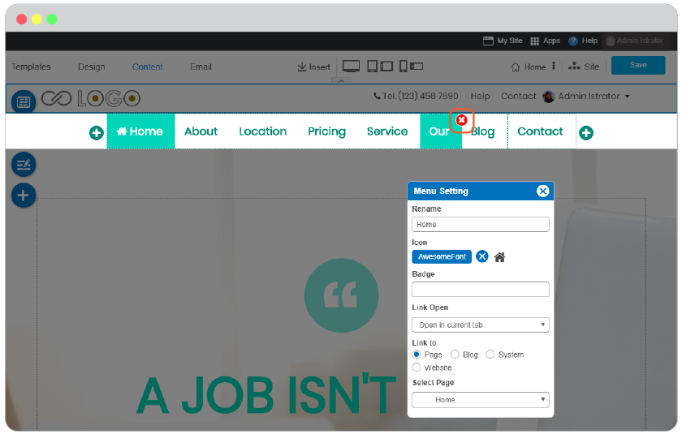

# Website Menu

- [Add New Menu](#add-new-menu)
- [Add New Top Menu](#add-new-top-menu)
- [Rename menu](#rename-menu)
- [Add sub menu](#add-sub-menu)
- [Delete Menu](#delete-menu)

First, a little to know is adding Menu and adding Page are not the same part.

Adding menu is to add new Top Menu or Menu on website navigation. You can define **Page** for the new added menu immediately or later.

Adding page is to add new content area for your new content. It WILL NOT appear on website navigation unless you add it to a Menu. See guide [here](website-content.md#add-new-page).

## Add New Menu

1. In Content editor, click "Menu" on floating menu.
   
  

2. The "Menu Setting" panel appears. Click at "+" symbol on Website Navigation to add new menu.

  

3. The added menu information appears in "Menu Setting" panel.

  

4. Edit the Menu name, add Icon and Badge (optional), set Link open to same or new window, and define a Page or Blog or System or Website to be opened by this Menu.

  

5. Once setting it up already, you can drag this new added Menu to drop anywhere on website navigation.

  

6. Close Menu Setting window, and Save it on Content edior page.

  

**Change design of Menu**

You can change design for your website navigation by following this [guide](website-design.md#menu)

---------------------------------------------------------------------------------------------------

## Add New Top Menu

1. In Content editor, click "Top Menu" on floating menu.
  
  

2. You will see 3 types on data you can edit; website branding, menus, and Register and Login menu.
   
  

**Add more Top Menu**

You can add more Top Menu for the purpose of quicker contact such as Help or Contact Us.

1. By click on a menu name, the "Menu Setting" panel appears. Click at "+" symbol on Website Navigation to add new menu.

  

2. The new added top menu information appears in "Menu Setting" panel.

  

3. Edit the Menu name, add Icon and Badge (optional), set Link open to same or new window, and define a Page or Blog or System or Website to be opened by this Menu.

  

4. Once setting it up already, you can drag this new added Menu to drop anywhere on website navigation.

  

5. Close Menu Setting window, and Save it on Content edior page.

  

**Edit Website Branding**

You can also edit website branding at anytime by following this [guide](website-design.md#top-menu)

**Register and Login menu**

RVsitebuilder 7 brings back membership area with full-featured authentication setting. You can enable Register/Login menu on yoour website by following this easy [guide](register-and-login-system.md)

**Change design of Top Menu**

You can change design for your website navigation by following this [guide](website-design.md#top-menu)

---------------------------------------------------------------------------------------------------

## Rename menu

1. In Content editor, click "Menu" on floating menu.

  

2. The "Menu Setting" panel appears, click on Menu you want to rename on the navigation. Then Rename it.

  

3. Close Menu Setting window, and Save it on Content edior page.

  

---------------------------------------------------------------------------------------------------

## Add sub menu

1. In Content editor, click "Menu" on floating menu.

  

2. The "Menu Setting" panel appears, drag the Menu you want to make it a sub menu and drag under the menu you want to have it as a menu parent.

  

3. Close Menu Setting window, and Save it on Content edior page.

  

  -------------------------------------------

## Delete Menu

To delete menu is quite easy, but just make sure you really want to delete it.

It will delete menu from website navigation but the page it's linked to still remains.

1. In Content editor, click on "Menu" or "Top Menu" on floating menu.

  

2. The "Menu Setting" panel appears. Hover your mouse on menu you want to delete. You will see "Delete" symbol on it.

  

3. Once the menu deleted, it will disappear from website navaition while its page still remains.

  

4. If you want to delete page as well. Please follow this [guide](page-management.md#page-management-tools)