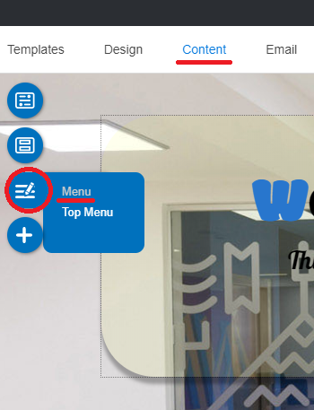
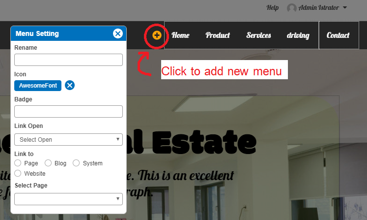
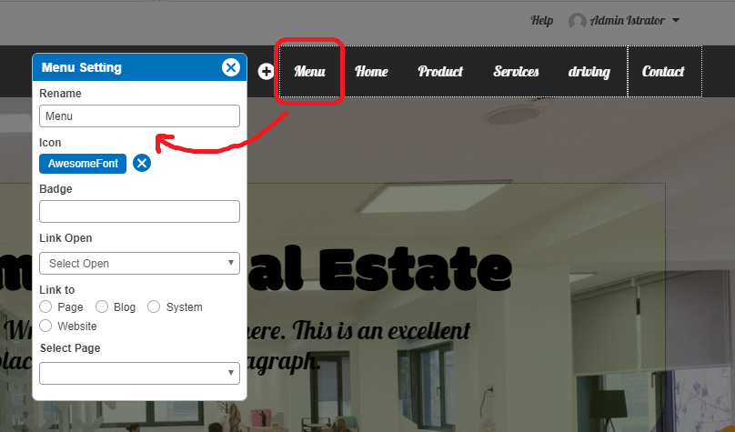
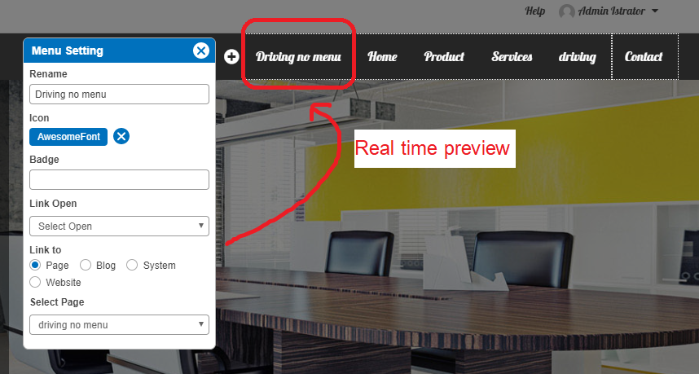
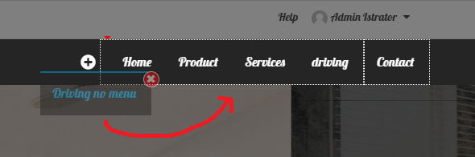

# Website Menu

  - [Add new menu](#addnewmenu)
  - [Rename menu](#renamemenu)
  - [Add sub menu](#addsubmenu)

First, a little to know is adding Menu and adding Page are not the same part.

Adding menu is to add new Top Menu or Menu on website navigation. You can define **Page** for the new added menu immediately or later.

Adding page is to add new content area for your new content. It WILL NOT appear on website navigation unless you add it to a Menu. See guide [here](website-content.md).

## Add New Menu

1. In Content editor, click "Menu" floating menu, and select **Menu**.

2. The "Menu Setting" panel appears. Click at "+" symbol on Website Navigation to add new menu.

3. The added menu information appears in "Menu Setting" panel.

4. Edit the Menu name, add Icon and Badge (optional), set Link open to same or new window, and define a Page or Blog or System or Website to be opened by this Menu.

5. Once setting it up already, you can drag this new added Menu to drop anywhere on website navigation.

6. Close Menu Setting window, and Save it on Content edior page.

 => [n'woon แสดงการคลิกปุ่ม save หลักในหน้า content editor]

---------------------------------------------------------------------------------------------------

## Rename menu

1. In Content editor, click "Menu" floating menu, and select **Menu**.

2. The "Menu Setting" panel appears, click on Menu you want to rename on the navigation. Then Rename it.

 => [n'woon หน้า content editor, คลิก Menu แล้ว แสดงการเลือกชื่อเมนูบน navigation แล้วชี้ให้เห๋็นชื่อเมนูที่เลือกในชอง Rename ]

3. Close Menu Setting window, and Save it on Content edior page.

 => [n'woon แสดงการคลิกปุ่ม save หลักในหน้า content editor]
 

 ---------------------------------------------------------------------------------------------------

## Add sub menu

1. In Content editor, click "Menu" floating menu, and select **Menu**.

2. The "Menu Setting" panel appears, drag the Menu you want to make it a sub menu and drag under the menu you want to have it as a menu parent.

3. Close Menu Setting window, and Save it on Content edior page.

 => [n'woon แสดงการคลิกปุ่ม save หลักในหน้า content editor]

