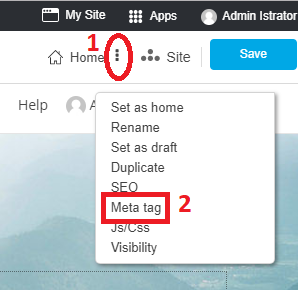
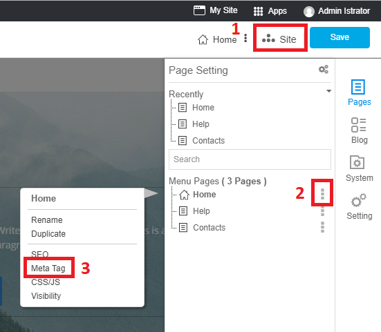
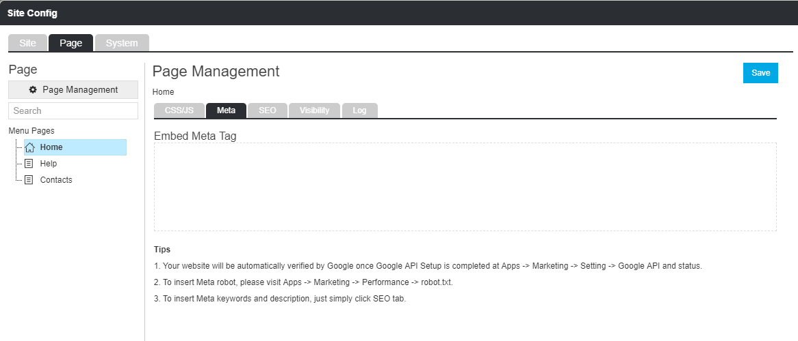

### Website Meta tag

RVsitebuilder provides places to insert meta tag and meta description for users. This might be only a little help. But all the rest of being ranked in google, it's about SEO strategies as explained above.

#### Setting Areas
- 3-dot next to current page name you're editing

- Site -> Page Management icon

- Site -> Menu Pages -> 3-dot after page names

Once **Meta tag** clicked, you will be at Page Management box.

- **Menu Pages** on the left colum will bluely highlight the current page that you're going to set its Meta tag now. You can change to other pages from here.

- **Page Management** with current page name on the right column. Insert embed meta tag here. And connect with Google API by this guide.

