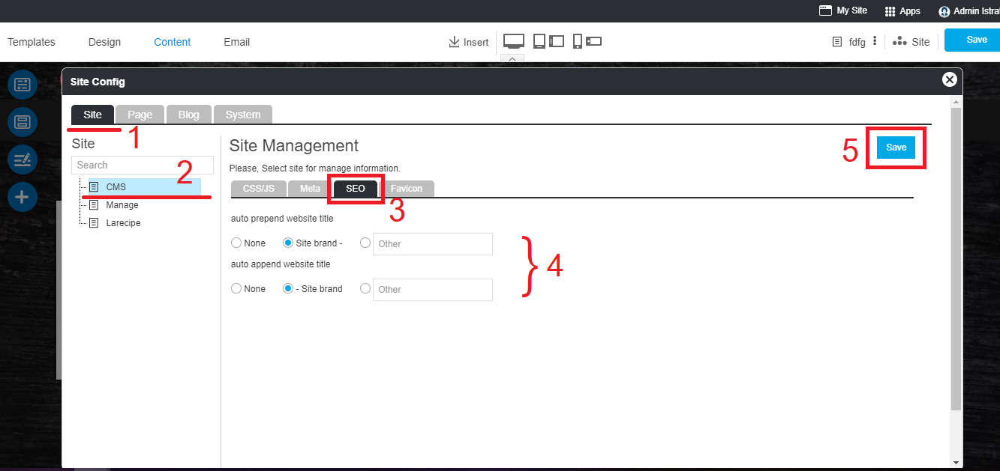

# Easy Website Meta tag

  - [Meta tag by page](#metabypage)
  - [Meta tag by site](#metabysite)

## Website Meta tag

RVsitebuilder provides places to insert meta tag and meta description for users. This might be only a little help. But all the rest of being ranked in google.

### Setting Areas
You can set SEO in 2 ways; by page or by site.

#### By page

It means to set SEO for an individual page that will be effect only at this page.

A) 3-dot next to current page name you're editing

B) Site -> Page Management icon

C) Site -> Menu Pages -> 3-dot after page names

Once **Meta tag** clicked, you will be at Page Management box.

**Menu Pages** on the left colum will bluely highlight the current page that you're going to set its Meta tag now. You can change to other pages from here.

**Page Management** with current page name on the right column. Insert embed meta tag here. And connect with Google API by this guide.

#### By site

This means to set Meta tag that will effect for the entire website, You can edit on some specific pages to use different Meta tag by guide **By page** above.

Way to access to Meta tag by site setting areas.

1. At **Site** -> **Page Management** icon

2. you will just click on **Site** on the setting panel to switch to Site setting.

1) Click **Site**

2) Select **CMS**

3) Select **Meta**

4) Insrt Meta tag for the entire site

5) Click **Save**

3. Don't forget to click **Save** on content editor.

4. Click on **My Site** to publish what you just have done.

