# Website Template

  - [Create a new site](#createanewsite)
  - [Customise template](#customisetemplate)
  - [Change template](#changetemplate)
  - [Publish](#publish)

## Create a new site

### By cPanel control panel

1. Login to control panel.
1. Look for Software feature group.
1. Click on "RVsitebuilder 7" icon.

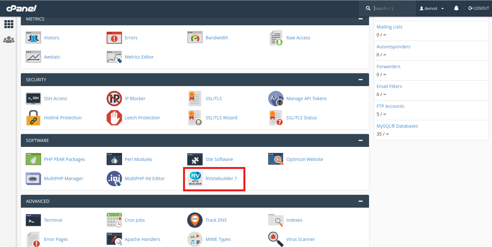

### By your domain name

1. Open domain name on browser with /admin/login (You can set the domain name login for admin by this [guide](https://user.rvsitebuilder.com/docs/7.2/en/website-membership).
1. Enter admin login.

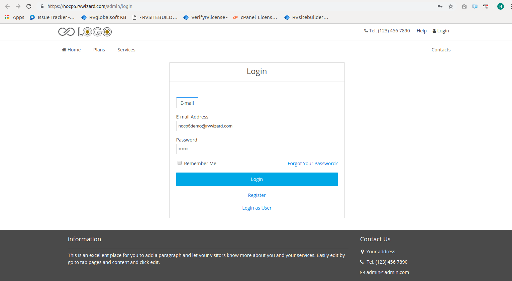

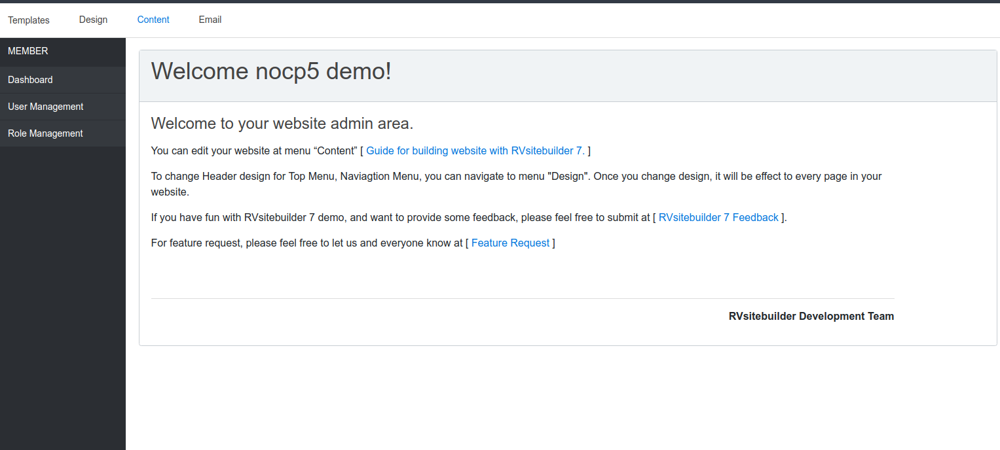

### Select Domain Name

After logging in, you can start your professtional site in 1 minute!
1. Start with click **Create new site** 

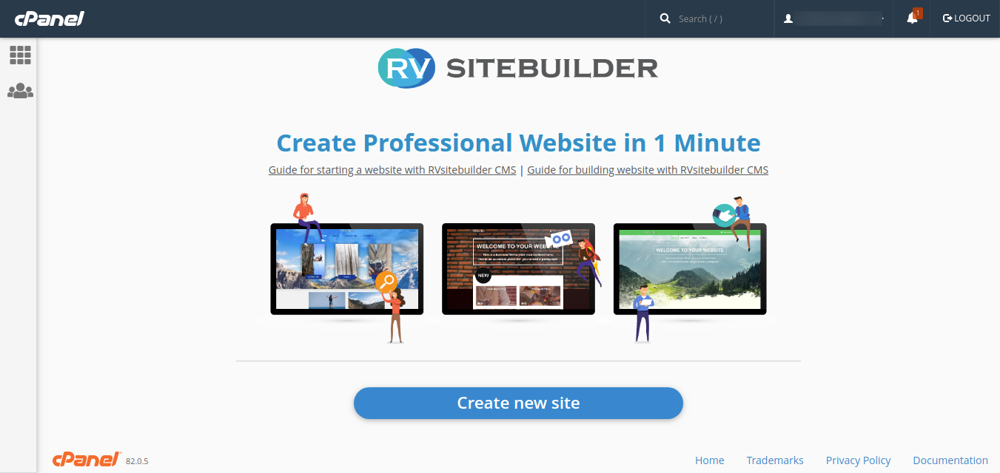

2. Selecting a domain name you want to create a beautiful professtional website with RVsitebuilder 7 and clicking "Next" to continue.

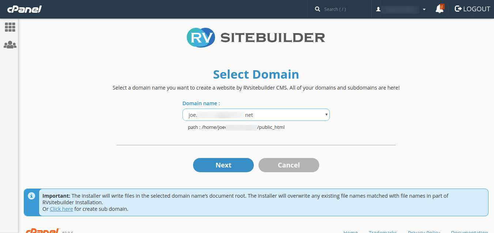

3. Check the information and add Admin Email, then check boxes to agree with our License Agreement.

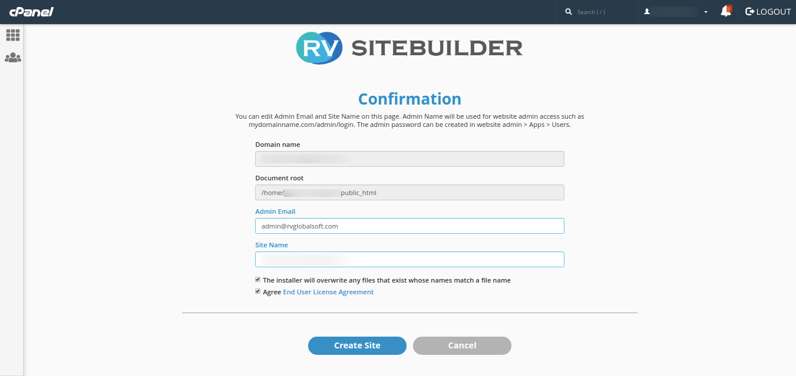

4. Have a cup of coffee while waiting for RVsitebuilder 7 creates itself in your domain name.

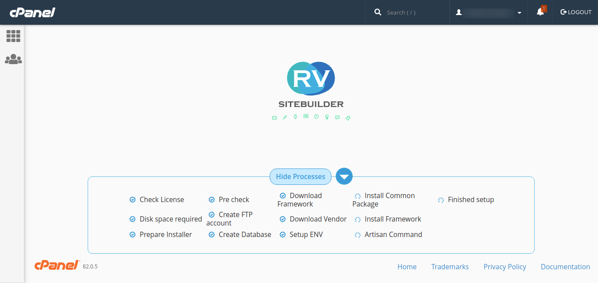

### Select Template

On your first create site by steps above, you will be welcome to **Templates** tab to select a template for your website.

Start a ready-to-edit website by selecting one from free beautiful templates from this step.

 => [n'woon รูปหน้า Templates แล้วลบรปข้างล่างออก]
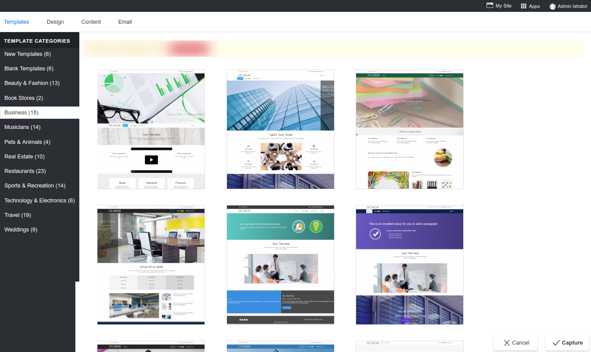

---------------------------------------------------------------------------------------------------

## Customise template

After the [one-click create my site](#createanewsite) and select a template already, you sure want to design it as beautiful as your style.

Then let's start from **Edit website banner**.

### Edit website banner

Banner is the top most of your website and it's the most attractive part. RVsitebuilder 7 allows you to use website banner in 2 styles; Hero Banner and Slide Banner.

#### Hero Banner

If you selected a template with Hero banner, you can change its image and color.

1. Click on Header banner area, then click on the edit tool icon on the right corner.

=> [n'woon รูป program เปิดหน้า content แล้วไกด์ให้คลิก Banner เพื่อคลิก edit Hero banner]

2. The **Section Properties** pops up which it allows you to change banner image, set shadow for image, make the image overlapped, and the box border of the banner image.

   - **Background**
   
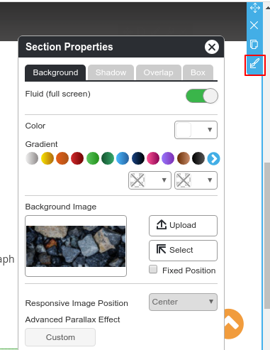

*Fluid (full screen)*: Enable or disable a full screen section.

*Color* : Select background color by using color picker or choosing from a gradient color.

*Background Image*: You can upload your own imageI or select one from Image Manager.

*Reponsive Image Position*: Image alignment on responsive mode.

   - **Shadow**

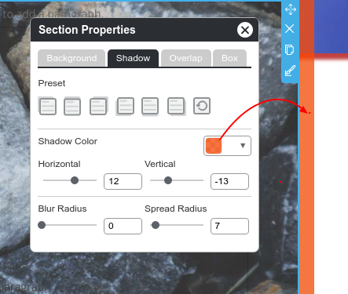

You can select 6 shadow preset styles which you can modify color and size on the below setting.

   - **Overlap**

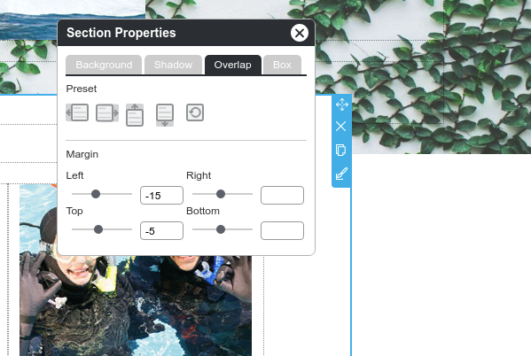

Make one section to overlap the other. Here you can make image banner to overlap the first content or make the first content overlap the banner.

   - **Box**

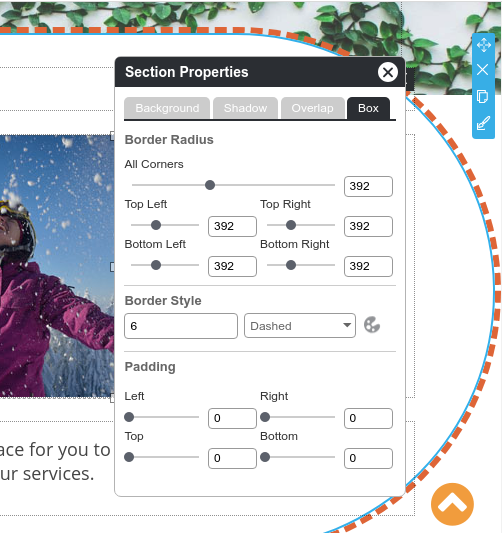

Add and edit border of the image.

 *Note: If you're setting website banner at Home page, it will affect to ALL pages.* 

#### Slide Banner

If you started your website with Slide banner template, you can change those images and slide effect for them.

**Edit slide image**
  
1. Click on Header banner area, then click on image icon on the number of slide template you want to edit. You may start from *slide1*.

=> [n'woon รูป program เปิดหน้า content แล้วไกด์ให้คลิก Banner เพื่อ edit รูป banner ตรง slide 1]

2. The **Section Properties** pops up which it allows you to change banner image, set shadow for image, make the image overlapped, and the box border of the banner image.

   - **Background**
   

*Fluid (full screen)*: Enable or disable a full screen section.

*Color* : Select background color by using color picker or choosing from a gradient color.

*Background Image*: You can upload your own imageI or select one from Image Manager.

*Reponsive Image Position*: Image alignment on responsive mode.

   - **Shadow**

You can select 6 shadow preset styles which you can modify color and size on the below setting.

   - **Overlap**

Make one section to overlap the other. Here you can make image banner to overlap the first content or make the first content overlap the banner.

   - **Box**

Add and edit border of the image.

 *Note: If you're setting website banner at Home page, it will affect to ALL pages.* 

**Add effect to slide banner**

1. Click on Header banner area, then click on **Effect** icon.

=> [n'woon รูป program เปิดหน้า content แล้วไกด์ให้คลิก Banner เพื่อ edit Slide effect]

2. Select an effect for your banner slide and give it the moving duration in second.

=> [n'woon รูป SLide effect จิ้มตั้วอย่าง 1  effect และแสดงการใส่ effect duration]

 *Note: If you're setting website banner at Home page, it will affect to ALL pages.* 

 **Add more slide images**

1. Click on Header banner area, then click on **Add Slide** icon.

=> [n'woon รูป program เปิดหน้า content แล้วไกด์ให้คลิก Banner เพื่อเพ่ิม slide image เครื่องหมายบวก]

2. Select one from pre-installed image list, then change it later.

=> [n'woon รูป banner slide popup จิ้มตั้วอย่าง 1 อัน + ปุ่ม save]

 *Note: If you're setting website banner at Home page, it will affect to ALL pages.* 

### Edit website navigation style

Manage your Top Menu and Menu

#### Top Menu

**Select Top Menu style**

Most of the visitors who access your website do not have much time to spare. The key is to intelligently display those links which your visitors are looking for. Once your products are easily accessible, your visitors are likely to turn into reliable customers.

You can select a Top Menu style anytime.

1. Click **Design** tab and **Topmenu**.

=> [n'woon รูป แสดงไกด์ click เมนู Design และ Topmenu ด้านซ้าย]

2. Select one from Top Menu style, and don't forget to click **Save**.

=> [n'woon รูป จิ้ม Top menu 1 style + คลิกปุ่ม Save]

**Edit Top Menu branding**

1. At **Content** tab, click on the Menu icon and select **Top Menu**.

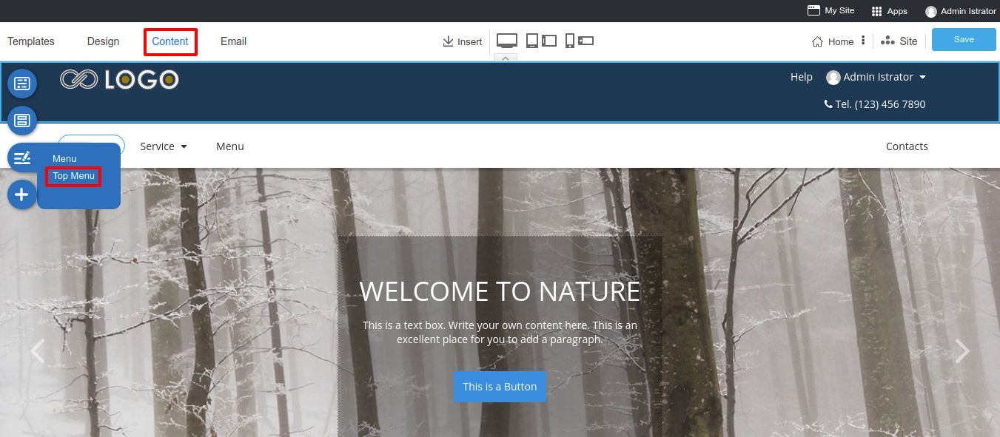

2. Click on a logo to change your own company logo and insert your company address.

=> [n'woon รูป แสดงการ edit Top Menu โดยไกด์ให้จิ้มที่ logo เพื่อให้ Brand tool แสดงขึ้นมา]

#### Menu

This part is useful in organizing the information on your website so that your visitors have a clear idea of your products and services.

You can select a Menu style anytime.

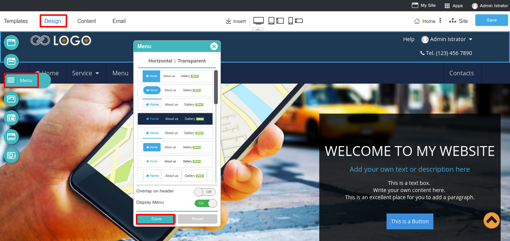

1. Click **Design** tab and **Menu**.

=> [n'woon รูป แสดงไกด์ click เมนู Design และ Menu ด้านซ้าย]

2. Select one from Menu style, and don't forget to click **Save**.

=> [n'woon รูป จิ้ม Menu 1 style + คลิกปุ่ม Save]

### Sort Header Positions

You can reorder Header positions between Banner, Top Menu, and Menu to make your website more unique than the deafult positions added from template you selected.

1. Go to **Design** tab, and **Sort Header**.

=> [n'woon รูป แสดงไกด์ click เมนู Design และ Sort Header ด้านซ้าย]

2. Freely drag and drop Banner, Top Menu, and Menu as order you want in Header area.

=> [n'woon รูป แสดงไกด์ การลาก banner, top menu, และ เมนู สลับที่บน header]

3. Close with Cross (close) mark, and Save it on Content edior page.

=> [n'woon รูป แสดงไกด์ ปิด sort header และ แสดงการคลิกปุ่ม save หลักในหน้า content editor]

---------------------------------------------------------------------------------------------------

## Change template

You may want to change template on your website for seasoning, changing Hero template to Slide or changing Slide template to Hero. It's easy as just click on **Template** tab.

 => [n'woon รูปหน้า program เปิดหน้า content แล้วไกด์ให้คลิกตรงเมนู Templates ]

**What's to concern for changing website template**

Website content, configurations, and users are safe and kept.

Things will change are **images and text on Header Banner of every page** that you have to reinsert again.

### Change Hero template to Slide

You may first started your website with an immoveble Header and Content for cool but feel it needs moveable header to present what you just added to your website or business.

- **Change on some page**

If you want to change Hero banner to slide images, you switch it page by page. *This way, you will have some page with Slide images Header, and Home page and the other pages still have Hero banner.*

1. One the page you want to switch to Slide images, click on Header banner to activate Banner tools.

 => [n'woon หน้า website ทีี่เป็น hero ไม่ใช้หน้า home, แสดงการคลิกเพื่อเปิดใช้งาน banner tool]

2. On the Banner tool, click "Switch Banner".

=> [n'woon รูป hero banner ไกด์ให้คิลิกรง Switch banner icon]

3. Select one from pre-installed image list, then change it later.

=> [n'woon รูป banner slide popup จิ้มตั้วอย่าง 1 อัน + ปุ่ม save]

- **Change for the entire website**

1. Just click **Templates** tab, and sneak on Template Categories list for the most relative, and place mouse (not click) on a template you like and see its type. You're finding a movable slide images on website header, so keep looing for **"Type: Slide"**.

 => [n'woon ในหน้า templates ชี้ให้เห็น template categories และ แสดงตัวอย่างการวางเมาส์ลง template ที่เป้น slide]

2. By selecting a most favorite slide banner will pop you a warning about what's to concern on changing template.

 => [n'woon แสดง popup warning ตอนทำการเปลี่ยน template]

3. Sure to change it, just click **OK**.

### Change Slide template to Hero

You may feel the slide images on Header are none of use by some reason.

- **Change on some page**

If you want to change Slide header to be just an immoveable image for cool, you can remove unused images from Header of the page. *This way, you will have some page with Slide images Header, and some with immoveable image.*

1. One the page you want to remove Slide images, click on Header banner to activate Banner tools.

 => [n'woon หน้า website ที่มี slide header สัก 3-4 slide, ในหน้า content ที่ไม่ใช่หน้า Home , click Banner เพื่อแสดงให้เห็น Banner Tools ยังไม่ต้อง คลิกอะไร]

2. Click remove all Header images and leave the last one.

 => [n'woon ใน banner tool ข้อ 1 แสดงให้เห็นการลบ banner image ออกทุกรูป เหลือแค่ 1 รูป]

3. On the laft image, edit it as you want it to be. You can see how to customise banner are below at [Customise template](#customisetemplate)

 => [n'woon ใน จากข้อ 2 แสดงการคลิกเพื่อเปิด Section Properties ของ Header banner เพื่อ edit. ไม่ต้อง edit ให้ดู เดี่ยวจะ link ไปหัวข้อ Customiza Template ด้านล่าง]

- **Change for the entire website**

You can change the Slide Header banner for the entire website at once.

1. Just click **Templates** tab, and sneak on Template Categories list for the most relative, and place mouse (not click) on a template you like and see its type. You're finding a Hero banner, so keep looing for **"Type: Hero"**.

 => [n'woon ในหน้า templates ชี้ให้เห็น template categories และ แสดงตัวอย่างการวางเมาส์ลง template ที่เป้น Hero]

2. By selecting a most favorite slide banner will pop you a warning about what's to concern on changing template.

 => [n'woon แสดง popup warning ตอนทำการเปลี่ยน template]

3. Sure to change it, just click **OK**.
---------------------------------------------------------------------------------------------------

## Publish

Just click **Save** button, your website will online immediatly. No longer PUBLISH BUTTON. It's a new save system in a single Save button that brings your website online in a blink!

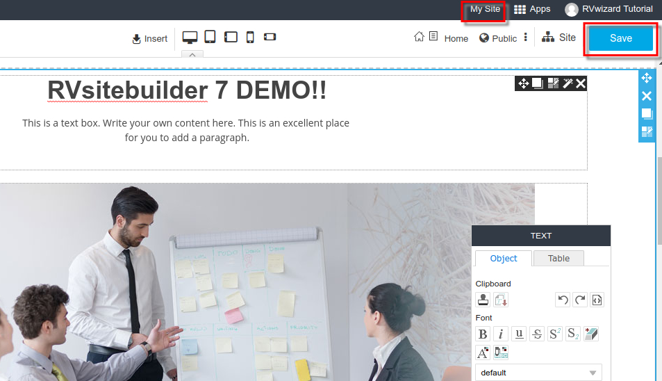

Now your website is online!

Let's go further for more beautiful and unique one!

You may continue next step with;

   1) [Website Menu](website-menu.md)
   
   2) [Website Content](website-content.md)
   
   3) [Website Footer](website-footer.md)
   
   4) [Online Form](online-form.md)
   
